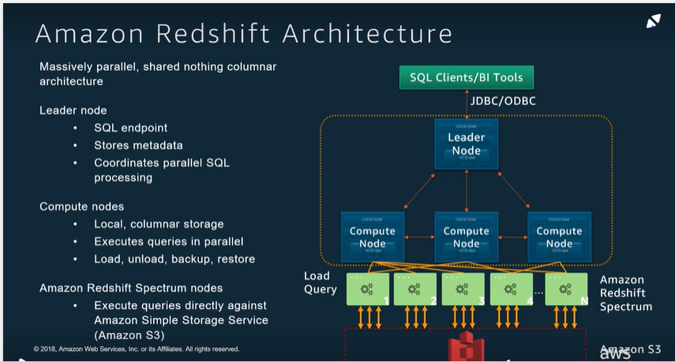
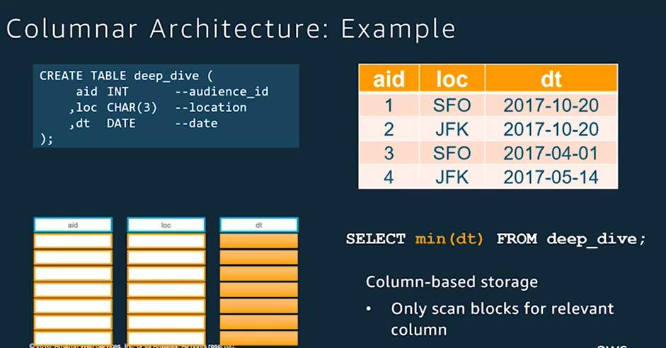
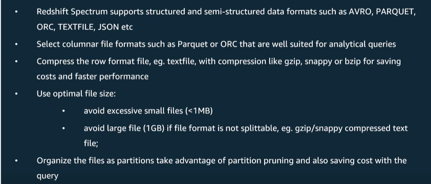
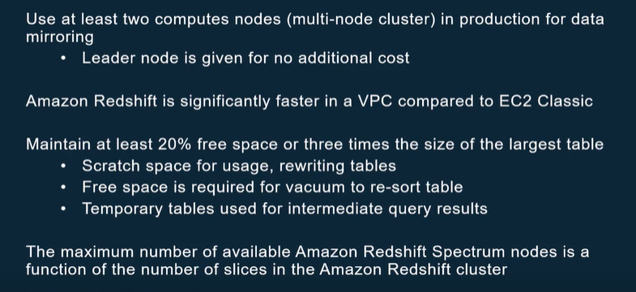
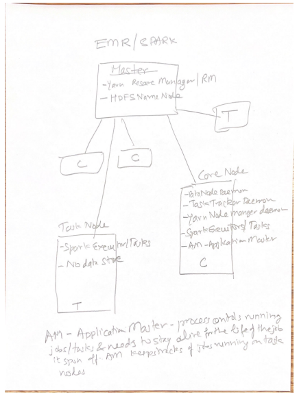

# Working with pyspark/spark-sql/aws-glue using jupyter notebook/windows

I happened to attend one of the data conferences few years back when I came to know the power of spark-sql. I have been working with relational databases and sql
for a long time,and I sure there are many developers like me out there who missed the hadoop boat while working on rdbms based projects. I have spend some time searching the web, reading up on pluralsight, googled into various websites and have cobbled up a spark/sql on jupyter notebook running on windows, so thought it will be useful for folks like me  who want to get into big data via spark-sql.

Spark runs on top of Hadoop, then why do we need Spark? Spark abstracts the hadoop  distributed processing. We work on data as though it were on a single node, but under the hood, the data processing occurs on multiple nodes on your spark cluster. The most interesting thing for me is it allows me to use sql with columnnar storage - parquet, with csv, etc.. and allows me to harness the power of hadoop without going into the details of hadoop/map-reduce.

# Apache Spark ?
[Apache Spark](https://docs.aws.amazon.com/emr/latest/ReleaseGuide/emr-spark.html) has two main components - single driver and multiple Executors, each of these run in their own JVM. Driver is idle waiting for requests for executor tasks, Executor usually run in itʼs own JVM. Each executor has slots, these process tasks send by the Driver to the executor. Slots run in their own threads.

- the Driver must decide [how to partition](partition/README.md) the data so that it can be distributed for parallel processing
- the Driver is assigning a Partition of data to each task - in this 
way each Task knows which piece of data it is to process.
- Once started, each Task will fetch from the original data source the Partition
of data assigned to it

The driver is the application code that defines the transformations and actions applied to the data set. At its core, the driver has instantiated an object of the SparkContext class. This object allows the driver to acquire a connection to the cluster, request resources, split the application actions into tasks, and schedule and launch tasks in the executors.

 Similar to Apache Hadoop, Spark is an open-source, distributed processing system commonly used for 
 big data workloads. However, Spark has several notable differences from Hadoop MapReduce. Spark has an
 optimized directed acyclic graph (DAG) execution engine and actively caches data in-memory, 
 which can boost performance, especially for certain algorithms and interactive queries. 
 Spark natively supports applications wr    itten in **Scala, Python, and Java**. It also includes several
 tightly integrated libraries for SQL (Spark SQL), machine learning (MLlib), stream processing (Spark streaming),
 and graph processing (GraphX). [More Apache Spark](https://aws.amazon.com/blogs/aws/new-apache-spark-on-amazon-emr/)
 
 > **Spark vs Hadoop performance**
 > By using a directed acyclic graph (DAG) execution engine, Spark can create a more efficient query plan for data transformations. Also, Spark uses in-memory, [fault-tolerant resilient distributed datasets (RDDs)](http://vishnuviswanath.com/spark_rdd.html), keeping intermediates, inputs, and outputs in memory instead of on disk. These two elements of functionality can result in better performance for certain workloads when compared to Hadoop MapReduce, which will force jobs into a sequential map-reduce framework and incurs an I/O cost from writing intermediates out to disk. Spark’s performance enhancements are particularly applicable for iterative workloads, which are common in machine learning and low-latency querying use cases.
> 

**Spark AWS options:**
- EMR
- Databricks

**Note:**
Spark does not provide a distributed file storage system, so it is mainly used for computation, on top of Hadoop. Spark does not need Hadoop to run, 
but can be used with Hadoop since it can create distributed datasets from files stored in the HDFS.

**Spark Characteristics**
- Spark does lazy load all the way, until it needs to perform an action
- Action - Common actions include operations that collect the results of tasks - count, sum etc... and ship them to the driver, save an RDD, or count the number of elements in a RDD.
- Transformation - are operations that generate a new RDD- resilient distributed dataset. Common transformations include operations that filter, sort and group by key, cache etc are all lazy
- The Dataframes returned/read by spark are all immutable.
- The Spark DataFrame was designed to behave a lot like a SQL table (a table with variables in the columns and observations in the rows). Not only are they easier to understand,
  DataFrames are also more optimized for complicated operations than RDDs.
- [Shuffling Magic](https://medium.com/swlh/revealing-apache-spark-shuffling-magic-b2c304306142)

**Why Shuffle:**

Data re-distribution is the primary goal of shuffling operation in Spark. Shuffling in a Spark program is executed
whenever there is a need to re-distribute an existing distributed data collection represented either by an RDD, Dataframe,
or Dataset. A data partition represents the unit of data to be processed together by a single Spark Task

- Increase or Decrease the number of data partitions when existing number of data partitions are:
  - not sufficient enough in order to maximize the usage of available resources.
  - too heavy to be computed reliably without memory overruns.
  - high in number such that task scheduling overhead becomes the bottleneck in the overall processing time. 

In all of the above situations, redistribution of data is required to either increase or decrease the number of underlying 
data partitions. **This redestributuion is achieved by executing shuffling on the existing distributed data collection via commonly 
available ‘repartition’ API among RDDs, Datasets, and Dataframes.**

- When performing aggregation and join all data records belonging to aggregation, or a join key should reside in a single data 
partition. If the existing partitioning scheme of the input data collection(s) does not satisfy the condition, then re-distribution
in accordance with aggregation/join key becomes mandatory, and therefore shuffling would be executed on the input data collection
to achieve the desired re-distribution/shuffling

**Cache:**
Cache is applied to DF using- .cache, a flag is enabled for spark to know caching 
of DF is enabled. The actual caching happens when an action is performed - show 
or count etc.
Cache should be used carefully because when cache is used the catalyst 
optimizer may not be able to perform its optimization. The optimizer may also not 
be able to do optimization when it has to [shuffle - Important Aspects of Apache Spark Shuffling](https://medium.com/swlh/revealing-apache-spark-shuffling-magic-b2c304306142) - because of narrow DF to wider DF - wider operation like groupby.

>
> More on ***[Spark Partitioning](partition/README.md)***
>
> **Note:** When you want to reduce the number of partitions, It is recommended to use PySpark coalesce() over repartition() 
> as it uses fewer resources due to less number of shuffles it takes.
>

**Transformation Wide vs Narrow**
- Wide transformation

 

In wide transformation, all the elements that are required to compute the records in the single partition may live in many partitions of parent RDD. The partition may live in many partitions of parent RDD. Wide transformations examples are groupBy, aggregate(), join(), etc...

- Narrow transformation

In Narrow transformation, all the elements that are required to compute the records in single partition live in the single partition of parent RDD. A limited subset of partition is used to calculate the result. Some examples of narrow transformation are filter(), union(), etc..

**ref:** https://sparkbyexamples.com/apache-spark-rdd/spark-rdd-transformations/#narrow-transformation

# UDF user defined functions
PySpark UDF (a.k.a User Defined Function) is the most useful feature of Spark SQL & DataFrame that is used to extend the PySpark build in capabilities. **Note**: UDF’s are  expensive operations hence use them only you have no choice and when essential.

PySpark UDF’s are similar to UDF on traditional databases. In PySpark, you create a function in a Python syntax and wrap it with PySpark SQL udf() or register it as udf and use it on DataFrame and SQL respectively. Before you create any UDF, do your research to check if the similar function you wanted is already available in [Spark SQL Functions](https://sparkbyexamples.com/spark/spark-sql-functions/). PySpark SQL provides several predefined common functions and many more new functions are added with every release. hence, It is best to check before you reinventing the wheel.

The first step in creating a UDF is creating a Python function. Below snippet creates a **function convertCase()** which takes a string parameter and converts the first letter of every word to capital letter. UDF’s take parameters of your choice and returns a value.

<pre>
def convertCase(str):
    resStr=""
    arr = str.split(" ")
    for x in arr:
       resStr= resStr + x[0:1].upper() + x[1:len(x)] + " "
    return resStr 
</pre>

## Dataframe and udf
Now convert this function convertCase() to UDF by passing the function to PySpark SQL udf(), this function is available at **org.apache.spark.sql.functions.udf** package. Make sure you import this package before using it.
<pre>
""" Converting function to UDF """
convertUDF = udf(lambda z: convertCase(z),StringType())

""" Converting function to UDF  StringType() is by default hence not required """
convertUDF = udf(lambda z: convertCase(z)) 

df.select(col("Seqno"), \
    convertUDF(col("Name")).alias("Name") ) \
   .show(truncate=False)

</pre>
- [@udf](https://spark.apache.org/docs/3.1.1/api/python/reference/api/pyspark.sql.functions.udf.html)
## SQL and udf
In order to use convertCase() function on PySpark SQL, you need to register the function with PySpark by using **spark.udf.register()**.

<pre>
""" Using UDF on SQL """
spark.udf.register("convertUDF", convertCase,StringType())
df.createOrReplaceTempView("NAME_TABLE")
spark.sql("select Seqno, convertUDF(Name) as Name from NAME_TABLE") \
     .show(truncate=False)     
</pre>

[Ref](https://sparkbyexamples.com/pyspark/pyspark-udf-user-defined-function/)

# Spark functions vs UDF performance ?
**UDF function:**

<pre>
from pyspark.sql.functions import udf
concat_s = udf(lambda s: s+ 's')
udfData = dataDF.select(concat_s(dataDF.first_name).alias('name'))
udfData.count()
</pre>

**Spark Function:**
<pre>
from pyspark.sql.functions import lit, concat
spfData = dataDF.select(concat(dataDF.first_name, lit('s')).alias('name'))
spfData.count()
</pre>
Ran both multiple times, the udf usually took about 1.1 - 1.4 s, and the Spark concat function always took under 0.15 s.

When executing Spark-SQL native functions, the data will stays in tungsten backend. However, in Spark UDF scenario, the data will be moved out from tungsten into JVM (Scala scenario) or JVM and Python Process (Python scenario) to do the actual process, and then move back into tungsten. As a result of that:
- Inevitably, there would be a overhead / penalty on :
  - Deserialize the input from tungsten.
  - Serialize the output back into tungsten.
- Even using Scala, the first-class citizen in Spark, it will increase the memory footprint within JVM, and which may likely involve more GC within JVM. This issue exactly what tungsten "Off-Heap Memory Management" feature try to address.

Spark added a Python API in version 0.7, with support for user-defined functions. These user-defined functions operate one-row-at-a-time, and thus suffer from high serialization and invocation overhead. However the newly vectorized udfs seem to be improving the performance a lot.

Still
Use the higher-level standard Column-based functions with Dataset operators whenever possible before reverting to using your own custom UDF functions since UDFs are a BlackBox for Spark and so it does not even try to optimize them.

What actually happens behind the screens, is that the [Catalyst](https://blog.bi-geek.com/en/spark-sql-optimizador-catalyst/) can’t process and optimize UDFs at all, and it treats them as BlackBox, which results in losing many optimizations like Predicate pushdown, Constant folding and many others.

[Ref](https://stackoverflow.com/questions/38296609/spark-functions-vs-udf-performance)

# Spark predicate pushdown
A predicate is a condition on a query that returns true or false, typically located in the WHERE clause. A predicate push down filters the data in
the database query - if you can “push down” parts of the query to where the data is stored, and thus filter out most of the data, then you can
greatly reduce network traffic, reducing the number of entries retrieved from the database and improving query performance. By default the Spark
Dataset API will automatically push down valid WHERE clauses to the database. Depending on the processing framework, predicate pushdown can optimize your query by doing things like filtering data
before it is transferred over the network, filtering data before loading into memory, or skipping reading entire files or chunks of files.

A “predicate” (in mathematics and functional programming) is a function that returns a boolean (true or false).
In SQL queries predicates are usually encountered in the WHERE clause and are used to filter data.
[Pushdown predicate and spark sql](https://docs.datastax.com/en/dse/6.0/dse-dev/datastax_enterprise/spark/sparkPredicatePushdown.html#:~:text=To%20push%20down%20the%20correct,can%20generate%20the%20correct%20predicate.)

## Hints to make predicate pushdown to work
1. Partition key columns can be pushed down as long as:
    - All partition key columns are included in the filter.
    - No more than one equivalence predicate per column.
    - Use an IN clause to specify multiple restrictions for a particular column.
    
2. When creating Spark SQL queries that use comparison operators, making sure the predicates are pushed down to the database correctly is 
   critical to retrieving the correct data with the best performance. For example, given a SQL table with the following schema:
  <pre>
    CREATE TABLE test.common (
        year int,
        birthday timestamp,
        userid uuid,
        likes text,
        name text,
        PRIMARY KEY (year, birthday, userid)
    )
  </pre>  
 Suppose you want to write a query that selects all entries where the birthday is earlier than a given date:
<pre>
SELECT * FROM test.common WHERE birthday < '2001-1-1';
</pre>

Note that the Filter directive is treating the birthday column, a SQL TIMESTAMP, as a string. The query optimizer looks at this comparison
and needs to make the types match before generating a predicate. In this case the optimizer decides to cast the birthday column as a string to
match the string '2001-1-1', but cast functions cannot be pushed down. The predicate isn't pushed down, and it doesn't appear in PushedFilters.
A full table scan will be performed at the database layer, with the results returned to Spark for further processing.

To push down the correct predicate for this query, use the cast method to specify that the predicate is comparing the birthday column to a 
TIMESTAMP, so the types match and the optimizer can generate the correct predicate.

<pre>
EXPLAIN SELECT * FROM test.common WHERE birthday < cast('2001-1-1' as TIMESTAMP);

== Physical Plan ==
*Scan org.apache.spark.sql.cassandra.CassandraSourceRelation [year#0,birthday#1,userid#2,likes#3,name#4] 
<b>PushedFilters: [*LessThan(birthday,2001-01-01 00:00:00.0)], </b>
ReadSchema: struct<year:int,birthday:timestamp,userid:string,likes:string,name:string>
Time taken: 0.034 seconds, Fetched 1 row(s)
</pre>

Note the PushedFilters indicating that the LessThan predicate will be pushed down for the column data in birthday. 
This should speed up the query as a full table scan will be avoided.

[Ref](https://phpfog.com/what-is-predicate-pushdown/) 

# AWS Glue Catalog:
WE have tons of data stored in S3, the glue helps us to add a metadata on top our S3 data. You can use glue 
crawler to perform ETL, to pull the data and create metadata in glue catalog. I like to use boto3 api to 
create glue metadata in glue catalog to map data in S3 - other ways are - package awswrangler 
and DDL sql. S3 data can be accessed via sql - using redshift spectrum, accessed via AWS EMR/pyspark/spark-sql, or via  
Aws Athena/Mesos(the sql engine), etc.  

It's easy to create table metadata in Glue catalog via boto3 glue api. One can use DDL SQL or the package awswrangler to create table,
add partitions etc. We will access this table mapped on S3 using sql via jupyter notebook running on a local pc using [aws data wrangler](https://aws-data-wrangler.readthedocs.io/en/stable/what.html).

# Schema on read/write
- [Schema on read/write](https://luminousmen.com/post/schema-on-read-vs-schema-on-write)
- RDMS - schema on write, here we define the columns, data format, relationships of columns, etc. before the actual data upload.
- AWS Glue - schema on read, with glue we can create the schema at the time were consume/read data, this allows for  fast data
ingestion because data shouldn't follow any internal schema — it's just copying/moving files. This type of data handling is more flexible in case of big data, unstructured data, or frequent schema changes.

# Spark sql
- CreateTableView based on dataframe - createOrReplaceTempView creates (or replaces if that view name already exists) a lazily evaluated "view" 
that you can then use like a hive table in Spark SQL. It does not persist to memory unless you cache or persist the 
dataset that underpins the view.
  
- Caching - Spark will read the parquet, csv,etc.., execute the query only once and then cache it.
  when the code is in the loop, it will use the cached, pre-calculated DataFrame. Imagine that 
  you are working with a lot of data, and you run a series of queries and actions on it 
  without using caching. It runs again and again without you even noticing.
  This can add hours to the job running time or even make the job fail.
   You can also use SQL’s CACHE TABLE [tableName] to cache tableName table in memory. 
   Unlike cache and persist operators, CACHE TABLE is an eager operation which is executed as soon
   as the statement is executed - sql("CACHE TABLE [tableName]"). You could however use LAZY keyword
  to make caching lazy - sql("CACHE LAZY TABLE [tableName]")
- Cache vs Persist - The only difference between cache() and persist() is ,using Cache technique we 
  can save intermediate results in memory only when needed while in Persist() we can save the intermediate
  results in 5 storage levels(MEMORY_ONLY, MEMORY_AND_DISK, MEMORY_ONLY_SER, MEMORY_AND_DISK_SER,
  DISK_ONLY). Without passing argument, persist() and cache() are the same - results in memory.
   
-  Explain Plan/Query Execution Plan - The best way to make sure everything has run as expected is to look
   at the execution plan. You can see in the following execution plan the keywords InMemoryTableScan and 
   InMemoryRelation which indicate that we are working on a cached DataFrame.dataframe_object.explain()
   
# Parquet file Gzip vs Snappy
GZIP compression uses more CPU resources than Snappy or LZO, but provides a higher compression ratio. GZip is often a good choice for cold data,
which is accessed infrequently. Snappy or LZO are a better choice for hot data, which is accessed frequently. Snappy often performs better
than LZO. ref: google search Use Snappy if you can handle higher disk usage for the performance benefits (lower CPU + Splittable).
> When Spark switched from GZIP to Snappy by default, this was the reasoning:

Based on our tests, gzip decompression is very slow (< 100MB/s), making queries decompression bound. Snappy can 
decompress at ~ 500MB/s on a single core.
- Snappy:
  - Storage Space: High
  - CPU Usage: Low
  - Splittable: Yes (1), If you need your compressed data to be splittable, then use BZip2, LZO, and Snappy
  formats which are splittable, but GZip is not.
  
- GZIP:
  - Storage Space: Medium
  - CPU Usage: Medium
  - Splittable: No

## Apache Parquet has the following characteristics:
  - Self-describing
  - Columnar format
  - Language-independent
 
  - [reference](https://stackoverflow.com/questions/35789412/spark-sql-difference-between-gzip-vs-snappy-vs-lzo-compression-formats)
  - https://medium.com/swlh/insights-into-parquet-storage-ac7e46b94ffe

## Apache Avro
Apache Avro is an open-source, row-based, data serialization and data exchange framework for Hadoop projects, originally
developed by databricks as an open-source library that supports reading and writing data in Avro file format. it is
mostly used in Apache Spark especially for Kafka-based data pipelines. When **Avro data is stored in a file, its schema is
stored with it, so that files may be processed later by any program**.

It has build to serialize and exchange big data between different Hadoop based projects. It serializes data in a compact
binary format and schema is in JSON format that defines the field names and data types.

[ref:](https://sparkbyexamples.com/spark/read-write-avro-file-spark-dataframe/)

# [Join strategies](join-strategies/README.md)

## [Developing AWS Glue ETL jobs locally using a container](https://github.com/paramraghavan/sparksql-awsglue/tree/main/aws-glue-container#readme)

# Redshift Spectrum vs Glue
Developers describe Amazon Redshift Spectrum as "Exabyte-Scale In-Place Queries of S3 Data". With Redshift Spectrum, yo
u can extend the analytic power of Amazon Redshift beyond data stored on local disks in your data warehouse to query vast
amounts of unstructured data in your Amazon S3 “data lake” -- without having to load or transform any data. On the other hand, 
AWS Glue is detailed as "Fully managed extract, transform, and load (ETL) service". A fully managed extract, transform, and
load (ETL) service that makes it easy for customers to prepare and load their data for analytics.

Amazon Redshift Spectrum and AWS Glue can be primarily classified as "Big Data" tools.

**ref:** https://stackshare.io/stackups/amazon-redshift-spectrum-vs-aws-glue

# Glue Catalog, Athena, Redshift, Redshift Spectrum
- Glue is used as data catalog and the schema's are maintained and managed via DDL scripts. The DDL scripts are executed via
 Zepplin or the table creation  scripts  is part of CI/CD. On execution of DDL script for creation of Glue catalog tables, 
 glue in turns maps the parquet/csv columns in the raw file to table schema. The column names should be exact match between 
 auto mapped tables(internal table/schema) in glue catalog and the tables/columns created via ddl scripts. **Note** you can
 use/setup the Glue crawler to all of this as well.
- Glue catalog needs to use sql engine to query the tables cataloged in Glue. Athena - presto sql engine, spark sql , 
 Redshift/Redshift Spectrum and zepellin
- Redshift spectrum is used to read AWS S3 files(external files) as table and are accessed in Redshift as views - views
 are used to format string to date, date data type is not supported by Redshift spectrum????.
- Redshift external files  in S3 bucket are mapped as table in glue(by default for external tables data catalog is 
 managed in Athena). The glue catalog is accessed as view from Redshift using Redshift spectrum. When new files are
 added to S3, these new partitions have to added to the glue catalog to the associated schema.
- Tableau reports use Redshift views.
- Athena can also be used to access  database/tables in glue catalog. Athena, Redshift a can be accessed via jdbc
 driver like we access Postgres sql db.
- Tableau reporting - exposing the files in S3 using glue catalog + Redshift Spectrum + Red Shift view – looks
 like this is the easiest way for tableau to consume files in S3 as tables. You could access glue catalog via Athena, but 
 looks like tableau has to manage tokens and these tokens have to renewed every x interval of time
- Redshift accesses the tables in Glue catalog as external tables. These glue tables which are to be accessed by Redshift 
 are tagged as external scheme

# Redshift Architecture

# Columnar Storage

# Redshift Spectrum

# Redshift setup

# Redshift Notes
<pre>
The copy command is a redshift sql command to copy file(s) from s3 to redshift table, 
copy command automatically analyzes and compresses the data on first load into
an empty table.

Analyze compression is a built-in command that will find the optimal compression
 for each column on an existing table.

Sortkey columns, data is stored in blocks or zones in the sortkey order
Sortkey are less benefcial on small tables, as it does not prune a
lot of blocks as there are not too many blocks in the first place. 
Add columns to sortkey that are frequently filtered, with lowest
cardinality columns first
Columns added to sortkey column after a high-cardinality column
are not effective
More than 4 sortkey columns will marginally improve query speed.
Sortkey column helps redshift is identifying the stored blocks/zones.
Small size  table in datawarehouse like redshift is about 3 millon rows
Data distribution:
- ALL, for small dimensional tables
- Even, for fact tables 
- Key, data stored in blocks based on key hash, used for joins for large tables

Redshift blocks
- these are 1 mb blocks
- these blocks are immutable, so whenever changes happens to data in these block, this block is marked for
  logical delete, you have to run the vaccum process - this will sort the table and remove rows that are 
  marked as deleted. Analyze will collect table statistics for optimal query planning.
- use vaccum to reclaim the blocks 
- run analyze command typically adter the ETL process completes

</pre>

**Ref:**
- https://docs.aws.amazon.com/redshift/latest/dg/c-spectrum-external-tables.html
- https://aws.amazon.com/premiumsupport/knowledge-center/redshift-spectrum-external-table/

# Conversion Between PySpark and Pandas DataFrames
Converting a PySpark DataFrame to Pandas is quite trivial thanks to toPandas()method however, this is 
 probably one of the most costly operations that must be used sparingly, especially when dealing with
 fairly large volume of data.

**Why is it so costly?** Pandas DataFrames are stored in-memory which means that the operations 
 over them are faster to execute however, their size is limited by the memory of a single machine. 

On the other hand, Spark DataFrames are distributed across the nodes of the Spark Cluster which is 
 consisted of at least one machine and thus the size of the DataFrames is limited by the size of the cluster. 
 When there is a need to store more data, you simply need to scale up your cluster by adding more 
 nodes (and/or adding more memory to the nodes).

It is important to understand that when toPandas() method is executed over a Spark DataFrame, 
 all the rows which are distributed across the nodes of the cluster will be collected into the driver
 program that needs to have sufficient memory to fit the data.

toPandas() is an expensive operation that should be used carefully in order to minimize the performance 
 impact on our Spark applications. In case where this is required and especially when the dataframe is 
 fairly large, you need to consider PyArrow optimization when converting Spark to Pandas DataFrames.
 [See here for more details](https://towardsdatascience.com/how-to-efficiently-convert-a-pyspark-dataframe-to-pandas-8bda2c3875c3)

# EMR, YARN, SPARK Jobs

The central component of Amazon EMR is the cluster. A cluster is a collection of Amazon Elastic Compute Cloud (Amazon
EC2) instances. Each instance in the cluster is called a node. Each node has a role within the cluster, referred to as
the node type. Amazon EMR also installs different software components on each node type, giving each node a role in a
distributed application like Apache Hadoop.

The node types in Amazon EMR are as follows:
- Master node: The master node manages the cluster and typically runs master components of distributed applications. For
  example, **the master node runs the YARN ResourceManager** service to manage resources for applications. It **also runs the
  HDFS NameNode service**, tracks the status of jobs submitted to the cluster, and monitors the health of the instance
  groups.

  To monitor the progress of a cluster and interact directly with applications, you can connect to the master node over
  SSH as the Hadoop user. For more information, see Connect to the master node using SSH. Connecting to the master node
  allows you to access directories and files, such as Hadoop log files, directly. For more information, see View log
  files. You can also view user interfaces that applications publish as websites running on the master node.

- **Core node:** A node with software components that run tasks and store data in the Hadoop Distributed File System (
  HDFS) on your cluster. Multi-node clusters have at least one core node.Core nodes are managed by the master node. Core
  nodes run the **Data Node daemon to coordinate data storage
  as part of the Hadoop Distributed File System (HD**FS). They also run the Task Tracker daemon and perform other
  parallel computation tasks on data that installed applications require. For example, a **core node runs YARN NodeManager
  daemons, Hadoop MapReduce tasks,and Spark executors.**

  There is only one core instance group or instance fleet per cluster, but there can be multiple nodes running on multiple
  Amazon EC2 instances in the instance group or instance fleet. With instance groups, you can add and remove Amazon EC2
  instances while the cluster is running. You can also set up automatic scaling to add instances based on the value of a
  metric. 

  With instance fleets, you can effectively add and remove instances by modifying the instance fleet's target capacities
  for On-Demand and Spot accordingly.

- **Task node**:  A node with software components that only runs tasks and does not store data in HDFS. Task nodes are
  optional.You can use task nodes to add power to perform parallel computation tasks on data, such as Hadoop MapReduce
  tasks and Spark executors. Task nodes don't run the Data Node daemon, nor do they store data in HDFS. As with core
  nodes, you can add task nodes to a cluster by adding Amazon EC2 instances to an existing uniform instance group or by
  modifying target capacities for a task instance fleet.

  With the uniform instance group configuration, you can have up to a total of 48 task instance groups. The ability to add
  instance groups in this way allows you to mix Amazon EC2 instance types and pricing options, such as On-Demand Instances
  and Spot Instances. This gives you flexibility to respond to workload requirements in a cost-effective way.
  
  With the instance fleet configuration, the ability to mix instance types and purchasing options is built in, so there is
  only one task instance fleet.
  
  _Because Spot Instances are often used to run task nodes, Amazon EMR has default functionality for scheduling YARN jobs
  so that running jobs do not fail when task nodes running on Spot Instances are terminated. **Amazon EMR does this by
  allowing application master processes to run only on core nodes. The application master process controls running jobs
  and needs to stay alive for the life of the job**._
  
  _Amazon EMR release version 5.19.0 and later uses the built-in YARN node labels feature to achieve this. (Earlier
  versions used a code patch). Properties in the yarn-site and capacity-scheduler configuration classifications are
  configured by default so that the YARN capacity-scheduler and fair-scheduler take advantage of node labels. Amazon EMR
  automatically labels core nodes with the CORE label, and sets properties so that **application masters are scheduled only
  on nodes with the CORE label.** Manually modifying related properties in the yarn-site and capacity-scheduler
  configuration classifications, or directly in associated XML files, could break this feature or modify this
  functionality._
  
  Beginning with Amazon EMR 6.x release series, the YARN node labels feature is disabled by default. The application
  master processes can run on both core and task nodes by default. You can enable the YARN node labels feature by
  configuring following properties:
  
  yarn.node-labels.enabled: true
  yarn.node-labels.am.default-node-label-expression: 'CORE'
- **Application Master**: The Application Master is responsible for the execution of a single application. It asks for
  containers from the Resource Scheduler (Resource Manager) and executes specific programs on the obtained containers.
  **Application Master is just a broker that negotiates resources with the Resource Manager** and then after getting some
  container it make sure to launch tasks(which are picked from scheduler queue) on
  containers.[ref](https://stackoverflow.com/questions/63914667/what-is-the-difference-between-driver-and-application-manager-in-spark)  
  ref: https://docs.aws.amazon.com/emr/latest/ManagementGuide/emr-master-core-task-nodes.html

# [EMR Spark submit - How does it work?](https://aws.amazon.com/blogs/big-data/submitting-user-applications-with-spark-submit/)
AWS EMR clusters by default are configured with a single capacity scheduler queue and can run a single job at any given
time. [This](http://mitylytics.com/2017/11/configuring-multiple-queues-aws-emr-yarn/) blog talks about how you can create
and configure multiple capacity scheduler queues in YARN Capacity Scheduler during the creation of a new EMR cluster or 
when updating existing EMR clusters. For more details on configuration, refer to Apache documentation on Hadoop Capacity Scheduler.

Spark is a distributed computing engine and its main abstraction is a resilient distributed dataset (RDD), which can be viewed as 
a distributed collection. RDDs are collections of objects. Under the hood, **these objects are stored in partitions.** When performing 
computations on RDDs, these partitions can be operated on in parallel. Understanding how Spark deals with partitions allow us to control
 the application parallelism which leads to better cluster utilization — fewer costs and better execution time.
 
When you submit a Spark job, the driver implicitly converts the code containing transformations and actions performed on the RDDs 
into a logical Directed Acyclic Graph (DAG). The driver program also performs certain optimizations like pipelining transformations and
then it converts the **logical DAG into physical execution plan with set of stages.** A Stage is a combination of transformations which does not
cause any shuffling, pipelining as many narrow transformations (eg: map, filter etc) as possible.

 - transformation grouped into stages
 
 
If suppose we read a file in Spark, the entire content of the file is partitioned into multiple smaller chunks. When we apply a
transformation, the transformation is applied to each of its partition. **Spark spawns a single Task for a single partition,
which will run inside the executor JVM.** Each stage contains as many tasks as partitions of the RDD and will perform the
transformations (map, filter etc) pipelined in the stage.

- Relationship between Tasks and Partitions in RDD

 - Visualization of RDD being partitioned
 

ref: https://medium.com/@thejasbabu/spark-under-the-hood-partition-d386aaaa26b7

# Apache Hudi

In today’s world, We are more concerned about our personal data privacy as compared to earlier. In the future, there
would definitely be a need to form laws regarding data privacy and the storage of personal data will come into the
picture for developing countries too.
As many EU countries have already formed General Data Protection Regulations (GDPR) which govern the usage of personal
data. So If a user requests an organization to OPT-OUT or Delete his/her personal data from the data lake. It became
very tricky to delete  a record from a petabyte of data. To Overcome the problem of deletion or updates to a single
row in a big data system there are many solutions available in the market i.e. from Hive transactional property to 
data bricks Delta features to now Apache Hudi. Apache Hudi is an open-source data management framework used to simplify
incremental data processing and data pipeline development by providing **record-level insert, update and delete
capabilities.** This record-level capability is helpful if you’re building your data lakes on Amazon S3 or HDFS.

## Can we use Apache Hudi without having to convert existing Parquet data in our data lake

For customers operating at scale on several terabytes or petabytes of data, migrating their datasets to start using
Apache Hudi is a very time-consuming operation. Depending on the size of the dataset and the compute power, it might
take several hours using insert or bulk insert write operations. These operations rewrite the entire dataset into an
Apache Hudi table format so that Apache Hudi could generate per-record metadata and index information required to
perform record-level operations. Even if the existing dataset is in Parquet format, Hudi would rewrite it entirely in
its compatible format, which is also Parquet. This created an obstacle to customer adoption and onboarding.

To address this problem, Amazon EMR team collaborated with the Apache Hudi community to create a feature in release
version 0.6.0, the bootstrap operation, which allows customers to use Hudi with their existing Parquet datasets without
needing to rewrite the dataset. As part of this operation, Hudi generates metadata only. It writes the metadata in a
separate file that corresponds to each data file in the dataset. The original data is left as-is and not copied over.
The result is a faster, less compute-intensive onboarding process. The bootstrap operation is available in Amazon EMR
releases 5.31.0 and 6.2.0, which ship with Apache Hudi 0.6.0.[ref](https://aws.amazon.com/blogs/big-data/new-features-from-apache-hudi-available-in-amazon-emr/)

**Note:**
- [Hudi does not support field deletions](https://github.com/apache/hudi/issues/2331)
- [insert operation didn't insert a new record, instead it updated existing records in my no-primary-key table](https://github.com/apache/hudi/issues/2051)

**references**
https://medium.com/@simpsons/apache-hudi-basic-crud-operations-64c1f1fe35df **	
https://medium.com/@parth09/apache-hudi-the-basics-5c1848ca12e0 *
https://hudi.apache.org/docs/writing_data/
https://hudi.apache.org/docs/next/table_management/

# Running pyspark on windows
- [setup pysaprk/sparksql on windows](https://github.com/paramraghavan/sparksql-awsglue/blob/main/help/sparksql-setup.md)
- pyspark with interactive Jupyter Notebook
  - Under aws-glue there are 2 ipynb files. 
    - [spark-sql](https://github.com/padmaparam/sparksql-awsglue/blob/main/aws-glue/spark-sql-parquet.ipynb) 
    - [aws-glue](https://github.com/padmaparam/sparksql-awsglue/blob/main/aws-glue/aws-glue.ipynb) -  using [aws data wrangler](https://aws-data-wrangler.readthedocs.io/en/stable/what.html) seems to be nicely written and easy to use with pandas dataframe

# Apache Hudi
- [Apache Hudi](https://github.com/paramraghavan/sparksql-awsglue/blob/main/ApacheHudi.pdf) supports in place updates, inserts and deletes in a Big data system. There are couple of way to use Hudi:
- Convert all current datasets/parquet to Apache Hudi parquet files.
- Apache Hudi without having to convert existing Parquet data in our data lake - As part of this operation, Hudi generates metadata only. It writes the metadata in a separate file that corresponds to each data file in the dataset. The original data is left as-is and not copied over. This is available in EMR.
- Hudi is acronym for Hadoop Upserts anD Incrementals
- EMR 5.28 includes Hudi 0.5.0 and is is compatible with spark hive and presto. Support hive metastore and aws glue catalog for storing metadata

# Notes
- [difference between s3n, s3a and s3](https://stackoverflow.com/questions/33356041/technically-what-is-the-difference-between-s3n-s3a-and-s3)
- [Spark RDD Stages,DAG](https://medium.com/@goyalsaurabh66/spark-basics-rdds-stages-tasks-and-dag-8da0f52f0454)
- [Transformation by Example](https://sparkbyexamples.com/apache-spark-rdd/spark-rdd-transformations/)
- [Apache Spark Interview Questions](https://www.mygreatlearning.com/blog/spark-interview-questions/)
- [Interview Questions](https://www.zeolearn.com/interview-questions/spark)
- [Window functions](https://docs.oracle.com/cd/E17952_01/mysql-8.0-en/window-functions-usage.html)
- https://medium.com/@thejasbabu/spark-under-the-hood-partition-d386aaaa26b7
- [Pandas vs SQL](https://towardsdatascience.com/pandas-vs-sql-compared-with-examples-3f14db65c06f)
- [Pycharm Parquet Plugin](https://plugins.jetbrains.com/plugin/12281-avro-and-parquet-viewer)
- Steps to Install apache Drill 
  - Drill can be used to query parquet, json, avro, etc... files
  - [installing-drill-on-linux-and-mac-os-x/](https://drill.apache.org/docs/installing-drill-on-linux-and-mac-os-x/)
  - [starting-drill-on-linux-and-mac-os-x](https://drill.apache.org/docs/starting-drill-on-linux-and-mac-os-x/), bin/drill-embedded
  - [sql query using drill](https://drill.apache.org/docs/query-data/)
  - example query,  SELECT * FROM dfs.`<path-tofile/sample-data/region.parquet`;
 
# Spark Performance Tuning & Best Practices
- https://sparkbyexamples.com/spark/spark-performance-tuning/
- https://www.unraveldata.com/common-reasons-spark-applications-slow-fail-part-1/
- https://www.unraveldata.com/common-failures-slowdowns-part-ii/

# pyspark and windows function
- https://www.geeksforgeeks.org/pyspark-window-functions/
