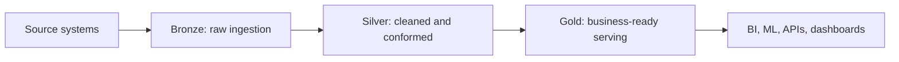

# PySpark, Spark SQL, AWS Glue, and Big Data Tutorial Guide

This is a standalone tutorial and desk reference for PySpark, Spark SQL, AWS Glue, and Big Data engineering. It is designed for day-to-day development, interview preparation, and production troubleshooting.

## How to Use This Guide

- For a quick coding refresher: sections 4, 5, 6, 7, 12, 18, 19, 20, 27, and 28.
- For fundamentals: sections 1, 2, 3, 8, and 9.
- For performance work: sections 7, 8, 10, 14, 15, 16, 17, and 25.
- For AWS Glue: sections 10, 11, 13, and 25.
- For lakehouse architecture and transactional data lakes: sections 32 and 33.
- For interviews: sections 26, 27, 28, and 29.

Callouts:

- **Interview Tip**: phrasing useful in interviews.
- **Performance Tip**: optimization guidance.
- **Warning**: common trap or production risk.
- **Production Practice**: recommended real-world approach.

## Table of Contents

1. [Big Data Fundamentals](#1-big-data-fundamentals)
2. [Apache Spark Fundamentals](#2-apache-spark-fundamentals)
3. [PySpark Fundamentals](#3-pyspark-fundamentals)
4. [PySpark Desk Reference](#4-pyspark-desk-reference)
5. [Spark SQL Tutorial](#5-spark-sql-tutorial)
6. [DataFrame Transformations and Actions](#6-dataframe-transformations-and-actions)
7. [Joins in PySpark](#7-joins-in-pyspark)
8. [Partitioning and Shuffling](#8-partitioning-and-shuffling)
9. [Spark Execution and Query Plans](#9-spark-execution-and-query-plans)
10. [Spark Internals](#10-spark-internals)
11. [AWS Glue Fundamentals](#11-aws-glue-fundamentals)
12. [DynamicFrames and DataFrames](#12-dynamicframes-and-dataframes)
13. [Reading and Writing Data](#13-reading-and-writing-data)
14. [Data Quality and Validation](#14-data-quality-and-validation)
15. [Error Handling and Logging](#15-error-handling-and-logging)
16. [Spark Performance Tuning](#16-spark-performance-tuning)
17. [Data Skew](#17-data-skew)
18. [Caching and Persistence](#18-caching-and-persistence)
19. [UDFs and Built-In Functions](#19-udfs-and-built-in-functions)
20. [Window Functions](#20-window-functions)
21. [Deduplication Patterns](#21-deduplication-patterns)
22. [Incremental and Idempotent Processing](#22-incremental-and-idempotent-processing)
23. [Testing PySpark Applications](#23-testing-pyspark-applications)
24. [Production Project Structure](#24-production-project-structure)
25. [Common PySpark Mistakes](#25-common-pyspark-mistakes)
26. [Troubleshooting Guide](#26-troubleshooting-guide)
27. [Interview Questions and Answers](#27-interview-questions-and-answers)
28. [Scenario-Based Interview Practice](#28-scenario-based-interview-practice)
29. [Frequently Used PySpark Code Snippets](#29-frequently-used-pyspark-code-snippets)
30. [Quick Revision Sheets](#30-quick-revision-sheets)
31. [Final Study Checklist](#31-final-study-checklist)
32. [Transactional Parquet with Delta Lake, Apache Hudi, and Apache Iceberg](#32-transactional-parquet-with-delta-lake-apache-hudi-and-apache-iceberg)
33. [Medallion Architecture](#33-medallion-architecture)

## 1. Big Data Fundamentals

### What Big Data Means

Big Data describes systems where ordinary single-machine processing is not enough because the data is large, fast, complex, or operationally critical.

The common 5 Vs:

- Volume: large data size.
- Velocity: fast-arriving or frequently changing data.
- Variety: structured, semi-structured, and unstructured data.
- Veracity: data quality, trust, and consistency challenges.
- Value: business value derived from processing data.

### Distributed Computing

Distributed systems split data and work across multiple machines. Spark does this by dividing data into partitions and processing those partitions with tasks on executors.

```text
Large dataset
  -> partitions
  -> tasks
  -> executors
  -> results written or returned
```

### Horizontal vs Vertical Scaling

| Scaling type | Meaning | Big Data relevance |
|---|---|---|
| Vertical scaling | Use a larger machine | Simple but limited |
| Horizontal scaling | Add more machines | Core pattern for Spark and Big Data |

### Batch vs Stream Processing

Batch processing handles bounded data, such as daily files. Stream processing handles unbounded data, such as events from Kafka.

### ETL vs ELT

ETL extracts, transforms, then loads. ELT extracts, loads raw data, then transforms inside the analytical platform.

### Data Lake, Warehouse, Lakehouse

| Architecture | Description |
|---|---|
| Data lake | Object storage or distributed storage for raw and curated files |
| Data warehouse | Managed SQL analytics platform |
| Lakehouse | Data lake plus table format, transactions, and warehouse-like features |

### OLTP vs OLAP

OLTP systems support transactions. OLAP systems support analytical queries, scans, aggregations, and reporting. Spark is primarily used for OLAP and ETL workloads.

**Interview Tip**

Say: "Spark is a distributed compute engine. It is usually paired with storage systems such as S3, HDFS, ADLS, GCS, Hive, Glue Catalog, or lakehouse table formats."

## 2. Apache Spark Fundamentals

### Spark Architecture

| Component | Role |
|---|---|
| Driver | Runs application code, builds plans, schedules work |
| Executor | Runs tasks and stores shuffle/cache data |
| Cluster manager | Allocates resources, such as YARN, Kubernetes, standalone |
| Job | Work triggered by an action |
| Stage | Set of tasks separated by shuffle boundaries |
| Task | Unit of execution for one partition |
| Partition | Slice of distributed data |

### Transformations and Actions

Transformations are lazy and build a plan:

- `select`
- `filter`
- `withColumn`
- `join`
- `groupBy`
- `repartition`

Actions trigger execution:

- `count`
- `show`
- `collect`
- `take`
- `write`

### Lazy Evaluation

Spark delays execution until an action is called. This lets Catalyst optimize the full plan before running it.

```python
filtered_df = df.filter("amount > 0").select("id", "amount")  # lazy
filtered_df.count()                                           # action
```

### Narrow vs Wide Transformations

Narrow transformations do not require data movement. Wide transformations require shuffle.

Examples:

- Narrow: `select`, `filter`, `withColumn`
- Wide: `join`, `groupBy`, `distinct`, `orderBy`, `repartition`

### Shuffle

A shuffle redistributes data across executors. It uses disk, network, memory, and serialization.

**Performance Tip**

If a Spark job is slow, first look for large shuffles, skewed tasks, memory spill, and unnecessary actions.

### Lineage and Fault Recovery

Spark tracks lineage so it can recompute lost partitions after failure. Long lineage can make retries expensive; checkpointing can truncate lineage.

## 3. PySpark Fundamentals

### SparkSession and SparkContext

```python
from pyspark.sql import SparkSession

spark = SparkSession.builder.appName("tutorial").getOrCreate()
sc = spark.sparkContext
```

`SparkSession` is the primary entry point for DataFrames and SQL. `SparkContext` is the lower-level cluster connection and RDD entry point.

### DataFrames

A DataFrame is a distributed table with rows, columns, and schema.

```python
df.columns       # list of column names
df.dtypes        # list of (column_name, data_type_string)
df.schema        # StructType object with full schema metadata
df.printSchema()
df.show(5, truncate=False)
```

### RDDs

RDDs are low-level distributed collections. Use DataFrames for most PySpark ETL because DataFrames are optimized by Catalyst.

### Columns and Rows

Columns are expressions. Rows are records.

```python
from pyspark.sql import functions as F

df.select(F.col("amount") * 2)
```

### Immutability

DataFrames are immutable. Each transformation returns a new DataFrame.

```python
df2 = df.withColumn("load_ts", F.current_timestamp())
```

### Catalyst, Tungsten, AQE

- Catalyst: query optimizer.
- Tungsten: memory and CPU execution improvements.
- AQE: Adaptive Query Execution adjusts plans at runtime.

```python
spark.conf.set("spark.sql.adaptive.enabled", "true")
```

## 4. PySpark Desk Reference

### Imports

```python
from pyspark.sql import SparkSession, Window
from pyspark.sql import functions as F
from pyspark.sql.types import (
    StructType, StructField, StringType, IntegerType,
    LongType, DoubleType, DateType, TimestampType
)
```

### SparkSession

```python
spark = (
    SparkSession.builder
    .appName("pyspark-desk-reference")
    .config("spark.sql.adaptive.enabled", "true")
    .getOrCreate()
)
```

### Explicit Schema

```python
schema = StructType([
    StructField("id", LongType(), False),
    StructField("status", StringType(), True),
    StructField("amount", DoubleType(), True),
    StructField("event_ts", TimestampType(), True),
])
```

### Inspect Columns and Data Types

```python
# Column names as a Python list
columns = df.columns

# Data types as a list of tuples: [("id", "bigint"), ("status", "string")]
dtypes = df.dtypes

# Tree view of the schema
df.printSchema()

# Full StructType schema object
schema = df.schema

# Iterate through fields with name, data type, and nullable flag
for field in df.schema.fields:
    print(field.name, field.dataType, field.nullable)

# Select columns by data type
string_cols = [name for name, dtype in df.dtypes if dtype == "string"]
numeric_cols = [
    name for name, dtype in df.dtypes
    if dtype in ("int", "bigint", "double", "float", "decimal")
]
```

**Interview Tip**: Use `df.printSchema()` for human-readable inspection, `df.dtypes` for quick checks, and `df.schema.fields` when code needs to programmatically inspect names, types, and nullability.

### Reading Files

```python
csv_df = spark.read.option("header", True).schema(schema).csv("s3://bucket/input/")
json_df = spark.read.schema(schema).json("s3://bucket/json/")
parquet_df = spark.read.parquet("s3://bucket/parquet/")
orc_df = spark.read.orc("s3://bucket/orc/")
```

### Common Transformation Pattern

```python
result_df = (
    input_df
    .filter(F.col("status") == "ACTIVE")
    .withColumn("amount", F.col("amount").cast("double"))
    .groupBy("customer_id")
    .agg(
        F.sum("amount").alias("total_amount"),
        F.count("*").alias("transaction_count"),
    )
)
```

### Nulls, Strings, Dates

```python
clean_df = (
    df.withColumn("name", F.upper(F.trim("name")))
      .withColumn("amount", F.coalesce("amount", F.lit(0.0)))
      .withColumn("event_date", F.to_date("event_ts"))
)
```

### Joins

```python
joined_df = fact_df.join(F.broadcast(dim_df), "customer_id", "left")
```

### Window Function

```python
w = Window.partitionBy("customer_id").orderBy(F.col("event_ts").desc())
latest_df = df.withColumn("rn", F.row_number().over(w)).filter("rn = 1").drop("rn")
```

### Write Partitioned Parquet

```python
(
    result_df
    .repartition("business_date")
    .write
    .mode("overwrite")
    .partitionBy("business_date")
    .parquet("s3://bucket/curated/table/")
)
```

## 5. Spark SQL Tutorial

### Temporary Views

```python
df.createOrReplaceTempView("orders")
```

### Query

```python
spark.sql("""
select customer_id, count(*) as order_count, sum(amount) as total_amount
from orders
where status = 'ACTIVE'
group by customer_id
""").show()
```

### CTE and Window

```sql
with ranked as (
  select
    *,
    row_number() over (partition by customer_id order by event_ts desc) as rn
  from orders
)
select *
from ranked
where rn = 1
```

### DataFrame API vs SQL

Use DataFrame API for reusable Python transformations. Use Spark SQL for analyst-friendly business logic and complex SQL expressions.

## 6. DataFrame Transformations and Actions

| Operation | Type | Narrow/Wide | Shuffle |
|---|---|---|---|
| `select` | Transformation | Narrow | No |
| `filter` | Transformation | Narrow | No |
| `withColumn` | Transformation | Usually narrow | Usually no |
| `drop` | Transformation | Narrow | No |
| `distinct` | Transformation | Wide | Yes |
| `groupBy` | Transformation | Wide | Yes |
| `join` | Transformation | Usually wide | Usually yes |
| `orderBy` | Transformation | Wide | Yes |
| `repartition` | Transformation | Wide | Yes |
| `coalesce` | Transformation | Usually narrow | Usually no |
| `count` | Action | N/A | Executes plan |
| `collect` | Action | N/A | Executes and returns to driver |
| `show` | Action | N/A | Executes limited result |
| `take` | Action | N/A | Executes limited result |
| `write` | Action | N/A | Executes and writes |

## 7. Joins in PySpark

### Join Types

```python
inner_df = left.join(right, "id", "inner")
left_df = left.join(right, "id", "left")
right_df = left.join(right, "id", "right")
outer_df = left.join(right, "id", "outer")
semi_df = left.join(right.select("id").distinct(), "id", "left_semi")
anti_df = left.join(right.select("id").distinct(), "id", "left_anti")
```

### Join Strategies

| Strategy | Use when |
|---|---|
| Broadcast hash join | One side is small |
| Sort-merge join | Both sides are large |
| Shuffle hash join | One side per partition fits memory |
| Cross join | Cartesian product is intentional |

### Avoid Ambiguous Columns

```python
joined = (
    left.alias("l")
    .join(right.alias("r"), F.col("l.id") == F.col("r.id"), "left")
    .select("l.id", "l.amount", F.col("r.segment").alias("segment"))
)
```

### Detect Join Explosion

```python
left.groupBy("id").count().filter("count > 1").orderBy(F.desc("count")).show(20)
right.groupBy("id").count().filter("count > 1").orderBy(F.desc("count")).show(20)
```

## 8. Partitioning and Shuffling

### Different Meanings of Partition

| Partition type | Meaning |
|---|---|
| Spark partition | Runtime slice of a DataFrame/RDD |
| Input partition | Split created from source files |
| Output partition | Task/file produced during write |
| Table/S3 partition | Directory layout such as `date=2026-07-16` |
| Glue partition | Catalog metadata pointing to partition locations |
| Shuffle partition | Partition created during shuffle |

### Commands

```python
df.rdd.getNumPartitions()
df.repartition(800, "customer_id")
df.coalesce(100)
df.write.partitionBy("business_date").parquet(path)
```

### Shuffle Partitions

```python
spark.conf.set("spark.sql.shuffle.partitions", "800")
```

## 9. Spark Execution and Query Plans

```python
df.explain()
df.explain("formatted")
```

Look for:

| Plan marker | Meaning |
|---|---|
| `Exchange` | Shuffle or broadcast exchange |
| `Sort` | Sort operation |
| `BroadcastHashJoin` | Broadcast join |
| `SortMergeJoin` | Large equi-join |
| `HashAggregate` | Hash aggregation |
| `WholeStageCodegen` | Generated JVM code |
| `AdaptiveSparkPlan` | AQE enabled |

## 10. Spark Internals

### Catalyst

Catalyst optimizes logical plans through rule-based and cost-aware transformations.

### Tungsten

Tungsten improves memory and CPU efficiency using binary row formats and code generation.

### Py4J and Python Workers

PySpark uses Py4J to communicate with the JVM. Python UDFs require data movement between JVM and Python workers.

### Arrow

Arrow enables efficient columnar transfer, especially for Pandas UDFs.

### Spill

If Spark cannot fit execution data in memory, it spills to disk. Spill is slower but prevents immediate failure.

## 11. AWS Glue Fundamentals

AWS Glue is a managed data integration service built around Spark and the Glue Data Catalog.

Core concepts:

- Glue job
- Glue version
- Worker type
- DPU
- Glue Data Catalog
- Crawler
- Job bookmark
- DynamicFrame
- GlueContext
- Connection
- CloudWatch logs
- IAM role
- Trigger/workflow

### Glue vs EMR vs Databricks vs Lambda

| Service | Best for |
|---|---|
| Glue | Serverless Spark ETL and catalog integration |
| EMR | More control over Hadoop/Spark clusters |
| Databricks | Managed lakehouse and collaborative Spark |
| Lambda | Short event-driven tasks, not large Spark ETL |

## 12. DynamicFrames and DataFrames

```python
from awsglue.dynamicframe import DynamicFrame

dynamic_frame = DynamicFrame.fromDF(df, glue_context, "dynamic_frame")
df = dynamic_frame.toDF()
```

DynamicFrames are useful for messy semi-structured data and Glue transforms. DataFrames are usually preferred for complex joins, aggregations, SQL, and performance.

## 13. Reading and Writing Data

### Production Read

```python
df = (
    spark.read
    .schema(schema)
    .option("mode", "PERMISSIVE")
    .json("s3://bucket/raw/events/")
)
```

### CSV

```python
df = (
    spark.read
    .option("header", True)
    .option("delimiter", ",")
    .schema(schema)
    .csv("s3://bucket/input/")
)
```

### Write

```python
(
    df.write
    .mode("overwrite")
    .option("compression", "snappy")
    .partitionBy("business_date")
    .parquet("s3://bucket/curated/table/")
)
```

## 14. Data Quality and Validation

```python
required = ["id", "business_date"]

for column_name in required:
    null_count = df.filter(F.col(column_name).isNull()).count()
    print(column_name, null_count)

duplicate_keys = df.groupBy("id").count().filter(F.col("count") > 1)

profile = df.agg(
    F.count("*").alias("row_count"),
    F.countDistinct("id").alias("distinct_ids"),
    F.min("business_date").alias("min_date"),
    F.max("business_date").alias("max_date"),
)
```

## 15. Error Handling and Logging

```python
import logging

logger = logging.getLogger(__name__)
logger.setLevel(logging.INFO)

def log_metric(name: str, value: object) -> None:
    logger.info("metric=%s value=%s", name, value)
```

Guidelines:

- Use structured logs.
- Log input/output paths and parameters.
- Log counts carefully because counts trigger actions.
- Catch specific exceptions when possible.
- Separate retryable and non-retryable failures.

## 16. Spark Performance Tuning

Checklist:

- Filter early.
- Select only required columns.
- Use built-in functions.
- Avoid driver-side operations.
- Reduce shuffles.
- Broadcast small dimensions.
- Tune `spark.sql.shuffle.partitions`.
- Enable AQE.
- Address skew.
- Use Parquet or ORC.
- Compact small files.
- Cache only reused DataFrames.
- Unpersist cached DataFrames.
- Use explicit schemas.

```python
spark.conf.set("spark.sql.adaptive.enabled", "true")
spark.conf.set("spark.sql.adaptive.skewJoin.enabled", "true")
spark.conf.set("spark.sql.adaptive.coalescePartitions.enabled", "true")
spark.conf.set("spark.sql.shuffle.partitions", "800")
```

## 17. Data Skew

Detect skew:

```python
df.groupBy("join_key").count().orderBy(F.desc("count")).show(20)

df.withColumn("pid", F.spark_partition_id()).groupBy("pid").count().orderBy(F.desc("count")).show(20)
```

Fixes:

- Broadcast small side.
- Enable AQE skew join.
- Salt hot keys.
- Split heavy hitters.
- Repartition by a better key.

## 18. Caching and Persistence

```python
from pyspark import StorageLevel

reused = expensive_df.persist(StorageLevel.MEMORY_AND_DISK)
reused.count()
reused.unpersist()
```

Cache only when the DataFrame is reused and recomputation is expensive.

## 19. UDFs and Built-In Functions

Prefer built-in functions:

```python
df2 = df.withColumn("clean_code", F.upper(F.trim("code")))
```

Use Python UDFs only when Spark SQL functions cannot express the logic.

## 20. Window Functions

```python
w = Window.partitionBy("customer_id").orderBy("event_ts")

result = (
    df.withColumn("rn", F.row_number().over(w))
      .withColumn("rank", F.rank().over(w))
      .withColumn("dense_rank", F.dense_rank().over(w))
      .withColumn("prev_amount", F.lag("amount").over(w))
      .withColumn("running_total", F.sum("amount").over(w))
)
```

## 21. Deduplication Patterns

```python
deduped = df.dropDuplicates(["business_key"])

w = Window.partitionBy("business_key").orderBy(F.col("updated_at").desc())
latest = df.withColumn("rn", F.row_number().over(w)).filter("rn = 1").drop("rn")
```

## 22. Incremental and Idempotent Processing

Patterns:

- Full load.
- Incremental load.
- Watermark.
- High-water mark.
- Glue bookmark.
- CDC.
- Backfill.
- Idempotent partition overwrite.

```python
incremental_df = source_df.filter(F.col("updated_at") > F.lit(last_successful_watermark))
```

## 23. Testing PySpark Applications

```python
import pytest
from pyspark.sql import SparkSession

@pytest.fixture(scope="session")
def spark() -> SparkSession:
    return SparkSession.builder.master("local[2]").appName("tests").getOrCreate()
```

```python
def transform(df):
    return df.filter(F.col("amount") > 0).select("id", "amount")

def test_transform(spark):
    input_df = spark.createDataFrame([(1, 10.0), (2, -1.0)], ["id", "amount"])
    result = transform(input_df)
    assert result.count() == 1
```

## 24. Production Project Structure

Recommended structure:

```text
src/
  jobs/
  transforms/
  readers/
  writers/
  validation/
  config/
  utils/
tests/
resources/
scripts/
```

Separate I/O from transformations. Keep transformations small, testable, and reusable.

## 25. Common PySpark Mistakes

- Using `collect()` on large data.
- Calling `count()` repeatedly.
- Using Python loops for distributed operations.
- Using Python `and`/`or` instead of `&`/`|`.
- Forgetting parentheses around column conditions.
- Using `== None` instead of `isNull()`.
- Creating ambiguous columns after joins.
- Using UDFs unnecessarily.
- Repartitioning without understanding shuffle.
- Assuming row order.
- Inferring schema in production.
- Writing too many small files.

## 26. Troubleshooting Guide

| Problem | Inspect | Likely fixes |
|---|---|---|
| Slow job | Spark UI Jobs/Stages | Identify slow stage, reduce shuffle |
| One stuck stage | Task durations | Check skew/spill |
| Executor loss | Executor logs | Memory overhead, spot loss, disk |
| Driver OOM | Driver logs | Remove collect/toPandas |
| Executor OOM | Executors tab | Repartition, fix skew, tune memory |
| Fetch failure | Stage logs | Stabilize executors, reduce shuffle |
| Python worker crash | Executor logs | UDF/package/memory |
| S3 failure | CloudWatch/S3 path | IAM, KMS, path, throttling |
| Missing Glue partitions | Glue Catalog | Repair/add partitions |
| Small files | S3 layout | Compact/coalesce |

## 27. Interview Questions and Answers

### Beginner

Q: What is lazy evaluation?

A: Spark records transformations and executes only when an action is called.

Q: DataFrame vs RDD?

A: DataFrames are structured and optimized by Catalyst; RDDs are lower-level.

### Intermediate

Q: repartition vs coalesce?

A: `repartition` shuffles and can increase/decrease partitions. `coalesce` usually reduces partitions without full shuffle.

Q: How do you tune a join?

A: Filter/select early, inspect plan, broadcast small side, check duplicate keys/skew, tune shuffle partitions.

### Advanced

Q: What is AQE?

A: Runtime query optimization that can coalesce shuffle partitions, switch joins, and handle skew using runtime stats.

Q: How do you debug executor OOM?

A: Inspect executor logs, Spark UI spill/GC/task sizes, skew, partition sizes, cache use, and memory overhead.

## 28. Scenario-Based Interview Practice

### Job Now Takes Five Hours Instead of One

Likely causes: data growth, skew, small files, config change, full scan, or bad join.

Investigate: compare Spark UI metrics, input size, stage duration, shuffle, spill, and task skew.

### One Task Runs Much Longer

Likely cause: skewed partition or hot key.

Fix: identify key distribution, salt/split hot keys, enable AQE skew join.

### `collect()` Crashes Driver

Fix: write results to storage, sample/limit, aggregate first, avoid collecting large DataFrames.

## 29. Frequently Used PySpark Code Snippets

### DataFrame Comparison

```python
keys = ["id"]
only_left = left.select(keys).distinct().join(right.select(keys).distinct(), keys, "left_anti")
only_right = right.select(keys).distinct().join(left.select(keys).distinct(), keys, "left_anti")
common = left.join(right, keys, "inner")
```

### JSON Parsing

```python
payload_schema = StructType([StructField("event_type", StringType(), True)])
parsed = df.withColumn("payload_struct", F.from_json("payload", payload_schema)).select("id", "payload_struct.*")
```

### Data Quality

```python
dq = df.agg(
    F.count("*").alias("rows"),
    F.countDistinct("id").alias("distinct_ids"),
    F.sum(F.col("id").isNull().cast("int")).alias("null_ids"),
)
```

### Glue Arguments

```python
from awsglue.utils import getResolvedOptions
import sys

args = getResolvedOptions(sys.argv, ["JOB_NAME", "input_path", "output_path"])
```

## 30. Quick Revision Sheets

### Spark Architecture

Driver builds plans and schedules tasks. Executors run tasks. Jobs are triggered by actions. Stages are separated by shuffles. Tasks process partitions.

### Performance

Filter early, select required columns, avoid unnecessary shuffles, broadcast small tables, handle skew, avoid driver collection, control file sizes, cache only reused data, inspect Spark UI.

### Join Strategies

Broadcast hash join for small-large. Sort-merge for large-large. Left anti for missing records. Left semi for existence. Check duplicate keys to avoid row explosion.

### AWS Glue

Glue is managed Spark plus Catalog. Use IAM roles, CloudWatch logs, job parameters, bookmarks/watermarks, partition pruning, and efficient S3 file layouts.

## 31. Final Study Checklist

- Explain driver, executor, job, stage, task, partition.
- Explain lazy evaluation.
- Explain narrow vs wide transformations.
- Explain shuffle.
- Explain broadcast vs sort-merge join.
- Explain repartition vs coalesce.
- Explain cache vs persist.
- Explain how to detect skew.
- Explain how to read an execution plan.
- Explain how to debug driver and executor OOM.
- Explain why plain Parquet is not transactional.
- Explain Delta Lake vs Apache Hudi vs Apache Iceberg.
- Explain bronze, silver, and gold layers in medallion architecture.
- Practice common PySpark snippets.
- Practice scenario-based answers.

## 32. Transactional Parquet with Delta Lake, Apache Hudi, and Apache Iceberg

### Core Idea

Parquet is a columnar file format, not a database table. It is excellent for analytics because it supports compression, predicate pushdown, column pruning, and efficient scans. But plain Parquet files do not have transactions, row-level updates, rollback, or table history.

In plain Parquet, there is no in-place `UPDATE`. A Parquet file is effectively immutable in data lake workloads. To change one record, Spark usually has to:

1. Read the affected file, partition, or table into a DataFrame.
2. Apply the change in Spark.
3. Write new Parquet files.
4. Replace the affected partition or table path.

Example: update one date partition in plain Parquet:

```python
from pyspark.sql import functions as F

target_path = "s3://my-bucket/lake/orders_parquet/"

partition_df = (
    spark.read.parquet(target_path)
    .filter(F.col("order_date") == "2026-07-15")
)

updated_partition = (
    partition_df
    .withColumn(
        "status",
        F.when(F.col("order_id") == "O-100", F.lit("CANCELLED"))
         .otherwise(F.col("status"))
    )
)

spark.conf.set("spark.sql.sources.partitionOverwriteMode", "dynamic")

(
    updated_partition.write
    .mode("overwrite")
    .partitionBy("order_date")
    .parquet(target_path)
)
```

This is still not a transaction. If the overwrite fails, if another job writes at the same time, or if overwrite settings are wrong, readers can see missing, duplicate, partial, or inconsistent data.

Lakehouse table formats solve this by storing data as files, usually Parquet, and adding a metadata layer that defines the valid table state.

```text
Data files:
  Parquet files in S3 or cloud object storage

Metadata layer:
  transaction log, snapshots, manifests, commits

Table behavior:
  ACID transactions, MERGE, UPDATE, DELETE, rollback, time travel
```

**Interview Tip**: "Parquet does not become transactional by itself. Delta Lake, Hudi, and Iceberg add a table metadata layer over Parquet files so readers know which files represent the current valid table version."

### Delta Lake

Delta Lake stores table data as Parquet files and stores transaction history in the `_delta_log` directory. The transaction log is the source of truth.

Delta provides:

- ACID transactions.
- `MERGE`, `UPDATE`, and `DELETE`.
- Schema enforcement and schema evolution.
- Time travel by version or timestamp.
- Batch and streaming support.
- Compaction and cleanup features in Delta-enabled platforms.

On AWS, Delta Lake is commonly used with Databricks on AWS, Amazon EMR, AWS Glue Spark jobs with Delta packages, and S3 storage.

Write a partitioned Delta table:

```python
orders_path = "s3://my-bucket/lake/silver/orders_delta"

(
    orders_df.write
    .format("delta")
    .mode("append")
    .partitionBy("order_date")
    .save(orders_path)
)

orders = spark.read.format("delta").load(orders_path)
```

The physical layout still has partition folders:

```text
s3://my-bucket/lake/silver/orders_delta/
  _delta_log/
    00000000000000000000.json
    00000000000000000001.json

  order_date=2026-07-15/
    part-0001.snappy.parquet
    part-0004.snappy.parquet

  order_date=2026-07-16/
    part-0002.snappy.parquet
```

But Delta readers do not trust folder listing alone. They read `_delta_log` to know which files are active.

### What Is Inside a Delta Log JSON File

Delta log files are newline-delimited JSON. Each line is one action, such as table metadata, protocol version, added files, removed files, or commit information.

Example `_delta_log/00000000000000000001.json`:

```json
{"commitInfo":{"timestamp":1784246400000,"operation":"UPDATE","operationParameters":{"predicate":"order_date = '2026-07-15' AND order_id = 'O-100'"},"readVersion":0,"isolationLevel":"Serializable"}}
{"protocol":{"minReaderVersion":1,"minWriterVersion":2}}
{"metaData":{"id":"8f7b2c1a-table-id","format":{"provider":"parquet","options":{}},"schemaString":"{\"type\":\"struct\",\"fields\":[{\"name\":\"order_id\",\"type\":\"string\",\"nullable\":true},{\"name\":\"status\",\"type\":\"string\",\"nullable\":true},{\"name\":\"order_date\",\"type\":\"date\",\"nullable\":true}]}","partitionColumns":["order_date"]}}
{"remove":{"path":"order_date=2026-07-15/part-0001.snappy.parquet","deletionTimestamp":1784246400000,"dataChange":true}}
{"add":{"path":"order_date=2026-07-15/part-0004.snappy.parquet","partitionValues":{"order_date":"2026-07-15"},"size":1048576,"modificationTime":1784246400000,"dataChange":true,"stats":"{\"numRecords\":3,\"minValues\":{\"order_id\":\"O-100\"},\"maxValues\":{\"order_id\":\"O-102\"},\"nullCount\":{\"order_id\":0}}"}}
```

How to read this:

- `commitInfo`: describes the operation, such as `WRITE`, `UPDATE`, `DELETE`, `MERGE`, or `OPTIMIZE`.
- `protocol`: records the minimum Delta reader/writer versions required.
- `metaData`: stores table schema, partition columns, table id, and format details.
- `remove`: marks an old Parquet file as no longer active.
- `add`: marks a new Parquet file as active and stores partition values and file statistics.

**Important**: Delta does not delete the old file immediately when it writes a `remove` action. The file can remain physically present for time travel. Delta readers ignore it because `_delta_log` says it is removed.

### What Happens When a Delta Partition Is Updated

Delta keeps the partition folder structure. For the Spark user, Delta feels like a database-style update:

```python
orders.update(
    condition="order_date = '2026-07-15' AND order_id = 'O-100'",
    set={"status": "'CANCELLED'"}
)
```

Internally, Delta still works with immutable Parquet files. It does not edit one row inside an existing Parquet file. It rewrites affected files and records the change in `_delta_log`.

For an update in `order_date=2026-07-15`, Delta typically:

1. Finds files in that partition that contain matching rows.
2. Reads the affected files.
3. Writes new Parquet replacement files, usually under the same partition folder.
4. Marks old files as removed in `_delta_log`.
5. Marks new files as added in `_delta_log`.

Example before update:

```text
order_date=2026-07-15/
  part-0001.snappy.parquet

part-0001 contents:
  order_id=O-100, status=NEW        # row to update
  order_id=O-101, status=NEW        # unchanged row
  order_id=O-102, status=SHIPPED    # unchanged row
```

Example after update:

```text
order_date=2026-07-15/
  part-0001.snappy.parquet  # old file, physically present but removed in _delta_log
  part-0004.snappy.parquet  # new active replacement file

part-0004 contents:
  order_id=O-100, status=CANCELLED  # updated row
  order_id=O-101, status=NEW        # unchanged row copied from old file
  order_id=O-102, status=SHIPPED    # unchanged row copied from old file
```

Delta readers only read files that are active in the latest transaction log version. They ignore `part-0001` and read `part-0004`. Old files remain for time travel until cleanup runs.

Key point: the row is logically updated, but the physical operation is a file rewrite. Updating one row may rewrite a whole Parquet file. This is called write amplification.

Update example:

```python
from delta.tables import DeltaTable

orders = DeltaTable.forPath(spark, "s3://my-bucket/lake/silver/orders_delta")

orders.update(
    condition="order_date = '2026-07-15' AND order_id = 'O-100'",
    set={"status": "'CANCELLED'"}
)
```

### How Delta Helps Spark Users

Delta does not make Parquet files mutable. Spark still reads candidate data and Delta still rewrites Parquet files underneath. Delta helps because it manages the rewrite safely and transactionally.

| Plain Parquet | Delta Lake |
|---|---|
| You manually read, modify, and overwrite files | You call `UPDATE`, `DELETE`, or `MERGE` |
| Failed overwrite can leave partial data | Commit is atomic through `_delta_log` |
| Readers may see inconsistent files | Readers see one consistent table version |
| Concurrent writers can corrupt output | Delta detects write conflicts with optimistic concurrency |
| No built-in rollback | Time travel can read older table versions |
| Folder listing decides what is read | Transaction log decides active files |

Delta does not always scan the full table. With a partition predicate such as `order_date = '2026-07-15'`, Delta can prune unrelated partitions. It then rewrites only affected candidate files, not every partition.

### Using Delta Lake on AWS EMR

On EMR, Delta Lake is not just "normal Parquet." Spark must run with Delta Lake libraries and Delta SQL extensions. The exact Delta package version must match the EMR Spark and Scala versions.

You usually need:

- Delta Lake package or JAR.
- Spark SQL extension: `io.delta.sql.DeltaSparkSessionExtension`.
- Delta catalog: `org.apache.spark.sql.delta.catalog.DeltaCatalog`.
- S3 permissions for the table path and `_delta_log`.
- Optional Glue Data Catalog configuration if you want metastore tables.

`spark-submit` example:

```bash
spark-submit \
  --packages io.delta:delta-spark_2.12:<delta-version> \
  --conf spark.sql.extensions=io.delta.sql.DeltaSparkSessionExtension \
  --conf spark.sql.catalog.spark_catalog=org.apache.spark.sql.delta.catalog.DeltaCatalog \
  delta_orders_job.py
```

PySpark `SparkSession` example:

```python
from pyspark.sql import SparkSession

spark = (
    SparkSession.builder
    .appName("delta-on-emr")
    .config("spark.sql.extensions", "io.delta.sql.DeltaSparkSessionExtension")
    .config("spark.sql.catalog.spark_catalog", "org.apache.spark.sql.delta.catalog.DeltaCatalog")
    .getOrCreate()
)
```

Write and read a Delta table on S3:

```python
orders_path = "s3://my-bucket/lake/silver/orders_delta"

(
    orders_df.write
    .format("delta")
    .mode("append")
    .partitionBy("order_date")
    .save(orders_path)
)

orders = spark.read.format("delta").load(orders_path)
```

Create a Delta table in the catalog:

```sql
CREATE TABLE IF NOT EXISTS analytics.orders_delta
USING DELTA
LOCATION 's3://my-bucket/lake/silver/orders_delta'
```

If EMR is configured to use AWS Glue Data Catalog as the Hive metastore, Spark SQL can resolve `analytics.orders_delta` through the catalog while the actual Delta files remain in S3.

EMR production checklist:

- Confirm EMR version, Spark version, Scala version, and Delta package compatibility.
- Attach IAM permissions for both data files and `_delta_log`.
- Use S3 paths consistently. Do not mix direct Parquet writes into a Delta table path.
- Use `VACUUM` carefully because it removes old files needed for time travel.
- Test concurrent writers if multiple EMR steps or jobs can update the same table.

**Interview Tip**: "On EMR, I add the Delta Lake package and configure Spark with `DeltaSparkSessionExtension` and `DeltaCatalog`. Then I use `.format('delta')` or SQL `USING DELTA`. The main operational checks are version compatibility, S3 permissions, Glue Catalog integration, and avoiding non-Delta writes into the same path."

### Running Standard PySpark and Delta Examples Locally on macOS or Windows

You can practice standard PySpark and Delta Lake at home without EMR by running PySpark locally. Use standard PySpark examples to refresh DataFrame basics, joins, aggregations, and file reads/writes. Use Delta examples to learn `UPDATE`, `MERGE`, `_delta_log`, and time travel.

Local prerequisites:

- Install Java and make sure `java -version` works.
- Use a Python virtual environment if possible.
- Use local file paths for practice. Use S3 paths only if AWS credentials and Hadoop S3 dependencies are configured.

Install local dependencies:

```bash
pip install pyspark delta-spark
```

For standard PySpark only, `pyspark` is enough. Install `delta-spark` only when you want to run Delta Lake examples.

### Local Standard PySpark Example Without Delta Lake

This example uses normal PySpark DataFrames and writes plain Parquet. It does not use Delta Lake, `_delta_log`, `UPDATE`, or `MERGE`.

Standard PySpark setup:

```python
from pyspark.sql import SparkSession
from pyspark.sql import functions as F

spark = (
    SparkSession.builder
    .appName("local-standard-pyspark-practice")
    .master("local[*]")
    .getOrCreate()
)
```

Use a local path.

macOS or Linux:

```python
orders_path = "/tmp/pyspark-practice/orders_parquet"
```

Windows:

```python
orders_path = "C:/tmp/pyspark-practice/orders_parquet"
```

Create, transform, and write sample data:

```python
orders_df = spark.createDataFrame(
    [
        ("O-100", "C-1", "NEW", 100.0, "2026-07-15"),
        ("O-101", "C-1", "NEW", 50.0, "2026-07-15"),
        ("O-102", "C-2", "SHIPPED", 75.0, "2026-07-15"),
        ("O-200", "C-3", "NEW", 20.0, "2026-07-16"),
    ],
    ["order_id", "customer_id", "status", "amount", "order_date"],
).withColumn("order_date", F.to_date("order_date"))

daily_sales = (
    orders_df
    .filter(F.col("status").isin("NEW", "SHIPPED"))
    .groupBy("order_date")
    .agg(
        F.countDistinct("order_id").alias("order_count"),
        F.sum("amount").alias("total_amount")
    )
)

(
    orders_df.write
    .mode("overwrite")
    .partitionBy("order_date")
    .parquet(orders_path)
)
```

Read the plain Parquet data:

```python
read_df = spark.read.parquet(orders_path)

read_df.printSchema()
read_df.orderBy("order_id").show(truncate=False)
daily_sales.orderBy("order_date").show(truncate=False)
```

Plain Parquet update pattern:

```python
partition_df = read_df.filter(F.col("order_date") == "2026-07-15")

updated_partition = (
    partition_df
    .withColumn(
        "status",
        F.when(F.col("order_id") == "O-100", F.lit("CANCELLED"))
         .otherwise(F.col("status"))
    )
)

spark.conf.set("spark.sql.sources.partitionOverwriteMode", "dynamic")

(
    updated_partition.write
    .mode("overwrite")
    .partitionBy("order_date")
    .parquet(orders_path)
)
```

This works for practice, but it is not transactional. Spark rewrites files or partitions, and there is no `_delta_log`, rollback, or time travel.

### Local Delta Lake Example

Delta Spark setup:

```python
from delta import configure_spark_with_delta_pip
from pyspark.sql import SparkSession
from pyspark.sql import functions as F

builder = (
    SparkSession.builder
    .appName("local-delta-practice")
    .master("local[*]")
    .config("spark.sql.extensions", "io.delta.sql.DeltaSparkSessionExtension")
    .config("spark.sql.catalog.spark_catalog", "org.apache.spark.sql.delta.catalog.DeltaCatalog")
)

spark = configure_spark_with_delta_pip(builder).getOrCreate()
```

Use a local path.

macOS or Linux:

```python
orders_path = "/tmp/delta-practice/orders_delta"
```

Windows:

```python
orders_path = "C:/tmp/delta-practice/orders_delta"
```

Create sample data:

```python
orders_df = spark.createDataFrame(
    [
        ("O-100", "NEW", "2026-07-15"),
        ("O-101", "NEW", "2026-07-15"),
        ("O-102", "SHIPPED", "2026-07-15"),
        ("O-200", "NEW", "2026-07-16"),
    ],
    ["order_id", "status", "order_date"],
).withColumn("order_date", F.to_date("order_date"))

(
    orders_df.write
    .format("delta")
    .mode("overwrite")
    .partitionBy("order_date")
    .save(orders_path)
)
```

Update one row:

```python
from delta.tables import DeltaTable

orders = DeltaTable.forPath(spark, orders_path)

orders.update(
    condition="order_date = '2026-07-15' AND order_id = 'O-100'",
    set={"status": "'CANCELLED'"}
)
```

Read current table:

```python
spark.read.format("delta").load(orders_path).orderBy("order_id").show()
```

Read an older version:

```python
spark.read.format("delta").option("versionAsOf", 0).load(orders_path).show()
```

Inspect the local folder:

```text
orders_delta/
  _delta_log/
  order_date=2026-07-15/
  order_date=2026-07-16/
```

Open files under `_delta_log` to see the `add` and `remove` actions. This is the best local way to understand how Delta makes immutable Parquet files behave like a transactional table.

Upsert with `MERGE`:

```python
from delta.tables import DeltaTable

target = DeltaTable.forPath(spark, "s3://my-bucket/lake/silver/orders_delta")

(
    target.alias("t")
    .merge(updates_df.alias("s"), "t.order_id = s.order_id")
    .whenMatchedUpdate(set={
        "status": "s.status",
        "updated_at": "s.updated_at"
    })
    .whenNotMatchedInsert(values={
        "order_id": "s.order_id",
        "status": "s.status",
        "updated_at": "s.updated_at"
    })
    .execute()
)
```

Time travel:

```python
previous = (
    spark.read
    .format("delta")
    .option("versionAsOf", 10)
    .load("s3://my-bucket/lake/silver/orders_delta")
)
```

Cleanup old inactive files after the retention period:

```python
DeltaTable.forPath(spark, orders_path).vacuum()
```

**Performance Tip**: Delta transactions fix correctness problems, not all performance problems. You still need good partition design, file sizing, compaction, statistics, and skew handling.

### Apache Hudi

Apache Hudi is a lakehouse table format designed heavily for upserts, deletes, CDC ingestion, incremental reads, and near-real-time pipelines.

Hudi provides:

- Transactional commit timeline.
- Upserts and deletes.
- Incremental reads from a commit instant.
- Copy-on-write and merge-on-read table types.
- Record keys and indexing for efficient updates.
- Cleaner and compaction services.

Hudi table types:

| Type | Meaning | Best for |
|---|---|---|
| Copy-on-write | Updates rewrite Parquet files during write | Read-heavy tables |
| Merge-on-read | Writes changes to log files and compacts later | Write-heavy or near-real-time ingestion |

Key Hudi concepts:

- Record key: unique business key, such as `order_id`.
- Precombine field: field used to pick the latest record, such as `updated_at`.
- Partition path: physical partition column, such as `order_date`.
- Commit timeline: ordered history of table commits.

Hudi upsert example:

```python
hudi_options = {
    "hoodie.table.name": "orders_hudi",
    "hoodie.datasource.write.recordkey.field": "order_id",
    "hoodie.datasource.write.precombine.field": "updated_at",
    "hoodie.datasource.write.partitionpath.field": "order_date",
    "hoodie.datasource.write.operation": "upsert",
    "hoodie.datasource.write.table.type": "COPY_ON_WRITE",
}

(
    updates_df.write
    .format("hudi")
    .options(**hudi_options)
    .mode("append")
    .save("s3://my-bucket/lake/silver/orders_hudi")
)
```

Incremental read pattern:

```python
incremental = (
    spark.read
    .format("hudi")
    .option("hoodie.datasource.query.type", "incremental")
    .option("hoodie.datasource.read.begin.instanttime", "20260715000000")
    .load("s3://my-bucket/lake/silver/orders_hudi")
)
```

On AWS, Hudi is commonly used with AWS Glue, Amazon EMR, S3, and the AWS Glue Data Catalog. It is a strong choice when the workload is CDC-heavy and requires frequent upserts.

### Apache Iceberg

Apache Iceberg is an open table format for large analytic tables. It stores table state in snapshots and manifest files that point to active data files.

Iceberg provides:

- ACID transactions.
- Snapshot isolation.
- Time travel.
- Schema evolution.
- Partition evolution.
- Hidden partitioning.
- `MERGE`, `UPDATE`, and `DELETE` depending on engine support.
- Strong interoperability across Spark, Flink, Trino, Athena, EMR, and Glue.

Iceberg is especially useful when the same lakehouse tables must work across multiple engines.

Spark SQL example with a Glue Catalog-backed Iceberg table:

```python
spark.sql("""
CREATE TABLE IF NOT EXISTS glue_catalog.analytics.orders_iceberg (
    order_id STRING,
    customer_id STRING,
    order_status STRING,
    order_ts TIMESTAMP,
    amount DECIMAL(10, 2)
)
USING iceberg
PARTITIONED BY (days(order_ts))
""")

updates_df.writeTo("glue_catalog.analytics.orders_iceberg").append()
```

Iceberg `MERGE` example:

```python
updates_df.createOrReplaceTempView("order_updates")

spark.sql("""
MERGE INTO glue_catalog.analytics.orders_iceberg t
USING order_updates s
ON t.order_id = s.order_id
WHEN MATCHED THEN UPDATE SET
    t.order_status = s.order_status,
    t.amount = s.amount
WHEN NOT MATCHED THEN INSERT *
""")
```

Time travel query:

```python
snapshot_df = spark.read.option("snapshot-id", "123456789").table(
    "glue_catalog.analytics.orders_iceberg"
)
```

On AWS, Iceberg is commonly used with AWS Glue Data Catalog, Amazon Athena, Amazon EMR, AWS Glue Spark, and S3. It is often a strong choice when multiple engines must read and write the same lakehouse tables.

### Delta Lake vs Hudi vs Iceberg

| Format | Best fit | Strengths | Watch out for |
|---|---|---|---|
| Delta Lake | Databricks or Spark-heavy lakehouse workloads | Simple Spark API, strong `MERGE`, time travel, mature Delta ecosystem | Runtime/package compatibility outside Databricks |
| Apache Hudi | CDC, frequent upserts, incremental ingestion | Record-level upserts, incremental pulls, copy-on-write and merge-on-read choices | More write options to understand and tune |
| Apache Iceberg | Open lakehouse across many engines | Snapshots, hidden partitioning, schema and partition evolution, Athena/Trino/Spark interoperability | Requires correct catalog and engine configuration |

### How to Choose

- Use Delta Lake when your platform is Databricks or Delta-standardized Spark and you want straightforward `MERGE`, time travel, and schema enforcement.
- Use Hudi when the workload is CDC-heavy, upsert-heavy, or needs incremental consumption from commits.
- Use Iceberg when many engines must share the same tables, especially Spark, Athena, Trino, Flink, EMR, and Glue.

### Production Checklist for Transactional Data Lake Tables

- Choose the table format deliberately. Do not mix formats casually.
- Store data in S3, but manage table state through the format metadata.
- Use a catalog such as AWS Glue Data Catalog when the format and engine support it.
- Pick partition columns based on query patterns and data volume.
- Prefer date formats such as `yyyy-MM-dd`; avoid `ddmmyyyy` strings for partition values.
- Avoid high-cardinality partition columns such as `user_id`.
- Compact small files regularly.
- Configure retention, vacuum, cleaner, or snapshot expiration carefully.
- Test concurrent writes if multiple jobs can modify the same table.
- Treat schema evolution as a controlled production change.
- Monitor table metadata growth, commit history, and failed write attempts.
- Keep raw bronze data replayable so corrupted silver or gold tables can be rebuilt.

### Common Interview Question

**Question**: How would you make Parquet on S3 behave like a transactional database table?

**Answer**: Plain Parquet is only a file format. It cannot update rows in place and does not have ACID transactions. I would use Delta Lake, Apache Hudi, or Apache Iceberg. These formats still store data as Parquet files, but they add a metadata layer that tracks active files, removed files, commits, schema, and snapshots. In Delta Lake specifically, partition folders remain, but `_delta_log` is the source of truth. To the Spark user, `UPDATE` and `MERGE` look like database operations. Internally, Delta rewrites affected Parquet files, marks old files as removed, and atomically commits the new table version so readers see consistent data.

## 33. Medallion Architecture

### The Core Idea

Medallion architecture is a layered data lakehouse design pattern. It organizes data into progressively cleaner and more business-ready layers:

- Bronze: raw or nearly raw data.
- Silver: cleaned, validated, deduplicated, and conformed data.
- Gold: business-ready aggregates, marts, metrics, and serving tables.



**Interview Tip**: Explain medallion architecture as "a way to separate raw ingestion, data cleaning, and business serving so pipelines are replayable, testable, and easier to govern."

### Bronze Layer

The bronze layer stores source-aligned data with minimal transformation. It is the landing zone for raw events, files, CDC records, API extracts, or database dumps.

Bronze should preserve:

- Original source columns.
- Source system identifiers.
- Ingestion timestamp.
- File name or batch id.
- Raw payload when useful.
- Enough metadata to replay and audit.

Bronze examples:

- Raw JSON events from Kafka.
- CSV files from a vendor.
- CDC records from a relational database.
- API response payloads.

Bronze PySpark pattern:

```python
from pyspark.sql import functions as F

bronze = (
    spark.read
    .option("multiline", "false")
    .json("s3://my-bucket/raw/orders/")
    .withColumn("_ingest_ts", F.current_timestamp())
    .withColumn("ingest_date", F.to_date("_ingest_ts"))
    .withColumn("_source_file", F.input_file_name())
)

(
    bronze.write
    .mode("append")
    .partitionBy("ingest_date")
    .parquet("s3://my-bucket/lake/bronze/orders/")
)
```

**Production Practice**: Keep bronze append-only when possible. If downstream logic changes, rebuild silver and gold from bronze instead of asking the source system to resend historical data.

### Silver Layer

The silver layer turns raw data into reliable analytical data. It applies data quality rules, typing, deduplication, standard naming, and joins to reference data.

Silver usually includes:

- Explicit schema and correct data types.
- Deduplicated records.
- Validated required fields.
- Standardized column names.
- Clean timestamps and dates.
- Conformed dimensions.
- PII handling or tokenization where required.
- Upserts from CDC sources.

Silver PySpark pattern:

```python
from pyspark.sql import Window
from pyspark.sql import functions as F

w = Window.partitionBy("order_id").orderBy(F.col("updated_at").desc())

silver = (
    bronze
    .filter(F.col("order_id").isNotNull())
    .withColumn("updated_at", F.to_timestamp("updated_at"))
    .withColumn("amount", F.col("amount").cast("decimal(10,2)"))
    .withColumn("_rn", F.row_number().over(w))
    .filter(F.col("_rn") == 1)
    .drop("_rn")
)
```

Silver write with a transactional table format:

```python
(
    silver.write
    .format("iceberg")  # or delta/hudi depending on your platform
    .mode("append")
    .saveAsTable("glue_catalog.silver.orders")
)
```

**Performance Tip**: Silver tables are frequently joined and reused, so table layout matters. Choose partitioning, file size, clustering, and compaction based on actual query patterns.

### Gold Layer

The gold layer is optimized for business consumption. It contains curated marts, aggregates, feature tables, KPI tables, and dashboard-ready datasets.

Gold examples:

- Daily revenue by product.
- Customer 360 table.
- Fraud model feature table.
- Finance reporting mart.
- Executive dashboard metrics.

Gold PySpark pattern:

```python
gold_daily_sales = (
    silver
    .groupBy(F.to_date("order_ts").alias("order_date"), "order_status")
    .agg(
        F.countDistinct("order_id").alias("orders"),
        F.sum("amount").alias("revenue")
    )
)

(
    gold_daily_sales.write
    .mode("overwrite")
    .format("parquet")
    .partitionBy("order_date")
    .save("s3://my-bucket/lake/gold/daily_sales/")
)
```

For gold tables that must support updates, history, or concurrent readers, use Delta Lake, Hudi, or Iceberg instead of plain Parquet.

### Medallion Architecture Benefits

| Benefit | Why it matters |
|---|---|
| Replayability | Silver and gold can be rebuilt from bronze |
| Data quality | Rules can be applied before data reaches business users |
| Lineage | Each layer has a clear purpose and source |
| Governance | Access can be restricted by layer |
| Performance | Gold can be optimized for BI and serving |
| Team ownership | Data engineering owns bronze/silver; analytics teams often own gold marts |

### Common Design Choices

| Decision | Recommended approach |
|---|---|
| Bronze format | Keep raw data as source-aligned as possible |
| Silver format | Use transactional table format for upserts and corrections |
| Gold format | Use format and layout based on serving engine |
| Partitioning | Partition by common filters, not by unique identifiers |
| Data quality | Block or quarantine bad records before gold |
| Reprocessing | Use deterministic jobs with batch ids or watermarks |

### Common Mistakes

- Putting complex business logic directly into bronze.
- Skipping silver and building dashboards from raw data.
- Treating gold as a dumping ground for every possible column.
- Using non-idempotent jobs that duplicate records on retry.
- Partitioning by high-cardinality columns.
- Ignoring schema evolution.
- Not keeping enough raw history to rebuild downstream layers.
- Letting small files accumulate in every layer.

### Interview Answer Template

When asked to explain medallion architecture:

```text
I use medallion architecture to structure a lakehouse into bronze, silver, and gold layers.
Bronze keeps raw, replayable source data with ingestion metadata.
Silver cleans, deduplicates, validates, standardizes, and conforms the data.
Gold contains business-ready marts, aggregates, metrics, or ML feature tables.
This pattern improves quality, lineage, governance, reprocessing, and performance.
In production, I often use Delta, Hudi, or Iceberg for silver and gold tables when I need ACID transactions, upserts, time travel, or concurrent access.
```

### How Medallion and Transactional Table Formats Work Together

Medallion architecture is a data design pattern. Delta Lake, Hudi, and Iceberg are storage table formats. They solve different but complementary problems.

Use them together like this:

- Bronze: often append-only raw files or transactional tables when ingestion needs exactly-once semantics.
- Silver: commonly transactional because deduplication, corrections, CDC, and upserts are frequent.
- Gold: often transactional when dashboards, ML features, or reports need reliable updates and rollback.

```text
Bronze raw data
  -> append-only, replayable, source-aligned

Silver clean data
  -> Delta/Hudi/Iceberg for upserts, deduplication, schema enforcement

Gold serving data
  -> optimized tables for BI, ML, APIs, or reporting
```
