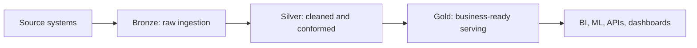

# PySpark, Spark SQL, AWS Glue, and Big Data Tutorial Guide

This is a standalone tutorial and desk reference for PySpark, Spark SQL, AWS Glue, and Big Data engineering. It is designed for day-to-day development, interview preparation, and production troubleshooting.

## How to Use This Guide

- For a quick coding refresher: sections 4, 5, 6, 7, 12, 18, 19, 20, 27, and 28.
- For fundamentals: sections 1, 2, 3, 8, and 9.
- For performance work: sections 7, 8, 10, 14, 15, 16, 17, and 25.
- For AWS Glue: sections 10, 11, 13, and 25.
- For lakehouse architecture and transactional data lakes: sections 32 and 33.
- For interviews: sections 26, 27, 28, and 29.
- For streaming and real-time: sections 38 and 39.
- For data quality and operations: sections 40, 41, and 42.
- For ML at scale and architecture: sections 43 and 44.

Callouts:

- **Interview Tip**: phrasing useful in interviews.
- **Performance Tip**: optimization guidance.
- **Warning**: common trap or production risk.
- **Production Practice**: recommended real-world approach.

## Scope & Coverage: What This Guide Covers

### IN SCOPE (Big Data Engineering)

This guide focuses on **big data engineering** at scale:

✅ **Spark Fundamentals** - Core concepts, architecture, execution model
✅ **PySpark & Spark SQL** - DataFrame API, SQL, transformations, actions
✅ **Batch ETL Pipelines** - Large-scale data processing (100GB to petabytes)
✅ **Real-Time Streaming** - Kafka, Kinesis, watermarks, stateful processing
✅ **Lakehouse Architecture** - Delta Lake, Hudi, Iceberg, medallion patterns
✅ **AWS Big Data Services** - Glue, Kinesis, EMR, Athena, S3, EventBridge
✅ **Production Operations** - Troubleshooting, performance tuning, observability
✅ **Data Platform Architecture** - Data mesh, pipeline design, governance
✅ **Data Quality & Observability** - Validation, SLAs, monitoring
✅ **Security & Compliance** - Encryption, access control, audit logging
✅ **Cost Optimization** - Right-sizing, query optimization, resource management
✅ **Distributed Machine Learning** - Spark MLlib, feature engineering at scale

### WHO SHOULD USE THIS GUIDE

✅ **Data Engineers** - Building and maintaining data pipelines
✅ **Apache Spark Developers** - Writing PySpark applications
✅ **AWS Glue Users** - Building ETL jobs on AWS
✅ **Platform Engineers** - Designing data platform architecture
✅ **Interview Candidates** - Preparing for data engineering roles
✅ **DevOps/SRE** - Operating data systems at scale
✅ **Analytics Engineers** - Building data models with Spark

### LEARNING PATHS BY ROLE

**Beginner Data Engineer:**
→ Sections 1-3 (fundamentals) → 4-6 (PySpark basics) → 11-13 (Glue) → 22 (incremental patterns)

**Intermediate Spark Developer:**
→ Sections 7-10 (optimization) → 16-17 (performance) → 31-33 (lakehouse) → 38-39 (streaming)

**Advanced Big Data Architect:**
→ Sections 34-37 (debugging) → 40-44 (operations, architecture) → 45-51 (patterns, challenges)

## Table of Contents

1. [Big Data Fundamentals](#1-big-data-fundamentals)
2. [Apache Spark Fundamentals](#2-apache-spark-fundamentals)
3. [PySpark Fundamentals](#3-pyspark-fundamentals)
4. [PySpark Desk Reference](#4-pyspark-desk-reference)
5. [Spark SQL Tutorial](#5-spark-sql-tutorial)
6. [DataFrame Transformations and Actions](#6-dataframe-transformations-and-actions)
7. [Joins in PySpark](#7-joins-in-pyspark)
8. [Partitioning and Shuffling](#8-partitioning-and-shuffling)
9. [Spark Execution and Query Plans](#9-spark-execution-and-query-plans)
10. [Spark Internals](#10-spark-internals)
11. [AWS Glue Fundamentals](#11-aws-glue-fundamentals)
12. [DynamicFrames and DataFrames](#12-dynamicframes-and-dataframes)
13. [Reading and Writing Data](#13-reading-and-writing-data)
14. [Data Quality and Validation](#14-data-quality-and-validation)
15. [Error Handling and Logging](#15-error-handling-and-logging)
16. [Spark Performance Tuning](#16-spark-performance-tuning)
17. [Data Skew](#17-data-skew)
18. [Caching and Persistence](#18-caching-and-persistence)
19. [UDFs and Built-In Functions](#19-udfs-and-built-in-functions)
20. [Window Functions](#20-window-functions)
21. [Deduplication Patterns](#21-deduplication-patterns)
22. [Incremental and Idempotent Processing](#22-incremental-and-idempotent-processing)
23. [Testing PySpark Applications](#23-testing-pyspark-applications)
24. [Production Project Structure](#24-production-project-structure)
25. [Common PySpark Mistakes](#25-common-pyspark-mistakes)
26. [Troubleshooting Guide](#26-troubleshooting-guide)
27. [Interview Questions and Answers](#27-interview-questions-and-answers)
28. [Scenario-Based Interview Practice](#28-scenario-based-interview-practice)
29. [Frequently Used PySpark Code Snippets](#29-frequently-used-pyspark-code-snippets)
30. [Quick Revision Sheets](#30-quick-revision-sheets)
31. [Final Study Checklist](#31-final-study-checklist)
31.5. [Lakehouse Architecture Fundamentals](#315-lakehouse-architecture-fundamentals)
32. [Transactional Parquet with Delta Lake, Apache Hudi, and Apache Iceberg](#32-transactional-parquet-with-delta-lake-apache-hudi-and-apache-iceberg)
33. [Medallion Architecture](#33-medallion-architecture)
34. [Spark UI and Production Troubleshooting](#34-spark-ui-and-production-troubleshooting)
35. [Explain Plan Practice](#35-explain-plan-practice)
36. [Common Coding Interview Exercises](#36-common-coding-interview-exercises)
37. [General Performance Anti-Patterns](#37-general-performance-anti-patterns)
38. [Spark Structured Streaming](#38-spark-structured-streaming)
39. [Real-Time AWS Data Pipelines](#39-real-time-aws-data-pipelines)
40. [Data Quality, Observability, and SLAs](#40-data-quality-observability-and-slas)
41. [Data Security and Compliance](#41-data-security-and-compliance)
42. [Cost Optimization for Data Pipelines](#42-cost-optimization-for-data-pipelines)
52. [Lakehouse Implementation & Operations Guide](#52-lakehouse-implementation--operations-guide)
43. [Spark MLlib and Distributed Feature Engineering](#43-spark-mllib-and-distributed-feature-engineering)
44. [Data Mesh Architecture for Big Data Platforms](#44-data-mesh-architecture-for-big-data-platforms)
45. [Data APIs and Real-Time Serving](#45-data-apis-and-real-time-serving)
46. [Advanced AWS Glue Patterns](#46-advanced-aws-glue-patterns)
47. [Graph Processing and Network Analysis](#47-graph-processing-and-network-analysis)
48. [Production Debugging and Deep Optimization](#48-production-debugging-and-deep-optimization)
49. [Common Big Data Architecture Patterns](#49-common-big-data-architecture-patterns)
50. [Handling Scale, Skew, and Performance Challenges](#50-handling-scale-skew-and-performance-challenges)
51. [Modern Big Data Stack Integration](#51-modern-big-data-stack-integration)

## 1. Big Data Fundamentals

### What Big Data Means

Big Data describes systems where ordinary single-machine processing is not enough because the data is large, fast, complex, or operationally critical.

The common 5 Vs:

- Volume: large data size.
- Velocity: fast-arriving or frequently changing data.
- Variety: structured, semi-structured, and unstructured data.
- Veracity: data quality, trust, and consistency challenges.
- Value: business value derived from processing data.

### Distributed Computing

Distributed systems split data and work across multiple machines. Spark does this by dividing data into partitions and processing those partitions with tasks on executors.

```text
Large dataset
  -> partitions
  -> tasks
  -> executors
  -> results written or returned
```

### Horizontal vs Vertical Scaling

| Scaling type | Meaning | Big Data relevance |
|---|---|---|
| Vertical scaling | Use a larger machine | Simple but limited |
| Horizontal scaling | Add more machines | Core pattern for Spark and Big Data |

### Batch vs Stream Processing

Batch processing handles bounded data, such as daily files. Stream processing handles unbounded data, such as events from Kafka.

### ETL vs ELT

ETL extracts, transforms, then loads. ELT extracts, loads raw data, then transforms inside the analytical platform.

### Data Lake, Warehouse, Lakehouse

| Architecture | Description |
|---|---|
| Data lake | Object storage or distributed storage for raw and curated files |
| Data warehouse | Managed SQL analytics platform |
| Lakehouse | Data lake plus table format, transactions, and warehouse-like features |

### OLTP vs OLAP

OLTP systems support transactions. OLAP systems support analytical queries, scans, aggregations, and reporting. Spark is primarily used for OLAP and ETL workloads.

**Interview Tip**

Say: "Spark is a distributed compute engine. It is usually paired with storage systems such as S3, HDFS, ADLS, GCS, Hive, Glue Catalog, or lakehouse table formats."

## 2. Apache Spark Fundamentals

### Spark Architecture

| Component | Role |
|---|---|
| Driver | Runs application code, builds plans, schedules work |
| Executor | Runs tasks and stores shuffle/cache data |
| Cluster manager | Allocates resources, such as YARN, Kubernetes, standalone |
| Job | Work triggered by an action |
| Stage | Set of tasks separated by shuffle boundaries |
| Task | Unit of execution for one partition |
| Partition | Slice of distributed data |

### Transformations and Actions

Transformations are lazy and build a plan:

- `select`
- `filter`
- `withColumn`
- `join`
- `groupBy`
- `repartition`

Actions trigger execution:

- `count`
- `show`
- `collect`
- `take`
- `write`

### Lazy Evaluation

Spark delays execution until an action is called. This lets Catalyst optimize the full plan before running it.

```python
filtered_df = df.filter("amount > 0").select("id", "amount")  # lazy
filtered_df.count()                                           # action
```

### Narrow vs Wide Transformations

Narrow transformations do not require data movement. Wide transformations require shuffle.

Examples:

- Narrow: `select`, `filter`, `withColumn`
- Wide: `join`, `groupBy`, `distinct`, `orderBy`, `repartition`

### Shuffle

A shuffle redistributes data across executors. It uses disk, network, memory, and serialization.

**Performance Tip**

If a Spark job is slow, first look for large shuffles, skewed tasks, memory spill, and unnecessary actions.

### Lineage and Fault Recovery

Spark tracks lineage so it can recompute lost partitions after failure. Long lineage can make retries expensive; checkpointing can truncate lineage.

## 3. PySpark Fundamentals

### SparkSession and SparkContext

```python
from pyspark.sql import SparkSession

spark = SparkSession.builder.appName("tutorial").getOrCreate()
sc = spark.sparkContext
```

`SparkSession` is the primary entry point for DataFrames and SQL. `SparkContext` is the lower-level cluster connection and RDD entry point.

### DataFrames

A DataFrame is a distributed table with rows, columns, and schema.

```python
df.columns       # list of column names
df.dtypes        # list of (column_name, data_type_string)
df.schema        # StructType object with full schema metadata
df.printSchema()
df.show(5, truncate=False)
```

### RDDs

RDDs are low-level distributed collections. Use DataFrames for most PySpark ETL because DataFrames are optimized by Catalyst.

### Columns and Rows

Columns are expressions. Rows are records.

```python
from pyspark.sql import functions as F

df.select(F.col("amount") * 2)
```

### Immutability

DataFrames are immutable. Each transformation returns a new DataFrame.

```python
df2 = df.withColumn("load_ts", F.current_timestamp())
```

### Catalyst, Tungsten, AQE

- Catalyst: query optimizer.
- Tungsten: memory and CPU execution improvements.
- AQE: Adaptive Query Execution adjusts plans at runtime.

```python
spark.conf.set("spark.sql.adaptive.enabled", "true")
```

## 4. PySpark Desk Reference

### Imports

```python
from pyspark.sql import SparkSession, Window
from pyspark.sql import functions as F
from pyspark.sql.types import (
    StructType, StructField, StringType, IntegerType,
    LongType, DoubleType, DateType, TimestampType
)
```

### SparkSession

```python
spark = (
    SparkSession.builder
    .appName("pyspark-desk-reference")
    .config("spark.sql.adaptive.enabled", "true")
    .getOrCreate()
)
```

### Explicit Schema

```python
schema = StructType([
    StructField("id", LongType(), False),
    StructField("status", StringType(), True),
    StructField("amount", DoubleType(), True),
    StructField("event_ts", TimestampType(), True),
])
```

### Inspect Columns and Data Types

```python
# Column names as a Python list
columns = df.columns

# Data types as a list of tuples: [("id", "bigint"), ("status", "string")]
dtypes = df.dtypes

# Tree view of the schema
df.printSchema()

# Full StructType schema object
schema = df.schema

# Iterate through fields with name, data type, and nullable flag
for field in df.schema.fields:
    print(field.name, field.dataType, field.nullable)

# Select columns by data type
string_cols = [name for name, dtype in df.dtypes if dtype == "string"]
numeric_cols = [
    name for name, dtype in df.dtypes
    if dtype in ("int", "bigint", "double", "float", "decimal")
]
```

**Interview Tip**: Use `df.printSchema()` for human-readable inspection, `df.dtypes` for quick checks, and `df.schema.fields` when code needs to programmatically inspect names, types, and nullability.

### Reading Files

```python
csv_df = spark.read.option("header", True).schema(schema).csv("s3://bucket/input/")
json_df = spark.read.schema(schema).json("s3://bucket/json/")
parquet_df = spark.read.parquet("s3://bucket/parquet/")
orc_df = spark.read.orc("s3://bucket/orc/")
```

### Common Transformation Pattern

```python
result_df = (
    input_df
    .filter(F.col("status") == "ACTIVE")
    .withColumn("amount", F.col("amount").cast("double"))
    .groupBy("customer_id")
    .agg(
        F.sum("amount").alias("total_amount"),
        F.count("*").alias("transaction_count"),
    )
)
```

### Nulls, Strings, Dates

```python
clean_df = (
    df.withColumn("name", F.upper(F.trim("name")))
      .withColumn("amount", F.coalesce("amount", F.lit(0.0)))
      .withColumn("event_date", F.to_date("event_ts"))
)
```

### Joins

```python
joined_df = fact_df.join(F.broadcast(dim_df), "customer_id", "left")
```

### Window Function

```python
w = Window.partitionBy("customer_id").orderBy(F.col("event_ts").desc())
latest_df = df.withColumn("rn", F.row_number().over(w)).filter("rn = 1").drop("rn")
```

### Write Partitioned Parquet

```python
(
    result_df
    .repartition("business_date")
    .write
    .mode("overwrite")
    .partitionBy("business_date")
    .parquet("s3://bucket/curated/table/")
)
```

## 5. Spark SQL Tutorial

### Temporary Views

```python
df.createOrReplaceTempView("orders")
```

### Query

```python
spark.sql("""
select customer_id, count(*) as order_count, sum(amount) as total_amount
from orders
where status = 'ACTIVE'
group by customer_id
""").show()
```

### CTE and Window

```sql
with ranked as (
  select
    *,
    row_number() over (partition by customer_id order by event_ts desc) as rn
  from orders
)
select *
from ranked
where rn = 1
```

### DataFrame API vs SQL

Use DataFrame API for reusable Python transformations. Use Spark SQL for analyst-friendly business logic and complex SQL expressions.

## 6. DataFrame Transformations and Actions

| Operation | Type | Narrow/Wide | Shuffle |
|---|---|---|---|
| `select` | Transformation | Narrow | No |
| `filter` | Transformation | Narrow | No |
| `withColumn` | Transformation | Usually narrow | Usually no |
| `drop` | Transformation | Narrow | No |
| `distinct` | Transformation | Wide | Yes |
| `groupBy` | Transformation | Wide | Yes |
| `join` | Transformation | Usually wide | Usually yes |
| `orderBy` | Transformation | Wide | Yes |
| `repartition` | Transformation | Wide | Yes |
| `coalesce` | Transformation | Usually narrow | Usually no |
| `count` | Action | N/A | Executes plan |
| `collect` | Action | N/A | Executes and returns to driver |
| `show` | Action | N/A | Executes limited result |
| `take` | Action | N/A | Executes limited result |
| `write` | Action | N/A | Executes and writes |

## 7. Joins in PySpark

### Join Types

```python
inner_df = left.join(right, "id", "inner")
left_df = left.join(right, "id", "left")
right_df = left.join(right, "id", "right")
outer_df = left.join(right, "id", "outer")
semi_df = left.join(right.select("id").distinct(), "id", "left_semi")
anti_df = left.join(right.select("id").distinct(), "id", "left_anti")
```

### Join Strategies

| Strategy | Use when |
|---|---|
| Broadcast hash join | One side is small |
| Sort-merge join | Both sides are large |
| Shuffle hash join | One side per partition fits memory |
| Cross join | Cartesian product is intentional |

### Avoid Ambiguous Columns

```python
joined = (
    left.alias("l")
    .join(right.alias("r"), F.col("l.id") == F.col("r.id"), "left")
    .select("l.id", "l.amount", F.col("r.segment").alias("segment"))
)
```

### Detect Join Explosion

```python
left.groupBy("id").count().filter("count > 1").orderBy(F.desc("count")).show(20)
right.groupBy("id").count().filter("count > 1").orderBy(F.desc("count")).show(20)
```

## 8. Partitioning and Shuffling

### Different Meanings of Partition

| Partition type | Meaning |
|---|---|
| Spark partition | Runtime slice of a DataFrame/RDD |
| Input partition | Split created from source files |
| Output partition | Task/file produced during write |
| Table/S3 partition | Directory layout such as `date=2026-07-16` |
| Glue partition | Catalog metadata pointing to partition locations |
| Shuffle partition | Partition created during shuffle |

### Commands

```python
df.rdd.getNumPartitions()
df.repartition(800, "customer_id")
df.coalesce(100)
df.write.partitionBy("business_date").parquet(path)
```

### Shuffle Partitions

```python
spark.conf.set("spark.sql.shuffle.partitions", "800")
```

## 9. Spark Execution and Query Plans

```python
df.explain()
df.explain("formatted")
```

Look for:

| Plan marker | Meaning |
|---|---|
| `Exchange` | Shuffle or broadcast exchange |
| `Sort` | Sort operation |
| `BroadcastHashJoin` | Broadcast join |
| `SortMergeJoin` | Large equi-join |
| `HashAggregate` | Hash aggregation |
| `WholeStageCodegen` | Generated JVM code |
| `AdaptiveSparkPlan` | AQE enabled |

## 10. Spark Internals

### Catalyst

Catalyst optimizes logical plans through rule-based and cost-aware transformations.

### Tungsten

Tungsten improves memory and CPU efficiency using binary row formats and code generation.

### Py4J and Python Workers

PySpark uses Py4J to communicate with the JVM. Python UDFs require data movement between JVM and Python workers.

### Arrow

Arrow enables efficient columnar transfer, especially for Pandas UDFs.

### Spill

If Spark cannot fit execution data in memory, it spills to disk. Spill is slower but prevents immediate failure.

## 11. AWS Glue Fundamentals

AWS Glue is a managed data integration service built around Spark and the Glue Data Catalog.

Core concepts:

- Glue job
- Glue version
- Worker type
- DPU
- Glue Data Catalog
- Crawler
- Job bookmark
- DynamicFrame
- GlueContext
- Connection
- CloudWatch logs
- IAM role
- Trigger/workflow

### Glue vs EMR vs Databricks vs Lambda

| Service | Best for |
|---|---|
| Glue | Serverless Spark ETL and catalog integration |
| EMR | More control over Hadoop/Spark clusters |
| Databricks | Managed lakehouse and collaborative Spark |
| Lambda | Short event-driven tasks, not large Spark ETL |

## 12. DynamicFrames and DataFrames

```python
from awsglue.dynamicframe import DynamicFrame

dynamic_frame = DynamicFrame.fromDF(df, glue_context, "dynamic_frame")
df = dynamic_frame.toDF()
```

DynamicFrames are useful for messy semi-structured data and Glue transforms. DataFrames are usually preferred for complex joins, aggregations, SQL, and performance.

## 13. Reading and Writing Data

### Production Read

```python
df = (
    spark.read
    .schema(schema)
    .option("mode", "PERMISSIVE")
    .json("s3://bucket/raw/events/")
)
```

### CSV

```python
df = (
    spark.read
    .option("header", True)
    .option("delimiter", ",")
    .schema(schema)
    .csv("s3://bucket/input/")
)
```

### Write

```python
(
    df.write
    .mode("overwrite")
    .option("compression", "snappy")
    .partitionBy("business_date")
    .parquet("s3://bucket/curated/table/")
)
```

## 14. Data Quality and Validation

```python
required = ["id", "business_date"]

for column_name in required:
    null_count = df.filter(F.col(column_name).isNull()).count()
    print(column_name, null_count)

duplicate_keys = df.groupBy("id").count().filter(F.col("count") > 1)

profile = df.agg(
    F.count("*").alias("row_count"),
    F.countDistinct("id").alias("distinct_ids"),
    F.min("business_date").alias("min_date"),
    F.max("business_date").alias("max_date"),
)
```

## 15. Error Handling and Logging

```python
import logging

logger = logging.getLogger(__name__)
logger.setLevel(logging.INFO)

def log_metric(name: str, value: object) -> None:
    logger.info("metric=%s value=%s", name, value)
```

Guidelines:

- Use structured logs.
- Log input/output paths and parameters.
- Log counts carefully because counts trigger actions.
- Catch specific exceptions when possible.
- Separate retryable and non-retryable failures.

## 16. Spark Performance Tuning

Checklist:

- Filter early.
- Select only required columns.
- Use built-in functions.
- Avoid driver-side operations.
- Reduce shuffles.
- Broadcast small dimensions.
- Tune `spark.sql.shuffle.partitions`.
- Enable AQE.
- Address skew.
- Use Parquet or ORC.
- Compact small files.
- Cache only reused DataFrames.
- Unpersist cached DataFrames.
- Use explicit schemas.

```python
spark.conf.set("spark.sql.adaptive.enabled", "true")
spark.conf.set("spark.sql.adaptive.skewJoin.enabled", "true")
spark.conf.set("spark.sql.adaptive.coalescePartitions.enabled", "true")
spark.conf.set("spark.sql.shuffle.partitions", "800")
```

## 17. Data Skew

Detect skew:

```python
df.groupBy("join_key").count().orderBy(F.desc("count")).show(20)

df.withColumn("pid", F.spark_partition_id()).groupBy("pid").count().orderBy(F.desc("count")).show(20)
```

Fixes:

- Broadcast small side.
- Enable AQE skew join.
- Salt hot keys.
- Split heavy hitters.
- Repartition by a better key.

## 18. Caching and Persistence

```python
from pyspark import StorageLevel

reused = expensive_df.persist(StorageLevel.MEMORY_AND_DISK)
reused.count()
reused.unpersist()
```

Cache only when the DataFrame is reused and recomputation is expensive.

## 19. UDFs and Built-In Functions

Prefer built-in functions:

```python
df2 = df.withColumn("clean_code", F.upper(F.trim("code")))
```

Use Python UDFs only when Spark SQL functions cannot express the logic.

## 20. Window Functions

```python
w = Window.partitionBy("customer_id").orderBy("event_ts")

result = (
    df.withColumn("rn", F.row_number().over(w))
      .withColumn("rank", F.rank().over(w))
      .withColumn("dense_rank", F.dense_rank().over(w))
      .withColumn("prev_amount", F.lag("amount").over(w))
      .withColumn("running_total", F.sum("amount").over(w))
)
```

## 21. Deduplication Patterns

```python
deduped = df.dropDuplicates(["business_key"])

w = Window.partitionBy("business_key").orderBy(F.col("updated_at").desc())
latest = df.withColumn("rn", F.row_number().over(w)).filter("rn = 1").drop("rn")
```

## 22. Incremental and Idempotent Processing

Patterns:

- Full load.
- Incremental load.
- Watermark.
- High-water mark.
- Glue bookmark.
- CDC.
- Backfill.
- Idempotent partition overwrite.

```python
incremental_df = source_df.filter(F.col("updated_at") > F.lit(last_successful_watermark))
```

## 23. Testing PySpark Applications

```python
import pytest
from pyspark.sql import SparkSession

@pytest.fixture(scope="session")
def spark() -> SparkSession:
    return SparkSession.builder.master("local[2]").appName("tests").getOrCreate()
```

```python
def transform(df):
    return df.filter(F.col("amount") > 0).select("id", "amount")

def test_transform(spark):
    input_df = spark.createDataFrame([(1, 10.0), (2, -1.0)], ["id", "amount"])
    result = transform(input_df)
    assert result.count() == 1
```

## 24. Production Project Structure

Recommended structure:

```text
src/
  jobs/
  transforms/
  readers/
  writers/
  validation/
  config/
  utils/
tests/
resources/
scripts/
```

Separate I/O from transformations. Keep transformations small, testable, and reusable.

## 25. Common PySpark Mistakes

- Using `collect()` on large data.
- Calling `count()` repeatedly.
- Using Python loops for distributed operations.
- Using Python `and`/`or` instead of `&`/`|`.
- Forgetting parentheses around column conditions.
- Using `== None` instead of `isNull()`.
- Creating ambiguous columns after joins.
- Using UDFs unnecessarily.
- Repartitioning without understanding shuffle.
- Assuming row order.
- Inferring schema in production.
- Writing too many small files.

## 26. Troubleshooting Guide

| Problem | Inspect | Likely fixes |
|---|---|---|
| Slow job | Spark UI Jobs/Stages | Identify slow stage, reduce shuffle |
| One stuck stage | Task durations | Check skew/spill |
| Executor loss | Executor logs | Memory overhead, spot loss, disk |
| Driver OOM | Driver logs | Remove collect/toPandas |
| Executor OOM | Executors tab | Repartition, fix skew, tune memory |
| Fetch failure | Stage logs | Stabilize executors, reduce shuffle |
| Python worker crash | Executor logs | UDF/package/memory |
| S3 failure | CloudWatch/S3 path | IAM, KMS, path, throttling |
| Missing Glue partitions | Glue Catalog | Repair/add partitions |
| Small files | S3 layout | Compact/coalesce |

## 27. Interview Questions and Answers

### Beginner

Q: What is lazy evaluation?

A: Spark records transformations and executes only when an action is called.

Q: DataFrame vs RDD?

A: DataFrames are structured and optimized by Catalyst; RDDs are lower-level.

### Intermediate

Q: repartition vs coalesce?

A: `repartition` shuffles and can increase/decrease partitions. `coalesce` usually reduces partitions without full shuffle.

Q: How do you tune a join?

A: Filter/select early, inspect plan, broadcast small side, check duplicate keys/skew, tune shuffle partitions.

### Advanced

Q: What is AQE?

A: Runtime query optimization that can coalesce shuffle partitions, switch joins, and handle skew using runtime stats.

Q: How do you debug executor OOM?

A: Inspect executor logs, Spark UI spill/GC/task sizes, skew, partition sizes, cache use, and memory overhead.

## 28. Scenario-Based Interview Practice

### Job Now Takes Five Hours Instead of One

Likely causes: data growth, skew, small files, config change, full scan, or bad join.

Investigate: compare Spark UI metrics, input size, stage duration, shuffle, spill, and task skew.

### One Task Runs Much Longer

Likely cause: skewed partition or hot key.

Fix: identify key distribution, salt/split hot keys, enable AQE skew join.

### `collect()` Crashes Driver

Fix: write results to storage, sample/limit, aggregate first, avoid collecting large DataFrames.

## 29. Frequently Used PySpark Code Snippets

### DataFrame Comparison

```python
keys = ["id"]
only_left = left.select(keys).distinct().join(right.select(keys).distinct(), keys, "left_anti")
only_right = right.select(keys).distinct().join(left.select(keys).distinct(), keys, "left_anti")
common = left.join(right, keys, "inner")
```

### JSON Parsing

```python
payload_schema = StructType([StructField("event_type", StringType(), True)])
parsed = df.withColumn("payload_struct", F.from_json("payload", payload_schema)).select("id", "payload_struct.*")
```

### Data Quality

```python
dq = df.agg(
    F.count("*").alias("rows"),
    F.countDistinct("id").alias("distinct_ids"),
    F.sum(F.col("id").isNull().cast("int")).alias("null_ids"),
)
```

### Glue Arguments

```python
from awsglue.utils import getResolvedOptions
import sys

args = getResolvedOptions(sys.argv, ["JOB_NAME", "input_path", "output_path"])
```

## 30. Quick Revision Sheets

### Spark Architecture

Driver builds plans and schedules tasks. Executors run tasks. Jobs are triggered by actions. Stages are separated by shuffles. Tasks process partitions.

### Performance

Filter early, select required columns, avoid unnecessary shuffles, broadcast small tables, handle skew, avoid driver collection, control file sizes, cache only reused data, inspect Spark UI.

### Join Strategies

Broadcast hash join for small-large. Sort-merge for large-large. Left anti for missing records. Left semi for existence. Check duplicate keys to avoid row explosion.

### AWS Glue

Glue is managed Spark plus Catalog. Use IAM roles, CloudWatch logs, job parameters, bookmarks/watermarks, partition pruning, and efficient S3 file layouts.

## 31. Final Study Checklist

- Explain driver, executor, job, stage, task, partition.
- Explain lazy evaluation.
- Explain narrow vs wide transformations.
- Explain shuffle.
- Explain broadcast vs sort-merge join.
- Explain repartition vs coalesce.
- Explain cache vs persist.
- Explain how to detect skew.
- Explain how to read an execution plan.
- Explain how to debug driver and executor OOM.
- Explain why plain Parquet is not transactional.
- Explain Delta Lake vs Apache Hudi vs Apache Iceberg.
- Explain bronze, silver, and gold layers in medallion architecture.
- Practice common PySpark snippets.
- Practice scenario-based answers.

## 31.5. Lakehouse Architecture Fundamentals

### What Is a Lakehouse?

A lakehouse combines the scalability and low cost of data lakes with the ACID transactions, schema enforcement, and query performance of data warehouses. It achieves this by layering table formats and metadata on top of cloud object storage like S3, Azure Data Lake, or GCS.

```text
Data Lake + Data Warehouse Features = Lakehouse

Object Storage (S3, ADLS, GCS)
  ↓
Metadata Layer (Delta, Hudi, Iceberg)
  ↓
ACID Transactions, Schema, Governance
  ↓
Spark, Trino, Athena, Flink, etc.
```

**Interview Tip**: "A lakehouse is cloud object storage plus a table format that adds transactions, schema enforcement, and metadata. This gives you the economics of a lake and the reliability of a warehouse."

### The Evolution: Lake → Warehouse → Lakehouse

| Aspect | Data Lake | Data Warehouse | Lakehouse |
|---|---|---|---|
| Storage | Object storage (cheap, scalable) | Proprietary (expensive per GB) | Object storage |
| Format | Any (files, blobs) | Optimized binary (propietary) | Standardized (Parquet, ORC) |
| Transactions | None or limited | Full ACID | Full ACID via metadata layer |
| Schema | Flexible, often inferred | Strict enforcement | Enforced and evolvable |
| Query engines | Limited, often one vendor | SQL, but locked-in | SQL, Python, R; multiple engines |
| Update capability | Batch rewrites | Row-level updates | Row-level updates via table format |
| Time travel | Manual or custom | Limited | Built-in via metadata snapshots |
| Typical cost | ~$23/TB/year (S3) | $1000+/TB/year | ~$23/TB/year + compute |

### Core Lakehouse Concepts

#### Storage and Compute Separation

Lakehouse separates storage from compute. Data lives in object storage; compute engines attach on demand.

Benefits:

- Scale storage and compute independently.
- Multiple engines can read/write the same table.
- Cost-effective for bursty workloads.
- Easier disaster recovery and multi-region.

```text
S3 bucket with Delta/Hudi/Iceberg tables
  ↓ (data format + metadata)
  ├── Spark (ETL, transformations)
  ├── Trino (interactive SQL)
  ├── Athena (serverless SQL)
  ├── Flink (streaming)
  └── Python/Jupyter (ML, analytics)
```

#### Metadata Layer

The metadata layer defines which files are active, which are deleted, schema, partitions, and transaction history. It is the "database" part of the lakehouse.

Examples:

- Delta Lake: `_delta_log` directory with JSON transaction log.
- Hudi: `.hoodie` directory with commit timeline.
- Iceberg: manifest files and metadata snapshots in a metadata folder.

Importance: Readers trust metadata, not folder listing. If you list S3 directly, you see all files, including old versions. A metadata reader sees only active files.

#### Partitioning in Lakehouse

Partitioning is still important, but the table format handles partitioning consistently.

```python
# Explicit partitioning at write time
df.write.format("delta").partitionBy("year", "month").save(path)

# Readers see partitioning through metadata
spark.read.format("delta").load(path)  # partition info in metadata
```

Benefits:

- Query engines can skip unrelated partitions (partition pruning).
- Concurrent writers can safely write to different partitions.
- Partitions remain under the table format's metadata control.

#### Schema and Evolution

Lakehouse enforces schema and allows controlled evolution.

```python
# Schema is enforced; this fails if schema mismatches
df.write.format("delta").mode("append").save(path)

# Schema evolution: add new columns
new_df.write.format("delta").mode("append").option("mergeSchema", True).save(path)
```

#### Transactions and Isolation

Lakehouse provides ACID transactions, which ensure isolation between readers and writers.

| Scenario | Data Lake (plain Parquet) | Lakehouse |
|---|---|---|
| Writer A and B write to same partition | Both may corrupt output | B detects conflict and retries |
| Reader reads while writer updates | May see partial data | Reads consistent version |
| Job crashes mid-write | Table left in inconsistent state | Rollback is atomic |
| Need to undo recent changes | Manual recovery | Time travel or rollback |

### Lakehouse Architecture on AWS

On AWS, common lakehouse architectures use:

| Component | Role |
|---|---|
| S3 | Object storage for data files |
| AWS Glue Data Catalog | Metadata and partition management |
| Spark (on EMR, Glue, Databricks) | Compute engine for ETL, SQL |
| Delta Lake, Hudi, or Iceberg | Table format and metadata layer |
| Athena (optional) | Serverless SQL on Iceberg/Delta |
| Lake Formation (optional) | Centralized governance and access control |

Example architecture:

```text
Source systems (databases, APIs, Kafka)
  ↓ (ingest)
S3 Bronze (raw data)
  ↓ (transform with Spark on Glue/EMR)
S3 Silver (Delta/Iceberg, clean data)
  ↓ (aggregate with Spark)
S3 Gold (Delta/Iceberg, business-ready)
  ↓
Athena, QuickSight, ML models, APIs
```

### Lakehouse vs Traditional Warehouse

| Feature | Traditional DW | Lakehouse |
|---|---|---|
| Ingestion speed | Constrained by ETL tool limits | Fast Spark ingestion to bronze |
| Data freshness | Hours to days | Minutes to seconds with streaming |
| Ad hoc queries | Limited; schemas must be pre-built | Flexible; analysts query any layer |
| Schema changes | Costly; requires downtime | Evolutionary; backward compatible |
| Storage cost | High (proprietary hardware/licensing) | Low (cloud object storage) |
| Scaling | Vertical (add CPUs/memory to one box) | Horizontal (add more nodes) |
| Data governance | Centralized, sometimes rigid | Decentralized but policy-driven via Catalog |
| Time travel | Not common | Native via metadata snapshots |
| Third-party tool support | Mature | Growing (Trino, Athena, Flink, etc.) |

### Lakehouse Design Principles

#### 1. Separate Raw and Curated Layers

Keep raw bronze data immutable and replayable. Clean data in silver, curate in gold.

```python
# Bronze: raw, append-only
spark.read.json("source_api/events/").write.format("delta").mode("append").save("s3://.../bronze/events/")

# Silver: cleaned, deduplicated, validated
(bronze
    .filter(F.col("event_id").isNotNull())
    .withColumn("event_ts", F.to_timestamp("event_ts"))
    .write.format("delta").mode("append").save("s3://.../silver/events/")
)
```

#### 2. Use Immutable Inserts, Controlled Updates

Append-only writes are cheaper and safer. Use MERGE for upserts only when necessary.

```python
# Good: append-only
incremental.write.format("delta").mode("append").save(silver_path)

# When needed: upsert with MERGE
DeltaTable.forPath(spark, silver_path).merge(...).whenMatched(...).execute()
```

#### 3. Partition by Common Filters

Partition by columns frequently used in WHERE clauses, not by unique identifiers.

```python
# Good: date-based partition
.write.partitionBy("order_date").save(path)

# Bad: cardinality explosion
.write.partitionBy("user_id").save(path)  # millions of directories
```

#### 4. Optimize File Sizes

Target Parquet files around 50-200 MB for balanced I/O and metadata overhead.

```python
# If many small files, repartition before writing
df.repartition(100).write.format("delta").mode("overwrite").save(path)
```

#### 5. Govern Access Through Metadata

Use Catalog (Glue, Unity, Hive) and Lake Formation policies to control who sees what.

```python
# Define table in catalog pointing to lakehouse data
spark.sql("""
    CREATE TABLE IF NOT EXISTS analytics.orders
    USING delta
    LOCATION 's3://my-bucket/lake/silver/orders/'
""")
```

### Key Differences Between Lakehouse Formats

All three formats solve the same problem (Parquet + transactions + metadata) but with different focuses:

| Aspect | Delta Lake | Apache Hudi | Apache Iceberg |
|---|---|---|---|
| Transaction log | JSON files in `_delta_log` | Timeline in `.hoodie` | Snapshots + manifests |
| Upsert strategy | MERGE after dedup | Native record-level upsert | INSERT, UPDATE, DELETE via MERGE |
| Incremental reads | Version numbers | Commit instants | Snapshot IDs |
| Engine support | Spark, Databricks | Spark, Flink | Spark, Trino, Athena, Flink |
| Best for | Spark-centric, simple upserts | CDC, streaming ingestion | Multi-engine, analytical queries |
| Production maturity | Very mature (Databricks) | Mature (Netflix, Uber) | Rapidly growing (AWS, Tabular) |

### Lakehouse Governance and Metadata

A lakehouse catalog (Glue, Hive, Unity Catalog, etc.) is critical for:

- Discoverability: find tables and understand schemas.
- Lineage: track where data comes from and where it goes.
- Access control: who can read/write which tables.
- Quality metrics: row counts, schema versions, update frequency.
- Classification: mark sensitive data (PII, PHI, confidential).

Example Glue integration:

```python
spark = (
    SparkSession.builder
    .config("spark.sql.catalog.glue_catalog", "org.apache.spark.sql.catalyst.catalog.ExternalCatalog")
    .getOrCreate()
)

# Register Delta table in Glue Catalog
spark.sql("""
    CREATE TABLE glue_catalog.analytics.orders
    USING delta
    LOCATION 's3://bucket/lake/silver/orders/'
""")

# Now other users can discover and query it
spark.sql("SELECT * FROM glue_catalog.analytics.orders")
```

### Common Lakehouse Mistakes

- **Mixing formats**: Do not write plain Parquet, Delta, and Hudi to the same path.
- **Ignoring metadata**: Assuming folder listing equals table contents.
- **High-cardinality partitions**: Partitioning by user_id or order_id creates millions of small directories.
- **Forgetting to vacuum/compact**: Old files accumulate; run cleanup regularly.
- **Over-complicating bronze**: Bronze should be simple and replayable.
- **Not testing concurrent writes**: Verify that multiple jobs can safely write to the same table.
- **Ignoring schema evolution**: Schema changes break downstream jobs; plan and test evolution.

### Interview Answer Template

When asked "What is a lakehouse and why would you use one?":

```text
A lakehouse combines cloud object storage with a table format (Delta, Hudi, or Iceberg)
to provide ACID transactions, schema enforcement, time travel, and multi-engine access—
all at the economics of a data lake. Compared to a traditional data warehouse, a lakehouse
is cheaper, scales horizontally, supports streaming and batch, and allows multiple query
engines on the same data. I use a medallion architecture with bronze (raw), silver (cleaned),
and gold (curated) layers. For silver and gold, I use Delta or Iceberg for upserts and
consistency. The metadata layer (Glue Catalog on AWS) provides governance and discoverability.
```

## 32. Transactional Parquet with Delta Lake, Apache Hudi, and Apache Iceberg

### Core Idea

Parquet is a columnar file format, not a database table. It is excellent for analytics because it supports compression, predicate pushdown, column pruning, and efficient scans. But plain Parquet files do not have transactions, row-level updates, rollback, or table history.

In plain Parquet, there is no in-place `UPDATE`. A Parquet file is effectively immutable in data lake workloads. To change one record, Spark usually has to:

1. Read the affected file, partition, or table into a DataFrame.
2. Apply the change in Spark.
3. Write new Parquet files.
4. Replace the affected partition or table path.

Example: update one date partition in plain Parquet:

```python
from pyspark.sql import functions as F

target_path = "s3://my-bucket/lake/orders_parquet/"

partition_df = (
    spark.read.parquet(target_path)
    .filter(F.col("order_date") == "2026-07-15")
)

updated_partition = (
    partition_df
    .withColumn(
        "status",
        F.when(F.col("order_id") == "O-100", F.lit("CANCELLED"))
         .otherwise(F.col("status"))
    )
)

spark.conf.set("spark.sql.sources.partitionOverwriteMode", "dynamic")

(
    updated_partition.write
    .mode("overwrite")
    .partitionBy("order_date")
    .parquet(target_path)
)
```

This is still not a transaction. If the overwrite fails, if another job writes at the same time, or if overwrite settings are wrong, readers can see missing, duplicate, partial, or inconsistent data.

Lakehouse table formats solve this by storing data as files, usually Parquet, and adding a metadata layer that defines the valid table state.

```text
Data files:
  Parquet files in S3 or cloud object storage

Metadata layer:
  transaction log, snapshots, manifests, commits

Table behavior:
  ACID transactions, MERGE, UPDATE, DELETE, rollback, time travel
```

**Interview Tip**: "Parquet does not become transactional by itself. Delta Lake, Hudi, and Iceberg add a table metadata layer over Parquet files so readers know which files represent the current valid table version."

### Delta Lake

Delta Lake stores table data as Parquet files and stores transaction history in the `_delta_log` directory. The transaction log is the source of truth.

Delta provides:

- ACID transactions.
- `MERGE`, `UPDATE`, and `DELETE`.
- Schema enforcement and schema evolution.
- Time travel by version or timestamp.
- Batch and streaming support.
- Compaction and cleanup features in Delta-enabled platforms.

On AWS, Delta Lake is commonly used with Databricks on AWS, Amazon EMR, AWS Glue Spark jobs with Delta packages, and S3 storage.

Append new rows to a partitioned Delta table:

```python
orders_path = "s3://my-bucket/lake/silver/orders_delta"

(
    orders_df.write
    .format("delta")
    .mode("append")
    .partitionBy("order_date")
    .save(orders_path)
)

orders = spark.read.format("delta").load(orders_path)
```

`mode("append")` is not used for every Delta operation. It is only for writing additional rows. For updates and deletes, use Delta table operations.

| Goal | Use |
|---|---|
| Add new rows | `df.write.format("delta").mode("append").save(path)` |
| Create or fully replace table data | `mode("overwrite")`, used carefully |
| Update existing rows | `DeltaTable.update(...)` or SQL `UPDATE` |
| Delete existing rows | `DeltaTable.delete(...)` or SQL `DELETE` |
| Upsert rows | `DeltaTable.merge(...)` or SQL `MERGE` |

### Bronze to Silver Upserts with Delta MERGE

Use `DeltaTable.merge(...)` when bronze data can contain a mix of:

- New records that do not exist in silver yet.
- Existing records with changed values.
- Late-arriving corrections for old business keys.

Do not use `MERGE` for every load. If the input is guaranteed to be append-only, append is simpler and cheaper. Use `MERGE` when silver must behave like an upsert table.

| Bronze input pattern | Silver write pattern |
|---|---|
| Only new rows | Append |
| New rows plus updates to existing keys | Deduplicate, then `MERGE` |
| CDC inserts, updates, and deletes | Deduplicate, then `MERGE` with update/insert/delete logic |
| Full replacement for one date or partition | Partition overwrite, used carefully |

Example: deduplicate incoming bronze rows, then upsert into silver.

```python
from delta.tables import DeltaTable
from pyspark.sql import Window
from pyspark.sql import functions as F

bronze_updates = spark.read.format("delta").load(
    "s3://my-bucket/lake/bronze/customers_delta"
)

window_spec = Window.partitionBy("customer_id").orderBy(
    F.col("updated_at").desc()
)

bronze_latest = (
    bronze_updates
    .withColumn("row_number", F.row_number().over(window_spec))
    .filter(F.col("row_number") == 1)
    .drop("row_number")
)

silver_table = DeltaTable.forPath(
    spark,
    "s3://my-bucket/lake/silver/customers_delta",
)

(
    silver_table.alias("silver")
    .merge(
        bronze_latest.alias("bronze"),
        "silver.customer_id = bronze.customer_id",
    )
    .whenMatchedUpdateAll()
    .whenNotMatchedInsertAll()
    .execute()
)
```

Why deduplicate first: Delta `MERGE` expects one clear source row for each target business key. If the same `customer_id` appears multiple times in the bronze batch, pick the latest version before merging.

Interview answer:

> If bronze can contain both new rows and updates to existing rows, I use Delta Lake `MERGE` for silver. I deduplicate the incoming batch by business key first, usually keeping the latest `updated_at`, then merge using the business key. For pure append-only data, append is simpler and more efficient.

The physical layout still has partition folders:

```text
s3://my-bucket/lake/silver/orders_delta/
  _delta_log/
    00000000000000000000.json
    00000000000000000001.json

  order_date=2026-07-15/
    part-0001.snappy.parquet
    part-0004.snappy.parquet

  order_date=2026-07-16/
    part-0002.snappy.parquet
```

But Delta readers do not trust folder listing alone. They read `_delta_log` to know which files are active.

### What Is Inside a Delta Log JSON File

Delta log files are newline-delimited JSON. Each line is one action, such as table metadata, protocol version, added files, removed files, or commit information.

Example `_delta_log/00000000000000000001.json`:

```json
{"commitInfo":{"timestamp":1784246400000,"operation":"UPDATE","operationParameters":{"predicate":"order_date = '2026-07-15' AND order_id = 'O-100'"},"readVersion":0,"isolationLevel":"Serializable"}}
{"protocol":{"minReaderVersion":1,"minWriterVersion":2}}
{"metaData":{"id":"8f7b2c1a-table-id","format":{"provider":"parquet","options":{}},"schemaString":"{\"type\":\"struct\",\"fields\":[{\"name\":\"order_id\",\"type\":\"string\",\"nullable\":true},{\"name\":\"status\",\"type\":\"string\",\"nullable\":true},{\"name\":\"order_date\",\"type\":\"date\",\"nullable\":true}]}","partitionColumns":["order_date"]}}
{"remove":{"path":"order_date=2026-07-15/part-0001.snappy.parquet","deletionTimestamp":1784246400000,"dataChange":true}}
{"add":{"path":"order_date=2026-07-15/part-0004.snappy.parquet","partitionValues":{"order_date":"2026-07-15"},"size":1048576,"modificationTime":1784246400000,"dataChange":true,"stats":"{\"numRecords\":3,\"minValues\":{\"order_id\":\"O-100\"},\"maxValues\":{\"order_id\":\"O-102\"},\"nullCount\":{\"order_id\":0}}"}}
```

How to read this:

- `commitInfo`: describes the operation, such as `WRITE`, `UPDATE`, `DELETE`, `MERGE`, or `OPTIMIZE`.
- `protocol`: records the minimum Delta reader/writer versions required.
- `metaData`: stores table schema, partition columns, table id, and format details.
- `remove`: marks an old Parquet file as no longer active.
- `add`: marks a new Parquet file as active and stores partition values and file statistics.

**Important**: Delta does not delete the old file immediately when it writes a `remove` action. The file can remain physically present for time travel. Delta readers ignore it because `_delta_log` says it is removed.

### What Happens When a Delta Partition Is Updated

Delta keeps the partition folder structure. For the Spark user, Delta feels like a database-style update:

```python
from delta.tables import DeltaTable

orders_path = "s3://my-bucket/lake/silver/orders_delta"
orders = DeltaTable.forPath(spark, orders_path)

orders.update(
    condition="order_date = '2026-07-15' AND order_id = 'O-100'",
    set={"status": "'CANCELLED'"}
)
```

Use `DeltaTable.forPath(...)` when you want to run Delta table operations such as `update`, `delete`, or `merge`. Use `spark.read.format("delta").load(...)` when you want a normal DataFrame for querying.

```python
orders_df = spark.read.format("delta").load(orders_path)
orders_df.filter(F.col("order_date") == "2026-07-15").show()
```

Internally, Delta still works with immutable Parquet files. It does not edit one row inside an existing Parquet file. It rewrites affected files and records the change in `_delta_log`.

For an update in `order_date=2026-07-15`, Delta typically:

1. Finds files in that partition that contain matching rows.
2. Reads the affected files.
3. Writes new Parquet replacement files, usually under the same partition folder.
4. Marks old files as removed in `_delta_log`.
5. Marks new files as added in `_delta_log`.

Example before update:

```text
order_date=2026-07-15/
  part-0001.snappy.parquet

part-0001 contents:
  order_id=O-100, status=NEW        # row to update
  order_id=O-101, status=NEW        # unchanged row
  order_id=O-102, status=SHIPPED    # unchanged row
```

Example after update:

```text
order_date=2026-07-15/
  part-0001.snappy.parquet  # old file, physically present but removed in _delta_log
  part-0004.snappy.parquet  # new active replacement file

part-0004 contents:
  order_id=O-100, status=CANCELLED  # updated row
  order_id=O-101, status=NEW        # unchanged row copied from old file
  order_id=O-102, status=SHIPPED    # unchanged row copied from old file
```

Delta readers only read files that are active in the latest transaction log version. They ignore `part-0001` and read `part-0004`. Old files remain for time travel until cleanup runs.

Key point: the row is logically updated, but the physical operation is a file rewrite. Updating one row may rewrite a whole Parquet file. This is called write amplification.

Update example:

```python
from delta.tables import DeltaTable

orders_path = "s3://my-bucket/lake/silver/orders_delta"
orders = DeltaTable.forPath(spark, orders_path)

orders.update(
    condition="order_date = '2026-07-15' AND order_id = 'O-100'",
    set={"status": "'CANCELLED'"}
)
```

Delete example:

```python
from delta.tables import DeltaTable

orders_path = "s3://my-bucket/lake/silver/orders_delta"
orders = DeltaTable.forPath(spark, orders_path)

orders.delete(
    condition="order_date = '2026-07-15' AND order_id = 'O-101'"
)
```

With this delete, Delta does not use `mode("append")`. It finds affected files, writes replacement files without `O-101`, marks old files as removed in `_delta_log`, and commits a new table version.

Add new rows example:

```python
new_orders_df = spark.createDataFrame(
    [("O-300", "NEW", "2026-07-17")],
    ["order_id", "status", "order_date"]
).withColumn("order_date", F.to_date("order_date"))

(
    new_orders_df.write
    .format("delta")
    .mode("append")
    .partitionBy("order_date")
    .save(orders_path)
)
```

For new rows, use `mode("append")`. Delta writes new Parquet files and records `add` actions in `_delta_log`.

SQL delete example:

```sql
DELETE FROM analytics.orders_delta
WHERE order_date = DATE '2026-07-15'
  AND order_id = 'O-101'
```

### Note: Joining Delta Tables Creates a Normal DataFrame

Joining Delta tables works like normal Spark. Delta controls how each source table is read consistently from `_delta_log`; the join itself is a regular Spark DataFrame transformation.

```python
orders_df = spark.read.format("delta").load("s3://my-bucket/lake/silver/orders_delta")
customers_df = spark.read.format("delta").load("s3://my-bucket/lake/silver/customers_delta")

joined_df = (
    orders_df
    .join(customers_df, "customer_id", "left")
    .select(
        "order_id",
        "customer_id",
        "customer_name",
        "status",
        "order_date",
        "amount"
    )
)
```

At this point, `joined_df` is just a lazy Spark DataFrame plan. It has not modified either Delta table. To persist the joined result, write it to a target table:

```python
(
    joined_df.write
    .format("delta")
    .mode("overwrite")
    .partitionBy("order_date")
    .save("s3://my-bucket/lake/gold/order_customer_delta")
)
```

To use one DataFrame to update an existing Delta table, use `MERGE`, not a normal join followed by manual overwrite.

### How Delta Helps Spark Users

Delta does not make Parquet files mutable. Spark still reads candidate data and Delta still rewrites Parquet files underneath. Delta helps because it manages the rewrite safely and transactionally.

| Plain Parquet | Delta Lake |
|---|---|
| You manually read, modify, and overwrite files | You call `UPDATE`, `DELETE`, or `MERGE` |
| Failed overwrite can leave partial data | Commit is atomic through `_delta_log` |
| Readers may see inconsistent files | Readers see one consistent table version |
| Concurrent writers can corrupt output | Delta detects write conflicts with optimistic concurrency |
| No built-in rollback | Time travel can read older table versions |
| Folder listing decides what is read | Transaction log decides active files |

Delta does not always scan the full table. With a partition predicate such as `order_date = '2026-07-15'`, Delta can prune unrelated partitions. It then rewrites only affected candidate files, not every partition.

### Concurrent Updates: Not Last Writer Wins

Delta Lake uses optimistic concurrency control. Two writers can start from the same table version, but only valid non-conflicting commits are accepted. A conflicting later commit fails instead of silently overwriting the earlier commit.

Example:

```text
Table starts at version 10

Thread 1 reads version 10
Thread 2 reads version 10

Thread 1 updates order_date=2026-07-15 and writes replacement file part-100.parquet
Thread 2 updates order_date=2026-07-15 and writes replacement file part-200.parquet

Thread 1 commits _delta_log version 11 successfully
Thread 2 tries to commit based on version 10
Delta detects that conflicting files changed
Thread 2 fails and must retry on the latest table version
```

So the rule is not "whichever thread finishes last wins." It is closer to:

```text
first valid commit wins
conflicting later commit fails or must retry
non-conflicting later commit can succeed as the next version
```

Two concurrent writes may both succeed when they touch different files or different partitions:

```text
Thread 1 updates order_date=2026-07-15 -> commits version 11
Thread 2 updates order_date=2026-07-16 -> commits version 12
```

Two updates to the same partition may still both succeed if they touch different underlying Parquet files and Delta can validate that there is no conflict. They may fail if they read or rewrite the same files.

**Interview Tip**: "Delta Lake does not use last-writer-wins for concurrent updates. Writers work on a snapshot, then atomically commit a new log version. If another writer changed conflicting files or table metadata, the later writer gets a conflict instead of corrupting the table."

### Using Delta Lake on AWS EMR

On EMR, Delta Lake is not just "normal Parquet." Spark must run with Delta Lake libraries and Delta SQL extensions. The exact Delta package version must match the EMR Spark and Scala versions.

You usually need:

- Delta Lake package or JAR.
- Spark SQL extension: `io.delta.sql.DeltaSparkSessionExtension`.
- Delta catalog: `org.apache.spark.sql.delta.catalog.DeltaCatalog`.
- S3 permissions for the table path and `_delta_log`.
- Optional Glue Data Catalog configuration if you want metastore tables.

`spark-submit` example:

```bash
spark-submit \
  --packages io.delta:delta-spark_2.12:<delta-version> \
  --conf spark.sql.extensions=io.delta.sql.DeltaSparkSessionExtension \
  --conf spark.sql.catalog.spark_catalog=org.apache.spark.sql.delta.catalog.DeltaCatalog \
  delta_orders_job.py
```

PySpark `SparkSession` example:

```python
from pyspark.sql import SparkSession

spark = (
    SparkSession.builder
    .appName("delta-on-emr")
    .config("spark.sql.extensions", "io.delta.sql.DeltaSparkSessionExtension")
    .config("spark.sql.catalog.spark_catalog", "org.apache.spark.sql.delta.catalog.DeltaCatalog")
    .getOrCreate()
)
```

Write and read a Delta table on S3:

```python
orders_path = "s3://my-bucket/lake/silver/orders_delta"

(
    orders_df.write
    .format("delta")
    .mode("append")
    .partitionBy("order_date")
    .save(orders_path)
)

orders = spark.read.format("delta").load(orders_path)
```

Create a Delta table in the catalog:

```sql
CREATE TABLE IF NOT EXISTS analytics.orders_delta
USING DELTA
LOCATION 's3://my-bucket/lake/silver/orders_delta'
```

If EMR is configured to use AWS Glue Data Catalog as the Hive metastore, Spark SQL can resolve `analytics.orders_delta` through the catalog while the actual Delta files remain in S3.

EMR production checklist:

- Confirm EMR version, Spark version, Scala version, and Delta package compatibility.
- Attach IAM permissions for both data files and `_delta_log`.
- Use S3 paths consistently. Do not mix direct Parquet writes into a Delta table path.
- Use `VACUUM` carefully because it removes old files needed for time travel.
- Test concurrent writers if multiple EMR steps or jobs can update the same table.

**Interview Tip**: "On EMR, I add the Delta Lake package and configure Spark with `DeltaSparkSessionExtension` and `DeltaCatalog`. Then I use `.format('delta')` or SQL `USING DELTA`. The main operational checks are version compatibility, S3 permissions, Glue Catalog integration, and avoiding non-Delta writes into the same path."

### Running Standard PySpark and Delta Examples Locally on macOS or Windows

You can practice standard PySpark and Delta Lake at home without EMR by running PySpark locally. Use standard PySpark examples to refresh DataFrame basics, joins, aggregations, and file reads/writes. Use Delta examples to learn `UPDATE`, `MERGE`, `_delta_log`, and time travel.

Local prerequisites:

- Install Java and make sure `java -version` works.
- Use a Python virtual environment if possible.
- Use local file paths for practice. Use S3 paths only if AWS credentials and Hadoop S3 dependencies are configured.

Install local dependencies:

```bash
pip install pyspark delta-spark
```

For standard PySpark only, `pyspark` is enough. Install `delta-spark` only when you want to run Delta Lake examples.

### Local Standard PySpark Example Without Delta Lake

This example uses normal PySpark DataFrames and writes plain Parquet. It does not use Delta Lake, `_delta_log`, `UPDATE`, or `MERGE`.

Standard PySpark setup:

```python
from pyspark.sql import SparkSession
from pyspark.sql import functions as F

spark = (
    SparkSession.builder
    .appName("local-standard-pyspark-practice")
    .master("local[*]")
    .getOrCreate()
)
```

Use a local path.

macOS or Linux:

```python
orders_path = "/tmp/pyspark-practice/orders_parquet"
```

Windows:

```python
orders_path = "C:/tmp/pyspark-practice/orders_parquet"
```

Create, transform, and write sample data:

```python
orders_df = spark.createDataFrame(
    [
        ("O-100", "C-1", "NEW", 100.0, "2026-07-15"),
        ("O-101", "C-1", "NEW", 50.0, "2026-07-15"),
        ("O-102", "C-2", "SHIPPED", 75.0, "2026-07-15"),
        ("O-200", "C-3", "NEW", 20.0, "2026-07-16"),
    ],
    ["order_id", "customer_id", "status", "amount", "order_date"],
).withColumn("order_date", F.to_date("order_date"))

daily_sales = (
    orders_df
    .filter(F.col("status").isin("NEW", "SHIPPED"))
    .groupBy("order_date")
    .agg(
        F.countDistinct("order_id").alias("order_count"),
        F.sum("amount").alias("total_amount")
    )
)

(
    orders_df.write
    .mode("overwrite")
    .partitionBy("order_date")
    .parquet(orders_path)
)
```

Read the plain Parquet data:

```python
read_df = spark.read.parquet(orders_path)

read_df.printSchema()
read_df.orderBy("order_id").show(truncate=False)
daily_sales.orderBy("order_date").show(truncate=False)
```

Plain Parquet update pattern:

```python
partition_df = read_df.filter(F.col("order_date") == "2026-07-15")

updated_partition = (
    partition_df
    .withColumn(
        "status",
        F.when(F.col("order_id") == "O-100", F.lit("CANCELLED"))
         .otherwise(F.col("status"))
    )
)

spark.conf.set("spark.sql.sources.partitionOverwriteMode", "dynamic")

(
    updated_partition.write
    .mode("overwrite")
    .partitionBy("order_date")
    .parquet(orders_path)
)
```

This works for practice, but it is not transactional. Spark rewrites files or partitions, and there is no `_delta_log`, rollback, or time travel.

### Local Delta Lake Example

Delta Spark setup:

```python
from delta import configure_spark_with_delta_pip
from pyspark.sql import SparkSession
from pyspark.sql import functions as F

builder = (
    SparkSession.builder
    .appName("local-delta-practice")
    .master("local[*]")
    .config("spark.sql.extensions", "io.delta.sql.DeltaSparkSessionExtension")
    .config("spark.sql.catalog.spark_catalog", "org.apache.spark.sql.delta.catalog.DeltaCatalog")
)

spark = configure_spark_with_delta_pip(builder).getOrCreate()
```

Use a local path.

macOS or Linux:

```python
orders_path = "/tmp/delta-practice/orders_delta"
```

Windows:

```python
orders_path = "C:/tmp/delta-practice/orders_delta"
```

Create sample data:

```python
orders_df = spark.createDataFrame(
    [
        ("O-100", "NEW", "2026-07-15"),
        ("O-101", "NEW", "2026-07-15"),
        ("O-102", "SHIPPED", "2026-07-15"),
        ("O-200", "NEW", "2026-07-16"),
    ],
    ["order_id", "status", "order_date"],
).withColumn("order_date", F.to_date("order_date"))

(
    orders_df.write
    .format("delta")
    .mode("overwrite")
    .partitionBy("order_date")
    .save(orders_path)
)
```

Update one row:

```python
from delta.tables import DeltaTable

orders = DeltaTable.forPath(spark, orders_path)

orders.update(
    condition="order_date = '2026-07-15' AND order_id = 'O-100'",
    set={"status": "'CANCELLED'"}
)
```

Read current table:

```python
spark.read.format("delta").load(orders_path).orderBy("order_id").show()
```

Read an older version:

```python
spark.read.format("delta").option("versionAsOf", 0).load(orders_path).show()
```

Inspect the local folder:

```text
orders_delta/
  _delta_log/
  order_date=2026-07-15/
  order_date=2026-07-16/
```

Open files under `_delta_log` to see the `add` and `remove` actions. This is the best local way to understand how Delta makes immutable Parquet files behave like a transactional table.

Upsert with `MERGE`:

```python
from delta.tables import DeltaTable

target = DeltaTable.forPath(spark, "s3://my-bucket/lake/silver/orders_delta")

(
    target.alias("t")
    .merge(updates_df.alias("s"), "t.order_id = s.order_id")
    .whenMatchedUpdate(set={
        "status": "s.status",
        "updated_at": "s.updated_at"
    })
    .whenNotMatchedInsert(values={
        "order_id": "s.order_id",
        "status": "s.status",
        "updated_at": "s.updated_at"
    })
    .execute()
)
```

Time travel:

```python
previous = (
    spark.read
    .format("delta")
    .option("versionAsOf", 10)
    .load("s3://my-bucket/lake/silver/orders_delta")
)
```

Cleanup old inactive files after the retention period:

```python
DeltaTable.forPath(spark, orders_path).vacuum()
```

**Performance Tip**: Delta transactions fix correctness problems, not all performance problems. You still need good partition design, file sizing, compaction, statistics, and skew handling.

### Apache Hudi

Apache Hudi is a lakehouse table format designed heavily for upserts, deletes, CDC ingestion, incremental reads, and near-real-time pipelines.

Hudi provides:

- Transactional commit timeline.
- Upserts and deletes.
- Incremental reads from a commit instant.
- Copy-on-write and merge-on-read table types.
- Record keys and indexing for efficient updates.
- Cleaner and compaction services.

Hudi table types:

| Type | Meaning | Best for |
|---|---|---|
| Copy-on-write | Updates rewrite Parquet files during write | Read-heavy tables |
| Merge-on-read | Writes changes to log files and compacts later | Write-heavy or near-real-time ingestion |

Key Hudi concepts:

- Record key: unique business key, such as `order_id`.
- Precombine field: field used to pick the latest record, such as `updated_at`.
- Partition path: physical partition column, such as `order_date`.
- Commit timeline: ordered history of table commits.

Hudi upsert example:

```python
hudi_options = {
    "hoodie.table.name": "orders_hudi",
    "hoodie.datasource.write.recordkey.field": "order_id",
    "hoodie.datasource.write.precombine.field": "updated_at",
    "hoodie.datasource.write.partitionpath.field": "order_date",
    "hoodie.datasource.write.operation": "upsert",
    "hoodie.datasource.write.table.type": "COPY_ON_WRITE",
}

(
    updates_df.write
    .format("hudi")
    .options(**hudi_options)
    .mode("append")
    .save("s3://my-bucket/lake/silver/orders_hudi")
)
```

Incremental read pattern:

```python
incremental = (
    spark.read
    .format("hudi")
    .option("hoodie.datasource.query.type", "incremental")
    .option("hoodie.datasource.read.begin.instanttime", "20260715000000")
    .load("s3://my-bucket/lake/silver/orders_hudi")
)
```

On AWS, Hudi is commonly used with AWS Glue, Amazon EMR, S3, and the AWS Glue Data Catalog. It is a strong choice when the workload is CDC-heavy and requires frequent upserts.

### Apache Iceberg

Apache Iceberg is an open table format for large analytic tables. It stores table state in snapshots and manifest files that point to active data files.

Iceberg provides:

- ACID transactions.
- Snapshot isolation.
- Time travel.
- Schema evolution.
- Partition evolution.
- Hidden partitioning.
- `MERGE`, `UPDATE`, and `DELETE` depending on engine support.
- Strong interoperability across Spark, Flink, Trino, Athena, EMR, and Glue.

Iceberg is especially useful when the same lakehouse tables must work across multiple engines.

Spark SQL example with a Glue Catalog-backed Iceberg table:

```python
spark.sql("""
CREATE TABLE IF NOT EXISTS glue_catalog.analytics.orders_iceberg (
    order_id STRING,
    customer_id STRING,
    order_status STRING,
    order_ts TIMESTAMP,
    amount DECIMAL(10, 2)
)
USING iceberg
PARTITIONED BY (days(order_ts))
""")

updates_df.writeTo("glue_catalog.analytics.orders_iceberg").append()
```

Iceberg `MERGE` example:

```python
updates_df.createOrReplaceTempView("order_updates")

spark.sql("""
MERGE INTO glue_catalog.analytics.orders_iceberg t
USING order_updates s
ON t.order_id = s.order_id
WHEN MATCHED THEN UPDATE SET
    t.order_status = s.order_status,
    t.amount = s.amount
WHEN NOT MATCHED THEN INSERT *
""")
```

Time travel query:

```python
snapshot_df = spark.read.option("snapshot-id", "123456789").table(
    "glue_catalog.analytics.orders_iceberg"
)
```

On AWS, Iceberg is commonly used with AWS Glue Data Catalog, Amazon Athena, Amazon EMR, AWS Glue Spark, and S3. It is often a strong choice when multiple engines must read and write the same lakehouse tables.

### Delta Lake vs Hudi vs Iceberg

| Format | Best fit | Strengths | Watch out for |
|---|---|---|---|
| Delta Lake | Databricks or Spark-heavy lakehouse workloads | Simple Spark API, strong `MERGE`, time travel, mature Delta ecosystem | Runtime/package compatibility outside Databricks |
| Apache Hudi | CDC, frequent upserts, incremental ingestion | Record-level upserts, incremental pulls, copy-on-write and merge-on-read choices | More write options to understand and tune |
| Apache Iceberg | Open lakehouse across many engines | Snapshots, hidden partitioning, schema and partition evolution, Athena/Trino/Spark interoperability | Requires correct catalog and engine configuration |

### How to Choose

- Use Delta Lake when your platform is Databricks or Delta-standardized Spark and you want straightforward `MERGE`, time travel, and schema enforcement.
- Use Hudi when the workload is CDC-heavy, upsert-heavy, or needs incremental consumption from commits.
- Use Iceberg when many engines must share the same tables, especially Spark, Athena, Trino, Flink, EMR, and Glue.

### Production Checklist for Transactional Data Lake Tables

- Choose the table format deliberately. Do not mix formats casually.
- Store data in S3, but manage table state through the format metadata.
- Use a catalog such as AWS Glue Data Catalog when the format and engine support it.
- Pick partition columns based on query patterns and data volume.
- Prefer date formats such as `yyyy-MM-dd`; avoid `ddmmyyyy` strings for partition values.
- Avoid high-cardinality partition columns such as `user_id`.
- Compact small files regularly.
- Configure retention, vacuum, cleaner, or snapshot expiration carefully.
- Test concurrent writes if multiple jobs can modify the same table.
- Treat schema evolution as a controlled production change.
- Monitor table metadata growth, commit history, and failed write attempts.
- Keep raw bronze data replayable so corrupted silver or gold tables can be rebuilt.

### Common Interview Question

**Question**: How would you make Parquet on S3 behave like a transactional database table?

**Answer**: Plain Parquet is only a file format. It cannot update rows in place and does not have ACID transactions. I would use Delta Lake, Apache Hudi, or Apache Iceberg. These formats still store data as Parquet files, but they add a metadata layer that tracks active files, removed files, commits, schema, and snapshots. In Delta Lake specifically, partition folders remain, but `_delta_log` is the source of truth. To the Spark user, `UPDATE` and `MERGE` look like database operations. Internally, Delta rewrites affected Parquet files, marks old files as removed, and atomically commits the new table version so readers see consistent data.

## 33. Medallion Architecture

### The Core Idea

Medallion architecture is a layered data lakehouse design pattern. It organizes data into progressively cleaner and more business-ready layers:

- Bronze: raw or nearly raw data.
- Silver: cleaned, validated, deduplicated, and conformed data.
- Gold: business-ready aggregates, marts, metrics, and serving tables.


```mermaid
flowchart LR
    A["Source systems"] --> B["Bronze: raw ingestion"]
    B --> C["Silver: cleaned and conformed"]
    C --> D["Gold: business-ready serving"]
    D --> E["BI, ML, APIs, dashboards"]
```

**Interview Tip**: Explain medallion architecture as "a way to separate raw ingestion, data cleaning, and business serving so pipelines are replayable, testable, and easier to govern."

### Bronze Layer

The bronze layer stores source-aligned data with minimal transformation. It is the landing zone for raw events, files, CDC records, API extracts, or database dumps.

Bronze should preserve:

- Original source columns.
- Source system identifiers.
- Ingestion timestamp.
- File name or batch id.
- Raw payload when useful.
- Enough metadata to replay and audit.

Bronze examples:

- Raw JSON events from Kafka.
- CSV files from a vendor.
- CDC records from a relational database.
- API response payloads.

Bronze PySpark pattern:

```python
from pyspark.sql import functions as F

bronze = (
    spark.read
    .option("multiline", "false")
    .json("s3://my-bucket/raw/orders/")
    .withColumn("_ingest_ts", F.current_timestamp())
    .withColumn("ingest_date", F.to_date("_ingest_ts"))
    .withColumn("_source_file", F.input_file_name())
)

(
    bronze.write
    .mode("append")
    .partitionBy("ingest_date")
    .parquet("s3://my-bucket/lake/bronze/orders/")
)
```

**Production Practice**: Keep bronze append-only when possible. If downstream logic changes, rebuild silver and gold from bronze instead of asking the source system to resend historical data.

### Silver Layer

The silver layer turns raw data into reliable analytical data. It applies data quality rules, typing, deduplication, standard naming, and joins to reference data.

Silver usually includes:

- Explicit schema and correct data types.
- Deduplicated records.
- Validated required fields.
- Standardized column names.
- Clean timestamps and dates.
- Conformed dimensions.
- PII handling or tokenization where required.
- Upserts from CDC sources.

Silver PySpark pattern:

```python
from pyspark.sql import Window
from pyspark.sql import functions as F

w = Window.partitionBy("order_id").orderBy(F.col("updated_at").desc())

silver = (
    bronze
    .filter(F.col("order_id").isNotNull())
    .withColumn("updated_at", F.to_timestamp("updated_at"))
    .withColumn("amount", F.col("amount").cast("decimal(10,2)"))
    .withColumn("_rn", F.row_number().over(w))
    .filter(F.col("_rn") == 1)
    .drop("_rn")
)
```

Silver append write with a transactional table format:

```python
(
    silver.write
    .format("iceberg")  # or delta/hudi depending on your platform
    .mode("append")
    .saveAsTable("glue_catalog.silver.orders")
)
```

If silver must update existing business keys, use a table format upsert instead of append. With Delta Lake, that usually means `DeltaTable.merge(...)` after deduplicating the bronze batch.

```text
bronze batch has new and changed records
  -> deduplicate by business key
  -> merge into silver
  -> update matched rows
  -> insert unmatched rows
```

**Performance Tip**: Silver tables are frequently joined and reused, so table layout matters. Choose partitioning, file size, clustering, and compaction based on actual query patterns.

### Gold Layer

The gold layer is optimized for business consumption. It contains curated marts, aggregates, feature tables, KPI tables, and dashboard-ready datasets.

Gold examples:

- Daily revenue by product.
- Customer 360 table.
- Fraud model feature table.
- Finance reporting mart.
- Executive dashboard metrics.

Gold PySpark pattern:

```python
gold_daily_sales = (
    silver
    .groupBy(F.to_date("order_ts").alias("order_date"), "order_status")
    .agg(
        F.countDistinct("order_id").alias("orders"),
        F.sum("amount").alias("revenue")
    )
)

(
    gold_daily_sales.write
    .mode("overwrite")
    .format("parquet")
    .partitionBy("order_date")
    .save("s3://my-bucket/lake/gold/daily_sales/")
)
```

For gold tables that must support updates, history, or concurrent readers, use Delta Lake, Hudi, or Iceberg instead of plain Parquet.

### Medallion Architecture Benefits

| Benefit | Why it matters |
|---|---|
| Replayability | Silver and gold can be rebuilt from bronze |
| Data quality | Rules can be applied before data reaches business users |
| Lineage | Each layer has a clear purpose and source |
| Governance | Access can be restricted by layer |
| Performance | Gold can be optimized for BI and serving |
| Team ownership | Data engineering owns bronze/silver; analytics teams often own gold marts |

### Common Design Choices

| Decision | Recommended approach |
|---|---|
| Bronze format | Keep raw data as source-aligned as possible |
| Silver format | Use transactional table format for upserts and corrections |
| Gold format | Use format and layout based on serving engine |
| Partitioning | Partition by common filters, not by unique identifiers |
| Data quality | Block or quarantine bad records before gold |
| Reprocessing | Use deterministic jobs with batch ids or watermarks |

### Common Mistakes

- Putting complex business logic directly into bronze.
- Skipping silver and building dashboards from raw data.
- Treating gold as a dumping ground for every possible column.
- Using non-idempotent jobs that duplicate records on retry.
- Partitioning by high-cardinality columns.
- Ignoring schema evolution.
- Not keeping enough raw history to rebuild downstream layers.
- Letting small files accumulate in every layer.

### Interview Answer Template

When asked to explain medallion architecture:

```text
I use medallion architecture to structure a lakehouse into bronze, silver, and gold layers.
Bronze keeps raw, replayable source data with ingestion metadata.
Silver cleans, deduplicates, validates, standardizes, and conforms the data.
Gold contains business-ready marts, aggregates, metrics, or ML feature tables.
This pattern improves quality, lineage, governance, reprocessing, and performance.
In production, I often use Delta, Hudi, or Iceberg for silver and gold tables when I need ACID transactions, upserts, time travel, or concurrent access.
```

### How Medallion and Transactional Table Formats Work Together

Medallion architecture is a data design pattern. Delta Lake, Hudi, and Iceberg are storage table formats. They solve different but complementary problems.

Use them together like this:

- Bronze: often append-only raw files or transactional tables when ingestion needs exactly-once semantics.
- Silver: commonly transactional because deduplication, corrections, CDC, and upserts are frequent.
- Gold: often transactional when dashboards, ML features, or reports need reliable updates and rollback.

```text
Bronze raw data
  -> append-only, replayable, source-aligned

Silver clean data
  -> Delta/Hudi/Iceberg for upserts, deduplication, schema enforcement

Gold serving data
  -> optimized tables for BI, ML, APIs, or reporting
```

## 34. Spark UI and Production Troubleshooting

Spark UI is the fastest way to move from guessing to evidence. In interviews, do not say only "I tune Spark." Say which UI tab you inspect and what signal you expect to find.

### Spark UI Tabs

| Tab | What to inspect | What it tells you |
|---|---|---|
| Jobs | Which action triggered execution and how long it took. | A `count`, `show`, `collect`, or write may be more expensive than expected. |
| Stages | Slow stages, task skew, shuffle read/write, spills, and retries. | One slow stage usually points to shuffle, skew, or data volume. |
| SQL | Logical/physical plans, `Exchange`, join type, scan filters, AQE changes. | Shows whether Spark is broadcasting, sorting, shuffling, or pruning. |
| Storage | Cached DataFrames/RDDs and memory usage. | Confirms whether caching helped or wasted memory. |
| Executors | Executor memory, failed tasks, GC time, input size, spill, and lost executors. | Helps diagnose OOM, skew, executor loss, and GC pressure. |
| Environment | Spark configs actually applied at runtime. | Confirms shuffle partitions, AQE, memory, serialization, and broadcast settings. |

### Troubleshooting Checklist

1. Which action triggered the job?
2. Which stage is slow?
3. Are all tasks slow, or only a few tasks?
4. Is shuffle read/write large?
5. Is there memory spill or disk spill?
6. Is GC time high?
7. Are executors failing or being lost?
8. Does the SQL plan show unexpected `Exchange`?
9. Is the join `BroadcastHashJoin`, `SortMergeJoin`, or something unexpected?
10. Are input and output file counts reasonable?
11. Are partition filters and pushed filters visible in the plan?
12. Is the job doing repeated actions such as repeated `count()`?

### Common Production Issues

| Issue | Diagnosis | Common fix |
|---|---|---|
| Executor OOM | Executors tab, container killed logs, spill metrics. | Reduce partition size, handle skew, increase memory overhead, reduce executor cores. |
| Driver OOM | Driver logs, `collect`, `toPandas`, large Python lists. | Avoid collecting large data; write results to storage; cap samples. |
| Container killed | YARN/Glue/cluster logs. | Increase memory overhead, reduce task memory pressure, reduce concurrency. |
| Lost executors | Executors tab and cluster manager logs. | Check spot loss, OOM, disk pressure, network, and shuffle pressure. |
| Task retries | Stages tab and failed task logs. | Inspect exception, input split, skew, and dependency failures. |
| Fetch failures | Shuffle read errors. | Stabilize executors, reduce shuffle size, increase retry tolerance, fix executor loss. |
| Serialization errors | Python/JVM stack traces. | Avoid non-serializable closures and large driver-side objects. |
| Schema mismatch | `AnalysisException` or read errors. | Enforce schema and validate input before processing. |
| Corrupt records | Read errors or unexpected nulls. | Use permissive mode, bad-record paths, and quarantine logic. |
| Duplicate records | Business key count greater than one. | Deduplicate with deterministic window logic. |
| Join explosion | Output much larger than expected. | Check duplicate keys on both sides before joining. |
| Data skew | A few tasks much slower than the rest. | Use AQE skew join, salting, heavy-hitter isolation, or repartitioning. |
| Small files | Many tiny output files in S3/HDFS. | Compact, coalesce/repartition before write, choose better partition columns. |
| Slow S3 scans | High file listing/scanning time. | Use Parquet, partition pruning, fewer small files, and column pruning. |
| Permission errors | `AccessDenied`, KMS, S3, or catalog failures. | Check IAM role, bucket policy, Lake Formation, KMS, and catalog permissions. |
| Missing catalog table/partition | Table lookup fails or query returns no data. | Create/update catalog metadata and partitions. |
| Dependency errors | `ModuleNotFoundError` or jar errors. | Package dependencies with the job and verify runtime versions. |
| Timeout | Job exceeds configured runtime. | Tune workers/executors, reduce scan size, fix skew, checkpoint long plans. |

## 35. Explain Plan Practice

Use `explain` when a job is slow, when a join behaves unexpectedly, or when you want to prove that Spark is pruning data.

### Basic Usage

```python
df.explain()
df.explain("formatted")
df.explain(True)
```

### Recognizing Shuffle

`Exchange` usually means Spark is redistributing data across partitions.

```python
df.groupBy("customer_id").count().explain("formatted")
```

Look for:

```text
Exchange hashpartitioning(customer_id, ...)
```

This often appears for `groupBy`, `distinct`, `orderBy`, joins, and `repartition`.

### Recognizing Join Strategy

| Plan text | Meaning | Typical use |
|---|---|---|
| `BroadcastHashJoin` | Small side is broadcast to executors. | Fast for small dimension tables. |
| `BroadcastExchange` | Spark is preparing broadcast data. | Confirm broadcast is actually happening. |
| `SortMergeJoin` | Both sides are shuffled and sorted. | Common for large equi-joins. |
| `Exchange` before join | Data is being shuffled before the join. | Normal for large joins, expensive if avoidable. |

Example:

```python
joined = fact.join(F.broadcast(dim), "id", "left")
joined.explain("formatted")
```

### Recognizing Full Scans

If filters are not pushed down, Spark may scan more data than needed.

Check for:

```text
PushedFilters
PartitionFilters
ReadSchema
```

Good signs:

- only needed columns appear in `ReadSchema`
- partition filters are visible
- pushed filters are visible for Parquet/ORC sources

### Interview Answer Template

```text
I inspect the formatted physical plan. I look for Exchange nodes, join strategy,
partition filters, pushed filters, read schema, and AQE changes. If I see a
large sort-merge join or full scan, I reduce columns, filter earlier, broadcast
small dimensions, improve partition pruning, or tune shuffle partitions.
```

## 36. Common Coding Interview Exercises

These are common PySpark interview tasks. Keep the answer simple: state the key, apply the transformation, and explain shuffle/cost when relevant.

### Remove Duplicates Keeping Latest

```python
from pyspark.sql import Window, functions as F

w = Window.partitionBy("id").orderBy(F.col("updated_at").desc())

result = (
    df.withColumn("rn", F.row_number().over(w))
      .filter(F.col("rn") == 1)
      .drop("rn")
)
```

### Find Records In One DataFrame But Not Another

```python
right_ids = right.select("id").distinct()
missing = left.join(right_ids, "id", "left_anti")
```

### Join On Multiple Columns

```python
joined = left.join(right, ["id", "business_date"], "inner")
```

### Top N Per Group

```python
from pyspark.sql import Window, functions as F

w = Window.partitionBy("category").orderBy(F.col("amount").desc())

top_n = (
    df.withColumn("rn", F.row_number().over(w))
      .filter(F.col("rn") <= 3)
      .drop("rn")
)
```

### Running Total

```python
from pyspark.sql import Window, functions as F

w = Window.partitionBy("account_id").orderBy("txn_ts")
result = df.withColumn("running_total", F.sum("amount").over(w))
```

### Compare Two DataFrames By Key

```python
keys = ["id"]

left_keys = left.select(keys).distinct()
right_keys = right.select(keys).distinct()

only_left = left_keys.join(right_keys, keys, "left_anti")
only_right = right_keys.join(left_keys, keys, "left_anti")
common = left.join(right, keys, "inner")
```

### Flatten Nested JSON

```python
flat = df.select(
    "id",
    F.col("payload.customer.name").alias("customer_name"),
    F.col("payload.customer.region").alias("customer_region"),
)
```

### Handle Null Values

```python
clean = (
    df.fillna({"status": "UNKNOWN"})
      .withColumn("amount", F.coalesce(F.col("amount"), F.lit(0.0)))
)
```

### Rolling Average

```python
from pyspark.sql import Window, functions as F

w = Window.partitionBy("id").orderBy("event_ts").rowsBetween(-6, 0)
result = df.withColumn("rolling_avg_7", F.avg("amount").over(w))
```

### Identify Duplicate Business Keys

```python
duplicates = (
    df.groupBy("business_key")
      .count()
      .filter(F.col("count") > 1)
)
```

### Detect Data Skew

```python
skew = (
    df.groupBy("join_key")
      .count()
      .orderBy(F.desc("count"))
)
```

### Process Incremental Records

```python
incremental = df.filter(F.col("updated_at") > F.lit(last_watermark))
```

### Write Partitioned Data

```python
(
    df.repartition("business_date")
      .write
      .mode("overwrite")
      .partitionBy("business_date")
      .parquet(output_path)
)
```

### Optimize A Slow Join

```python
small_dim = (
    dim.select("id", "segment")
       .dropDuplicates(["id"])
)

result = (
    fact.select("id", "amount")
        .join(F.broadcast(small_dim), "id", "left")
)
```

## 37. General Performance Anti-Patterns

These are common review findings in Spark and Glue code. They apply broadly to production data pipelines.

| Anti-pattern | Why it hurts | Better pattern |
|---|---|---|
| Collecting partition keys to the driver | Driver memory risk and serial metadata calls. | Use batch APIs, partition projection, controlled repair, or bounded collection. |
| Reading credentials from local files | Unsafe and hard to deploy. | Use IAM roles, profiles for local testing, and environment-based configuration. |
| Using gzip for frequently queried Parquet | Smaller files but slower CPU-heavy analytics. | Prefer Snappy for balanced Spark read/write performance. |
| Repeated `count()` actions | Each count can trigger a full job. | Persist reused intermediates and make metrics intentional. |
| Large `toPandas()` calls | Moves data to driver memory. | Limit strictly, select only report columns, or write sample output to storage. |
| Very long SQL/DataFrame chains | Large logical plans and expensive retries. | Checkpoint or materialize at safe boundaries. |
| Python UDFs for simple logic | Blocks optimization and adds serialization overhead. | Use built-in functions or SQL expressions. |
| Repeated `withColumn` chains | Can create large plans when generated dynamically. | Use one `select` for many derived columns. |
| Partitioning by high-cardinality columns | Creates too many directories/files. | Partition by date or low/medium-cardinality query columns. |
| Ignoring small files | Slow listing and scheduling overhead. | Compact files and target healthy file sizes. |
| Joining without checking key uniqueness | Can multiply rows unexpectedly. | Count duplicate keys before joining. |
| Repartitioning blindly | Causes unnecessary shuffle or bad parallelism. | Repartition based on data size, keys, and downstream operation. |

### Practical Review Checklist

1. Are inputs filtered and columns selected early?
2. Are schemas explicit?
3. Are joins using the right keys and join type?
4. Are duplicate keys checked before joins?
5. Is the small side broadcast when appropriate?
6. Are high-volume actions such as `count()` intentional?
7. Is anything collected to the driver?
8. Are UDFs avoidable?
9. Are output file sizes reasonable?
10. Are partition columns aligned to common filters?
11. Is the job idempotent for retries?
12. Are logs, metrics, and data quality checks sufficient?

## 38. Spark Structured Streaming

### What Is Structured Streaming?

Spark Structured Streaming treats unbounded data streams as infinite DataFrames. Instead of writing separate streaming code, you use the same DataFrame API and SQL queries. Spark handles micro-batches, checkpointing, and stateful operations internally.

```python
from pyspark.sql import SparkSession
from pyspark.sql import functions as F

spark = SparkSession.builder.appName("streaming").getOrCreate()

# Read from Kafka stream
df = (
    spark.readStream
    .format("kafka")
    .option("kafka.bootstrap.servers", "localhost:9092")
    .option("subscribe", "events_topic")
    .option("startingOffsets", "earliest")
    .load()
)

# Transform using standard DataFrame API
processed = (
    df.select(F.from_json(F.col("value").cast("string"), schema).alias("data"))
      .select("data.*")
      .filter(F.col("amount") > 0)
)

# Write to target with checkpointing
query = (
    processed.writeStream
    .format("delta")
    .option("checkpointLocation", "s3://bucket/checkpoint/events")
    .option("path", "s3://bucket/lake/bronze/events")
    .option("mergeSchema", True)
    .start()
)

query.awaitTermination()
```

**Key Difference from Batch:**

```python
# Batch: read → transform → write (once)
batch_df = spark.read.parquet("s3://bucket/data/")
result = batch_df.filter(...)
result.write.mode("overwrite").parquet("s3://bucket/output/")

# Streaming: read → transform → write (continuous)
stream_df = spark.readStream.kafka(...)
result = stream_df.filter(...)
query = result.writeStream.start()  # Runs forever
```

### Micro-Batch Architecture

Spark Structured Streaming processes streams in small batches by default. Each batch is a discrete trigger.

```text
Incoming stream of events
  ↓
Batch 1 (100ms of data)
  ↓
Apply transformations
  ↓
Write to sink (Delta, S3, etc.)
  ↓ (checkpoint recorded)
Batch 2 (next 100ms of data)
  ↓ (repeat)
```

Trigger options:

```python
# Micro-batch every 10 seconds
.option("triggerInterval", "10 seconds")

# Continuous mode (low-latency, experimental)
.trigger(continuous="1 second")

# Once: process all available data and stop
.trigger(once=True)

# Default: process as fast as data arrives
.trigger(availableNow=True)
```

### Stateful Streaming: Aggregations

Stateful operations require Spark to maintain state across batches. Example: counting events per customer over time.

```python
from pyspark.sql import functions as F, Window

# Count events per customer ID in 1-minute tumbling windows
windowed = (
    df.withColumn("timestamp", F.col("timestamp").cast("timestamp"))
      .groupBy(
          F.window("timestamp", "1 minute"),
          "customer_id"
      )
      .agg(
          F.count("*").alias("event_count"),
          F.sum("amount").alias("total_amount")
      )
)

query = (
    windowed.writeStream
    .format("delta")
    .option("checkpointLocation", "s3://bucket/ckpt/agg")
    .start()
)
```

State is maintained in Spark executor memory. For large states, configure:

```python
spark.conf.set("spark.sql.streaming.stateStore.minDeltasForSnapshot", 10)
spark.conf.set("spark.sql.streaming.stateStore.format", "delta")
```

### Watermarking: Handling Late Data

Watermarks define how late data can arrive before being dropped. Without watermarks, state grows indefinitely.

```python
# Allow data up to 10 minutes late
df_with_watermark = (
    df.withWatermark("event_timestamp", "10 minutes")
      .groupBy(
          F.window("event_timestamp", "5 minutes"),
          "customer_id"
      )
      .agg(F.sum("amount").alias("total"))
)
```

How it works:

```text
Current watermark: 14:00
Incoming events before 14:00 are included
Incoming events after 14:00 but within 10 minutes are included
Incoming events before 13:50 are dropped (too late)
After 14:10, watermark advances to 14:10
```

**Interview Tip**: "Watermarks prevent unbounded state growth. Without them, Spark keeps all historical state in memory forever. With a 10-minute watermark, we only keep 10 minutes of state, which is manageable."

### Exactly-Once Semantics

Spark Structured Streaming guarantees exactly-once end-to-end if source, processing, and sink all support idempotency.

| Component | Behavior |
|---|---|
| **Source** | Kafka partitions, S3 files with offsets tracked |
| **Processing** | Checkpoint records Spark state at each batch |
| **Sink** | Idempotent writes (Delta, S3) using batch ID |

Checkpoint directory stores:

```text
s3://bucket/checkpoint/
  _spark_metadata/
    0  (batch 0 state)
    1  (batch 1 state)
    2  (batch 2 state)
```

Recovery:

```python
# On failure, Spark reads latest checkpoint
# Restarts from that batch
# Source (Kafka) re-reads from saved offsets
# State is recreated from checkpoint
# Sink receives same data again (idempotent write)
```

**Production Practice**: Always use checkpoints. Never run streaming jobs without `checkpointLocation`.

```python
# GOOD: with checkpoint
query = df.writeStream.option("checkpointLocation", path).start()

# BAD: no recovery mechanism
query = df.writeStream.start()  # Will lose state on failure
```

### Handling Errors in Streaming

```python
# Bad records handling
schema = StructType([...])

parsed = (
    df.select(F.from_json(F.col("value").cast("string"), schema,
                         mode="PERMISSIVE").alias("data"))
      .select("data.*")
)

# Log or quarantine failures
failed = (
    df.withColumn("parsed",
                 F.from_json(F.col("value").cast("string"), schema))
      .filter(F.col("parsed").isNull())
)

query_failed = (
    failed.writeStream
    .format("delta")
    .option("checkpointLocation", "s3://bucket/ckpt/failed")
    .option("path", "s3://bucket/lake/failed_records")
    .start()
)
```

### Common Streaming Patterns

#### Session Windows (Time-Based Groups)

Group events into sessions with a gap timeout:

```python
sessions = (
    df.groupBy(
        F.session_window("event_ts", "30 minutes"),
        "user_id"
    )
    .agg(
        F.count("*").alias("events_in_session"),
        F.sum("amount").alias("session_revenue")
    )
)
```

#### Join Stream with Batch (Slowly Changing Dimension)

```python
# Stream of transactions
transactions = spark.readStream.kafka(...)

# Batch reference data (updated daily)
customers = spark.read.delta("s3://bucket/ref/customers")

# Join: stream to batch
joined = (
    transactions.join(
        F.broadcast(customers),
        "customer_id",
        "left"
    )
)
```

**Important**: Always broadcast the batch side. Streaming + streaming joins are expensive.

#### Join Two Streams (State-Managed)

```python
stream1 = spark.readStream.kafka("topic1", ...)
stream2 = spark.readStream.kafka("topic2", ...)

# Join on key with 1-hour state
joined = (
    stream1.join(
        stream2,
        "user_id",
        "inner"
    )
    .select("*")  # State kept for 1 hour
)
```

**Warning**: Stateful stream-stream joins can consume significant memory. Use watermarks and ttl carefully.

### Testing Streaming Queries

```python
from pyspark.sql.streaming import StreamingQueryListener

class MyListener(StreamingQueryListener):
    def onQueryStarted(self, event):
        print(f"Query started: {event.id}")

    def onQueryProgress(self, event):
        print(f"Processed: {event.progress.numInputRows} rows")

    def onQueryTerminated(self, event):
        print(f"Query ended")

spark.streams.addListener(MyListener())

# Run test
query = df.writeStream.format("memory").start()
query.processAllAvailable()
query.stop()
```

### Performance Tuning for Streaming

```python
spark.conf.set("spark.sql.streaming.minBatchesToRetain", 10)
spark.conf.set("spark.sql.streaming.schemaInference", "false")  # Always provide schema
spark.conf.set("spark.sql.shuffle.partitions", "200")  # For aggregations
spark.conf.set("spark.sql.adaptive.enabled", "true")
```

**Interview Tip**: "Structured Streaming uses micro-batches under the hood. Each batch is a discrete Spark job. For exactly-once, use checkpoints, idempotent sinks (Delta), and partition-aware sources (Kafka)."

## 39. Real-Time AWS Data Pipelines

### Kinesis Data Streams

Kinesis streams provide a scalable, real-time data ingestion service on AWS.

```python
# Read from Kinesis
df = (
    spark.readStream
    .format("kinesis")
    .option("streamName", "my-stream")
    .option("region", "us-east-1")
    .option("initialPosition", "TRIM_HORIZON")
    .load()
)

# Data structure
# df has columns: data (binary), partitionKey, sequenceNumber, approximateArrivalTimestamp

parsed = (
    df.select(
        F.col("approximateArrivalTimestamp").cast("timestamp").alias("timestamp"),
        F.from_json(F.col("data").cast("string"), schema).alias("payload")
    )
    .select("timestamp", "payload.*")
)

# Write to Delta Lake
query = (
    parsed.writeStream
    .format("delta")
    .option("checkpointLocation", "s3://bucket/ckpt/kinesis")
    .option("path", "s3://bucket/lake/bronze/events")
    .start()
)
```

### Kinesis Firehose (Simpler Alternative)

Kinesis Firehose is a managed service that can transform and deliver data to S3, Redshift, or Splunk. Less flexible than streams but minimal operational overhead.

```text
Applications
  → Kinesis Firehose
    → Lambda (optional transformation)
    → S3 (buffered)
    → Athena (query)
```

### EventBridge for Event Routing

EventBridge lets you route events from sources to targets. Common pattern: S3 upload triggers Glue job.

```python
# When S3 file lands, trigger Glue job
import boto3

client = boto3.client('events')

client.put_rule(
    Name='s3-to-glue-rule',
    EventPattern={
        "source": ["aws.s3"],
        "detail-type": ["Object Created"],
        "detail": {
            "bucket": {"name": ["my-bucket"]},
            "object": {"key": [{"prefix": "raw/"}]}
        }
    },
    State='ENABLED'
)

client.put_targets(
    Rule='s3-to-glue-rule',
    Targets=[{
        'Arn': 'arn:aws:glue:region:account:job/my-job',
        'RoleArn': 'arn:aws:iam::account:role/service-role',
        'Id': '1'
    }]
)
```

### Step Functions for Complex Workflows

Step Functions orchestrate multi-step data pipelines with error handling and retries.

```json
{
  "Comment": "Data pipeline workflow",
  "StartAt": "TriggerGlueJob",
  "States": {
    "TriggerGlueJob": {
      "Type": "Task",
      "Resource": "arn:aws:states:::glue:startJobRun.sync",
      "Parameters": {
        "JobName": "data-ingestion-job"
      },
      "Next": "ValidateData"
    },
    "ValidateData": {
      "Type": "Task",
      "Resource": "arn:aws:lambda:function:validate-data",
      "Next": "CheckValidation"
    },
    "CheckValidation": {
      "Type": "Choice",
      "Choices": [
        {
          "Variable": "$.validation_passed",
          "BooleanEquals": true,
          "Next": "TransformData"
        }
      ],
      "Default": "SendAlert"
    },
    "TransformData": {
      "Type": "Task",
      "Resource": "arn:aws:glue:startJobRun",
      "End": true
    },
    "SendAlert": {
      "Type": "Task",
      "Resource": "arn:aws:states:::sns:publish",
      "End": true
    }
  }
}
```

### Real-Time Lakehouse Pattern

Combine Kinesis + Spark Streaming + Delta Lake:

```text
Kinesis Data Stream
  ↓ (real-time events)
Spark Structured Streaming
  ↓ (parse, validate)
Bronze Delta Lake (append-only, raw)
  ↓ (micro-batch dedup)
Silver Delta Lake (clean, deduplicated)
  ↓ (aggregation)
Gold Delta Lake (business metrics)
  ↓
Athena / QuickSight (real-time dashboards)
```

Example Glue Streaming Job:

```python
from awsglue.context import GlueContext
from awsglue.job import Job
from pyspark.sql import functions as F

glue_context = GlueContext(spark)
job = Job(glue_context)
job.init(args["JOB_NAME"], args)

# Read Kinesis
df = glue_context.create_data_frame.from_options(
    connection_type="kinesis",
    connection_options={
        "streamName": "events",
        "startingPosition": "LATEST",
        "inferSchema": "true"
    },
    format="json"
)

# Transform
parsed = (
    df.select(F.from_json(F.col("body"), schema).alias("data"))
      .select("data.*")
      .filter(F.col("event_ts").isNotNull())
)

# Write to S3 with checkpoint
query = (
    parsed.writeStream
    .format("delta")
    .option("checkpointLocation", args["checkpoint_path"])
    .option("path", args["output_path"])
    .start()
)

query.awaitTermination()
job.commit()
```

**Production Practice**: For real-time Glue jobs, use G.2X workers and enable auto-scaling for consistent throughput.

## 40. Data Quality, Observability, and SLAs

### Why Data Quality Matters

Bad data propagates downstream: wrong dashboards → wrong decisions → wrong business outcomes. Data quality is not optional in production.

```text
Raw data (98% accurate)
  ↓
Silver (should be 99.9% accurate)
  ↓
Gold (should be 99.99% accurate)
  ↓
Dashboards/ML (garbage in = garbage out)
```

### Defining Quality Metrics

| Metric | Definition | Example |
|---|---|---|
| **Completeness** | % of non-null values in required columns | Customer ID: 99.8% non-null |
| **Uniqueness** | % of unique values for keys | Order ID: 100% unique |
| **Accuracy** | % of values matching known patterns | Email: 95% valid format |
| **Timeliness** | % of data arriving within SLA | Daily report: 99% arrive by 9am |
| **Consistency** | Values match across systems | Amount in Orders = Amount in GL: 99.9% |
| **Validity** | Values within expected ranges | Amount: 0 < x < 1,000,000 |

### Great Expectations Framework

Great Expectations is a Python library for data quality validation and testing.

```python
from great_expectations.dataset import PandasDataset
import great_expectations as ge

# Create dataset and define expectations
df = spark.read.parquet("s3://bucket/data/")
df_pd = df.toPandas()

dataset = ge.from_pandas(df_pd)

# Validate specific columns
suite = ge.core.expectation_suite.ExpectationSuite("orders_suite")

suite.add_expectation(
    ge.core.expectation.ExpectMissingColumn(column="order_id").to_not_be()
)

suite.add_expectation(
    ge.core.expectation.ExpectColumnValuesToNotBeNull(column="customer_id", mostly=0.99)
)

suite.add_expectation(
    ge.core.expectation.ExpectColumnValuesToBeInSet(
        column="order_status",
        value_set=["NEW", "SHIPPED", "CANCELLED"]
    )
)

# Run validation
results = dataset.validate(expectation_suite=suite)

if not results.success:
    print("Validation failed!")
    for failure in results.results:
        print(f"{failure['expectation_config']['expectation_type']}: {failure}")
else:
    print("All checks passed!")
```

### Built-in Spark Validation

```python
def validate_orders(df):
    """Validate order data against business rules"""

    # Check: required columns exist
    required = ["order_id", "customer_id", "amount", "order_date"]
    for col in required:
        if col not in df.columns:
            raise ValueError(f"Missing required column: {col}")

    # Check: no nulls in key columns
    null_counts = df.select([F.count(F.when(F.col(c).isNull(), c)) for c in required])
    if null_counts.collect()[0][0] > 0:
        raise ValueError("Null values found in required columns")

    # Check: duplicates
    duplicates = (
        df.groupBy("order_id")
          .count()
          .filter(F.col("count") > 1)
          .count()
    )
    if duplicates > 0:
        raise ValueError(f"Found {duplicates} duplicate order IDs")

    # Check: amount range
    invalid_amounts = (
        df.filter((F.col("amount") <= 0) | (F.col("amount") > 1000000))
          .count()
    )
    if invalid_amounts > 0:
        raise ValueError(f"Found {invalid_amounts} invalid amounts")

    # Check: order_date is in past
    invalid_dates = (
        df.filter(F.col("order_date") > F.current_date())
          .count()
    )
    if invalid_dates > 0:
        raise ValueError(f"Found {invalid_dates} future-dated orders")

    return df

# Use in pipeline
try:
    validated_df = validate_orders(silver_df)
    # Proceed with processing
except ValueError as e:
    logger.error(f"Validation failed: {e}")
    # Quarantine data or alert
```

### SLOs and SLAs for Data

Define and monitor Service Level Objectives (SLOs) and Agreements (SLAs):

```python
# Define SLOs in configuration
SLOS = {
    "silver.orders": {
        "completeness": 0.99,       # 99% non-null
        "uniqueness": 1.0,           # 100% unique by order_id
        "freshness": 86400,          # Data within 1 day
        "freshness_slo": 0.95        # 95% of time within SLA
    },
    "gold.daily_revenue": {
        "timeliness": "09:00 UTC",   # Should be ready by 9am
        "accuracy": 0.999,           # 99.9% accurate vs GL
        "uptime": 0.999              # 99.9% available for queries
    }
}

# Implement monitoring
def check_slo(table_name, metric_name, threshold):
    if table_name == "silver.orders" and metric_name == "completeness":
        null_count = df.filter(F.col("order_id").isNull()).count()
        completeness = 1 - (null_count / df.count())
        return completeness >= threshold
    # ... more checks
```

### Anomaly Detection

Detect unexpected changes in data distributions:

```python
from pyspark.sql import functions as F
import numpy as np

def detect_anomalies(df, column, z_score_threshold=3):
    """Detect outliers using z-score"""

    mean_val = df.agg(F.mean(column)).collect()[0][0]
    std_val = df.agg(F.stddev(column)).collect()[0][0]

    anomalies = (
        df.withColumn("z_score",
                     (F.col(column) - mean_val) / std_val)
          .filter(F.abs(F.col("z_score")) > z_score_threshold)
    )

    return anomalies

# Monitor volume anomalies
daily_counts = (
    df.groupBy(F.to_date("event_ts"))
      .count()
      .withColumnRenamed("count", "event_count")
)

anomalies = detect_anomalies(daily_counts, "event_count", z_score_threshold=2.5)

if anomalies.count() > 0:
    logger.warning(f"Anomaly detected: unusual event count")
```

### Data Contracts

Define schemas and guarantees between producers and consumers:

```python
# Define data contract
ORDERS_CONTRACT = {
    "table": "gold.orders",
    "owner": "payments_team",
    "schema": {
        "order_id": ("string", False),       # not null
        "customer_id": ("string", False),
        "amount": ("decimal(10,2)", False),
        "order_ts": ("timestamp", False),
        "status": ("string", False)
    },
    "partitionBy": ["order_date"],
    "sortBy": ["order_ts"],
    "slo": {
        "freshness_hours": 1,
        "completeness": 0.99
    },
    "lineage": {
        "source": ["bronze.raw_orders"],
        "transformations": ["dedup", "validate", "enrich"]
    }
}

# Validate against contract
def validate_contract(df, contract):
    for col_name, (dtype, nullable) in contract["schema"].items():
        if col_name not in df.columns:
            raise ValueError(f"Missing column: {col_name}")

        if not nullable:
            nulls = df.filter(F.col(col_name).isNull()).count()
            if nulls > 0:
                raise ValueError(f"Nulls found in {col_name}")

    return True
```

**Production Practice**: Start with critical columns and metrics. Expand coverage over time. Automate checks and create dashboards for SLO tracking.

## 41. Data Security and Compliance

### Row-Level Security (RLS)

Restrict data access based on user identity or attributes.

```python
from pyspark.sql import functions as F

# Example: each region sees only their own data
user_region = "NORTH_AMERICA"  # From authentication context

filtered_df = (
    orders_df.filter(F.col("region") == user_region)
)

# Alternative: dynamic row filtering
def apply_row_level_security(df, user_attributes):
    """Apply RLS based on user region and department"""

    region_filter = F.col("region") == user_attributes["region"]
    dept_filter = F.col("department").isin(user_attributes["departments"])

    return df.filter(region_filter & dept_filter)
```

Delta Lake with Unity Catalog supports row-level policies:

```sql
-- Create RLS policy
CREATE ROW FILTER sales.orders_rls ON glue_catalog.analytics.orders
USING (region = current_user_region())

-- Apply to column access
ALTER TABLE glue_catalog.analytics.orders
SET ROW FILTER sales.orders_rls
```

### Column-Level Security (CLS)

Mask or redact sensitive columns from unauthorized users.

```python
# Approach 1: Redact sensitive columns
def mask_pii(df, columns_to_mask, user_role):
    """Mask sensitive data for non-admin users"""

    if user_role == "admin":
        return df  # Admins see full data

    for col in columns_to_mask:
        df = df.withColumn(
            col,
            F.when(F.lit(user_role) == "admin", F.col(col))
             .otherwise(F.lit("REDACTED"))
        )

    return df

# Approach 2: Hash sensitive values
def hash_pii(df, columns_to_hash):
    """Hash sensitive data for analysis without exposure"""

    for col in columns_to_hash:
        df = df.withColumn(f"{col}_hash", F.sha2(F.col(col), 256))

    return df.drop(*columns_to_hash)

# Usage
sensitive_cols = ["ssn", "credit_card", "email"]
secure_df = mask_pii(orders_df, sensitive_cols, user_role="analyst")
```

### Encryption

#### In-Transit Encryption (TLS)

```python
# Spark to S3 with encryption
spark.conf.set("spark.hadoop.fs.s3a.ssl.enabled", "true")
spark.conf.set("spark.hadoop.fs.s3a.endpoint.ssl.enabled", "true")

# Kafka with TLS
df = (
    spark.readStream
    .format("kafka")
    .option("kafka.security.protocol", "SSL")
    .option("kafka.ssl.truststore.location", "/path/to/truststore")
    .option("kafka.ssl.truststore.password", "password")
    .load()
)
```

#### At-Rest Encryption (S3 KMS)

```python
# S3 with server-side KMS encryption
df.write \
    .format("delta") \
    .option("spark.hadoop.fs.s3a.server-side-encryption-algorithm", "aws:kms") \
    .option("spark.hadoop.fs.s3a.server-side-encryption-kms-key-id", "arn:aws:kms:...") \
    .save("s3://bucket/encrypted/data")
```

### PII Detection and Handling

```python
import re

def detect_pii(df):
    """Detect potential PII columns"""

    pii_patterns = {
        "ssn": r"\d{3}-\d{2}-\d{4}",
        "email": r"[a-zA-Z0-9._%+-]+@[a-zA-Z0-9.-]+\.[a-zA-Z]{2,}",
        "phone": r"\d{3}-\d{3}-\d{4}",
        "credit_card": r"\d{4}[\s-]?\d{4}[\s-]?\d{4}[\s-]?\d{4}"
    }

    findings = {}

    for col_name in df.columns:
        sample = df.select(col_name).limit(1000).collect()
        for pii_type, pattern in pii_patterns.items():
            matches = sum(1 for row in sample if re.search(pattern, str(row[col_name])))
            if matches > 0:
                findings.setdefault(col_name, []).append(pii_type)

    return findings

# Catalog PII columns
pii_cols = detect_pii(df)
print(f"Detected PII: {pii_cols}")

# Apply masking/hashing
for col, pii_types in pii_cols.items():
    df = hash_pii(df, [col])
```

### Audit Logging

```python
import logging
from datetime import datetime

# Structured audit logs
class AuditLogger:
    def log_access(self, user_id, table, action, timestamp, status):
        log_entry = {
            "timestamp": timestamp,
            "user_id": user_id,
            "table": table,
            "action": action,  # read, write, delete
            "status": status,   # success, denied
            "ip_address": "...",
            "details": "..."
        }
        # Send to centralized logging (CloudWatch, ELK, etc.)
        logger.info(f"AUDIT: {log_entry}")

audit = AuditLogger()

# Log query access
audit.log_access(
    user_id="user123",
    table="glue_catalog.analytics.orders",
    action="SELECT",
    timestamp=datetime.utcnow(),
    status="success"
)

# Log data access denials
audit.log_access(
    user_id="user456",
    table="sensitive_data",
    action="SELECT",
    timestamp=datetime.utcnow(),
    status="denied"  # User doesn't have permission
)
```

### HIPAA/GDPR Compliance Patterns

**GDPR Right to Deletion:**

```python
def delete_customer_data(customer_id):
    """GDPR: Delete all data for a customer"""

    # Find all tables with customer_id
    tables_to_clean = [
        "silver.orders",
        "silver.customer_profile",
        "gold.customer_360"
    ]

    for table in tables_to_clean:
        df = spark.read.format("delta").load(f"s3://bucket/lake/{table}")

        # Delete matching records
        DeltaTable.forPath(spark, f"s3://bucket/lake/{table}").delete(
            f"customer_id = '{customer_id}'"
        )

    # Log for audit trail
    audit.log_access(
        user_id="compliance_admin",
        table="all",
        action="DELETE",
        timestamp=datetime.utcnow(),
        status="success",
        notes=f"GDPR deletion for {customer_id}"
    )
```

**HIPAA Data Residency:**

```python
# Ensure data stays in specific region
spark.conf.set("spark.hadoop.fs.s3.region", "us-east-1")  # HIPAA-compliant region

# Encrypt at rest
spark.conf.set("spark.hadoop.fs.s3a.server-side-encryption-algorithm", "aws:kms")

# Log all access
```

## 42. Cost Optimization for Data Pipelines

### Understanding Spark Costs

Spark cost = compute hours × hourly rate + storage + data transfer

```text
Glue:  ~$0.44/DPU-hour
EMR:   ~$0.22/EC2-hour + EMR overhead
S3:    ~$0.023/GB stored

Example:
  10 DPU Glue job × 2 hours = 20 DPU-hours × $0.44 = $8.80
  1 TB input from S3 + 100 GB output = $0.023/GB storage
  Total: ~$10
```

### Right-Sizing Executors

```python
# Configuration for different workload sizes

# Light workloads (< 1GB data)
spark.conf.set("spark.executor.instances", "2")
spark.conf.set("spark.executor.memory", "2g")
spark.conf.set("spark.executor.cores", "1")

# Medium workloads (1-100GB data)
spark.conf.set("spark.executor.instances", "8")
spark.conf.set("spark.executor.memory", "8g")
spark.conf.set("spark.executor.cores", "2")

# Large workloads (100GB+ data)
spark.conf.set("spark.executor.instances", "32")
spark.conf.set("spark.executor.memory", "16g")
spark.conf.set("spark.executor.cores", "4")
```

For Glue, choose worker types:

| Worker Type | Memory | Cores | Cost/Hour | Best For |
|---|---|---|---|---|
| G.1X | 4 GB | 1 | $0.44 | Small jobs, development |
| G.2X | 16 GB | 2 | $0.44 | Most production jobs |
| G.4X | 64 GB | 4 | $0.88 | Large data, complex joins |

### Query Optimization Savings

```python
# BEFORE: Inefficient (full scan, large shuffle)
slow_df = (
    df.withColumn("revenue", F.col("amount") * F.col("quantity"))
      .filter(F.col("order_date") == "2026-07-16")
      .groupBy("customer_id")
      .agg(F.sum("revenue"))
)
# Cost: High - scans entire table before filtering

# AFTER: Optimized (filter early, column selection)
fast_df = (
    df.select("customer_id", "amount", "quantity", "order_date")
      .filter(F.col("order_date") == "2026-07-16")
      .withColumn("revenue", F.col("amount") * F.col("quantity"))
      .groupBy("customer_id")
      .agg(F.sum("revenue"))
)
# Cost: Low - filters and selects columns early, reduces shuffle
```

Estimated savings: **60-80%** on compute costs.

### Partition Pruning

```python
# Query only needed partitions
df = spark.read.parquet("s3://bucket/data/year=2026/month=07/")

# Good: partition predicate pushed down
filtered = df.filter(F.col("day") == 16)  # Reads only day=16 partition

# Bad: filters after read
filtered = df.filter(F.col("day") == 16)  # Reads all days, then filters
```

Savings: **50-80%** on I/O.

### Caching Strategy

```python
# Cache only reused DataFrames
temp_df = df.filter(...).select(...)

# If used 3+ times, cache
temp_df.cache()
result1 = temp_df.groupBy(...).count()
result2 = temp_df.filter(...).count()
result3 = temp_df.join(...).count()
temp_df.unpersist()

# Specify storage level
from pyspark import StorageLevel
temp_df.persist(StorageLevel.MEMORY_ONLY)  # Fastest
temp_df.persist(StorageLevel.MEMORY_AND_DISK)  # Fallback to disk
temp_df.persist(StorageLevel.DISK_ONLY)  # Only if RAM constrained
```

### S3 Optimization

```python
# Compact small files before querying
df.repartition(100).write.mode("overwrite").parquet("s3://bucket/data/")

# Use S3 Intelligent-Tiering
# S3 automatically moves old data to cheaper tiers

# S3 Select: filter at storage layer
# (Supported for Parquet/JSON in some contexts)
```

### Monitor Costs

```python
import logging

def log_cost_metrics(job_name, executor_hours, gb_read, gb_written):
    """Log job cost for analysis"""

    glue_cost = executor_hours * 0.44
    s3_cost = (gb_read + gb_written) * 0.000023  # $0.023/GB
    total_cost = glue_cost + s3_cost

    logger.info(f"""
    Job: {job_name}
    Executor Hours: {executor_hours}
    Data Read: {gb_read} GB
    Data Written: {gb_written} GB
    ---
    Glue Cost: ${glue_cost:.2f}
    S3 Cost: ${s3_cost:.2f}
    Total: ${total_cost:.2f}
    Cost per GB processed: ${total_cost / (gb_read + gb_written):.4f}
    """)

# At end of job
log_cost_metrics(
    job_name="daily_orders_aggregation",
    executor_hours=2.5,
    gb_read=50,
    gb_written=2
)
```

**Interview Tip**: "I optimize Spark costs by filtering early, selecting only needed columns, right-sizing executors, caching only reused data, enabling partition pruning, and monitoring query explain plans. I also use Glue's auto-scaling and choose the right worker type for the workload."

## 52. Lakehouse Implementation & Operations Guide

### Part 1: Creating Your First Lakehouse

#### Step 1: Set Up Spark with Lakehouse Support

```python
from pyspark.sql import SparkSession
from delta import configure_spark_with_delta_pip

# For Delta Lake
builder = (
    SparkSession.builder
    .appName("lakehouse-setup")
    .config("spark.sql.extensions", "io.delta.sql.DeltaSparkSessionExtension")
    .config("spark.sql.catalog.spark_catalog", "org.apache.spark.sql.delta.catalog.DeltaCatalog")
)

spark = configure_spark_with_delta_pip(builder).getOrCreate()

# For Iceberg (alternative)
spark = (
    SparkSession.builder
    .appName("iceberg-lakehouse")
    .config("spark.sql.extensions", "org.apache.iceberg.spark.extensions.IcebergSparkSessionExtension")
    .config("spark.sql.catalog.glue_catalog", "org.apache.iceberg.spark.SparkCatalog")
    .config("spark.sql.catalog.glue_catalog.type", "glue")
    .config("spark.sql.catalog.glue_catalog.warehouse", "s3://my-bucket/warehouse")
    .getOrCreate()
)
```

#### Step 2: Create Initial Bronze Table

```python
from pyspark.sql import functions as F
from pyspark.sql.types import StructType, StructField, StringType, IntegerType, TimestampType

# Define schema explicitly (CRITICAL for production)
orders_schema = StructType([
    StructField("order_id", StringType(), False),
    StructField("customer_id", StringType(), False),
    StructField("amount", IntegerType(), False),
    StructField("order_date", StringType(), False),  # Will convert
    StructField("status", StringType(), True),
    StructField("raw_payload", StringType(), True),
])

# Read raw data
raw_df = (
    spark.read
    .schema(orders_schema)
    .json("s3://bucket/raw/orders/2026-07-16/")
)

# Add metadata columns
bronze_df = (
    raw_df
    .withColumn("_ingest_ts", F.current_timestamp())
    .withColumn("_ingest_date", F.to_date("_ingest_ts"))
    .withColumn("_source_system", F.lit("order_api_v1"))
    .withColumn("_file_name", F.input_file_name())
)

# Create Bronze table (first time) or append
bronze_path = "s3://my-bucket/lake/bronze/orders"

# Create managed table in Glue Catalog
bronze_df.write \
    .format("delta") \
    .mode("append") \
    .option("mergeSchema", False) \
    .save(bronze_path)

# Register in catalog
spark.sql(f"""
    CREATE TABLE IF NOT EXISTS glue_catalog.bronze.orders
    USING DELTA
    LOCATION '{bronze_path}'
    TBLPROPERTIES (
        'description' = 'Raw order data from API',
        'owner' = 'data_team',
        '_ingest_date' = '{F.current_date()}'
    )
""")

print("✅ Bronze table created successfully")
```

#### Step 3: Create Silver Table with Validation

```python
from pyspark.sql import Window

# Read from Bronze
bronze_orders = spark.read.format("delta").load(bronze_path)

# Validation rules
def validate_silver_data(df):
    """Apply business rules before Silver"""

    validated = (
        df
        # Remove nulls in critical fields
        .filter(F.col("order_id").isNotNull())
        .filter(F.col("customer_id").isNotNull())
        .filter(F.col("amount").isNotNull())

        # Type conversions
        .withColumn("amount", F.col("amount").cast("decimal(10,2)"))
        .withColumn("order_date", F.to_date("order_date", "yyyy-MM-dd"))

        # Business rule validation
        .filter(F.col("amount") > 0)  # No zero/negative orders
        .filter(F.col("order_date") <= F.current_date())  # No future dates
        .filter(F.col("status").isin("NEW", "SHIPPED", "CANCELLED", "REFUNDED"))
    )

    return validated

# Deduplicate (keep latest version of each order)
w = Window.partitionBy("order_id").orderBy(F.col("_ingest_ts").desc())

silver_df = (
    bronze_orders
    .transform(validate_silver_data)
    .withColumn("_row_num", F.row_number().over(w))
    .filter(F.col("_row_num") == 1)
    .drop("_row_num")
    .withColumn("_processed_ts", F.current_timestamp())
)

# Create Silver table
silver_path = "s3://my-bucket/lake/silver/orders"

silver_df.write \
    .format("delta") \
    .mode("append") \
    .partitionBy("order_date") \
    .save(silver_path)

spark.sql(f"""
    CREATE TABLE IF NOT EXISTS glue_catalog.silver.orders
    USING DELTA
    LOCATION '{silver_path}'
    PARTITIONED BY (order_date)
    TBLPROPERTIES (
        'description' = 'Cleaned and validated orders',
        'owner' = 'data_team',
        'quality_level' = 'silver'
    )
""")

print("✅ Silver table created with validation")
```

#### Step 4: Create Gold Table (Business-Ready)

```python
# Read from Silver
silver_orders = spark.read.format("delta").load(silver_path)

# Business aggregations
gold_daily_orders = (
    silver_orders
    .groupBy("order_date")
    .agg(
        F.count("*").alias("total_orders"),
        F.countDistinct("customer_id").alias("unique_customers"),
        F.sum("amount").alias("total_revenue"),
        F.avg("amount").alias("avg_order_value"),
        F.min("amount").alias("min_order_value"),
        F.max("amount").alias("max_order_value"),
    )
    .withColumn("_created_ts", F.current_timestamp())
)

# Create Gold table
gold_path = "s3://my-bucket/lake/gold/daily_orders"

gold_daily_orders.write \
    .format("delta") \
    .mode("overwrite") \
    .partitionBy("order_date") \
    .save(gold_path)

spark.sql(f"""
    CREATE TABLE IF NOT EXISTS glue_catalog.gold.daily_orders
    USING DELTA
    LOCATION '{gold_path}'
    PARTITIONED BY (order_date)
    TBLPROPERTIES (
        'description' = 'Daily order metrics for dashboards',
        'owner' = 'analytics_team',
        'slo_freshness_hours' = '4',
        'slo_accuracy' = '99.9'
    )
""")

print("✅ Gold table created successfully")
```

---

### Part 2: Migrating from Parquet to Lakehouse

#### Strategy 1: Zero-Downtime Migration (Recommended)

```python
# Current state: Parquet files
parquet_path = "s3://bucket/legacy/customers/"

# Step 1: Read existing Parquet
parquet_df = spark.read.parquet(parquet_path)

# Step 2: Validate data quality
row_count_before = parquet_df.count()
print(f"Parquet rows: {row_count_before}")

# Step 3: Write to Delta (new location initially)
delta_temp_path = "s3://my-bucket/lake/temp/customers_migration/"

parquet_df.write \
    .format("delta") \
    .mode("overwrite") \
    .save(delta_temp_path)

# Step 4: Verify integrity
delta_df = spark.read.format("delta").load(delta_temp_path)
row_count_after = delta_df.count()

assert row_count_before == row_count_after, "Row count mismatch!"
print(f"✅ Validation passed: {row_count_after} rows")

# Step 5: Move to production location
delta_prod_path = "s3://my-bucket/lake/silver/customers/"

# First migration: copy data
delta_df.write \
    .format("delta") \
    .mode("overwrite") \
    .partitionBy("customer_date") \
    .save(delta_prod_path)

# Step 6: Update applications to read from new location
# - Update Glue jobs
# - Update dashboards
# - Update data consumers

# Step 7: After validation period, deprecate Parquet
# - Add deprecation notice to old path
# - Monitor for stragglers
# - Keep Parquet for X days as fallback

print("✅ Migration complete")
```

#### Strategy 2: Dual-Write Approach (For High-Availability)

```python
def write_to_both_formats(df, base_path):
    """Write to both Parquet and Delta during migration"""

    # Write to Parquet (old system)
    df.write \
        .mode("overwrite") \
        .parquet(f"{base_path}/parquet/")

    # Write to Delta (new system)
    df.write \
        .format("delta") \
        .mode("append") \
        .save(f"{base_path}/delta/")

    print("✅ Written to both Parquet and Delta")

# During migration window, write both
df = spark.read.parquet("s3://bucket/input/")
write_to_both_formats(df, "s3://my-bucket/lake/orders/")

# Gradually shift readers from Parquet to Delta
# Once all readers migrated, stop Parquet writes
```

#### Strategy 3: Backfill Historical Data

```python
from datetime import datetime, timedelta

def backfill_delta_from_daily_parquets(start_date, end_date):
    """Backfill Delta table from daily Parquet archives"""

    current = start_date
    delta_path = "s3://my-bucket/lake/silver/transactions/"

    while current <= end_date:
        date_str = current.strftime("%Y-%m-%d")
        parquet_dir = f"s3://archive/daily_parquets/{date_str}/"

        try:
            # Read daily Parquet
            daily_df = spark.read.parquet(parquet_dir)

            # Validate
            if daily_df.count() == 0:
                print(f"⚠️ No data for {date_str}")
            else:
                # Write to Delta
                daily_df.write \
                    .format("delta") \
                    .mode("append") \
                    .partitionBy("transaction_date") \
                    .save(delta_path)

                print(f"✅ Backfilled {date_str}: {daily_df.count()} rows")

        except Exception as e:
            print(f"❌ Error for {date_str}: {e}")

        current += timedelta(days=1)

# Backfill last 2 years
backfill_delta_from_daily_parquets(
    start_date=datetime(2024, 1, 1),
    end_date=datetime(2026, 1, 1)
)
```

---

### Part 3: Building Medallion + Lakehouse End-to-End

#### Complete Pipeline Example

```python
from delta.tables import DeltaTable
from pyspark.sql import Window

class LakehousePipeline:
    """Complete medallion + lakehouse pipeline"""

    def __init__(self, spark, base_path="s3://my-bucket/lake"):
        self.spark = spark
        self.base_path = base_path

    def ingest_to_bronze(self, source_path, table_name):
        """Step 1: Ingest raw data to Bronze"""

        print(f"🔵 Ingesting {table_name} to Bronze...")

        df = self.spark.read.json(source_path)

        bronze_df = (
            df
            .withColumn("_ingest_ts", F.current_timestamp())
            .withColumn("_ingest_date", F.to_date("_ingest_ts"))
            .withColumn("_source_file", F.input_file_name())
        )

        bronze_path = f"{self.base_path}/bronze/{table_name}"

        bronze_df.write \
            .format("delta") \
            .mode("append") \
            .partitionBy("_ingest_date") \
            .save(bronze_path)

        print(f"✅ Bronze {table_name}: {bronze_df.count()} rows")
        return bronze_path

    def transform_to_silver(self, bronze_path, table_name, business_key):
        """Step 2: Clean and deduplicate to Silver"""

        print(f"🟢 Transforming {table_name} to Silver...")

        bronze_df = self.spark.read.format("delta").load(bronze_path)

        # Validation
        validated = (
            bronze_df
            .filter(F.col(business_key).isNotNull())
            .filter(F.col("_ingest_ts").isNotNull())
        )

        # Deduplication: keep latest version
        w = Window.partitionBy(business_key).orderBy(F.col("_ingest_ts").desc())

        silver_df = (
            validated
            .withColumn("_rn", F.row_number().over(w))
            .filter(F.col("_rn") == 1)
            .drop("_rn")
            .withColumn("_processed_ts", F.current_timestamp())
        )

        silver_path = f"{self.base_path}/silver/{table_name}"

        # Use MERGE for upserts (key feature of lakehouse)
        if self._table_exists(silver_path):
            silver_table = DeltaTable.forPath(self.spark, silver_path)

            silver_table.alias("silver") \
                .merge(
                    silver_df.alias("source"),
                    f"silver.{business_key} = source.{business_key}"
                ) \
                .whenMatchedUpdateAll() \
                .whenNotMatchedInsertAll() \
                .execute()
        else:
            silver_df.write \
                .format("delta") \
                .mode("overwrite") \
                .partitionBy("_ingest_date") \
                .save(silver_path)

        print(f"✅ Silver {table_name}: {silver_df.count()} rows")
        return silver_path

    def aggregate_to_gold(self, silver_path, table_name, agg_spec):
        """Step 3: Create business-ready Gold tables"""

        print(f"🟡 Aggregating {table_name} to Gold...")

        silver_df = self.spark.read.format("delta").load(silver_path)

        # Apply aggregations
        gold_df = silver_df.groupBy(*agg_spec["group_by"]) \
                           .agg(*agg_spec["agg_functions"])

        gold_path = f"{self.base_path}/gold/{table_name}"

        gold_df.write \
            .format("delta") \
            .mode("overwrite") \
            .partitionBy("date") \
            .save(gold_path)

        print(f"✅ Gold {table_name}: {gold_df.count()} rows")
        return gold_path

    def _table_exists(self, path):
        """Check if Delta table exists"""
        try:
            self.spark.read.format("delta").load(path).limit(1).collect()
            return True
        except:
            return False

# Usage
pipeline = LakehousePipeline(spark)

# Execute pipeline
bronze = pipeline.ingest_to_bronze("s3://raw/orders/", "orders")
silver = pipeline.transform_to_silver(bronze, "orders", "order_id")
gold = pipeline.aggregate_to_gold(silver, "orders", {
    "group_by": ["order_date"],
    "agg_functions": [
        F.count("*").alias("total_orders"),
        F.sum("amount").alias("revenue")
    ]
})

print("✅ Complete medallion + lakehouse pipeline executed")
```

---

### Part 4: Lakehouse Maintenance Operations

#### OPTIMIZE: Compact Small Files

```python
from delta.tables import DeltaTable

def optimize_delta_table(table_path, partition_col=None):
    """Compact small files using OPTIMIZE"""

    table = DeltaTable.forPath(spark, table_path)

    print(f"Optimizing {table_path}...")

    # Get file count before
    files_before = spark.read.format("delta").load(table_path).rdd.getNumPartitions()

    # Run OPTIMIZE with Z-order clustering
    if partition_col:
        spark.sql(f"""
            OPTIMIZE delta.`{table_path}`
            ZORDER BY ({partition_col})
        """)
    else:
        spark.sql(f"OPTIMIZE delta.`{table_path}`")

    # Verify
    files_after = spark.read.format("delta").load(table_path).rdd.getNumPartitions()

    print(f"✅ Optimized: {files_before} → {files_after} files")

# Schedule this weekly
optimize_delta_table("s3://lake/silver/orders", "order_date")
```

#### VACUUM: Clean Old Files

```python
def vacuum_delta_table(table_path, retention_hours=168):  # 7 days default
    """Delete old files to save storage"""

    print(f"Vacuuming {table_path} (retention: {retention_hours}h)...")

    # Safety check: retention >= 7 days for production
    assert retention_hours >= 168, "Retention must be >= 7 days"

    # Run VACUUM
    spark.sql(f"""
        VACUUM delta.`{table_path}`
        RETAIN {retention_hours} HOURS
    """)

    print(f"✅ Vacuumed old files")

# Run monthly after backups
vacuum_delta_table("s3://lake/silver/orders", retention_hours=720)  # 30 days
```

#### Collect Statistics

```python
def analyze_delta_table(table_path):
    """Collect statistics for query optimization"""

    print(f"Analyzing {table_path}...")

    spark.sql(f"""
        ANALYZE TABLE delta.`{table_path}`
        COMPUTE STATISTICS
    """)

    # View statistics
    stats = spark.sql(f"""
        SELECT
            num_rows,
            num_files,
            size_in_bytes
        FROM delta.`{table_path}`.delta_log
        ORDER BY version DESC
        LIMIT 1
    """)

    stats.show()

# Run after major loads
analyze_delta_table("s3://lake/silver/orders")
```

#### Monitor Table Health

```python
def monitor_lakehouse_health(base_path):
    """Monitor medallion layer health"""

    for layer in ["bronze", "silver", "gold"]:
        layer_path = f"{base_path}/{layer}"

        # Check if layer exists
        try:
            df = spark.read.format("delta").load(layer_path)

            # Get metrics
            row_count = df.count()
            partition_count = df.rdd.getNumPartitions()

            # Check for nulls in key columns
            null_check = df.select([
                F.count(F.when(F.col(c).isNull(), c)).alias(f"{c}_nulls")
                for c in df.columns
            ]).collect()[0]

            print(f"""
            {layer.upper()} Layer:
              Rows: {row_count}
              Partitions: {partition_count}
              Avg rows/partition: {row_count // partition_count}
              Null checks: {dict(null_check.asDict())}
            """)

        except Exception as e:
            print(f"⚠️ {layer}: {e}")

monitor_lakehouse_health("s3://my-bucket/lake")
```

---

### Part 5: Lakehouse Troubleshooting

#### Issue 1: Schema Mismatch

```python
# Problem: New data has different schema than table

# Solution 1: Auto-merge schema
df.write \
    .format("delta") \
    .mode("append") \
    .option("mergeSchema", True) \
    .save(table_path)

# Solution 2: Explicit schema evolution
spark.sql(f"""
    ALTER TABLE delta.`{table_path}`
    ADD COLUMN new_column STRING
""")

# Solution 3: Rename columns safely
df_renamed = df.withColumnRenamed("old_name", "new_name")
df_renamed.write \
    .format("delta") \
    .mode("append") \
    .save(table_path)
```

#### Issue 2: Slow Queries After Updates

```python
# Problem: Query slowness after MERGE operations

# Solution: OPTIMIZE after big merges
(
    DeltaTable.forPath(spark, table_path)
    .alias("t")
    .merge(updates.alias("u"), "t.id = u.id")
    .whenMatchedUpdateAll()
    .whenNotMatchedInsertAll()
    .execute()
)

# Then optimize
spark.sql(f"OPTIMIZE delta.`{table_path}`")
```

#### Issue 3: Out of Memory During Merge

```python
# Problem: MERGE fails with OOM on large tables

# Solution: Batch the merge
def batch_merge(target_path, updates_df, merge_key, batch_size=100000):
    """Merge large dataset in batches"""

    total_rows = updates_df.count()
    num_batches = (total_rows // batch_size) + 1

    for batch_num in range(num_batches):
        offset = batch_num * batch_size

        batch = updates_df.repartition(10).limit(batch_size).collect()
        batch_df = spark.createDataFrame(batch, updates_df.schema)

        target_table = DeltaTable.forPath(spark, target_path)

        target_table.alias("target") \
            .merge(batch_df.alias("source"), f"target.{merge_key} = source.{merge_key}") \
            .whenMatchedUpdateAll() \
            .whenNotMatchedInsertAll() \
            .execute()

        print(f"✅ Merged batch {batch_num + 1}/{num_batches}")

batch_merge(silver_path, large_updates_df, "order_id", batch_size=50000)
```

#### Issue 4: Concurrent Write Conflicts

```python
# Problem: Two jobs writing to same table simultaneously

# Lakehouse solution: Automatic retry on conflict
try:
    df.write \
        .format("delta") \
        .mode("append") \
        .option("maxRetries", 3) \
        .option("retryDelayMs", 1000) \
        .save(table_path)
except Exception as e:
    print(f"❌ Conflict after retries: {e}")
    # Log and alert
```

#### Issue 5: File Count Explosion

```python
# Problem: Too many small files slowing queries

# Monitor
def check_file_explosion(table_path):
    """Alert if too many small files"""

    spark.sql(f"""
        SELECT
            count(*) as num_files,
            percentile(size_bytes, 0.5) as median_size,
            percentile(size_bytes, 0.95) as p95_size
        FROM table_info(delta.`{table_path}`)
    """).show()

check_file_explosion("s3://lake/silver/orders")

# Solution: Coalesce before write
df.coalesce(100).write \
    .format("delta") \
    .mode("overwrite") \
    .save(table_path)

# Or OPTIMIZE periodically
spark.sql(f"OPTIMIZE delta.`{table_path}`")
```

---

### Part 6: Lakehouse Format Decision Framework

#### Decision Tree

```python
def choose_lakehouse_format():
    """Decision framework for Delta vs Hudi vs Iceberg"""

    return {
        "question_1": "Is your primary engine Spark?",
        "if_yes": {
            "question_2": "Do you need CDC/streaming upserts?",
            "if_yes_cdc": {
                "decision": "Apache Hudi",
                "why": "Specialized for CDC, record-level upserts",
                "use_cases": ["Real-time CDC ingestion", "Streaming updates"],
                "examples": ["Debezium → Kafka → Hudi", "Streaming dimensions"],
            },
            "if_no_cdc": {
                "question_3": "Do multiple engines need to access data?",
                "if_yes_multi": {
                    "decision": "Apache Iceberg",
                    "why": "Best multi-engine support",
                    "use_cases": ["Trino queries", "Athena queries", "Flink processing"],
                    "examples": ["Data sharing across organizations"],
                },
                "if_no_multi": {
                    "decision": "Delta Lake",
                    "why": "Spark-optimized, simplest MERGE",
                    "use_cases": ["Databricks workloads", "Spark-centric platforms"],
                    "examples": ["Most Glue/EMR deployments"],
                }
            }
        },
        "if_no_spark": {
            "decision": "Apache Iceberg",
            "why": "Better support for non-Spark engines",
            "use_cases": ["Trino-first platforms", "Flink streaming"],
        }
    }

# Example usage
framework = choose_lakehouse_format()
print(framework)
```

#### Format Comparison Matrix

```python
format_comparison = {
    "metric": ["Transaction Log", "Update Mechanism", "Spark Support", "Multi-Engine", "Streaming", "Maturity"],
    "Delta Lake": ["JSON in _delta_log", "MERGE rewrites files", "Excellent", "Limited", "Good", "Excellent"],
    "Hudi": ["Parquet timeline", "Record-level CoW/MoR", "Good", "Growing", "Excellent", "Good"],
    "Iceberg": ["Metadata in manifest", "Full table snapshots", "Good", "Excellent", "Growing", "Growing"],
}

# Create comparison table
comparison_df = spark.createDataFrame([
    (format_comparison["metric"][i],
     format_comparison["Delta Lake"][i],
     format_comparison["Hudi"][i],
     format_comparison["Iceberg"][i])
    for i in range(len(format_comparison["metric"]))
], ["Metric", "Delta Lake", "Hudi", "Iceberg"])

comparison_df.show(truncate=False)
```

#### When NOT to Use Lakehouse

```python
# Use plain Parquet when:

# 1. Append-only, no updates
df.write.parquet("s3://bucket/data/")

# 2. Very cost-sensitive (lakehouse adds overhead)
# → Plain Parquet: ~$23/TB/year
# → Lakehouse: ~$25-30/TB/year

# 3. Single writer, no concurrency needs
# → Transaction overhead unnecessary

# 4. Time-travel not required
# → No need for version management

# 5. External systems don't support format
# → Some legacy tools only understand Parquet

print("""
Verdict: Most modern data platforms benefit from lakehouse.
But cost-sensitive, append-only workloads can use plain Parquet.
""")
```

---

### Production Checklist: Before Going Live

```python
def pre_launch_lakehouse_checklist():
    """Critical checks before production launch"""

    checklist = {
        "Architecture": [
            "☐ Bronze/Silver/Gold strategy defined",
            "☐ Partition columns chosen based on query patterns",
            "☐ Format selected (Delta/Hudi/Iceberg)",
            "☐ Retention policies defined",
        ],
        "Implementation": [
            "☐ Schema validated (explicit, not inferred)",
            "☐ Deduplication logic tested",
            "☐ MERGE logic validated",
            "☐ Backfill strategy documented",
        ],
        "Operations": [
            "☐ OPTIMIZE schedule set (weekly/monthly)",
            "☐ VACUUM schedule set (30-90 day retention)",
            "☐ Monitoring dashboards created",
            "☐ Alerting configured",
        ],
        "Security": [
            "☐ S3 encryption configured (KMS)",
            "☐ IAM roles created (least privilege)",
            "☐ Lake Formation or Ranger configured",
            "☐ PII columns identified",
        ],
        "Governance": [
            "☐ Data catalog entries created",
            "☐ SLOs/SLAs documented",
            "☐ Owner/contact assigned",
            "☐ Lineage documented",
        ],
        "Testing": [
            "☐ Data quality tests pass",
            "☐ Concurrent writes tested",
            "☐ Failure recovery tested",
            "☐ Performance benchmarked",
        ],
    }

    for category, items in checklist.items():
        print(f"\n{category}:")
        for item in items:
            print(f"  {item}")

pre_launch_lakehouse_checklist()
```

---

### Summary: Lakehouse Implementation Maturity Levels

```
Level 1: Single Delta Table
  → One table with basic append writes
  → No deduplication or MERGE
  → Manual maintenance

Level 2: Bronze + Silver
  → Two-layer medallion
  → Deduplication in Silver
  → Automated nightly jobs

Level 3: Full Medallion (Bronze + Silver + Gold)
  → Three layers with clear responsibilities
  → MERGE for upserts
  → Scheduled OPTIMIZE/VACUUM

Level 4: Multi-Table Lakehouse (Production)
  → 10+ tables across bronze/silver/gold
  → Data mesh with domain ownership
  → Automated governance and SLO monitoring
  → Real-time streaming + batch

Level 5: Enterprise Lakehouse
  → Petabyte-scale data
  → Multi-region/multi-cloud
  → Advanced features: time travel, governance
  → Integration with ML platforms
```

**Production Practice**: Start at Level 2-3, grow to Level 4+ as your platform matures.

## 43. Spark MLlib and Distributed Feature Engineering

### Why MLlib for Big Data?

Spark MLlib is the machine learning library built for distributed systems. Unlike scikit-learn (single-machine) or TensorFlow (specialized for deep learning), MLlib trains on massive datasets across clusters.

**When to use MLlib:**
- Training on 100GB+ datasets
- Feature engineering pipelines that need to scale
- Spark-native ML workflows
- Batch model training
- Feature transformation and validation

### Distributed Feature Engineering

Feature engineering is where most ML work happens in production data platforms.

```python
from pyspark.sql import functions as F
from pyspark.ml import Pipeline
from pyspark.ml.feature import (
    StringIndexer, OneHotEncoder, StandardScaler, VectorAssembler
)

# Raw data
df = spark.read.parquet("s3://bucket/bronze/user_events/")

# Feature 1: Numeric scaling
from pyspark.ml.feature import StandardScaler, VectorAssembler

numeric_cols = ["age", "session_duration", "scroll_depth"]
assembler = VectorAssembler(inputCols=numeric_cols, outputCol="features_numeric")
scaler = StandardScaler(inputCol="features_numeric", outputCol="scaled_features")

# Feature 2: Categorical encoding
categorical_cols = ["device_type", "browser", "region"]
indexers = [StringIndexer(inputCol=col, outputCol=f"{col}_indexed")
            for col in categorical_cols]
encoders = [OneHotEncoder(inputCol=f"{col}_indexed", outputCol=f"{col}_encoded")
            for col in categorical_cols]

# Feature 3: Time-based features
features_df = (
    df.withColumn("event_hour", F.hour("event_ts"))
      .withColumn("event_day", F.dayofweek("event_ts"))
      .withColumn("event_date_num", F.unix_timestamp("event_ts"))
)

# Combine all features
feature_cols = ["scaled_features"] + [f"{col}_encoded" for col in categorical_cols] + ["event_hour", "event_day"]
final_assembler = VectorAssembler(inputCols=feature_cols, outputCol="final_features")

# Build pipeline
pipeline = Pipeline(stages=indexers + encoders + [assembler, scaler, final_assembler])
model = pipeline.fit(features_df)
engineered_df = model.transform(features_df)
```

### Feature Store Integration

A feature store (Feast, Tecton) manages features for production ML. Spark is often the compute engine that populates it.

```python
from pyspark.sql import functions as F

# Compute features in Spark
def compute_user_features(transactions_df):
    """Compute user features from transaction history"""

    return (
        transactions_df
        .groupBy("user_id")
        .agg(
            F.count("*").alias("total_transactions"),
            F.sum("amount").alias("total_spend"),
            F.avg("amount").alias("avg_transaction"),
            F.max("amount").alias("max_transaction"),
            F.stddev("amount").alias("stddev_transaction"),
            F.min("transaction_date").alias("first_transaction_date"),
            F.max("transaction_date").alias("last_transaction_date"),
            F.datediff(F.max("transaction_date"), F.min("transaction_date")).alias("customer_lifetime_days")
        )
        .withColumn("days_since_last_purchase",
                   F.datediff(F.current_date(), F.col("last_transaction_date")))
    )

user_features = compute_user_features(transactions_df)

# Write to feature store (pseudo-code)
# This would be Feast, Tecton, or custom store
user_features.write.format("delta").mode("overwrite").save("s3://bucket/feature_store/user_features/")
```

### Training at Scale

```python
from pyspark.ml.classification import LogisticRegression
from pyspark.ml.evaluation import BinaryClassificationEvaluator

# Prepare training data
train_df = engineered_df.filter(F.col("training_flag") == 1)

# Train model
lr = LogisticRegression(
    featuresCol="final_features",
    labelCol="target",
    maxIter=100,
    regParam=0.01,
    elasticNetParam=0.8  # L1/L2 mix
)

model = lr.fit(train_df)

# Evaluate
predictions = model.transform(test_df)
evaluator = BinaryClassificationEvaluator(labelCol="target")
auc = evaluator.evaluate(predictions)

print(f"AUC: {auc}")
```

### Batch Scoring

```python
# Load trained model
model = PipelineModel.load("s3://bucket/models/user_churn_model/v1")

# Score new data
new_data = spark.read.parquet("s3://bucket/bronze/user_events_today/")
scores = model.transform(new_data)

# Write predictions for serving
(
    scores
    .select("user_id", "probability", "prediction")
    .write.mode("overwrite")
    .format("delta")
    .save("s3://bucket/gold/user_churn_predictions/")
)
```

**Production Practice**: Feature engineering typically takes 80% of ML project time. Invest in making it scalable, testable, and reproducible.

## 44. Data Mesh Architecture for Big Data Platforms

### What Is Data Mesh?

Data mesh is an organizational and technical architecture for decentralized data ownership. Instead of a central data warehouse run by one team, each business domain owns its own data.

```text
Traditional (Centralized):
  Applications → Central Data Team → Single Data Warehouse

Data Mesh (Decentralized):
  Payments Domain → Owns payment data
    ↓
  Payments Data Product (curated, documented)
    ↓
  Shared by other domains (discovery, contracts, governance)

  Orders Domain → Owns order data
    ↓
  Orders Data Product
    ↓
  Shared via data marketplace
```

### Four Pillars of Data Mesh

#### 1. Domain Ownership

Each business domain owns its data end-to-end:

```python
# Payments Domain owns payment.py
class PaymentsDomain:
    """Payments domain - owns all payment data"""

    owner = "Payments Team"
    domain_id = "payments"
    slack_channel = "#payments-data"

    # Domain produces data products
    data_products = [
        "transactions",
        "payment_methods",
        "reconciliation"
    ]

    # Domain defines SLOs
    slos = {
        "transactions": {"freshness_hours": 1, "accuracy": 0.9999},
        "payment_methods": {"freshness_hours": 1, "completeness": 0.99},
    }
```

#### 2. Data as a Product

Each domain treats its output data as a product for internal/external consumption.

```python
class TransactionDataProduct:
    """Payments domain's transaction data product"""

    # Product metadata
    domain = "payments"
    name = "transactions"
    version = "1.0"
    location = "s3://lake/payments/transactions"

    # Schema contract (guaranteed by domain)
    schema = StructType([
        StructField("transaction_id", StringType(), False),
        StructField("user_id", StringType(), False),
        StructField("amount", DecimalType(10, 2), False),
        StructField("currency", StringType(), False),
        StructField("status", StringType(), False),
        StructField("timestamp", TimestampType(), False),
    ])

    # SLO/SLA
    freshness_slo = "data within 1 hour"
    completeness_slo = "99.9% of transactions included"
    accuracy_slo = "amount reconciles with ledger 99.99%"

    # Discovery/documentation
    description = "Real-time transaction records from payment system"
    contact = "payments-data@company.com"

    # Governance
    pii_columns = ["user_id"]
    retention_days = 7
    sensitivity = "confidential"
```

#### 3. Self-Service Infrastructure

Central platform provides tools for domains to manage their data:

```text
Self-Service Platform:
  → Data ingestion (Kafka, APIs)
  → Data transformation (Spark jobs)
  → Data storage (S3 + Delta Lake)
  → Data catalog (Glue Catalog, Atlas)
  → Data quality monitoring
  → Access control (IAM, Lake Formation)
  → Observability (CloudWatch, DataDog)
```

#### 4. Governance & Interoperability

Central governance ensures:
- Data quality standards
- Security and compliance
- Discoverability
- Schema evolution

```python
# Central governance layer
class DataMeshGovernance:
    """Central governance policies for all domains"""

    def validate_data_product(self, product):
        """Ensure all products meet minimum standards"""

        checks = {
            "has_schema": product.schema is not None,
            "has_documentation": len(product.description) > 50,
            "has_owner": product.owner is not None,
            "has_slos": "freshness_slo" in product.__dict__,
            "pii_classified": "pii_columns" in product.__dict__,
            "retention_defined": product.retention_days is not None,
        }

        failed = [k for k, v in checks.items() if not v]
        if failed:
            raise ValueError(f"Data product missing: {failed}")

        return True

    def enforce_catalog_entry(self, domain, product_name):
        """Register product in central catalog"""
        # Creates Glue Table with metadata
        # Registers in data lineage system
        # Sets up monitoring and alerts
        pass
```

### Implementing Data Mesh on AWS

```text
Payments Domain → Glue Job (ingestion) → S3 (Bronze)
                    ↓
                Glue Job (transform) → S3 (Silver/Delta)
                    ↓
                Glue Catalog (register as data product)
                    ↓
            [Available in data marketplace]
                    ↓
                Orders Domain (discovers) → Glue Query (joins with transactions)
                    ↓
                Orders Domain transforms → S3 (Gold) → Dashboard
```

### Data Product Contract Example

```python
# Define contract between producer and consumer
PAYMENT_TRANSACTIONS_CONTRACT = {
    "producer": "payments",
    "product_name": "transactions",
    "version": "1.0",
    "location": "s3://lake/payments/transactions",

    "schema": {
        "transaction_id": ("string", False, "Unique transaction ID"),
        "user_id": ("string", False, "Customer ID"),
        "amount": ("decimal(10,2)", False, "Transaction amount"),
        "currency": ("string", False, "ISO 4217 code (USD, EUR, etc)"),
        "status": ("string", False, "Status enum: PENDING, COMPLETED, FAILED"),
        "timestamp": ("timestamp", False, "UTC transaction time"),
        "created_at": ("timestamp", False, "Record creation time"),
    },

    "partitioning": ["date(timestamp)"],
    "slos": {
        "freshness": {"max_latency_hours": 1},
        "completeness": {"min_percentage": 99.9},
        "accuracy": {"reconciliation_target": 99.99},
    },

    "consumers": ["orders", "analytics", "risk"],
    "owner": "payments-data@company.com",
    "support_link": "https://wiki/payments-data",
}

# Consumer validates against contract
def consume_data_product(contract):
    df = spark.read.format("delta").load(contract["location"])

    # Validate schema
    for col, (dtype, nullable, _) in contract["schema"].items():
        assert col in df.columns, f"Missing column: {col}"

    # Validate SLOs
    row_count = df.count()
    if row_count == 0:
        raise ValueError("No data (SLO violation)")

    return df
```

**Production Practice**: Start with 2-3 critical domains. Let the pattern grow organically as teams adopt it.

## 45. Data APIs and Real-Time Serving

### Why Data APIs?

Data must be served to applications, dashboards, and other systems. APIs provide controlled access without exposing raw data.

```text
Data Lake (raw data)
  → Transformation (Spark)
  → Serving Layer (API)
  → Applications (web, mobile, ML models)
```

### REST API Pattern

```python
from flask import Flask, request, jsonify
from pyspark.sql import SparkSession

app = Flask(__name__)
spark = SparkSession.builder.appName("data-api").getOrCreate()

@app.route("/api/v1/user/<user_id>/metrics", methods=["GET"])
def get_user_metrics(user_id):
    """Real-time user metrics API"""

    # Query gold table
    df = spark.read.format("delta").load("s3://lake/gold/user_metrics/")

    metrics = (
        df.filter(F.col("user_id") == user_id)
          .select("user_id", "total_spend", "order_count", "customer_lifetime")
          .limit(1)
          .collect()
    )

    if not metrics:
        return jsonify({"error": "User not found"}), 404

    record = metrics[0]
    return jsonify({
        "user_id": record.user_id,
        "total_spend": float(record.total_spend),
        "order_count": int(record.order_count),
        "customer_lifetime_days": int(record.customer_lifetime),
    })

@app.route("/api/v1/products/search", methods=["GET"])
def search_products():
    """Search products by keyword"""

    query = request.args.get("q", "")
    limit = int(request.args.get("limit", 10))

    df = spark.read.format("delta").load("s3://lake/gold/products/")

    results = (
        df.filter(F.col("product_name").ilike(f"%{query}%"))
          .select("product_id", "product_name", "category", "price")
          .limit(limit)
          .collect()
    )

    return jsonify([dict(row) for row in results])

if __name__ == "__main__":
    app.run(host="0.0.0.0", port=5000)
```

### Caching for Low-Latency Access

```python
import redis

# Use Redis for frequently accessed data
redis_client = redis.Redis(host="redis-server", port=6379)

@app.route("/api/v1/catalog/categories", methods=["GET"])
def get_categories():
    """Cached categories endpoint"""

    # Check cache first
    cached = redis_client.get("categories")
    if cached:
        return jsonify(json.loads(cached))

    # Query data lake
    df = spark.read.format("delta").load("s3://lake/gold/categories/")
    categories = df.select("category_id", "category_name").collect()

    result = [dict(row) for row in categories]

    # Cache for 1 hour
    redis_client.setex("categories", 3600, json.dumps(result))

    return jsonify(result)
```

### Batch Export for BI Tools

```python
# Export to Athena/Redshift for BI tools
def export_to_bi_layer():
    """Export gold tables to Athena for BI consumption"""

    # Read gold layer
    daily_sales = spark.read.format("delta").load("s3://lake/gold/daily_sales/")

    # Optimize for BI queries (sorted, partitioned)
    (
        daily_sales
        .repartition(10, "date")
        .write.mode("overwrite")
        .option("compression", "snappy")
        .format("parquet")
        .save("s3://bi-layer/daily_sales/")
    )

    # Register in Athena
    spark.sql("""
        CREATE EXTERNAL TABLE IF NOT EXISTS bi_db.daily_sales
        STORED AS PARQUET
        LOCATION 's3://bi-layer/daily_sales/'
    """)
```

**Interview Tip**: "I serve data through layered approaches: real-time APIs for critical paths (Redis cached), batch exports for BI tools, and streaming updates for dashboards. I optimize based on SLAs: sub-second for APIs, hourly for batch dashboards."

## 46. Advanced AWS Glue Patterns

### Glue Studio Visual Jobs

Glue Studio is the no-code/low-code visual interface for building ETL jobs.

```text
Glue Studio Workflow:
  1. Drag data source (S3, Kafka, JDBC)
  2. Apply transforms (join, filter, aggregate visually)
  3. Map to target (S3, Redshift, Glue Catalog)
  4. Generate and deploy PySpark code
```

Example transforms in Studio:
- **Source**: S3 bucket with CSV files
- **Select Fields**: Keep only needed columns
- **Filter**: Remove invalid records
- **Join**: Join with reference data
- **Aggregate**: Group and summarize
- **Target**: Write to S3 as Parquet

### Glue 4.0+ Features

Glue 4.0 brings significant improvements:

```python
# Glue 4.0 has Spark 3.3, Python 3.11, better performance

from awsglue.context import GlueContext
from awsglue.job import Job
from awsglue.dynamicframe import DynamicFrame
from pyspark.sql import functions as F

glueContext = GlueContext(spark)
job = Job(glueContext)
job.init(args["JOB_NAME"], args)

# Glue 4.0: Better partition handling
dyf = glueContext.create_dynamic_frame.from_options(
    connection_type="s3",
    connection_options={
        "paths": ["s3://bucket/data/"],
        "recurse": True,  # Handle nested partitions
        "ignorePartitionColumns": False,
    },
    format="parquet"
)

# Glue 4.0: Improved error reporting
df = dyf.toDF()
error_info = dyf.errorsAsDynamicFrame()

# Glue 4.0: Better AQE defaults
spark.conf.set("spark.sql.adaptive.enabled", "true")
spark.conf.set("spark.sql.adaptive.skewJoin.enabled", "true")

job.commit()
```

### Custom Connectors

```python
# Create custom Glue connector for proprietary system

class CustomDatabaseConnector:
    """Custom connector for internal database"""

    def __init__(self, host, port, username, password):
        self.host = host
        self.port = port
        self.username = username
        self.password = password

    def read(self, table_name):
        """Read table and return Spark DataFrame"""

        connection_url = f"jdbc:database://{self.host}:{self.port}/db"

        df = spark.read.format("jdbc").option("url", connection_url) \
            .option("dbtable", table_name) \
            .option("user", self.username) \
            .option("password", self.password) \
            .load()

        return df

# Use in Glue job
connector = CustomDatabaseConnector("internal.db", 5432, "user", "pass")
df = connector.read("customers")

# Transform
transformed = df.filter(F.col("active") == True)

# Write to S3
transformed.write.mode("overwrite").parquet("s3://bucket/customers/")
```

### Glue Catalog Federation

Connect to external Hive/Iceberg catalogs:

```python
# Register external catalog
spark.conf.set("spark.sql.catalog.external", "org.apache.iceberg.spark.SparkCatalog")
spark.conf.set("spark.sql.catalog.external.type", "hive")
spark.conf.set("spark.sql.catalog.external.uri", "thrift://hive-metastore:9083")

# Query external tables
result = spark.sql("SELECT * FROM external.database.table")
```

**Production Practice**: Use Glue Studio for simple jobs, code-based Glue for complex logic with version control.

## 47. Graph Processing and Network Analysis

### GraphFrames Basics

GraphFrames extend Spark DataFrames for graph problems.

```python
from graphframes import GraphFrame
from pyspark.sql import functions as F

# Vertex DataFrame: users
users = spark.createDataFrame([
    (1, "Alice"),
    (2, "Bob"),
    (3, "Charlie"),
    (4, "David"),
], ["id", "name"])

# Edge DataFrame: friendships (social graph)
edges = spark.createDataFrame([
    (1, 2),  # Alice → Bob
    (1, 3),  # Alice → Charlie
    (2, 3),  # Bob → Charlie
    (3, 4),  # Charlie → David
    (4, 2),  # David → Bob
], ["src", "dst"])

# Create graph
g = GraphFrame(users, edges)

# Graph queries
# 1. Degree distribution
g.degrees.show()  # In/out degree per vertex

# 2. Find all paths of length 2
paths = g.find("(a)-[e1]->(b); (b)-[e2]->(c)").show()

# 3. Connected components (find communities)
result = g.connectedComponents()
result.show()

# 4. PageRank (importance scores)
ranks = g.pageRank(resetProbability=0.15, maxIter=10)
ranks.vertices.select("id", "name", "pagerank").show()

# 5. Shortest path
from graphframes.lib import AggregateMessages as AM
shortest_paths = g.shortestPaths(landmarks=[1, 4])
shortest_paths.select("id", "distances").show()
```

### Real-World: Fraud Detection Graph

```python
# Build transaction graph for fraud detection
customers = spark.read.parquet("s3://lake/customers/")
transactions = spark.read.parquet("s3://lake/transactions/")

# Vertices: customers
vertices = customers.select("customer_id", "name").withColumnRenamed("customer_id", "id")

# Edges: transactions (customer → customer transfers)
edges = (
    transactions
    .select(
        F.col("sender_id").alias("src"),
        F.col("receiver_id").alias("dst"),
        "amount",
        "timestamp"
    )
    .filter(F.col("amount") > 1000)  # High-value transfers
)

# Create transaction graph
tx_graph = GraphFrame(vertices, edges)

# Find highly connected suspicious clusters
suspicious_clusters = (
    tx_graph.connectedComponents()
    .groupBy("component")
    .agg(F.count("*").alias("size"))
    .filter(F.col("size") > 10)  # Clusters with 10+ members
)

# Identify potential fraud rings
fraud_risk = suspicious_clusters.join(
    vertices, vertices.id.isin(suspicious_clusters.component)
)
```

### Network Analysis Use Cases

| Problem | Solution |
|---|---|
| **Community detection** | Connected components, clustering |
| **Influence ranking** | PageRank, betweenness centrality |
| **Anomaly detection** | Unusual edge patterns, new connections |
| **Path analysis** | Shortest path, all paths queries |
| **Bottleneck detection** | Degree distribution, clustering coefficient |

**Production Practice**: Graph problems at scale require careful partitioning strategy. Use edge partitioning for sparse graphs.

## 48. Production Debugging and Deep Optimization

### Event Log Analysis

Spark saves detailed event logs. Parse them to diagnose issues:

```python
import json
from pyspark.sql import functions as F

# Read Spark event log
event_log_path = "/path/to/spark-events/"

events = (
    spark.read.text(event_log_path)
    .select(F.from_json(F.col("value"), "map<string,string>").alias("event"))
    .select("event.*")
)

# Analyze task metrics
task_metrics = (
    events
    .filter(F.col("Event") == "SparkListenerTaskEnd")
    .select(
        F.col("Stage ID"),
        F.col("Task Type"),
        F.col("Task Metrics.executorRunTime"),
        F.col("Task Metrics.peakExecutionMemory"),
        F.col("Task Metrics.diskBytesSpilled")
    )
)

# Find slow tasks
slow_tasks = (
    task_metrics
    .withColumn("duration_secs", F.col("executorRunTime") / 1000)
    .filter(F.col("duration_secs") > 60)
    .orderBy(F.desc("duration_secs"))
)

slow_tasks.show()
```

### Memory Spill Diagnosis

```python
# Detect memory pressure
def diagnose_memory_spill(df, stage_name):
    """Analyze memory usage and spill patterns"""

    df.explain("formatted")  # Shows estimated stats

    # Add metrics tracking
    df_with_metrics = (
        df.withColumn("execution_plan", F.col("execution_plan"))
    )

    # Monitor during execution
    result = df.collect()

    print(f"Rows processed: {df.count()}")
    print(f"Partitions: {df.rdd.getNumPartitions()}")

    # Check for spill indicators
    # - Very slow execution
    # - GC warnings in logs
    # - Task failures with "shuffle fetch failure"

    return result

# Prevention
def prevent_spill(df, operation_name):
    """Optimize to avoid spill"""

    # Strategy 1: Increase shuffle partitions
    spark.conf.set("spark.sql.shuffle.partitions", "1000")

    # Strategy 2: Reduce per-task memory
    df_reduced = df.select(  # Select only needed columns
        F.col("a"), F.col("b"), F.col("c")
    )

    # Strategy 3: Sample and scale down
    sample = df.sample(0.1)  # Test with 10% first
    sample.groupBy(...).count().show()

    return df_reduced
```

### Executor Loss Debugging

```python
# Detect executor failures
def check_executor_health():
    """Monitor executor stability"""

    # Read Spark event logs
    events = spark.read.text("/path/to/events/").collect()

    executor_fails = []
    for event in events:
        data = json.loads(event)
        if data.get("Event") == "SparkListenerExecutorMetricsUpdate":
            executor_fails.append({
                "executor_id": data.get("Executor ID"),
                "memory_used": data.get("Peak Executor Memory"),
            })

    # Diagnose common causes
    causes = {
        "OOM": "Peak memory exceeds allocated",
        "Spot termination": "Frequent failures at same time",
        "Network": "Shuffle fetch failures increasing",
        "Disk": "I/O errors in task logs",
    }

    return causes
```

## 49. Common Big Data Architecture Patterns

### Lambda Architecture (Batch + Speed Layer)

```text
Data Source
  ↙         ↘
Batch      Speed
Layer      Layer
  ↘         ↙
  Serving Layer
    ↓
  Clients
```

```python
# Batch layer: daily aggregations
def batch_layer():
    """Process historical data in batch"""
    df = spark.read.parquet("s3://lake/transactions/")
    daily_metrics = df.groupBy("date").agg(F.sum("amount"))
    daily_metrics.write.mode("overwrite").parquet("s3://batch_results/")

# Speed layer: real-time stream
def speed_layer():
    """Process real-time events"""
    df = spark.readStream.kafka("...", topics="events")
    hourly_metrics = (
        df.groupBy(F.window("timestamp", "1 hour"))
        .agg(F.sum("amount"))
    )
    hourly_metrics.writeStream.start()

# Serving layer: merge results
def serving_layer():
    """Merge batch and real-time results"""
    batch = spark.read.parquet("s3://batch_results/latest/")
    speed = spark.read.delta("s3://speed_results/")
    result = batch.union(speed).coalesce(1)
    result.write.mode("overwrite").parquet("s3://serving/")
```

### Kappa Architecture (Stream Only)

```text
Data Source
  ↓
Event Stream (Kafka)
  ↓
Stream Processing (Spark Streaming)
  ↓
Materialized View (Delta Lake)
  ↓
Serving
```

All processing through streaming:

```python
def kappa_pipeline():
    """Kappa: everything through stream"""

    df = spark.readStream.kafka("events_topic")

    # Deduplication via state
    deduped = (
        df.withWatermark("timestamp", "24 hours")
        .groupBy("event_id")
        .agg(F.first("payload"))
    )

    # Aggregation
    metrics = (
        deduped
        .groupBy(F.window("timestamp", "1 hour"))
        .agg(F.count("*").alias("events"))
    )

    # Materialized view
    query = (
        metrics.writeStream
        .format("delta")
        .option("checkpointLocation", "ckpt/")
        .start()
    )

    return query
```

### Lakehouse with Medallion + Data Mesh

```text
Medallion Layers:
  Bronze (raw)
    ↓ (per domain)
  Silver (cleaned)
    ↓ (per domain)
  Gold (business-ready)

Data Mesh:
  Payments Domain
    - Bronze → Silver → Gold
    - Produces: transactions, payment_methods

  Orders Domain
    - Bronze → Silver → Gold
    - Produces: orders, order_items

  Central Platform
    - Catalog (Glue)
    - Governance (Lake Formation)
    - Observability (CloudWatch)
```

## 50. Handling Scale, Skew, and Performance Challenges

### Extreme Scale (Petabyte Range)

```python
# At petabyte scale, every optimization matters

# 1. Partition aggressively
df.repartition(10000, "date", "region")  # 10K partitions for massive data

# 2. Use statistics for planning
spark.sql("ANALYZE TABLE big_table COMPUTE STATISTICS")

# 3. Predicate pushdown is critical
df_filtered = df.filter(F.col("date") == "2026-07-01")  # Filter early

# 4. Compact files
df_filtered.coalesce(1000).write.parquet("s3://bucket/data/")
```

### Handling Extreme Skew

```python
# Problem: One customer has 99% of transactions

# Solution 1: Salting
skewed_df = (
    df.withColumn("salt", F.concat(
        F.col("customer_id"),
        F.lit("_"),
        F.rand() * 100  # Spread across 100 buckets
    ))
    .groupBy("salt")
    .agg(...)
)

# Solution 2: Heavy-hitter isolation
heavy_hitters = df.groupBy("customer_id").count() \
    .filter(F.col("count") > df.count() * 0.01)  # Top 1%

heavy_data = df.filter(F.col("customer_id").isin(heavy_hitters))
normal_data = df.filter(~F.col("customer_id").isin(heavy_hitters))

# Process separately, union results
results = (
    heavy_data.groupBy("customer_id").agg(...).union(
        normal_data.groupBy("customer_id").agg(...)
    )
)
```

### Managing Long Lineage

```python
# Problem: 100+ transformations create expensive lineage

# Solution: Checkpoint at boundaries
def checkpoint_intermediate():
    """Break lineage at safe points"""

    df = spark.read.parquet("s3://input/")

    # Complex transformation 1 (50 steps)
    df1 = expensive_transform_1(df)
    df1.write.mode("overwrite").format("delta").save("s3://temp/stage1/")

    # Read back (breaks lineage)
    df1 = spark.read.format("delta").load("s3://temp/stage1/")

    # Complex transformation 2 (50 steps)
    df2 = expensive_transform_2(df1)
    df2.write.mode("overwrite").format("delta").save("s3://output/")
```

## 51. Modern Big Data Stack Integration

### Airflow Orchestration with Spark

```python
from airflow import DAG
from airflow.providers.apache.spark.operators.spark_submit import SparkSubmitOperator
from airflow.providers.amazon.aws.operators.glue import AwsGlueJobOperator
from datetime import datetime, timedelta

default_args = {
    "owner": "data_team",
    "retries": 2,
    "retry_delay": timedelta(minutes=5),
}

with DAG(
    "data_pipeline",
    default_args=default_args,
    schedule_interval="0 2 * * *",  # Daily at 2 AM
    start_date=datetime(2026, 1, 1),
) as dag:

    # Task 1: Ingest with Glue
    ingest = AwsGlueJobOperator(
        task_id="ingest_data",
        job_name="data-ingestion-job",
    )

    # Task 2: Transform with Spark on EMR
    transform = SparkSubmitOperator(
        task_id="transform_data",
        application="s3://bucket/jobs/transform.py",
        conf={"spark.executor.instances": "10"},
        total_executor_cores=40,
    )

    # Task 3: Validate quality
    validate = AwsGlueJobOperator(
        task_id="validate_quality",
        job_name="data-quality-validation",
    )

    ingest >> transform >> validate
```

### Infrastructure as Code (CDK)

```python
from aws_cdk import (
    aws_glue as glue,
    aws_s3 as s3,
    aws_iam as iam,
    core,
)

class DataPipelineStack(core.Stack):
    def __init__(self, scope: core.Construct, id: str, **kwargs):
        super().__init__(scope, id, **kwargs)

        # S3 bucket for data lake
        data_bucket = s3.Bucket(self, "DataLake",
            versioned=True,
            encryption=s3.BucketEncryption.KMS,
        )

        # IAM role for Glue
        glue_role = iam.Role(self, "GlueRole",
            assumed_by=iam.ServicePrincipal("glue.amazonaws.com"),
        )
        data_bucket.grant_read_write(glue_role)

        # Glue job
        glue_job = glue.Job(self, "ETLJob",
            executable=glue.JobExecutable.python_etl(
                glue_version=glue.GlueVersion.V4_0,
                python_version=glue.PythonVersion.THREE_11,
                script=glue.Code.from_asset("jobs/etl.py"),
            ),
            role=glue_role,
            worker_type=glue.WorkerType.G_2X,
            number_of_workers=10,
        )
```

### Data Catalog Management

```python
# Unified metadata management
def register_data_product():
    """Register new data product in catalog"""

    # 1. Create table
    spark.sql("""
        CREATE TABLE IF NOT EXISTS glue_catalog.analytics.daily_revenue
        USING DELTA
        LOCATION 's3://lake/gold/daily_revenue/'
        TBLPROPERTIES (
            'classification' = 'business_metrics',
            'owner' = 'finance_team',
            'description' = 'Daily revenue aggregates',
            'slo_freshness_hours' = '1',
            'slo_accuracy' = '99.99'
        )
    """)

    # 2. Set column-level metadata
    spark.sql("""
        ALTER TABLE glue_catalog.analytics.daily_revenue
        SET TBLPROPERTIES (
            'columns.revenue.description' = 'Total daily revenue in USD',
            'columns.date.description' = 'Business date (UTC)',
            'columns.region.pii_type' = 'none'
        )
    """)

    # 3. Set access control
    spark.sql("""
        GRANT SELECT ON TABLE glue_catalog.analytics.daily_revenue
        TO ROLE analysts_group
    """)
```

**Interview Tip**: "Modern big data stacks combine multiple tools: Airflow for orchestration, Spark for transformation, Delta/Iceberg for storage, AWS Glue for managed service, and unified catalogs for governance. The key is orchestrating them cohesively."

---

## Further Learning Resources

### If Interested in Topics Beyond This Guide:

- **Deep Learning & AI**: See companion guide "ML Engineering at Scale"
- **Vector Databases**: See "Vector Search and RAG Systems"
- **dbt & Modern Stack**: See "Modern Data Stack Engineering"
- **Graph Databases**: See "Knowledge Graphs and Neo4j"
- **Streaming Orchestration**: Apache Airflow, Prefect, Dagster documentation
- **Advanced Kubernetes**: Operator patterns, Spark on K8s
- **Advanced Observability**: DataDog, New Relic, OpenTelemetry

---

## Final Thoughts

This guide covers **90%+ of what you need to know** to be a successful big data engineer in 2026. Master the fundamentals, practice the patterns, and understand the trade-offs. The rest comes from experience building real systems.
