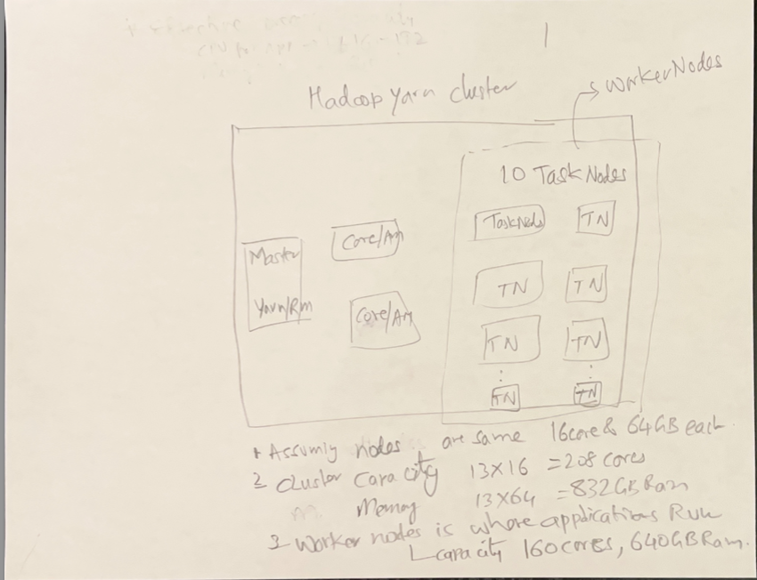
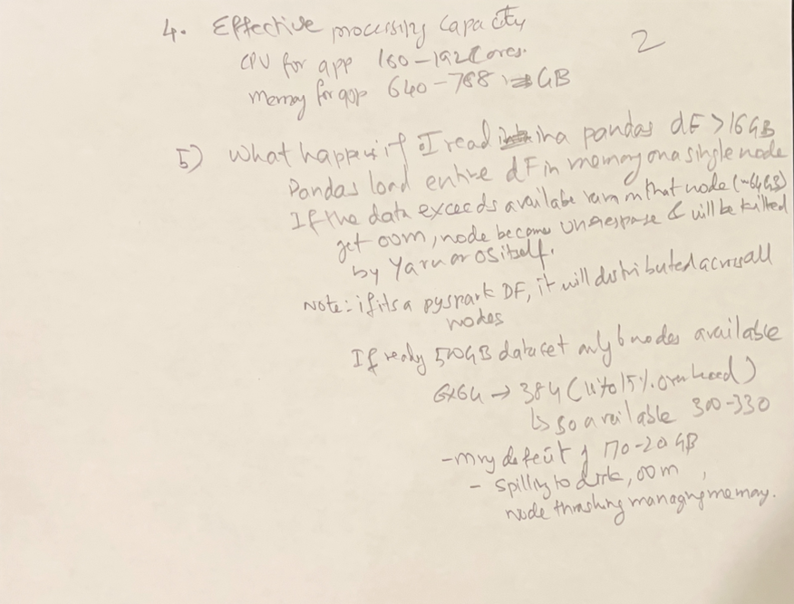
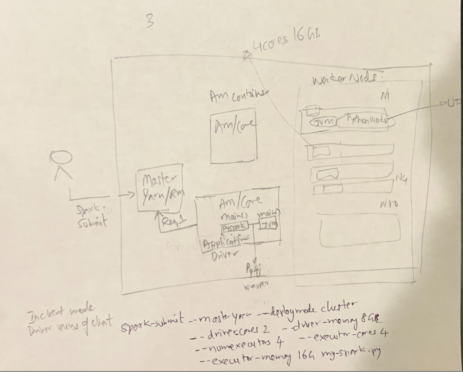
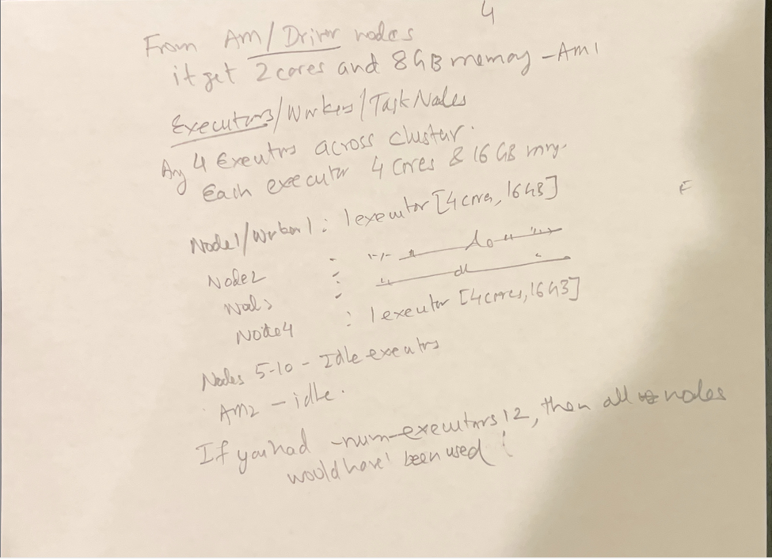

## Jobs, Stages , Read/Write Excahnge buffer, Tasks

> A typical spark application looks like a set of code blocks, spark driver anaylses the following code into Block 0 and
> Block 1 below
> The application driver will take this block, compile it and create a Spark job.
> But this job must be performed by the executors.
> Because the driver doesn't perform any data processing job.
> The driver must break this job into smaller tasks and assign them to the executors.
>
**start Job 0**

```python
# code Block 0
readAsDF = spark.read
.option("header", "true")
.option("inferSchema", "true")
.csv(args(0))  # <<---- action
```

> csv data
> https://www.statsamerica.org/downloads/default.aspx --> Population by Age and Sex
> https://population.un.org/wpp/downloads?folder=Standard%20Projections&group=CSV%20format

**end Job 0**

**start Job 1**

```python
# code Block 1
partitionedDF = readPopulationDF.repartition(numPartitions=2)  # wide dependency transformation
#  we apply 4 transformations to partitionedDF 
countDF = partitionedDF.where(conditionExpr=Age ‹ 40 )  # narrow transformation
select(col="Age", cols="Gender", "Country", "state")  # narrow transformation
.groupBy(col1="Country")  # wide dependency transformation
.count()  # this is count on groupby, Still lazy! result is a DataFrame with columns: [department, count],
# so it is a transform here and not an action
logger.info(countDF.collect())  # <<---- action
```

**end Job 1**

> Spark will run each code block **as one Spark Job**.
> Note Job 0 is a read, so it's an action

> Spark driver will create a logical query plan for each spark job.

### Job 0

WE are reading a CSV file and also inferring the schema and created an initial data frame and named it readPopulationDF.

### Job 1 in detail

**First step**, Spark driver will creates a logical query plan for each spark job. Once we have the logical plan, the
driver will start breaking this plan into stages.

#### Logical Plan


#### Stages

The driver will look at this plan to find out the wide dependency transformations.
We have two wide dependencies in this plan. The first one is the repartition() method, and the second one is the
groupBy() method.
So the driver will break logical plan after each wide dependency.
The first one becomes the first stage. The second one goes to the second stage and the last one is the third stage.
So the logical plan is now broken down into three stages. Each stage can have one or more narrow transformations,
and the last step/operation of the stage is a wide transformation.

Note that spark cannot run these stages in parallel. We should finish the first stage, and only then we can start the
next stage.
Because the output of the first stage is an input for the next stage.
So a spark job is broken into stages, in our case job1 is broken down into three stages. All the stages can run one after
the other because the output of one stage is input for the next stage.

**Logical Plan with stages**


**Stage1**
In the first stage I am reading into readingDF and repartitioning it to create partitionedDF. LEt em assime we start with 1 partition
and we repartition creates 2 partitions and now stage becomes a task. Notice that the  output of one stage(write excahnge buffer)
becomes the input to the next stage.


**Stage2**
Stage 2 starts with read exchange buffer. Spark is a distributed system.
So the Write exchange and the read exchange may be on two different worker nodes or may be on same worker node/executor
> Assume I have configured spark shuffle partitions to ensure I preserve those two partitions in the read exchange. have set the spark.sql.shuffle.partitions=2,
> so we get 2 shuffled partitons in stage 2, meaning we have two input partitions here.
And new these transformations run in parallel on those two partitions. Spark can execute the 
same plan in parallel on two partitions because we have two partitions. 

And we have two parallel tasks in stage two. Stage two also ends with a wide dependency transformation.

And this copy operation is popularly known as the Shuffle/Sort operation.
The shuffle/sort is not a plain copy of data, lets keep as a copy operataion for now
The shuffle/sort will move data from the Write exchange to the read exchange.

>The stage ends with a wide dependency transformation, and hence it requires a shuffle/sort of the data.

The Shuffle/Sort is an expensive operation in the Spark cluster.
It requires a write exchange buffer and a read exchange buffer.
The data from the write exchange buffer is sent to the read exchange buffer over the network.


**Stage3**


## Explain why count on a groupby() is not action but a transformation

```python
# This is an ACTION - triggers execution
df.count()  # Returns a number immediately

# This is TRANSFORMATION + ACTION combined
df.groupBy("column").count()  # Returns a new DataFrame
```

### **What Actually Happens:**

**1. `groupBy()` is a Transformation:**

```python
grouped = df.groupBy("department")  # Lazy - nothing executed yet
# grouped is a GroupedData object, not a DataFrame
```

**2. `.count()` on GroupedData creates a new DataFrame:**

```python
result = df.groupBy("department").count()  # Still lazy!
# result is a DataFrame with columns: [department, count]
```

**3. To actually execute, you need an action:**

```python
# NOW it executes - this is the action
result.show()
result.collect()
result.write.parquet("output/")
```

### Here with an Example:**

```python
# Sample data
df = spark.createDataFrame([
    ("Sales", "John"),
    ("Sales", "Jane"),
    ("IT", "Bob"),
    ("IT", "Alice")
], ["department", "name"])

# This is lazy - no execution yet
grouped_counts = df.groupBy("department").count()
print("No execution happened yet!")

# THIS triggers execution
grouped_counts.show()
# Output:
# +----------+-----+
# |department|count|
# +----------+-----+
# |     Sales|    2|
# |        IT|    2|
# +----------+-----+
```
