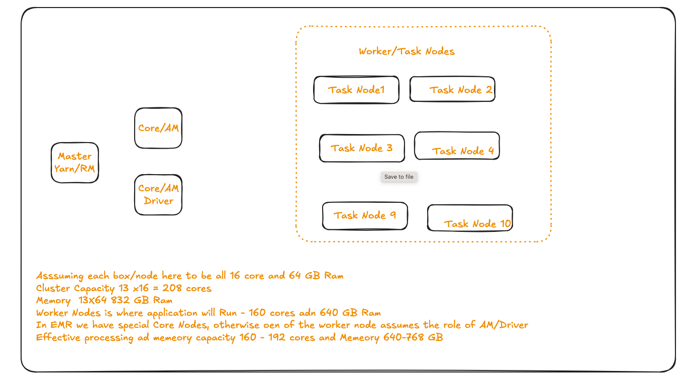
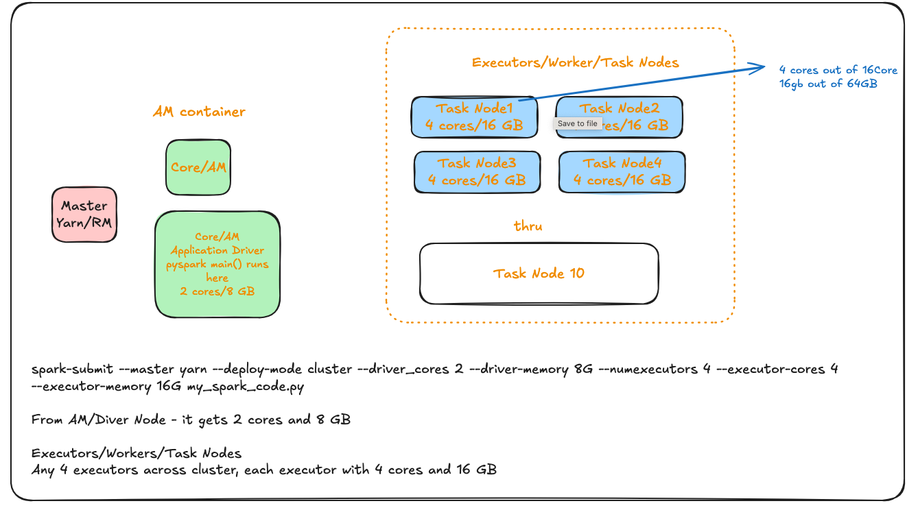
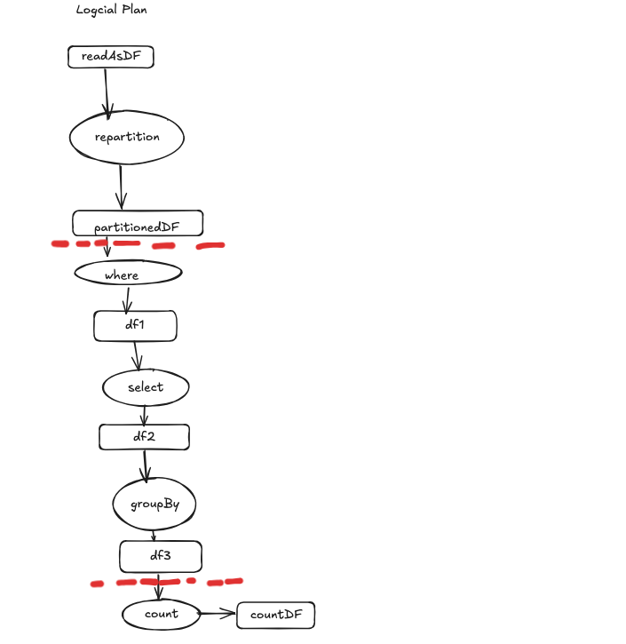
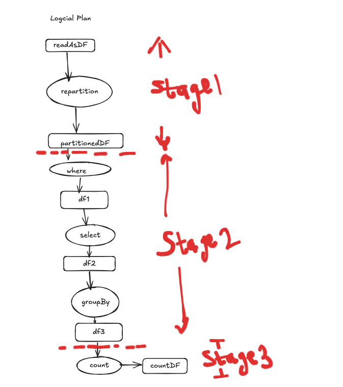
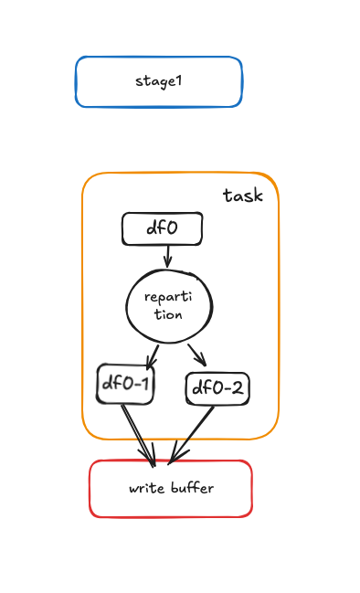
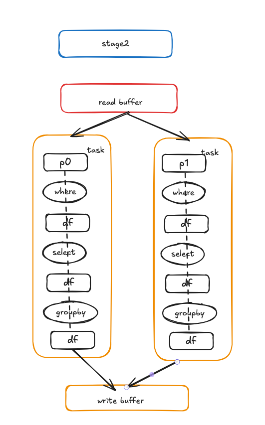
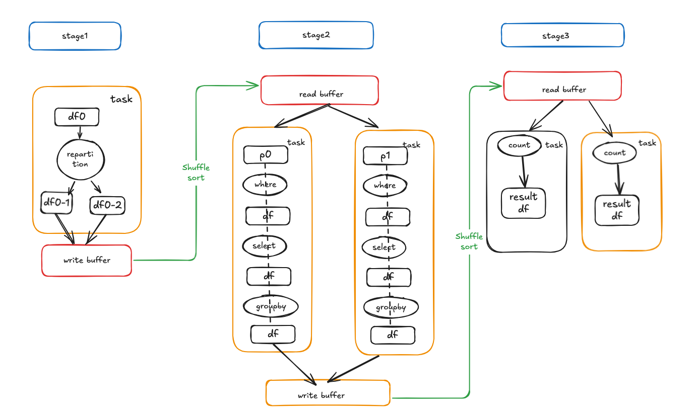
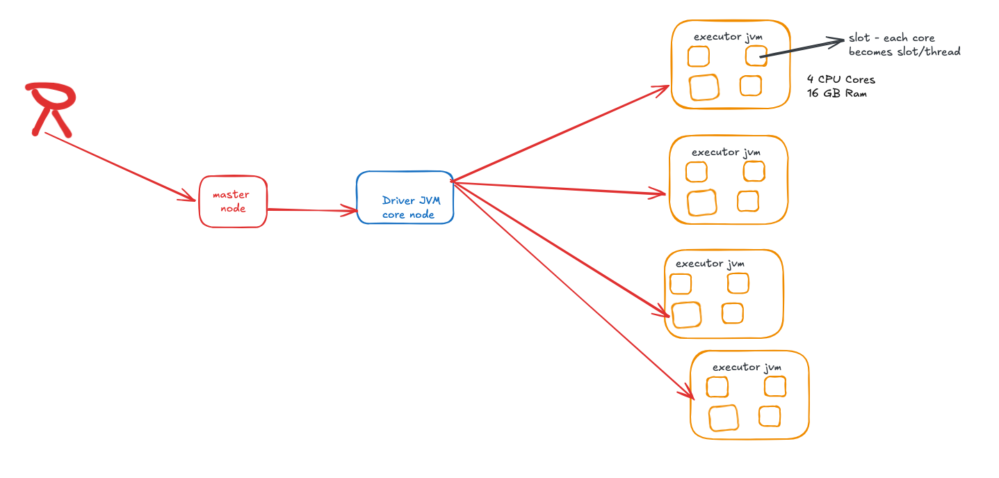

# EMR 101 for Modellers: Spark on AWS

## Why Spark Instead of Pandas?



### The Problem: Pandas on a Single Node

When you read a pandas DataFrame larger than ~16GB:
- **What happens**: Pandas loads the ENTIRE dataframe onto a single node
- **Memory limit**: If data exceeds available RAM on that node (~64GB), you hit an **Out of Memory (OOM)** error
- **Result**: Node becomes unstable, unresponsive, and gets killed by YARN or the OS

**Example - Pandas fails:**
```python
import pandas as pd

# Reading 500GB with pandas on a single 64GB node
df = pd.read_csv("s3://bucket/huge-file-500gb.csv")  # ❌ CRASH!
# OutOfMemoryError: Cannot allocate 500GB on 64GB node
```

### The Solution: Spark Distributes Data

When you read a PySpark DataFrame with 500GB across a 6-node cluster:
- **Memory per node**: 6 nodes × 64GB = 384GB total
- **After overhead (10-15%)**: ~300-330GB usable
- **Distribution**: 500GB ÷ 6 nodes = ~83GB per node

#### ⚠️ IMPORTANT: Disk Spill Will Occur

**The issue**: Per-node data (83GB) **EXCEEDS** node memory (64GB)

```
Memory per node: 64GB
├─ Reserved (JVM, system): ~6GB
├─ Usable memory: ~58GB
└─ Spark execution memory: ~35GB (60% of usable)

Data per node: 83GB
├─ Fits in node memory? NO (83GB > 64GB)
└─ Spill to disk: ~19GB per node required
```

**Result**: When operations like `groupBy()`, `join()`, or `sort()` happen, Spark will:
1. Load 83GB per node into memory (overflows to 64GB limit)
2. Write overflow to disk: **Spill happens** (~19GB/node)
3. Read from disk during shuffle (much slower)
4. Performance impact: 10-50x slower due to disk I/O

**Example - Spark with disk spill:**
```python
from pyspark.sql import SparkSession

spark = SparkSession.builder.appName("BigData").master("yarn").getOrCreate()

# Reading 500GB with Spark across 6 nodes
df = spark.read.csv("s3://bucket/huge-file-500gb.csv")  # ✅ Reads OK
# Each node handles ~83GB

# But this triggers disk spill!
result = df.groupBy("customer_id").count()  # ❌ Disk spill occurs!
# Spark UI shows: "Spill (Memory): 19GB"
# Expected time: 1-2 hours (very slow!)
```

#### How to Avoid Disk Spill

**Option 1: Use more memory per node**
```bash
# Upgrade to 128GB nodes minimum
spark-submit \
  --num-executors 6 \
  --executor-memory 100g \
  my_job.py
# Now: Per-node data (83GB) < Spark memory (60GB? No, still tight!)
# Better: Use 256GB nodes or more nodes
```

**Option 2: Add more nodes (Recommended)**
```bash
# With 15 nodes:
# Per-node data: 500GB ÷ 15 = 33GB
# Node memory: 64GB
# Spill: NO! (33GB < 64GB available)

spark-submit \
  --num-executors 15 \
  --executor-memory 32g \
  my_job.py
```

**Option 3: Reduce data before operations**
```python
# Select only needed columns
df_optimized = spark.read.csv("s3://bucket/huge-file-500gb.csv") \
    .select("customer_id", "amount", "date")  # ~200GB instead of 500GB

# New per-node: 200GB ÷ 6 = 33GB per node
# NO spill! (33GB < 64GB)

result = df_optimized.groupBy("customer_id").count()  # Fast! ✅
```

**Option 4: Batch Processing Patterns**

#### ⚠️ Important: DataFrame State in Batch Loops

When using batch processing in a loop, each iteration's DataFrame is **not available** to the next iteration:

```python
# ❌ PROBLEM: DataFrame state is lost between iterations
for month in range(1, 13):
    df = spark.read.csv("s3://bucket/huge-file-500gb.csv") \
        .filter(col("year") == 2024) \
        .filter(month(col("date")) == month)

    result = df.groupBy("customer_id").count()
    # df is GONE after this iteration

    # You CANNOT do this later:
    # combined = df_month1.union(df_month2)  # df_month1 doesn't exist!
```

#### Solution A: Batch Loop with Disk Persistence (If Results Are Independent)

Use this when each month's result is **independent**:

```python
# Process each month separately, save to disk
for month in range(1, 13):
    df = spark.read.csv("s3://bucket/huge-file-500gb.csv") \
        .filter(col("year") == 2024) \
        .filter(month(col("date")) == month)

    # Per-node: 42GB ÷ 6 = 7GB per node (NO spill!) ✅
    result = df.groupBy("customer_id").agg(sum("amount"))

    # Write to disk
    result.write.mode("overwrite").parquet(f"s3://bucket/output/month_{month}")

# Later: If you need to combine all months
from functools import reduce
from pyspark.sql import DataFrame

all_months = [
    spark.read.parquet(f"s3://bucket/output/month_{m}")
    for m in range(1, 13)
]

# Union all months into single result
combined = reduce(DataFrame.union, all_months)
combined.write.parquet("s3://bucket/output/all_months_combined")
```

**When to use**:
- Each month analyzed independently
- Results written separately
- Combine later if needed

**Pros**: No spill (7GB/node), simple to understand
**Cons**: Reads file 12 times, writes intermediate results

#### Solution B: Single Read + Column Reduction (Recommended)

Use this when you need **multiple operations on same data**:

```python
from pyspark.sql.functions import col, month, sum, count, max

# ✅ BEST APPROACH: Read once with column selection
# Select only needed columns (reduces from 500GB to ~200GB)
df = spark.read.csv("s3://bucket/huge-file-500gb.csv") \
    .select("customer_id", "date", "amount", "product_id", "region") \
    .filter(col("year") == 2024)

# Per-node: 200GB ÷ 6 = 33GB per node (NO spill!) ✅

# Now do multiple operations on SAME DataFrame
# (All results available, all without spill)

monthly_stats = df.groupBy(month(col("date")).alias("month"), "customer_id") \
    .agg(sum("amount").alias("total_amount"), count("*").alias("transactions"))

customer_stats = df.groupBy("customer_id") \
    .agg(sum("amount").alias("lifetime_total"), max("date").alias("last_purchase"))

regional_stats = df.groupBy("region") \
    .agg(sum("amount").alias("region_total"), count("*").alias("transactions"))

product_stats = df.groupBy("product_id") \
    .agg(count("*").alias("quantity_sold"))

# Write all results (all available!)
monthly_stats.write.parquet("s3://bucket/output/monthly_stats")
customer_stats.write.parquet("s3://bucket/output/customer_stats")
regional_stats.write.parquet("s3://bucket/output/regional_stats")
product_stats.write.parquet("s3://bucket/output/product_stats")
```

**When to use**:
- Multiple operations on same dataset
- Need to keep results together
- Want to reduce spill and file reads

**Pros**: Single read, no spill, all results available, efficient
**Cons**: Must select columns upfront

#### Solution C: Single Read + Cache (For Expensive Transformations)

Use this when transformations before operations are **expensive**:

```python
from pyspark.sql.functions import col, sum, count, month

# Read once and cache (after expensive transformations)
df = spark.read.csv("s3://bucket/huge-file-500gb.csv") \
    .select("customer_id", "date", "amount", "product_id") \
    .filter(col("year") == 2024) \
    .filter(col("status") == "completed")  # Expensive filter
    .cache()  # Cache the filtered result

# Per-node: ~30GB (NO spill!) ✅

# Multiple operations benefit from cache
result1 = df.groupBy("customer_id").sum("amount")
result2 = df.groupBy("product_id").count()
result3 = df.filter(col("amount") > 1000)

# Results available, cache reused for result2 and result3
result1.write.parquet("s3://bucket/output/result1")
result2.write.parquet("s3://bucket/output/result2")
result3.write.parquet("s3://bucket/output/result3")

df.unpersist()  # Clean up cache
```

**When to use**:
- Expensive transformations before groupBy/join
- Multiple operations need results
- Transformations same for all operations

**Pros**: Cache reused across operations, efficient
**Cons**: Takes memory for cache

#### Comparison Table

| Solution | Per-Node Memory | Spill | Reads File | Results Available | Best For |
|----------|-----------------|-------|------------|------------------|----------|
| **A: Batch Loop** | 7GB | NO ✅ | 12 times | Only current month | Independent analysis by period |
| **B: Single Read + Select** | 33GB | NO ✅ | 1 time | ALL together ✅ | Multiple operations on same data |
| **C: Single Read + Cache** | 30GB | NO ✅ | 1 time | ALL together ✅ | Expensive transformations |

#### Recommendation

For your 500GB case across 6×64GB nodes:
- **Use Solution B (Single Read + Column Reduction)** ✅
- Reads file only once (saves I/O)
- Reduces per-node data to 33GB (no spill)
- All results available together
- Most efficient for multi-operation analysis

#### How to Detect Disk Spill in Your Job

**In Spark UI** (http://driver-ip:4040):
```
Go to: Stages tab
Look for: "Spill (Memory)" metric

Example Good Stage:
├─ Spill (Memory): 0B ✓
├─ Spill (Disk): 0B ✓
└─ Duration: 20 seconds ✅

Example Bad Stage (Your case):
├─ Spill (Memory): 19GB ✗
├─ Spill (Disk): 15GB ✗
└─ Duration: 5+ minutes ❌
```

**In YARN logs**:
```bash
yarn logs -applicationId application_xxx | grep -i "spill"

# Output indicates:
# INFO SpillableIterator: Spilled 19GB to disk
# WARN MemoryManager: Writing 15GB to disk
```

### Key Insight: Distributed vs Single-Node

| Aspect | Pandas | PySpark |
|--------|--------|---------|
| **Data Location** | Single node | Distributed across cluster |
| **500GB dataset** | 500GB on 1 node (crashes) | 83GB per node on 6 nodes (works) |
| **Processing** | Sequential on 1 core | Parallel on all cores |
| **Best for** | Small data (<16GB) | Large data (>100GB) |

## Understanding Spark Cluster Architecture



### Cluster Setup Example

When you submit a Spark job to EMR with this configuration:
```bash
spark-submit --num-executors 4 --executor-cores 4 --executor-memory 16g my_job.py
```

You get:
- **Node1/Worker1**: 1 executor (1 JVM) with 4 cores and 16GB memory
- **Node2/Worker2**: 1 executor (1 JVM) with 4 cores and 16GB memory
- **Node3/Worker3**: 1 executor (1 JVM) with 4 cores and 16GB memory
- **Node4/Worker4**: 1 executor (1 JVM) with 4 cores and 16GB memory

**Total cluster capacity**: 4 nodes × 4 cores = **16 parallel tasks** can run simultaneously

### ⚠️ CRITICAL CLARIFICATION: 1 JVM Per Executor, NOT Per Core

**Question**: Do we have 1 JVM per executor or 1 JVM per core?

**Answer**: **1 JVM per executor** (NOT per core)

#### Example Architecture

```
Node1 (Physical Server)
│
└── Executor 1 (1 JVM Process)
    │
    ├── Task 1 (Thread 1)
    ├── Task 2 (Thread 2)
    ├── Task 3 (Thread 3)
    └── Task 4 (Thread 4)

    ← All 4 tasks run in the SAME JVM
    ← Each task runs in a separate thread
    ← They share the same 16GB memory pool
```

#### Why This Matters

**Misconception**: "4 cores = 4 JVMs"
```
❌ WRONG:
Node1 has:
├── JVM 1 (for core 1)
├── JVM 2 (for core 2)
├── JVM 3 (for core 3)
└── JVM 4 (for core 4)
```

**Correct Architecture**:
```
✅ RIGHT:
Node1 has:
└── JVM 1 (1 Executor)
    ├── Thread 1 (runs on core 1)
    ├── Thread 2 (runs on core 2)
    ├── Thread 3 (runs on core 3)
    └── Thread 4 (runs on core 4)
```

#### Detailed Example with 4 Executors

```bash
spark-submit \
  --num-executors 4 \
  --executor-cores 4 \
  --executor-memory 16g \
  my_job.py
```

Creates this structure:

```
Cluster (4 nodes × 1 executor each = 4 JVMs total)
│
├── Node1: Executor 1 JVM
│   ├── Thread 1 on Core 1
│   ├── Thread 2 on Core 2
│   ├── Thread 3 on Core 3
│   └── Thread 4 on Core 4
│
├── Node2: Executor 2 JVM
│   ├── Thread 1 on Core 1
│   ├── Thread 2 on Core 2
│   ├── Thread 3 on Core 3
│   └── Thread 4 on Core 4
│
├── Node3: Executor 3 JVM
│   ├── Thread 1 on Core 1
│   ├── Thread 2 on Core 2
│   ├── Thread 3 on Core 3
│   └── Thread 4 on Core 4
│
└── Node4: Executor 4 JVM
    ├── Thread 1 on Core 1
    ├── Thread 2 on Core 2
    ├── Thread 3 on Core 3
    └── Thread 4 on Core 4

Total: 4 JVMs, 16 threads (one per core), 16GB per JVM
```

#### Why 1 JVM vs 1 JVM Per Core?

**Efficiency**: JVM startup is expensive
- Creating 4 JVMs per 4 cores = overhead
- 1 JVM with 4 threads = lightweight, efficient

**Shared Memory**: All threads in same JVM share memory pool
- Task 1 needs extra memory? It can use Task 2's unused allocation
- This is the "Fair Share" memory management

**Process Overhead**: Each JVM needs:
- Memory for the runtime
- Garbage collection threads
- Class loading
- Metadata storage

With 4 cores, you want 1 JVM with 4 threads, NOT 4 JVMs with 1 thread each.

### How Cores and Memory Work Together

#### Cores: Task Parallelism
- **4 cores** = Each executor can run 4 tasks in parallel (one per core)
- **1 task per core** is the typical rule for CPU-bound work
- Example: Processing 100 partitions with 16 cores takes ~100÷16 = 6.25 "waves" of execution

#### Memory: Shared Pool (Not Hard-Wired to Cores)
Memory allocation is **NOT** tied to specific cores. Instead, it's a **shared pool**:

```python
# Example: 4 tasks running on one executor with 16GB total
# Task 1: Uses 6GB
# Task 2: Uses 4GB
# Task 3: Uses 3GB
# Task 4: Uses 2GB
# Total: 15GB (within 16GB limit)

# If Task 1 needs more memory:
# Task 4 releases its memory → Task 1 can borrow it
# This is called "Fair Share" memory management
```

### Fair Share Memory Rule

Each task gets at least `1/N` of available execution memory, where `N` = number of active tasks.

**Example with 4 tasks on 16GB executor:**
```
Initial fair share: 16GB ÷ 4 tasks = 4GB per task minimum
Task 1 needs 10GB? → It can use up to 10GB if others don't need it
Task 4 only needs 1GB? → Releases 3GB back to the pool
Task 1 can borrow that 3GB
```

**Result**: Flexible memory allocation allows tasks to get what they need without being tied to cores.

### Note on Node Assignment
The specific node assignment (Node1, Node2, etc.) can vary based on cluster availability. Node7 could be used instead of Node1, or Node10 instead of Node4—the distribution depends on YARN resource manager's scheduling.

## Transformations vs Actions: The Foundation

### Key Concept: Lazy Evaluation
Spark doesn't execute code immediately. It builds a **logical plan** and only executes when you call an action.

### Transformations (Lazy - No Execution Yet)

**Narrow Transformations** - No data movement between nodes
```python
df.select("name", "age")        # Pick columns
df.filter(df.age > 30)          # Filter rows
df.drop("unnecessary_column")   # Remove columns
df.withColumn("new_col", df.age * 2)  # Create new column
```
**Key**: Each input partition → only affects that partition (no shuffle)

**Wide Transformations** - Data moves between nodes (Shuffle)
```python
df.groupBy("department")        # Group data
df.join(other_df, on="id")      # Join two DataFrames
df.agg({"salary": "avg"})       # Aggregate across partitions
df.repartition(200)              # Redistribute data
```
**Key**: Input partitions → output partitions (requires network shuffle)

### Actions (Eager - Execute Immediately)

Actions trigger the entire lazy evaluation pipeline:
```python
df.count()                        # Count rows
df.collect()                      # Return all data to driver
df.show()                         # Display first 20 rows
df.write.parquet("output/")       # Write to disk
df.take(10)                       # Get first 10 rows
```

### Example: Which are Transformations vs Actions?

```python
# Chain of transformations (nothing happens yet)
df = spark.read.csv("data.csv")           # Lazy transformation
df = df.filter(df.age > 30)               # Lazy transformation
df = df.select("name", "salary")          # Lazy transformation
df = df.groupBy("name").count()           # Still lazy! Returns DataFrame

# THIS triggers execution (action)
df.show()  # ✅ NOW Spark executes everything above
```

## Jobs, Stages, and Tasks: How Spark Organizes Work

### The Three-Level Hierarchy

```
Application
    ↓
Jobs (triggered by actions)
    ↓
Stages (separated by wide transformations)
    ↓
Tasks (one per partition)
```

### How the Driver Processes Your Code

The **Spark Driver** (your application) does NOT process data. Instead, it:

1. **Analyzes** your code into logical blocks
2. **Creates a Spark Job** for each action (read, write, collect, etc.)
3. **Breaks the job** into stages based on wide transformations
4. **Assigns tasks** to executors for parallel processing

### Example Code Walkthrough

**Sample code** [sample_spark_code.py](sample_spark_code.py):

```python
# =================== JOB 0 ===================
# Block 0: Read data (this is an ACTION)
# Your code appears lazy (just assigns to variable), but inferSchema=true makes it execute immediately to detect column types
readAsDF = spark.read \
    .option("header", "true") \
    .option("inferSchema", "true") \
    .csv("s3://bucket/data.csv")

# =================== JOB 1 ===================
# Block 1: Transform and process data

# Stage 1: Repartition (WIDE transformation)
partitionedDF = readAsDF.repartition(numPartitions=2)

# Stage 2: Filter & Select (NARROW transformations)
countDF = partitionedDF \
    .filter(partitionedDF.Age < 40) \
    .select("Age", "Gender", "Country", "State")

# Stage 3: GroupBy & Count (WIDE transformation)
countDF = countDF.groupBy("Country").count()  # Result is a DataFrame

# Final action: Collect results
results = countDF.collect()  # <<---- THIS is the ACTION
logger.info(results)
```

### Why Two Jobs?

**Job 0**: Triggered by `.csv()` read action
- Executes immediately due to `inferSchema=true` (needs to scan file for types)

**Job 1**: Triggered by `.collect()` action
- Executes the entire transformation chain above it

### Job 0 Deep Dive: Reading Data

#### Reading and Schema Inference

```python
readAsDF = spark.read \
    .option("header", "true") \
    .option("inferSchema", "true") \
    .csv("s3://bucket/data.csv")
```

**Question**: Is `spark.read` a transformation or action?

**Answer**: It depends on your options!

#### Without `inferSchema` (Lazy Transformation)
```python
readAsDF = spark.read \
    .option("header", "true") \
    .csv("s3://bucket/data.csv")  # ← Lazy! No job runs yet
# No tasks are assigned. Job doesn't start until .count() or .show()
```

#### With `inferSchema=true` (Acts Like an Action)
```python
readAsDF = spark.read \
    .option("header", "true") \
    .option("inferSchema", "true") \
    .csv("s3://bucket/data.csv")  # ← Triggers a job!
# Spark must read sample rows to detect types → Job runs immediately
```

**Why**: To infer schema, Spark must:
1. Open the files
2. Read sample rows
3. Analyze data types (Is "123" an integer or string?)
4. Infer column types
5. Create a schema

This forces Spark to execute a job right away.

#### Task Count in Read Stage

With a 40-slot cluster (8 executors × 5 cores), how many tasks in a read stage?

**NOT 40 tasks!** Instead, it's determined by **data size and file splits**.

**Example: Reading 10GB CSV**

| Factor | Calculation | Result |
|--------|-------------|--------|
| File size | 10GB = 10,240 MB | - |
| Default split | `spark.sql.files.maxPartitionBytes` | 128 MB |
| Number of tasks | 10,240 MB ÷ 128 MB | **80 tasks** |

**Execution on 40-slot cluster**:
```
Wave 1: 40 tasks execute (0-39)
Wave 2: 40 remaining tasks execute (40-79)
Total time: 2 waves
```

**Multiple files example**:
```python
# If reading from 100 small CSV files
spark.read.csv("s3://bucket/data_*.csv")
# Tasks = number of files = 100 tasks (one per file)
```

#### The "Default Shuffle Partitions" Misconception

⚠️ **Common mistake**: Thinking `spark.sql.shuffle.partitions` affects read stages.

**The truth**:
- **Read Stage**: Tasks = Data Size ÷ 128MB (not affected by shuffle.partitions)
- **Shuffle Stage**: Tasks = spark.sql.shuffle.partitions (default 200)

**Example with 40-slot cluster reading 10GB**:

| Component | Value | Note |
|-----------|-------|------|
| Cluster capacity | 40 cores | Max parallel tasks |
| Read stage tasks | ~80 tasks | 10GB ÷ 128MB splits |
| Execution waves | 2 waves | Run 40, then 40 more |
| Shuffle.partitions | 200 (default) | Used ONLY for groupBy, join, etc. |

**Key takeaway**: The read stage ignores `shuffle.partitions`. It's only used after you do a groupBy, join, or repartition.

### Job 1 Deep Dive: Complex Transformations

```python
partitionedDF = readAsDF.repartition(numPartitions=2)
countDF = partitionedDF \
    .filter(partitionedDF.Age < 40) \
    .select("Age", "Gender", "Country", "State") \
    .groupBy("Country") \
    .count()
results = countDF.collect()  # ← ACTION triggers Job 1
```

#### Step 1: Logical Plan Creation



Spark analyzes your transformations and creates a logical execution plan. This is the "what" - the sequence of operations without considering how many cores/nodes.

#### Step 2: Breaking into Stages



**Key Rule**: Spark breaks the plan at every **wide transformation**

Your code has 2 wide transformations:
1. `repartition()` - Wide dependency
2. `groupBy()` - Wide dependency

**So you get N+1 stages**: 2 wide + 1 = **3 stages**

| Stage | Transformations | Type |
|-------|-----------------|------|
| Stage 1 | repartition() | Wide (shuffle required) |
| Stage 2 | filter() + select() | Narrow operations |
| Stage 3 | groupBy().count() | Wide (shuffle required) |

**Important**: Stages run **sequentially**, not in parallel. Output of Stage 1 → Input to Stage 2 → Input to Stage 3.

#### Stage 1 Deep Dive: Repartition



```python
# Input: 1 partition with data
partitionedDF = readAsDF.repartition(numPartitions=2)
# Output: 2 partitions with data shuffled
```

**What happens**:
1. Data from partition 0 is written to **Exchange Buffer** (temporary storage)
2. Data is redistributed across 2 new partitions
3. Each partition is ready for Stage 2 processing

**Task count**: Input partitions = 1, so 1 task writes to exchange buffer

#### Stage 2 Deep Dive: Filter and Select

**Input**: 2 partitions from Stage 1 (via exchange buffer)

```python
countDF = partitionedDF \
    .filter(partitionedDF.Age < 40) \      # Narrow
    .select("Age", "Gender", "Country")     # Narrow
```

**Key insight**: These narrow transformations run **in parallel on 2 partitions**

**Task count**: 2 partitions = 2 tasks (one per partition)

Example execution:
- **Task 1**: Processes partition 0 (filter + select)
- **Task 2**: Processes partition 1 (filter + select)
- Both run simultaneously

#### Stage 3 Deep Dive: GroupBy and Count

```python
countDF = countDF.groupBy("Country").count()
```

**Why it's wide**: `groupBy` requires data to move between partitions
- All rows with Country="USA" must go to the same partition
- All rows with Country="Canada" must go to the same partition
- This requires a **shuffle**

**Shuffle operation**:
1. **Write Phase**: Each task writes grouped data to exchange buffer
2. **Network Phase**: Data moves across network to correct partition
3. **Read Phase**: New tasks read grouped data and count



**Task count**: Determined by `spark.sql.shuffle.partitions` (default 200)
- Even though input is 2 partitions, output is 200 partitions
- 200 new tasks process the shuffled data

#### Overall Job Execution



**Complete execution flow**:
```
Job 1 Action: .collect()
    ↓
Stage 1: Read + Repartition (1 task)
    ↓ (Exchange buffer - data moves)
Stage 2: Filter + Select (2 parallel tasks)
    ↓ (Shuffle operation - expensive!)
Stage 3: GroupBy + Count (200 parallel tasks)
    ↓
Collect results back to driver
```

---

## Tasks: The Smallest Unit of Work

### What is a Task?

A **task** is the smallest unit of work in Spark:
```
Task = Code to execute + Data partition to process
```

The driver assigns tasks to executors with:
1. The transformation code
2. The specific partition to process

### Task Assignment with Executor Slots



**Cluster setup**: Driver + 4 executors, each with 4 cores

**Total capacity**: 4 executors × 4 cores = **16 parallel tasks**

#### JVM Architecture: 1 Per Executor, NOT Per Core

**Critical clarification**: When you have 1 executor with 4 cores, you have:
- ✅ **1 JVM** (not 4 JVMs)
- ✅ **4 threads** (one per core, all running in the same JVM)
- ✅ **1 shared memory pool** (16GB for all threads)

**Visual representation**:
```
Executor 1 (1 JVM)
│
├── Thread 1 (runs on Core 1) ← One task
├── Thread 2 (runs on Core 2) ← One task
├── Thread 3 (runs on Core 3) ← One task
└── Thread 4 (runs on Core 4) ← One task

All 4 threads share:
- 1 JVM process
- 16GB memory pool
- Garbage collection
- Class loader
```

**Why 1 JVM, not 4?**
- JVM startup is expensive
- Shared memory more efficient than 4 separate heaps
- Each thread can borrow memory from unused allocations
- One garbage collector manages all threads

**For your cluster** (4 executors × 4 cores):
```
Total JVMs: 4 (one per executor)
Total threads: 16 (4 per JVM, one per core)
Total parallel tasks: 16
```

#### Example 1: Fewer tasks than slots

```
Stage with 10 input partitions = 10 tasks

Executor 1 (4 slots):  Task 0, Task 1, Task 2, Task 3
Executor 2 (4 slots):  Task 4, Task 5, Task 6, Task 7
Executor 3 (4 slots):  Task 8, Task 9, (empty), (empty)
Executor 4 (4 slots):  (empty), (empty), (empty), (empty)

⚠️ Wasted capacity! 6 slots are idle.
```

#### Example 2: More tasks than slots

```
Stage with 32 input partitions = 32 tasks

Wave 1 (Slots full):   Task 0-15 execute (all 16 slots)
Wave 2 (Slots full):   Task 16-31 execute (all 16 slots)

✅ Full utilization! Executes in 2 waves.
```

#### Example 3: Optimal case

```
Stage with 16 input partitions = 16 tasks

All 16 tasks execute simultaneously on all 16 slots

✅ Perfect match! One wave, no wasted capacity.
```

### Task Failures and Retries

If a task fails:
1. Driver retries on a different executor (up to 4 times by default)
2. If all retries fail, the entire job fails
3. If partition was lost, Spark can recompute from source

---

## Summary: Jobs, Stages, and Tasks

| Level | What is it? | How many? |
|-------|-----------|----------|
| **Job** | Triggered by an action (count, collect, write) | One per action |
| **Stage** | Execution between wide transformations | N + 1 (where N = wide transforms) |
| **Task** | Process one partition with the stage's code | = Number of partitions in stage |

**Execution model**:
```
Driver submits Job → Breaks into Stages → Assigns Tasks to Executors
→ Executors run tasks in parallel → Results sent back to Driver
```

**Lets discuss collect() action**

The collect() action requires each task to send data back to the driver.
So the tasks of the last stage will send the result back to the driver over the network.
The driver will collect data from all the tasks and present it to you.
In my example, we flush the result into the log so the driver will do the same.
But we could have very well written the result in a data file, in that case,
all the tasks will write a data file partition and send the partition details to the driver.
The driver considers the job done when all the tasks are successful.
If any task fails, the driver might want to retry it.
So it can restart the task at a different executor. If all retries also fail, then the driver returns an exception and
marks the job failed.

## The Confusion: Is `groupBy().count()` a Transformation or Action?

### The Answer: It's a TRANSFORMATION

Many beginners think `df.groupBy("col").count()` triggers execution because it has "count" in it. **This is wrong!**

### Breaking It Down

```python
# ❌ This is an ACTION - immediately returns a NUMBER to driver
total = df.count()
print(total)  # Prints: 1000

# ✅ This is a TRANSFORMATION - returns a new DataFrame (still lazy!)
result = df.groupBy("department").count()
print(result)  # Prints: DataFrame object
# NOTHING executes yet!
```

### Why the Confusion?

**`df.count()`** returns a Python integer (an action).

**`df.groupBy().count()`** returns a DataFrame with columns [department, count] (a transformation).

They have the same name but completely different behavior!

### Complete Example

```python
from pyspark.sql import SparkSession

spark = SparkSession.builder.appName("Demo").getOrCreate()

# Sample data
df = spark.createDataFrame([
    ("Sales", "John", 50000),
    ("Sales", "Jane", 60000),
    ("IT", "Bob", 80000),
    ("IT", "Alice", 90000),
    ("HR", "Charlie", 55000)
], ["department", "name", "salary"])

print("Starting example...")

# ==========================================
# Step 1: GroupBy + Count (TRANSFORMATION)
# ==========================================
employee_counts = df.groupBy("department").count()

print("After groupBy().count()")
print("Type:", type(employee_counts))  # DataFrame
print("Execution happened? NO!")
print()

# ==========================================
# Step 2: Final Action (Now it executes!)
# ==========================================
employee_counts.show()
# NOW the job executes!
# Output:
# +----------+-----+
# |department|count|
# +----------+-----+
# |     Sales|    2|
# |        IT|    2|
# |        HR|    1|
# +----------+-----+
```

### Multiple Ways to Trigger Execution

Once you have the grouped result, you need an **action** to execute:

```python
grouped = df.groupBy("department").count()  # Lazy - no execution

# All of these trigger execution:
grouped.show()                          # Action 1: Display
grouped.count()                         # Action 2: Count rows
grouped.collect()                       # Action 3: Collect all
grouped.write.parquet("output/")        # Action 4: Write
results = grouped.take(10)              # Action 5: Take first 10
```

### Beginner vs Advanced: Same Concept, Different Context

**Beginner understanding**:
```
groupBy().count() returns a DataFrame
DataFrame operations are lazy
Need .show() or .collect() to see results
```

**Advanced understanding**:
```
groupBy() returns a GroupedData object (intermediate)
.count() on GroupedData returns a new DataFrame (aggregation)
DataFrame is still a logical plan until action executes
Execution creates N+1 stages (2 wide deps = 3 stages)
Count aggregation triggers shuffle to group data by department
```

---

## Quick Recap: Key Takeaways for Beginners

### 1. **Distributed Processing**
- Pandas: All data on one node (crashes with >16GB)
- Spark: Data split across cluster (scales to TB)

### 2. **Cluster Architecture**
- **Driver**: Your application (doesn't process data)
- **Executors**: Worker processes (do the actual work)
- **Cores**: Parallel execution threads
- **Memory**: Shared pool managed by Spark

### 3. **Lazy Evaluation**
```python
df.read → df.filter → df.select  # Nothing happens yet
df.show()                          # NOW it executes
```

### 4. **Transformations vs Actions**
- **Transformations**: Lazy (select, filter, groupBy, join)
- **Actions**: Eager (show, count, collect, write)

### 5. **Jobs, Stages, Tasks**
- **Job**: Triggered by action
- **Stage**: Separated by wide transformations
- **Task**: One per partition (runs in parallel)

### 6. **Why Understanding Matters**
Knowing this helps you:
- Debug slow jobs ("Stage 2 is shuffling 500GB!")
- Design efficient queries ("Join big with big - will shuffle")
- Optimize configurations ("200 shuffle partitions for 10GB data")
- Understand error messages ("Out of memory in Stage 3")

### 7. **Remember**
```
Big Data Problem:
  1 node can't hold 500GB

Spark Solution:
  Split across 6 nodes
  Process in parallel
  Shuffle data as needed
  Return results efficiently
```

---

## How Spark Decides Task Count

This is one of the most important decisions Spark makes, and it directly affects your job performance.

### Reading Data: Task Count = Data Size ÷ File Split Size

```python
df = spark.read.csv("s3://bucket/data.csv")
```

**Formula**:
```
Number of tasks = Total data size ÷ maxPartitionBytes
                = 10GB ÷ 128MB
                = 10,240 MB ÷ 128 MB
                = 80 tasks
```

**Key insights**:
- **Default split size**: 128MB (configurable)
- **One file minimum**: Even if file is 50MB, it gets 1 task
- **Multiple files**: Number of tasks = at least 1 per file
- **NOT influenced by**: `spark.sql.shuffle.partitions`

**Examples**:

```
Scenario 1: Single 10GB file
  10,240 MB ÷ 128 MB = 80 tasks

Scenario 2: 100 small files (50MB each = 5GB total)
  100 files × 1 task = 100 tasks (NOT just 5GB ÷ 128MB = 39)
  Spark respects file boundaries!

Scenario 3: Custom split size (64MB instead of 128MB)
  10,240 MB ÷ 64 MB = 160 tasks (more parallelism)
```

**Visualization**:
```
Reading 10GB file with 128MB splits:

10GB File
│
├─ Task 1: Reads 0-128MB (128 MB)
├─ Task 2: Reads 128-256MB (128 MB)
├─ Task 3: Reads 256-384MB (128 MB)
├─ ... (continues)
└─ Task 80: Reads 10,112-10,240MB (128 MB)

All 80 tasks read in parallel (in waves based on cluster capacity)
```

### Writing Data: Task Count = Number of Partitions in DataFrame

```python
df = spark.read.csv("s3://bucket/data.csv")  # 80 partitions
df.write.parquet("s3://bucket/output/")       # 80 write tasks
```

**Simple rule**:
```
Write tasks = DataFrame partitions at write time
```

**Where do partitions come from?**
```
1. After read: Same as number of read tasks
   df.read → 80 tasks → 80 partitions

2. After groupBy/join: Uses spark.sql.shuffle.partitions (default 200)
   df.groupBy().count() → 200 partitions → 200 write tasks

3. After repartition(N): Exactly N
   df.repartition(50) → 50 partitions → 50 write tasks
```

**Example - Complete Flow**:
```python
# Step 1: Read 10GB CSV
df = spark.read.csv("data.csv")
# Result: 80 partitions (10GB ÷ 128MB)

# Step 2: Filter (narrow transformation)
df_filtered = df.filter(df.age > 30)
# Result: Still 80 partitions (narrow = no change)

# Step 3: GroupBy (wide transformation = SHUFFLE)
df_agg = df_filtered.groupBy("country").count()
# Result: 200 partitions (from spark.sql.shuffle.partitions = 200)

# Step 4: Write
df_agg.write.parquet("output/")
# Result: 200 write tasks → 200 output files

# Summary:
├─ Read: 80 tasks
├─ Filter: 80 tasks (pipelined with read)
├─ GroupBy: 80 map tasks + 200 reduce tasks (shuffle)
└─ Write: 200 tasks
```

### Optimization: Controlling Task Count

**Too many tasks? Reduce them**:
```python
df = spark.read.csv("many_small_files/")  # 1000 tasks (too many!)
df_coalesced = df.coalesce(100)            # Merge to 100 partitions
df_coalesced.write.parquet("output/")      # 100 write tasks
```

**Too few tasks? Increase them**:
```python
df = spark.read \
    .option("maxPartitionBytes", "64MB") \  # Reduce split size
    .csv("huge_file.csv")                   # More tasks!
# Result: 10GB ÷ 64MB = 160 tasks (instead of 80)
```

**Partition by column for organized output**:
```python
df.write \
    .partitionBy("year", "month") \
    .parquet("output/")
# Result: output/year=2024/month=01/part-00000.parquet, etc.
```

For complete details, see: **[TASK_COUNT_DECISION_GUIDE.md](TASK_COUNT_DECISION_GUIDE.md)**

---

## Advanced Topics to Explore Next

Once you understand Jobs, Stages, and Tasks:
- **Task count tuning**: Balance parallelism vs overhead
- **Partitioning strategies**: How to design partitions for performance
- **Shuffle optimization**: Reduce network overhead
- **Catalyst optimizer**: How Spark optimizes your logical plan
- **Physical execution**: How stages turn into network I/O
- **Caching**: Persist intermediate results
- **Adaptive Query Execution**: Spark 3.0+ auto-optimization
