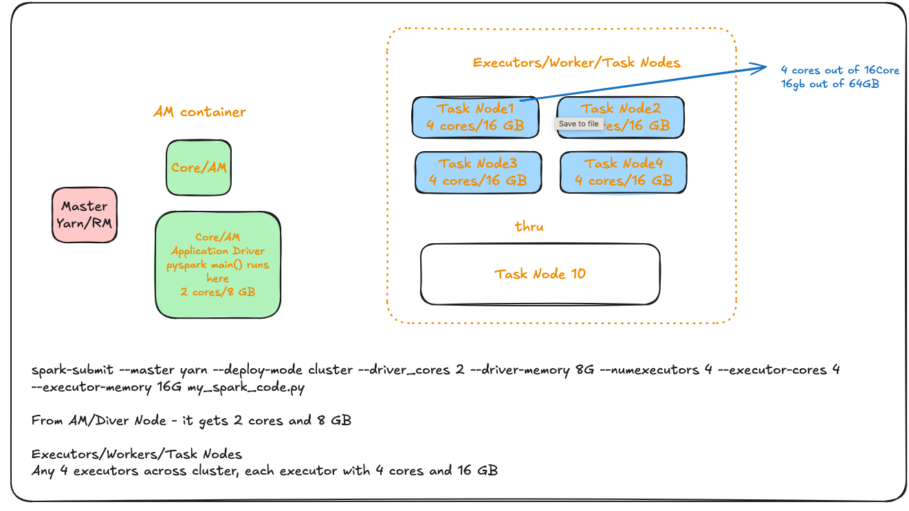

> What happens if we read a pandas dataframe > 16GB. Pandas will load the entire dataframe onta a single node
> If the data exceeds available ram on that node (~64GB), we get OOM and node becomes unstable, unresponsive adn will
> be killed by yarn or by OS itself
> if it were a pyspark dataframe it iwll be distributed across nodes. It read 500 GB dataset and only nodes available
> are 6X64 --> 384 GB(10 - 15% overhead), so avaialble memeory 300 - 330 GB. With memory deficiet of 170 - 200 GB,
> spilling to
> disk or OOM , node thrashing managing memory.

## Spark submit



- Node1/Worker1: 1 executor [4 Cores, 16 GB]
- Node2/Worker2: 1 executor [4 Cores, 16 GB]
- Node3/Worker3: 1 executor [4 Cores, 16 GB]
- Node4/Worker4: 1 executor [4 Cores, 16 GB]

> Node1/Worker1 with one executor has 4 cores , which means each core runs a task in separate thread. The memeory
> allocated to each task is flexible.
> While you have 4 cores, "1 task per core" is a logical limit for processing, but memory is not physically hard-wired
> to specific cores. Instead, it is managed as a shared pool. How it's allocated: If you are running 4 tasks (one per
> core), they all dip into this pool.The "Fair Share" Rule: Most executors try to ensure each task gets at least $1/N$ of
> the available execution memory (where $N$ is the number of active tasks). If Task A needs more and Task B isn't using
> its share, Task A can often "borrow" the extra space


> It could have been Node7 instead of Node1 and Node 10 instead of Node 4

## Transformation and Actions -Spark Jobs/Stages

- Transformation
    - Narrow Dependency - can be performed in a parallel on data partitions
        - select, filter, drop, etc
    - Wide dependency
        - grouping data
        - group by, join, agg, repartition etc
- Actions
    - read, write, collect, take , count

## Jobs, Stages , Read/Write Exchange buffer, Tasks

> A typical spark application looks like a set of code blocks, spark driver analyses the following code into Block 0 and
> Block 1 below
> The application driver will take this block, compile it and create a Spark job.
> But this job must be performed by the executors.
> Because the driver doesn't perform any data processing job.
> The driver must break this job into smaller tasks and assign them to the executors.

**Original Code here**
[sample_spark_code.py](sample_spark_code.py)

**start Job 0**

```python
# code Block 0
readAsDF = spark.read
.option("header", "true")
.option("inferSchema", "true")
.csv(args(0))  # <<---- action
```

**end Job 0**

**start Job 1**

```python
# code Block 1
partitionedDF = readAsDF.repartition(numPartitions=2)  # wide dependency transformation, stage1
#  we apply 4 transformations to partitionedDF 
countDF = partitionedDF.where(conditionExpr=Age ‹ 40 )  # narrow transformation
select(col="Age", cols="Gender", "Country", "state")  # narrow transformation
.groupBy(col1="Country")  # wide dependency transformation, stage2
.count()  # this is count on groupby, Still lazy! result is a DataFrame with columns: [department, count], stage3
# so it is a narrow transform here and not an action
logger.info(countDF.collect())  # <<---- action
```

**end Job 1**

> Spark will run each code block **as one Spark Job**.
> Note Job 0 is a read, so it's an action

> Spark driver will create a logical query plan for each spark job.

### Job 0

WE are reading a CSV file and also inferring the schema and created an initial data frame and named it readPopulationDF.

Technically, spark.read is a transformation, but because of your specific configuration, it behaves like an action.
Here is the breakdown of what happens on your EMR cluster with that specific code block.

1. Is it an Action or Transform?
   In a vacuum, spark.read is a transformation. However, because you added .option("inferSchema", "true"), Spark is
   forced to act like it’s executing an action.
   **The Conflict:** To "infer" a schema, Spark cannot just look at file names. It must physically open the files, read
   a
   sample of the rows, and check the data types (Is this a string? An integer?).
   **The Result:** This triggers a Spark Job immediately on your EMR cluster. If you had not used inferSchema (or if you
   had
   provided a manual schema), no job would have started until you called something like .count() or .save().

2. How the "Read" Stage looks (Task Count)
   You have 40 Total Slots ($8\ executors \times 5\ cores$). However, the number of tasks in a Read Stage is almost
   never determined by your executor count or the "default shuffle size."Instead, the number of tasks for a CSV read is
   determined by the Input Split (how the data is stored on S3/HDFS).
   **The Factors:**
    1. File Size: Spark splits files based on
       spark.sql.files.maxPartitionBytes (default is 128 MB).
    2. Number of Files: If you have 100 small CSV files, Spark will
       create 100 tasks (one per file).
    3. Total Tasks Calculation:If your input data is 10 GB (10,240 MB):
       $$\frac{10,240\ MB}{128\ MB\ (Split\ Size)} = 80\ Tasks$$

3. The "Default Shuffle Size" Confusion
   The "Default Shuffle Size" (parameter spark.sql.shuffle.partitions, which defaults to 200) has zero
   impact on the Read stage.
    - **Read Stage (Stage 0):** Task count is based on Input Data Size / 128MB.
    - **Shuffle Stage (Stage 1):** Task count is based on the 200 default. This only happens if you do a groupBy, join, or
      distinct later in your code.

   **Summary of Execution on EMR**

   Given your 40-slot cluster and a hypothetical 10GB file:
    ```markdown
    | Component           | Value        | Role in the Job                                                   |
    |--------------------|-------------|-------------------------------------------------------------------|
    | Parallel Capacity   | 40 Cores    | How many tasks can run at once.                                   |
    | Read Stage Tasks    | ~80 Tasks   | Calculated by data size (10GB / 128MB).                           |
    | Execution Flow      | 2 Waves     | 40 tasks run, then the next 40 tasks run.                         |
    | Shuffle Tasks       | 200 Tasks   | Ignored for the read; used only for later shuffles.               |
    ```

### Job 1 in detail

**First step**, Spark driver will creates a logical query plan for each spark job. Once we have the logical plan, the
driver will start breaking this plan into stages.

#### Logical Plan


#### Stages

The driver will look at this plan to find out the wide dependency transformations.
We have two wide dependencies in this plan. The first one is the repartition() method, and the second one is the
groupBy() method.
So the driver will break logical plan after each wide dependency.
The first one becomes the first stage. The second one goes to the second stage and the last one is the third stage.
So the logical plan is now broken down into three stages. Each stage can have one or more narrow transformations,
and the last step/operation of the stage is a wide transformation.

Note that spark cannot run these stages in parallel. We should finish the first stage, and only then we can start the
next stage.
Because the output of the first stage is an input for the next stage.
So a spark job is broken into stages, in our case job1 is broken down into three stages. All the stages can run one
after
the other because the output of one stage is input for the next stage.

**Logical Plan with stages**


> Note: If you N wide-dependencies, your plan should have N+1 Stages. In our case 2+1 stages

**Stage1**
In the first stage I am reading into readingDF and repartitioning it to create partitionedDF. LEt me assume we start
with 1 partition
and we repartition creates 2 partitions and now stage becomes a task. Notice that the output of one stage(write excahnge
buffer)
becomes the input to the next stage.


**Stage2**
Stage 2 starts with read exchange buffer. Spark is a distributed system.
So the Write exchange and the read exchange may be on two different worker nodes or may be on same worker node/executor
> Assume I have configured spark shuffle partitions to ensure I preserve those two partitions in the read exchange. have
> set the spark.sql.shuffle.partitions=2,
> so we get 2 shuffled partitons in stage 2, meaning we have two input partitions here.
> And new these transformations run in parallel on those two partitions. Spark can execute the
> same plan in parallel on two partitions because we have two partitions.

And we have two parallel tasks in stage two. Stage two also ends with a wide dependency transformation.

And this copy operation is popularly known as the Shuffle/Sort operation.
The shuffle/sort is not a plain copy of data, lets keep as a copy operataion for now
The shuffle/sort will move data from the Write exchange to the read exchange.

> The stage ends with a wide dependency transformation, and hence it requires a shuffle/sort of the data.

The Shuffle/Sort is an expensive operation in the Spark cluster.
It requires a write exchange buffer and a read exchange buffer.
The data from the write exchange buffer is sent to the read exchange buffer over the network.


**Stage3**


**A pyspark job**


Summary:
Spark creates one job for each action. This job may contain a series of multiple transformations.
The Spark engine will optimize those transformations and create a logical plan for the job.
Then spark will break the logical plan at the end of every wide dependency and create two or more stages.
If you do not have any wide dependency, your plan will be a single-stage plan.
But if you have N wide-dependencies, your plan should have N+1 stages.
Data from one stage to another stage is shared using the shuffle/sort operation.
Now each stage may be executed as one or more parallel tasks.

The number of tasks in the stage is equal to the number of input partitions.
In our example, the first stage starts with one single partition.
So it can have a maximum of one parallel task.
We made sure two partitions in the second stage. So we can have two parallel tasks in stage two. If we create 100
partitions for stage two, we can have 100 parallel tasks for stage two.

**Task and Application Driver**
A task is the smallest unit of work in a Spark job. The Spark driver assigns these tasks to the executors and asks them
to do the work.
The executor needs the following things to perform the task.

- The task Code
- And Data Partition

So the driver is responsible for assigning a task to the executor. The executor will ask for the code or API to be
executed for the task.
It will also ask for the data frame partition on which to execute the given code.
The application driver facilitates both these things to the executor, and the executor performs the task.

**Spark Cluster**


Our spark cluster has a driver and four executors. Each executor will have one JVM process.
And we assigned 4 CPU cores to each executor. So, our Executor-JVM can create four parallel threads.
And this we call slot capacity of my executor.
So each executor can have four parallel threads, and we call them executor slots.
Let's now assume the driver has a job stage to finish. And you have ten input partitions for the stage.
So you can have ten parallel tasks for the same. Now the driver will assign those ten tasks in these slots.
This assignment may not be as uniform as I showed here.
But we have some extra capacity that we are wasting because we do not have enough tasks for this stage.
Now let's assume this stage is complete. All slots are now free.
Now the driver should start the next stage.
And we have 32 tasks for the next stage. But we have 16 slots only.
The driver will schedule 16 tasks in the available slots.
The remaining 16 will wait for slots to become available again.
That's how these tasks are assigned and run by the executor.

**Lets discuss collect() action**

The collect() action requires each task to send data back to the driver.
So the tasks of the last stage will send the result back to the driver over the network.
The driver will collect data from all the tasks and present it to you.
In my example, we flush the result into the log so the driver will do the same.
But we could have very well written the result in a data file, in that case,
all the tasks will write a data file partition and send the partition details to the driver.
The driver considers the job done when all the tasks are successful.
If any task fails, the driver might want to retry it.
So it can restart the task at a different executor. If all retries also fail, then the driver returns an exception and
marks the job failed.

## Explain why count on a groupby() is not action but a transformation

```python
# This is an ACTION - triggers execution
df.count()  # Returns a number immediately

# This is TRANSFORMATION + ACTION combined
df.groupBy("column").count()  # Returns a new DataFrame
```

### **What Actually Happens:**

**1. `groupBy()` is a Transformation:**

```python
grouped = df.groupBy("department")  # Lazy - nothing executed yet
# grouped is a GroupedData object, not a DataFrame
```

**2. `.count()` on GroupedData creates a new DataFrame:**

```python
result = df.groupBy("department").count()  # Still lazy!
# result is a DataFrame with columns: [department, count]
```

**3. To actually execute, you need an action:**

```python
# NOW it executes - this is the action
result.show()
result.collect()
result.write.parquet("output/")
```

### Here with an Example:**

```python
# Sample data
df = spark.createDataFrame([
    ("Sales", "John"),
    ("Sales", "Jane"),
    ("IT", "Bob"),
    ("IT", "Alice")
], ["department", "name"])

# This is lazy - no execution yet
grouped_counts = df.groupBy("department").count()
print("No execution happened yet!")

# THIS triggers execution
grouped_counts.show()
# Output:
# +----------+-----+
# |department|count|
# +----------+-----+
# |     Sales|    2|
# |        IT|    2|
# +----------+-----+
```
