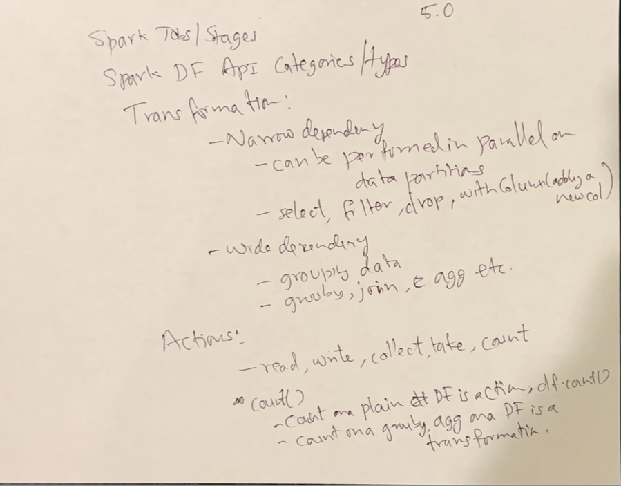

## Explain why count on a groupby() is not action but a transformation

```python
# This is an ACTION - triggers execution
df.count()  # Returns a number immediately

# This is TRANSFORMATION + ACTION combined
df.groupBy("column").count()  # Returns a new DataFrame
```

### **What Actually Happens:**

**1. `groupBy()` is a Transformation:**

```python
grouped = df.groupBy("department")  # Lazy - nothing executed yet
# grouped is a GroupedData object, not a DataFrame
```

**2. `.count()` on GroupedData creates a new DataFrame:**

```python
result = df.groupBy("department").count()  # Still lazy!
# result is a DataFrame with columns: [department, count]
```

**3. To actually execute, you need an action:**

```python
# NOW it executes - this is the action
result.show()
result.collect()
result.write.parquet("output/")
```

### Here with an Example:**

```python
# Sample data
df = spark.createDataFrame([
    ("Sales", "John"),
    ("Sales", "Jane"),
    ("IT", "Bob"),
    ("IT", "Alice")
], ["department", "name"])

# This is lazy - no execution yet
grouped_counts = df.groupBy("department").count()
print("No execution happened yet!")

# THIS triggers execution
grouped_counts.show()
# Output:
# +----------+-----+
# |department|count|
# +----------+-----+
# |     Sales|    2|
# |        IT|    2|
# +----------+-----+
```
