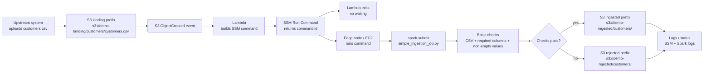
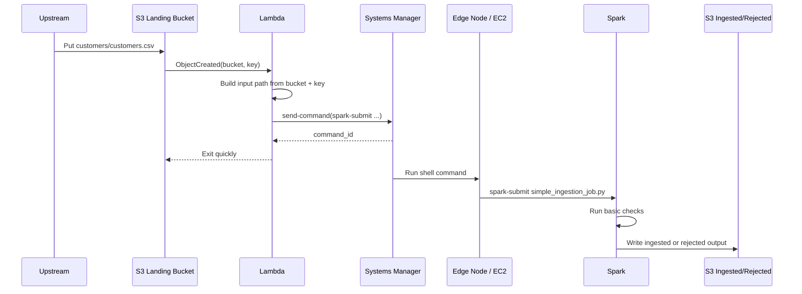

# Simple S3 Ingestion Pipeline

This folder documents a beginner-friendly ingestion pattern:

```text
S3 file landing -> Lambda -> SSM Run Command -> edge node spark-submit -> write back to S3
```

The key production rule is: **Lambda starts the job and exits quickly**.
Lambda does not wait for Spark because Lambda has a 15-minute maximum runtime
and Spark jobs may run longer. The long-running work belongs to Systems Manager
and the Spark submit host.

## Production Flow

1. A file lands in an S3 landing prefix:

   ```text
   s3://demo-landing/customers/customers.csv
   ```

2. S3 sends an ObjectCreated event to Lambda.

3. Lambda reads the S3 bucket and object key.

4. Lambda sends an SSM Run Command to an edge node.

5. Lambda exits after receiving the SSM command id.

6. The edge node runs:

   ```bash
   spark-submit jobs/simple_ingestion_job.py \
     --dataset customers \
     --input s3://demo-landing/customers/customers.csv \
     --output s3://demo-ingested/customers/ \
     --rejected-output s3://demo-rejected/customers/
   ```

7. Spark performs basic checks and writes good or rejected output to S3.

## Architecture Diagram



## Sequence Diagram



## Beginner Mental Model

| Piece | What it does |
| --- | --- |
| S3 landing bucket | Where a new input file arrives. |
| S3 event | Tells Lambda a new object was created. |
| Lambda | Reads bucket/key, builds the SSM command, then exits. |
| SSM Run Command | Starts the long-running command on the edge node. |
| Edge node | Machine where `spark-submit` runs. |
| Spark job | Reads the file, checks it, and writes output. |
| S3 ingested bucket | Destination for good records/files. |
| S3 rejected bucket | Destination for failed files. |

## How The S3 Object Name Reaches Spark

S3 sends Lambda an event containing the bucket and key:

```json
{
  "Records": [
    {
      "s3": {
        "bucket": { "name": "demo-landing" },
        "object": { "key": "customers/customers.csv" }
      }
    }
  ]
}
```

Lambda turns that into the Spark input argument:

```text
s3://demo-landing/customers/customers.csv
```

Then Lambda asks SSM to run this command on the edge node:

```bash
spark-submit jobs/simple_ingestion_job.py \
  --dataset customers \
  --input s3://demo-landing/customers/customers.csv \
  --output s3://demo-ingested/customers/ \
  --rejected-output s3://demo-rejected/customers/
```

## Minimal Lambda Code

This is intentionally small. The Lambda only submits work to SSM.

```python
import boto3
from urllib.parse import unquote_plus

ssm = boto3.client("ssm")

EDGE_NODE_INSTANCE_ID = "i-control-spark-submit"


def handler(event, context):
    record = event["Records"][0]
    bucket = record["s3"]["bucket"]["name"]
    key = unquote_plus(record["s3"]["object"]["key"])

    dataset = key.split("/", 1)[0]
    input_path = f"s3://{bucket}/{key}"
    output_path = f"s3://demo-ingested/{dataset}/"
    rejected_path = f"s3://demo-rejected/{dataset}/"

    spark_command = (
        "spark-submit jobs/simple_ingestion_job.py "
        f"--dataset {dataset} "
        f"--input {input_path} "
        f"--output {output_path} "
        f"--rejected-output {rejected_path}"
    )

    response = ssm.send_command(
        InstanceIds=[EDGE_NODE_INSTANCE_ID],
        DocumentName="AWS-RunShellScript",
        Parameters={"commands": [spark_command]},
    )

    return {
        "status": "accepted",
        "command_id": response["Command"]["CommandId"],
        "input": input_path,
    }
```

## Minimal Spark Job Code

This is the job that the edge node runs with `spark-submit`.

```python
import argparse
from pyspark.sql import SparkSession
from pyspark.sql.functions import col, current_timestamp


def main():
    parser = argparse.ArgumentParser()
    parser.add_argument("--dataset", required=True)
    parser.add_argument("--input", required=True)
    parser.add_argument("--output", required=True)
    parser.add_argument("--rejected-output", required=True)
    args = parser.parse_args()

    spark = SparkSession.builder.appName(f"ingest-{args.dataset}").getOrCreate()

    df = spark.read.option("header", "true").csv(args.input)

    required_columns = ["customer_id", "customer_name", "email"]
    missing = [c for c in required_columns if c not in df.columns]
    if missing:
        raise ValueError(f"Missing required columns: {missing}")

    good_df = df
    for column_name in required_columns:
        good_df = good_df.filter(col(column_name).isNotNull() & (col(column_name) != ""))

    rejected_df = df.subtract(good_df)

    good_df.withColumn("ingested_at", current_timestamp()).write.mode("append").parquet(args.output)
    rejected_df.write.mode("append").option("header", "true").csv(args.rejected_output)

    spark.stop()


if __name__ == "__main__":
    main()
```

## Local Learning Setup With Docker And LocalStack

For new users, keep local testing simple:

- Use **LocalStack** to simulate S3 and Lambda.
- Use a local Docker container as the **edge node**.
- In the first lesson, SSM can be simulated by writing a command file that the
  edge node container reads.
- Later, replace that command-file simulation with real AWS SSM.

### Simple Docker Compose Shape

```yaml
services:
  localstack:
    image: localstack/localstack:latest
    ports:
      - "4566:4566"
    environment:
      - SERVICES=s3,lambda,iam,logs
      - AWS_DEFAULT_REGION=us-east-1
    volumes:
      - "./localstack:/var/lib/localstack"
      - "/var/run/docker.sock:/var/run/docker.sock"

  edge-node:
    image: bitnami/spark:latest
    working_dir: /app
    volumes:
      - "./jobs:/app/jobs"
      - "./local_runtime/commands:/app/commands"
      - "./local_runtime/s3:/app/local_s3"
    command: ["bash", "-lc", "tail -f /dev/null"]
```

### LocalStack Bucket Setup

```bash
awslocal s3 mb s3://demo-landing
awslocal s3 mb s3://demo-ingested
awslocal s3 mb s3://demo-rejected
```

### Upload A Test File

```bash
awslocal s3 cp sample_files/simple_ingestion/customers.csv \
  s3://demo-landing/customers/customers.csv
```

In production, that upload triggers Lambda automatically. In a beginner local
demo, it is okay to invoke Lambda manually first:

```bash
awslocal lambda invoke \
  --function-name ingestion-lambda \
  --payload file://events/s3_object_created.json \
  /tmp/lambda-response.json
```

## Local Reset Note

There is no production reset command. Any `simple-reset` style command is only
for local filesystem simulations. It should reset only local folders used by a
demo. It should not touch AWS, Docker, S3, Lambda, SSM, or Spark
infrastructure.

