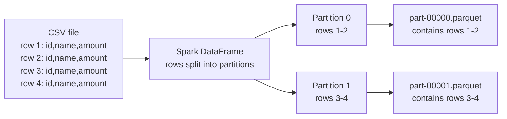
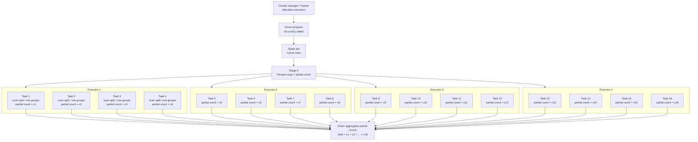

# Parquet, Spark Reads/Writes, Performance, And Updates

This note is for SQL and Python users learning how Spark works with Parquet files in a data lake.

## 1. Quick Mental Model

Remember this:

```text
Parquet is a file format.
Spark is a distributed compute engine that reads and writes those files.
S3/object storage is folder-like storage, not a database.
Delta/Iceberg/Hudi are table formats that add table behavior on top of Parquet files.
```

Why this matters:

- Spark reads and writes visible data files in storage, while databases hide storage pages behind tables.
- File size, partition layout, and sorting affect performance.
- `spark.read...` is lazy; actions such as `count`, `write`, `collect`, and `toPandas` trigger execution.
- Plain Parquet does not safely update one row in place.
- Delta Lake, Iceberg, and Hudi add metadata, snapshots, and transaction behavior.

## 2. What Is Parquet?

Parquet is a columnar binary file format used by Spark, Athena, Glue, EMR, Databricks, and many data lake systems.

For SQL users:

```text
CSV/JSON = text files
Parquet = analytics-optimized binary files with schema, compression, and column metadata
```

Parquet stores data by column instead of plain text rows. That helps analytics queries that read only a few columns from
a wide table.

Example:

```sql
select customer_id, order_date, amount
from orders
where order_year = 2025;
```

If `orders` has 100 columns, Parquet can read mostly the needed columns. CSV and JSON usually require parsing whole text
rows.

## 3. CSV Rows To Parquet Columnar Files

When Spark converts CSV to Parquet, it usually writes multiple `part-*` files. The count depends on Spark partitions at
write time.



Inside each Parquet file, data is organized by row groups, then by column chunks:

```text
part-00000.parquet
|
|-- metadata / schema
|
|-- row group 0
|   |-- column chunk: id values for rows 1-2
|   |-- column chunk: name values for rows 1-2
|   |-- column chunk: amount values for rows 1-2
|
|-- row group 1
    |-- column chunk: id values for more rows
    |-- column chunk: name values for more rows
    |-- column chunk: amount values for more rows
```

This CSV:

```text
id,name,amount
1,Ada,100
2,Grace,200
```

is not stored like this inside Parquet:

```text
row 1: 1,Ada,100
row 2: 2,Grace,200
```

It is stored more like this inside a row group:

```text
id column chunk:     1, 2
name column chunk:   Ada, Grace
amount column chunk: 100, 200
```

Important nuance:

```text
A single row belongs to one Spark output partition and one Parquet part file.
The values for that row are not physically side-by-side.
They are stored in separate column chunks inside the same row group.
```

That is why Parquet is fast for queries like:

```sql
select id, amount
from orders
where amount > 100;
```

Spark can read only the needed columns instead of parsing every full CSV row.

## 4. Where Min/Max Metadata Is Stored

Parquet stores column statistics such as min, max, and null count in file metadata, mainly per row group and column
chunk.

Conceptually:

```text
part-00000.parquet
|
|-- file metadata / schema
|
|-- row group 0
|   |-- column chunk: order_id
|   |   |-- statistics: min=1, max=1000, null_count=0
|   |
|   |-- column chunk: amount
|   |   |-- statistics: min=5.25, max=999.99, null_count=3
|
|-- row group 1
|   |-- column chunk: order_id
|   |   |-- statistics: min=1001, max=2000, null_count=0
|   |
|   |-- column chunk: amount
|       |-- statistics: min=1.00, max=500.00, null_count=8
```

Physically, this metadata is written in the Parquet footer. A reader can read the footer first to understand:

- schema
- row groups
- column chunks
- encodings and compression
- statistics such as min, max, and null count when available

This enables row-group skipping.

Example:

```python
df = spark.read.parquet("s3://bucket/orders/")
filtered = df.where("amount > 1000")
```

If a row group has:

```text
amount min=1
amount max=500
```

Spark can skip that row group because no row inside it can satisfy `amount > 1000`.

Key points:

```text
Min/max stats are usually per row group / column chunk, not one global table min/max.
Stats are still correct when data is unsorted.
Unsorted data often creates wide min/max ranges, so pruning is less effective.
Sorted or clustered data often creates narrower min/max ranges, so pruning is better.
```

Partition folder values are separate from Parquet row-group statistics:

```text
orders/order_year=2026/order_month=10/part-00000.parquet
```

Spark can use folder values for partition pruning before reading Parquet footers.

## 5. Writing Parquet For Future Filters

Design the Parquet layout around common query filters.

### 5.1 Partition By Common Low-Cardinality Filters
Good partition columns are common filters with limited distinct values:

>Cardinality means how many distinct values a column has, for example country has low cardinality, while customer_id usually has high cardinality.

```text
year, month, date, region, country, source_system, business_unit
```

Example filters:

```sql
where order_year = 2026
where order_month = '2026-10'
where region = 'US'
```

Write partitioned Parquet:

```python
df.write.partitionBy("order_year", "order_month").parquet("s3://bucket/orders/")
```

Output:

```text
orders/
  order_year=2026/
    order_month=10/
      part-00000.parquet
```

Spark can skip entire folders when filters match partition columns. This is partition pruning.

Avoid high-cardinality partition columns:

```text
order_id, customer_id, transaction_id, email
```

They can create too many tiny folders and files.

### 5.2 Sort Or Cluster For Range Filters

If users often filter by ranges:

```sql
where amount between 100 and 200
where event_ts between '2026-10-01' and '2026-10-03'
```

sort or cluster data so Parquet row-group stats become useful.

Example:

```python
df = df.repartition("order_month").sortWithinPartitions("amount")

df.write.partitionBy("order_month").parquet("s3://bucket/orders/")
```

Why this helps:

```text
Unsorted data -> wide min/max ranges -> less skipping
Sorted data   -> narrow min/max ranges -> more skipping
```

Unsorted row groups:

```text
row group 1: 500, 10, 900, 25       min=10, max=900
row group 2: 700, 5, 1000, 60       min=5, max=1000
```

For `where amount > 800`, Spark cannot skip either row group.

Sorted row groups:

```text
row group 1: 1, 5, 10, 25           min=1, max=25
row group 2: 500, 700, 900, 1000    min=500, max=1000
```

For `where amount > 800`, Spark can skip row group 1.

Sorting is not required for correctness. It helps performance when filters match the sorted or clustered column.

### 5.3 Control File Size

A practical target is often:

```text
128 MB to 1 GB compressed per Parquet file
```

Avoid:

```text
too many tiny files -> slow listing, planning, and task overhead
one giant file      -> poor parallelism
```

Useful patterns:

```python
df.repartition("order_month").write.partitionBy("order_month").parquet(path)
```

```python
df.write.option("maxRecordsPerFile", 500000).parquet(path)
```

### 5.4 Decision Guide

| Query pattern | Suggested write layout |
|---|---|
| Filter by `year` or `month` | Partition by `year` / `month` |
| Filter by `region` | Partition by `region` if cardinality is reasonable |
| Filter by `amount between x and y` | Sort or cluster by `amount` within partitions |
| Filter by timestamp ranges | Partition by date/month, then sort by timestamp |
| Filter by unique id | Do not partition by id; consider table format, clustering, or indexing strategy |

For serious update and lookup workloads, consider Delta Lake, Iceberg, or Hudi. Plain Parquet is a file format; table
formats add metadata, snapshots, and safer update/merge behavior.

## 6. Parquet vs CSV vs JSON

| Feature | CSV | JSON | Parquet |
|---|---|---|---|
| Human readable | Yes | Yes | No, binary |
| Stores schema | No | Not reliably | Yes |
| Good for nested data | No | Yes | Yes |
| Efficient compression | Limited | Limited | Yes, column-aware |
| Reads selected columns efficiently | No | No | Yes |
| Good for raw landing | Yes | Yes | Sometimes |
| Good for trusted/curated analytics | Usually no | Usually no | Yes |

Common data lake pattern:

```text
raw zone       -> source-shaped CSV, JSON, API extracts
trusted zone   -> clean Parquet with schema and partitions
transformed    -> Parquet tables ready for analytics
```

## 7. How Spark Decides Parquet File Size When Writing

Spark writes a folder of `part-*` files, not one file.

Example:

```python
df.write.mode("overwrite").parquet("data/output/orders")
```

Output:

```text
data/output/orders/
  part-00000-....snappy.parquet
  part-00001-....snappy.parquet
  _SUCCESS
```

Spark output file size mainly depends on:

- how many partitions the DataFrame has at write time
- whether you used `repartition` or `coalesce`
- whether you used `partitionBy`
- how much data each task receives
- how well the data compresses
- options such as `maxRecordsPerFile`

Rule:

```text
One Spark task usually writes one output file per target partition folder.
```

Example:

```python
df.repartition(8).write.mode("overwrite").parquet("data/output/orders")
```

This usually creates about 8 Parquet part files.

Partitioned writes can create more files:

```python
df.repartition(8).write.mode("overwrite").partitionBy("order_month").parquet(
    "data/output/orders_by_month"
)
```

If those 8 tasks contain records for several months, each task can write files into several `order_month=...` folders.

For tiny demos only:

```python
df.coalesce(1).write.mode("overwrite").parquet("data/output/small_demo")
```

Do not use `coalesce(1)` for large production output. It forces too much data through one task.

To limit records per output file:

```python
df.write.option("maxRecordsPerFile", 500000).parquet("data/output/orders")
```

Production teams often aim for 128 MB to 1 GB compressed per file, depending on engine and workload.

```text
One huge file       -> less parallelism
Thousands of files  -> slow listing, slow planning, too many small tasks
```

## 8. What Happens When I Say `spark.read()`?

This does not immediately read all data into memory:

```python
df = spark.read.parquet("data/output/orders")
```

Spark is lazy. `spark.read.parquet(...)` creates a DataFrame and a plan. Data is read only when an action runs.

Actions include:

```python
df.show()
df.count()
df.collect()
df.write.parquet("data/output/copy")
```

Spark may read metadata early, such as schema and Parquet footers, but it does not load the whole dataset into the
driver.

Think of `spark.read...` as creating a recipe:

```text
When an action runs, read Parquet files from data/output/orders.
```

### 8.1 Transformations vs Actions

Transformations build a plan and stay lazy:

```python
df = spark.read.parquet("data/output/orders")
small = df.select("order_id", "amount")
filtered = small.where("amount > 100")
```

Actions execute the plan:

```python
filtered.count()
filtered.show()
filtered.write.parquet("data/output/high_value_orders")
filtered.collect()
```

For ETL jobs, the most common action is usually the final write:

```python
clean_df.write.mode("overwrite").parquet("s3://company-trusted/orders/")
```

## 9. Does Spark Read The Entire Parquet File Into Memory?

Usually no.

High-level read flow:

1. Spark lists matching Parquet files.
2. Spark creates read tasks.
3. Executors read assigned files, splits, or row groups.
4. Parquet readers read column chunks and pages.
5. Spark processes batches of rows/columns.

Mental model:

```text
Spark reads Parquet in parallel chunks across executors.
It does not read the entire dataset into one Python process.
```

Parquet also helps with:

- column pruning: read fewer columns
- predicate pushdown: skip some row groups using statistics
- partition pruning: skip folders such as `order_month=2025-09`

Example:

```python
df = spark.read.parquet("data/output/orders")

small = df.select("order_id", "amount").where("order_month = '2025-09'")
small.count()
```

Spark can skip many unneeded columns and partition folders.

## 10. What Happens During `count()`

When you run:

```python
df.count()
```

Spark runs a distributed job. It counts all relevant rows, but it does not bring all rows to the driver.

For Parquet input, Spark usually:

1. Lists matching Parquet files.
2. Builds scan tasks from files and file splits.
3. Runs tasks on available executor cores.
4. Computes partial counts on executors.
5. Sends small partial counts to the driver.
6. Produces one final number.

Picture for a `df.count()` job with 16 concurrent tasks:



Key point:

```text
Each task reads its assigned Parquet split/row groups and returns a small number.
The driver receives partial counts, not all rows.
```

If you have:

```text
100 Parquet files
4 executors
4 cores per executor
```

Spark can run roughly:

```text
4 executors x 4 cores = about 16 tasks at the same time
```

That does not mean Spark reads only 4 files. It runs a limited number of tasks concurrently, then queues the rest.

```text
count() logically scans all relevant rows.
Physically, Spark scans them in parallel batches based on executor cores and partitions.
```

## 11. Why `collect()` And `toPandas()` Are Different

This is dangerous on a large PySpark DataFrame:

```python
rows = df.collect()
```

`collect()` brings all rows from executors to the driver Python process as a local list of `Row` objects.

This is also dangerous:

```python
pandas_df = df.toPandas()
```

`toPandas()` collects all Spark rows to the driver and converts them into one pandas DataFrame.

Important clarification:

```text
toPandas() does not mean one executor task reads all the data.
Spark still runs distributed tasks on executors to compute DataFrame partitions.
Then the partition results are sent to the driver.
The final pandas DataFrame is created in the driver Python process.
```

So the risk is driver memory, not one executor reading the source data.

Two phases:

```text
Before toPandas():
  df.filter(...).groupBy(...).sum()
  Spark DataFrame operations can run across executors.

During toPandas():
  Spark sends final rows from executors to the driver.
  The driver builds one local pandas DataFrame.

After toPandas():
  pandas_df["amount2"] = pandas_df["amount"] * 2
  pandas_df.groupby("customer_id")["amount"].sum()
  pandas_df.sort_values("amount")
  These are pandas operations on the driver, not Spark executor work.
```

Once you have a pandas DataFrame, normal pandas work runs on the driver. It uses Spark again only if you convert it back
to a Spark DataFrame and run Spark operations.

Both `collect()` and `toPandas()` bring all rows to the driver.

```text
collect()   -> Python list of Spark Row objects on the driver
toPandas()  -> pandas DataFrame on the driver
```

| Operation | Distributed? | What returns to driver? | Risk |
|---|---:|---|---|
| `df.count()` | Yes | One number | Usually safe |
| `df.write.parquet(...)` | Yes | Status/errors | Usually safe |
| `df.show(20)` | Mostly | Small sample | Usually safe |
| `df.limit(100).collect()` | Mostly | 100 rows | Usually safe |
| `df.collect()` | Spark computes distributed; final result is local | All rows | Dangerous for large data |
| `df.toPandas()` | Spark computes distributed; final pandas object is local | All rows as pandas | Dangerous for large data |

Rule of thumb:

```text
Use collect() only when the result fits in driver memory.
Use toPandas() only when the pandas DataFrame fits in driver memory.
For exploration, prefer df.limit(1000).toPandas().
```

### 11.1 pandas Join On Key vs PySpark Join On Key

The code can look similar, but the execution is very different.

pandas join:

```python
joined_pdf = orders_pdf.merge(customers_pdf, on="customer_id", how="inner")
```

PySpark join:

```python
joined_df = orders_df.join(customers_df, on="customer_id", how="inner")
```

Mental model:

```text
pandas DataFrame join:
  Runs in one Python process, usually the driver or your laptop.
  Both DataFrames must fit in that machine's memory.

PySpark DataFrame join:
  Runs across executors.
  Spark may shuffle rows so the same customer_id values meet on the same partition.
  The result stays distributed until an action runs.
```

Example:

```python
joined_df = orders_df.join(customers_df, "customer_id")
joined_df.write.parquet("s3://bucket/curated/orders_with_customers/")
```

This can stay distributed from read to join to write.

But this changes the execution model:

```python
joined_pdf = orders_df.join(customers_df, "customer_id").toPandas()
```

Spark performs the join across executors, then sends the full joined result to
the driver as one pandas DataFrame. After that, all pandas operations run on the
driver.

Rule:

```text
Use pandas joins for small local data.
Use PySpark joins for large data.
Be careful with skewed join keys because one key with huge data can overload one Spark task.
```

## 12. What If The Data Is Bigger Than Executor Memory?

It depends on the operation.

Simple scan:

```python
df = spark.read.parquet("data/output/orders")
df.where("amount > 100").count()
```

Spark can usually process data in chunks. The dataset can be much larger than cluster memory.

Riskier operations include joins, group by, sort, window functions, and deduplication. They may shuffle and hold
intermediate data. If one task gets too much data:

- Spark may spill data to disk.
- The job may become slow.
- A task may fail with out-of-memory.
- One executor may run much longer than others.

Important idea:

```text
Total executor memory is not one shared pool.
Each executor and each task has its own memory limits.
One oversized task can fail even when the whole cluster has enough total memory.
```

Common fixes:

- Select fewer columns early.
- Filter early.
- Repartition before large joins or aggregations.
- Avoid skewed keys where one key has huge data.
- Avoid `collect()` and `toPandas()` on large DataFrames.
- Increase executor memory for real clusters.
- Rewrite unhealthy file layouts into better file sizes.

### 12.1 What Does "Avoid Skewed Keys" Mean?

Data skew means data is not evenly distributed across keys.

Example:

```text
customer_id=A      10 rows
customer_id=B      12 rows
customer_id=C      8 rows
customer_id=BIG    50,000,000 rows
```

If you run:

```python
df.groupBy("customer_id").count()
```

or join by `customer_id`:

```python
orders.join(customers, "customer_id")
```

Spark may send all rows for the same key to one shuffle partition. One task may get almost all rows for
`customer_id = BIG`.

Mental picture:

```text
Task 1: customer A, B, C -> small work
Task 2: customer D, E, F -> small work
Task 3: customer BIG     -> huge work, slow, spills, maybe OOM
Task 4: customer G, H, I -> small work
```

This is why the Spark UI may show one task running much longer than the others.

### 12.2 Should You Force Repartitioning?

Sometimes, but not blindly.

Useful repartitioning:

```python
df = df.repartition(200, "customer_id")
```

This can help before joins or aggregations because Spark has more shuffle partitions.

But repartitioning by the skewed key alone may not solve one giant key:

```text
All customer_id=BIG rows still hash to one partition.
```

Random repartitioning is different:

```python
from pyspark.sql import functions as F

df = df.repartition(200, F.rand())
```

Random repartitioning can rebalance uneven physical partitions. Use it when the data is physically lopsided, not when
one logical key is huge.

Example: suppose Spark reads 10 files, but one file is much larger than the others:

```text
Input partition 1:   50 MB
Input partition 2:   45 MB
Input partition 3:   60 MB
Input partition 4: 5000 MB
```

If the next step is a row-level transformation or a write, random repartitioning can spread that large physical partition
across many tasks:

```python
balanced = df.repartition(200, F.rand())
balanced.write.mode("overwrite").parquet(output_path)
```

But if the next step is a join or aggregation by `customer_id`, Spark will shuffle by `customer_id` again. All rows for
`customer_id=BIG` can still end up together. In that case, random repartitioning is only a temporary rebalance; salting,
heavy-key isolation, AQE skew handling, or broadcast joins are better fixes.

For a truly skewed key, choose a fix based on the situation:

1. Handle the giant key separately.

   First split the heavy key from the normal keys:

   ```python
   orders_big = orders.where("customer_id = 'BIG'")
   orders_normal = orders.where("customer_id <> 'BIG'")
   ```

   Then process each side with the best strategy:

   - `orders_normal`: regular join is usually fine.
   - `orders_big`: use salting or broadcast, depending on the other side.

   ```python
   normal_result = orders_normal.join(customers, "customer_id")
   ```

   ### Option A: Salt the Heavy-Key Join

   Use salting when the heavy-key join still needs a shuffle and the other side cannot simply be broadcast.

   ```python
   from pyspark.sql import functions as F

   salt_count = 10

   orders_big_salted = orders_big.withColumn(
       "salt",
       (F.rand() * salt_count).cast("int")
   )
   ```

   This adds a random integer salt from `0` to `9` to each order row.

   Example `orders_big`:

   ```text
   order_id  customer_id  amount
   1         BIG          100
   2         BIG          150
   3         BIG          200
   ```

   Example `orders_big_salted`:

   ```text
   order_id  customer_id  amount  salt
   1         BIG          100     3
   2         BIG          150     8
   3         BIG          200     1
   ```

   Now `customer_id=BIG` is no longer one giant join group. It is split across `(BIG, 0)`, `(BIG, 1)`, `(BIG, 2)`, and so on.

   If another DataFrame joins to orders by `customer_id`, it also needs salt values:

   ```python
   salt_values = spark.range(salt_count).withColumnRenamed("id", "salt")
   ```

   `spark.range(salt_count)` creates one column named `id` with values from `0` up to `salt_count - 1`.
   `withColumnRenamed("id", "salt")` renames that column to `salt`.

   Example `salt_values`:

   ```text
   salt
   0
   1
   2
   3
   4
   5
   6
   7
   8
   9
   ```

   Then expand the other side of the join:

   ```python
   customers_for_big = customers.where("customer_id = 'BIG'")
   customers_big_expanded = customers_for_big.crossJoin(salt_values)
   ```

   Example `customers_for_big`:

   ```text
   customer_id  customer_name
   BIG          Big Customer
   ```

   Example `customers_big_expanded`:

   ```text
   customer_id  customer_name    salt
   BIG          Big Customer     0
   BIG          Big Customer     1
   BIG          Big Customer     2
   ...
   BIG          Big Customer     9
   ```

   Now join using both columns:

   ```python
   big_result = orders_big_salted.join(
       customers_big_expanded,
       ["customer_id", "salt"]
   ).drop("salt")
   ```

   This works because every customer row exists for every salt value. An order with `(customer_id=BIG, salt=3)` can join
   to the expanded customer row with `(customer_id=BIG, salt=3)`.

   Then combine the normal-key result and heavy-key result:

   ```python
   result = normal_result.unionByName(big_result)
   ```

   Use this carefully: expanding the other side multiplies it by `salt_count`. Expand only the heavy keys when possible
   instead of the whole DataFrame.

   ### Option B: Broadcast the Small Side

   Use broadcast when the other side of the join is small enough to fit safely in executor memory. This is often simpler
   than salting:

   ```python
   from pyspark.sql.functions import broadcast

   big_result = orders_big.join(
       broadcast(customers.where("customer_id = 'BIG'")),
       "customer_id"
   )
   ```

   Then combine it with the normal result:

   ```python
   result = normal_result.unionByName(big_result)
   ```

   Broadcast and salting are alternative strategies. Use one for the heavy-key path, not both, unless you are comparing
   performance.

2. Increase shuffle partitions for large shuffles.

   ```python
   spark.conf.set("spark.sql.shuffle.partitions", "400")
   ```

3. Let Adaptive Query Execution help if enabled.

   ```python
   spark.conf.set("spark.sql.adaptive.enabled", "true")
   ```

Rule:

```text
Repartitioning helps when there are too few partitions.
Repartitioning alone may not fix one massive skewed key.
For one huge key, split, salt, broadcast, or handle that key separately.
```

## 13. If A Spark Job Is Slow, Where Should I Look?

Start with the Spark UI:

1. Jobs
2. Stages inside each job
3. Tasks inside slow stages
4. Executors
5. SQL tab for the physical plan

Beginner checklist:

| Symptom | What to check |
|---|---|
| One task takes much longer than others | Data skew, one huge partition, bad partitioning |
| Large shuffle read/write | Join, group by, distinct, window, repartition |
| Memory spill or disk spill | Not enough memory for shuffle/sort/aggregation |
| Many tiny tasks | Too many small files or too many partitions |
| Very few tasks | Not enough parallelism or huge files |
| Slow file listing | Too many tiny files or deeply nested partitions |
| Executor lost or OOM | Task memory too large, skew, bad join strategy |

Look for:

- stage duration
- task duration distribution
- shuffle read and shuffle write
- memory and disk spill
- input size per task
- failed tasks
- executor memory usage

Rule:

```text
If one task is much slower than others, suspect skew or an oversized partition.
If every task is slow, suspect too much data, too many columns, expensive transformations, or poor file layout.
```

## 14. Updating September 2025 Parquet Data

Scenario:

```text
Existing partition:
s3://company-trusted/orders/order_month=2025-09/

New correction rows arrive for September 2025.
```

Plain Parquet does not update a few rows inside an existing file.

```text
Parquet files are immutable in normal data lake workflows.
Spark does not open part-00000.parquet, change one row, and save the same file.
Spark writes new files.
```

An update usually means rewriting the affected files or partition:

1. Read the September 2025 partition.
2. Read the correction rows.
3. Merge old rows and corrections in Spark.
4. Write a replacement September 2025 partition.

### 14.1 Replace One Affected Partition

Assume the business key is `order_id`.

```python
from pyspark.sql import functions as F

base_path = "s3a://de-lab/trusted/orders"
corrections_path = "s3a://de-lab/raw/order_corrections/sep2025.csv"
replacement_path = "s3a://de-lab/tmp/orders/order_month=2025-09"

sept_2025 = spark.read.parquet(f"{base_path}/order_month=2025-09")

corrections = (
    spark.read
    .option("header", True)
    .csv(corrections_path)
    .withColumn("order_date", F.to_date("order_date"))
    .withColumn("amount", F.col("amount").cast("double"))
    .withColumn("order_month", F.lit("2025-09"))
    .withColumn("update_ts", F.current_timestamp())
)

old_rows_not_corrected = sept_2025.join(
    corrections.select("order_id").dropDuplicates(),
    "order_id",
    "left_anti",
)

replacement = old_rows_not_corrected.unionByName(corrections, allowMissingColumns=True)

replacement.write.mode("overwrite").parquet(replacement_path)
```

Validate:

```python
spark.read.parquet(replacement_path).count()
spark.read.parquet(replacement_path).where("order_id is null").count()
```

After validation, promote the replacement partition.

For a local or LocalStack learning lab:

```bash
awslocal s3 rm s3://de-lab/trusted/orders/order_month=2025-09/ --recursive
awslocal s3 cp s3://de-lab/tmp/orders/order_month=2025-09/ \
  s3://de-lab/trusted/orders/order_month=2025-09/ \
  --recursive
```

Real AWS equivalent, shown only for learning:

```bash
aws s3 rm s3://your-real-bucket/trusted/orders/order_month=2025-09/ --recursive
aws s3 cp s3://your-real-bucket/tmp/orders/order_month=2025-09/ \
  s3://your-real-bucket/trusted/orders/order_month=2025-09/ \
  --recursive
```

Warning: deleting and copying S3 prefixes is not an atomic database transaction. A reader may see partial data during
replacement. Production systems use orchestration, versioned paths, or a lakehouse table format.

## 15. Dynamic Partition Overwrite

Spark can overwrite only the partitions present in the incoming DataFrame when configured carefully.

```python
spark.conf.set("spark.sql.sources.partitionOverwriteMode", "dynamic")

replacement.write.mode("overwrite").partitionBy("order_month").parquet(
    "s3a://de-lab/trusted/orders"
)
```

If `replacement` contains only `order_month = '2025-09'`, Spark overwrites only that partition instead of the whole
table path.

Use carefully:

- Validate that the incoming DataFrame contains only intended partitions.
- Keep a backup or versioned output path.
- Understand how your storage and catalog handle concurrent readers.

## 16. Delta Lake, Iceberg, And Hudi

Plain Parquet files are excellent for analytics reads, but they are still just files.

Plain Parquet does not provide a safe built-in way to say:

```sql
update orders
set status = 'CANCELLED'
where order_id = 1001;
```

or:

```sql
merge into orders using updates ...
```

With plain Parquet on S3, an update usually means:

1. Read old files.
2. Create replacement files.
3. Delete or replace old folders.
4. Hope no reader sees the table halfway through replacement.

Table formats solve this problem:

- Delta Lake
- Apache Iceberg
- Apache Hudi

They still store data as Parquet files, but add a table-management layer.

### 16.1 Practical Delta Lake Example

Start with a normal Spark DataFrame called `orders_df`:

```text
order_id  status    amount
1001      COMPLETE  99.50
1002      COMPLETE  25.00
1003      PENDING   40.00
```

If you write this as plain Parquet, the output is just data files in a folder:

```text
s3://company-trusted/orders/
  part-00000.parquet
  part-00001.parquet
```

Spark can read those files:

```python
orders_df = spark.read.parquet("s3://company-trusted/orders/")
```

But plain Parquet does not have a transaction log. Spark sees files in a folder, but it does not know:

- which files belong to version 0, version 1, or version 2
- whether a write finished completely
- which old files were replaced by new files
- how to safely run `UPDATE`, `DELETE`, or `MERGE`

Now one order changes:

```text
order_id = 1001
old status = COMPLETE
new status = CANCELLED
```

With plain Parquet, Spark normally does not open `part-00000.parquet`, change one row, and save the same file. You
usually rewrite the affected files or partition yourself.

Delta Lake stores the data as Parquet files too, but it also adds a transaction log:

```text
s3://company-trusted/orders_delta/
  _delta_log/
  part-*.parquet
```

The `_delta_log` is the important difference. It records which Parquet files are active for each table version.

### 16.2 Initial Delta Table Write

Write the starting DataFrame as a Delta table:

```python
orders_df.write.format("delta").mode("overwrite").save(
    "s3://company-trusted/orders_delta/"
)
```

At this point, use `orders_df.write...` because you are creating the Delta table for the first time. `DeltaTable.forPath`
is used later, after the Delta table already exists, when you want to run Delta-specific operations such as `MERGE`,
`UPDATE`, or `DELETE`.

```text
First write:
  DataFrame -> Delta table path

Later merge/update/delete:
  Existing Delta table path -> DeltaTable object
```

After this first write, the folder might look like this:

```text
orders_delta/
  _delta_log/
    00000000000000000000.json
  part-a.parquet
  part-b.parquet
```

Think of `00000000000000000000.json` as the first commit. It says:

```text
Table version 0:
  add part-a.parquet
  add part-b.parquet
```

So the current table is:

```text
version 0 = part-a.parquet + part-b.parquet
```

When a reader loads the Delta table:

```python
current_orders = spark.read.format("delta").load(
    "s3://company-trusted/orders_delta/"
)
```

Delta reads `_delta_log` first, learns that version 0 contains `part-a.parquet` and `part-b.parquet`, and then reads
only the active files.

### 16.3 Delta MERGE Example

Now a new update file arrives:

```text
updates.csv
order_id,status,amount
1001,CANCELLED,99.50
1005,COMPLETE,42.00
```

Goal:

- `order_id = 1001` already exists, so update it from `COMPLETE` to `CANCELLED`.
- `order_id = 1005` does not exist, so insert it as a new row.

Load the Delta table and the update file:

```python
from delta.tables import DeltaTable

target = DeltaTable.forPath(spark, "s3://company-trusted/orders_delta/")
updates = (
    spark.read
    .option("header", "true")
    .csv("s3://company-raw/order_updates/updates.csv")
)
```

Run the merge:

```python
(
    target.alias("t")
    .merge(
        updates.alias("u"),
        "t.order_id = u.order_id"
    )
    .whenMatchedUpdateAll()
    .whenNotMatchedInsertAll()
    .execute()
)
```

Read the merge condition like this:

```text
t.order_id = u.order_id
```

Meaning:

- `t` is the target Delta table.
- `u` is the incoming update DataFrame.
- If an incoming `order_id` matches an existing `order_id`, it is a matched row.
- If an incoming `order_id` does not match anything in the target table, it is a not-matched row.

These two lines define what to do:

```python
.whenMatchedUpdateAll()
.whenNotMatchedInsertAll()
```

Meaning:

- `whenMatchedUpdateAll()`: update all matching target columns using the incoming row.
- `whenNotMatchedInsertAll()`: insert the incoming row when no target row exists.

Logical row result:

```text
Before merge:
order_id  status    amount
1001      COMPLETE  99.50
1002      COMPLETE  25.00
1003      PENDING   40.00

Incoming updates:
order_id  status     amount
1001      CANCELLED  99.50
1005      COMPLETE   42.00

After merge:
order_id  status     amount
1001      CANCELLED  99.50   # updated
1002      COMPLETE   25.00   # unchanged
1003      PENDING    40.00   # unchanged
1005      COMPLETE   42.00   # inserted
```

Physical file result:

Delta still does not edit one row inside an existing Parquet file. It writes new Parquet files and updates the log.
Conceptually:

```text
1. Read current table version from _delta_log.
2. Find files that contain affected rows.
3. Write new Parquet files with updated data.
4. Write a new transaction log entry.
5. New readers see the new version.
6. Old files remain for time travel until cleanup/vacuum.
```

After the merge, the folder might look like this:

```text
orders_delta/
  _delta_log/
    00000000000000000000.json
    00000000000000000001.json
  part-a.parquet          # old file, no longer active in latest version
  part-b.parquet          # still active
  part-c.parquet          # new replacement file
```

The new log file, `00000000000000000001.json`, is the second commit. It might say:

```text
Table version 1:
  remove part-a.parquet
  add part-c.parquet
```

So the current table is now:

```text
version 1 = part-b.parquet + part-c.parquet
```

`part-a.parquet` may still physically exist in storage, but Delta no longer treats it as active for the latest table
snapshot. It is kept temporarily so older table versions can still be read until cleanup runs.

Important detail: Delta rewrites files, not individual rows inside a file.

Suppose `part-a.parquet` contains these rows:

```text
part-a.parquet
order_id  status    amount
1001      COMPLETE  99.50
1002      COMPLETE  25.00
```

If only `order_id = 1001` changes, Delta still replaces the affected file. The unchanged row, `order_id = 1002`, is
copied into the new active file:

```text
part-c.parquet
order_id  status     amount
1001      CANCELLED  99.50   # updated row
1002      COMPLETE   25.00   # untouched row copied forward
```

Rows in unaffected files are not rewritten:

```text
part-b.parquet stays active because none of its rows changed.
```

Deletes follow the same idea. If `order_id = 1001` is deleted and it lives in `part-a.parquet`, Delta writes a
replacement file that contains the remaining rows from that affected file:

```text
Before delete, part-a.parquet:
order_id  status    amount
1001      COMPLETE  99.50
1002      COMPLETE  25.00

After delete, new active file:
order_id  status    amount
1002      COMPLETE  25.00
```

Then the log marks the old file as removed and the replacement file as added:

```text
Table version 2:
  remove part-a.parquet
  add part-d.parquet
```

For a beginner, the mental model is:

```text
Updated rows -> new replacement files
Deleted rows -> omitted from new replacement files
Untouched rows in affected files -> copied forward
Untouched files -> remain active as-is
```

### 16.4 Why This Helps Readers

With manual Parquet replacement, a reader might see:

```text
some old files + some new files
```

With Delta, readers use a table version:

```text
Reader A starts before merge -> sees version 0
Reader B starts after merge  -> sees version 1
```

If `versionAsOf` is not specified, Delta reads the latest committed version at the time the query starts. If a writer is
currently updating the table but has not committed the new log version yet, the reader sees the old latest committed
version. After the writer commits, new readers see the new latest committed version.

```text
Current committed version: 5
Writer is creating version 6, but has not committed yet
Reader starts without versionAsOf -> sees version 5

Writer commits version 6
Next reader starts without versionAsOf -> sees version 6
```

That is the practical value of the transaction log.

### 16.5 Time Travel

Delta can read an older version:

```python
old_orders = (
    spark.read.format("delta")
    .option("versionAsOf", 0)
    .load("s3://company-trusted/orders_delta/")
)
```

This helps when:

- a bad file was ingested
- a merge had wrong business logic
- you need to compare before and after states
- you need audit/debug capability

Old files are not kept forever automatically. Production teams run cleanup with retention rules, often called vacuum.

### 16.6 Plain Parquet vs Delta Lake

| Plain Parquet | Delta Lake |
|---|---|
| Files in folders | Files plus `_delta_log` |
| No transaction log | Transaction log tracks table versions |
| Manual overwrite or folder replacement | `UPDATE`, `DELETE`, and `MERGE` operations |
| Readers can see partial replacement if badly orchestrated | Readers see consistent snapshots |
| Hard to roll back | Time travel can read older versions |
| Good file format | Good table format built on Parquet |

### 16.7 Where Iceberg And Hudi Fit

Delta Lake, Apache Iceberg, and Apache Hudi solve the same broad problem:

```text
How do I manage many Parquet files as one reliable table?
```

Beginner mental model:

```text
Parquet = file format
Delta/Iceberg/Hudi = table format
```

Interview explanation:

```text
Parquet stores the data. Delta Lake, Iceberg, and Hudi manage the table around those files using metadata, snapshots,
and transaction semantics. That enables safer merges, updates, deletes, and consistent reads on a data lake.
```

In AWS-style projects:

- Storage is often S3.
- Catalog is often AWS Glue Data Catalog.
- Compute may be Spark on Glue, EMR, Databricks, or another compatible engine.
- The right table format depends on platform standards and engine support.

## 17. Q&A: Common Beginner Questions

### Q: What happens if I read one 2 GB Parquet file but total executor memory is only 512 MB?

It can still work, depending on the operation.

A single 2 GB Parquet file does not mean Spark must load 2 GB into memory at once. Spark and Parquet usually read in
chunks:

```text
2 GB Parquet file
  -> row groups
    -> column chunks
      -> pages / batches
```

For a simple scan:

```python
df = spark.read.parquet("s3://bucket/one_2gb_file.parquet")
df.count()
```

Spark can often process the file with much less than 2 GB of memory because it reads batches, counts rows, and discards
intermediate data.

Risk 1: limited parallelism.

One large file can limit how much work Spark can do at once. Spark may split Parquet work by row groups, but parallelism
depends on row group layout, splittability, Spark settings, storage behavior, compression, and encoding.

Better layout:

```text
Instead of one 2 GB file:
  16 files x 128 MB
or
  8 files x 256 MB
```

Risk 2: shuffle or driver memory.

Simple operations may work:

```python
df.count()
df.select("id").count()
df.where("amount > 100").count()
```

Risky operations may fail:

```python
df.collect()
df.toPandas()
df.groupBy("customer_id").count()
df.orderBy("amount")
df.join(other_df, "id")
df.dropDuplicates()
```

These may bring data to the driver, shuffle data, sort data, build hash maps, or hold large intermediate state.

Recommendation:

```python
df = spark.read.parquet("s3://bucket/one_2gb_file.parquet")

df.repartition(16).write.mode("overwrite").parquet(
    "s3://bucket/orders_rewritten/"
)
```

This does not mean Spark first loads the whole 2 GB file into memory and then repartitions it.

Spark is lazy:

```text
spark.read.parquet(...) -> creates a logical DataFrame plan
df.repartition(16)      -> adds a shuffle/repartition step to the plan
write.parquet(...)      -> action that actually runs the plan
```

When the write action runs, executors read the input file in file splits, row groups, column chunks, pages, and batches.
Rows are processed in chunks, sent through the shuffle for `repartition(16)`, and written to new output files. Spark does
not need the entire DataFrame in executor memory at once, but the shuffle may use memory, disk spill, and network I/O.

For a 1 TB Parquet file, this can still work if the cluster, storage, and Parquet layout allow enough parallel reading.
But it can be expensive:

```text
1 TB input -> read 1 TB -> shuffle 1 TB -> write new files
```

`repartition(256)` controls the number of output shuffle partitions. It does not magically make one badly laid-out input
file cheap to read. If the source file has very large row groups or limited splittability, the read phase may still have
poor parallelism. Good input layout is better than relying on repartition after the fact.

Plain `repartition(16)` still causes a shuffle. Even without a join, Spark must redistribute rows into a new set of 16
partitions:

```text
Old partitions -> rows move across executors -> new 16 partitions
```

It is not just locally cutting one file into 16 pieces. Spark is creating a new physical row distribution, so rows from
one old partition may be sent to many new partitions.

```text
repartition(16) -> shuffle, better balance
coalesce(16)    -> usually avoids a full shuffle, but may keep imbalance
```

Use `repartition` when you need better balance or more parallel output. Use `coalesce` mainly when reducing partition
count after filtering and the existing partitions are already reasonably balanced.

For `count()`, Spark also does not bring all rows to the driver:

```python
df.count()
```

Conceptually:

```text
1. Executors read their assigned chunks.
2. Each task counts rows in batches.
3. Each task returns a small partial count.
4. The driver adds the partial counts.
```

So yes, you can think of simple scans such as `count()` as reading through smaller batches instead of holding the whole
file in memory.

Rule:

```text
Spark can process data larger than executor memory,
but good file layout makes it faster, safer, and more parallel.
```

### Q: Is one Parquet file better than many Parquet files?

Usually no. Spark works best when there are enough files or splits to create many tasks.

```text
one huge file -> not enough parallelism
thousands of tiny files -> too much listing/planning/task overhead
```

Better:

```text
reasonable number of files
reasonable file size
enough tasks for the cluster
```

Beginner target:

```text
128 MB to 1 GB compressed per Parquet file
```

This is a starting point, not a law.

### Q: Why is `coalesce(1)` bad for production?

This is common in demos:

```python
df.coalesce(1).write.parquet("output")
```

It creates one convenient output file, but for large data it is a bottleneck:

```text
many partitions -> one partition -> one task writes almost everything
```

That means less parallelism, more memory pressure on one task, slower writes, and higher failure risk.

Use `coalesce(1)` only for tiny local examples. For production, prefer multiple healthy part files.

### Q: What is the difference between `repartition` and `partitionBy`?

They solve different problems.

`repartition` controls Spark execution partitions:

```python
df = df.repartition(16)
```

`partitionBy` controls output folder layout:

```python
df.write.partitionBy("order_month").parquet("s3://bucket/orders/")
```

Output:

```text
orders/order_month=2026-10/
orders/order_month=2026-11/
```

Mental model:

```text
repartition = how Spark distributes work
partitionBy = how files are organized on storage
```

They are related, but not the same.

### Q: Should I partition by customer_id or order_id?

Usually no. Columns like `customer_id`, `order_id`, `transaction_id`, and `email` often have very high cardinality.

They can create:

```text
millions of folders
tiny files
slow file listing
slow query planning
```

Better choices:

```text
date
month
region
country
source_system
business_unit
```

For fast ID lookup, consider:

- clustering/sorting by ID within broader partitions
- Delta/Iceberg/Hudi table features
- a database/search system for point lookups

### Q: If Parquet has min/max stats, do I still need partitioning?

Often yes. They happen at different levels.

Partition pruning skips folders:

```text
orders/order_year=2026/order_month=10/
```

Parquet min/max pruning skips row groups inside files:

```text
part-00000.parquet -> row group 3 can be skipped
```

Best performance often uses both:

```text
partition by common coarse filters
sort/cluster by common range filters inside those partitions
```

Example:

```python
df = df.repartition("order_month").sortWithinPartitions("event_ts")

df.write.partitionBy("order_month").parquet("s3://bucket/events/")
```

### Q: Does sorting make Parquet smaller?

Sometimes, but the bigger reason to sort is pruning.

Sorting similar values together can improve compression, but the main performance benefit is:

```text
sorted data -> tighter min/max per row group -> better row group skipping
```

### Q: Why does Spark write `_SUCCESS`?

Spark often writes this marker file after a successful folder write:

```text
_SUCCESS
```

It is not data. It is a success marker for tools and humans.

Typical output:

```text
orders/
  part-00000-....parquet
  part-00001-....parquet
  _SUCCESS
```

### Q: Is a Parquet folder the same as a table?

Not exactly.

A plain Parquet folder is just files:

```text
s3://bucket/orders/
  part-00000.parquet
  part-00001.parquet
```

A table usually also has metadata:

- schema
- location
- partition columns
- owner/catalog information
- sometimes transaction history

AWS Glue Data Catalog can define an external table over Parquet files. Delta/Iceberg/Hudi go further by adding snapshots
and transaction metadata.

```text
Parquet files = data storage
Glue table = catalog pointer/schema
Delta/Iceberg/Hudi = table format with transaction/snapshot behavior
```

### Q: When should I rewrite Parquet files?

Rewrite or compact files when:

- there are too many tiny files
- one very large file limits parallelism
- query filters are slow because layout is poor
- you need to cluster/sort data for better pruning
- schema or partition strategy changed

Example rewrite:

```python
df = spark.read.parquet("s3://bucket/orders_old/")

(
    df.repartition("order_month")
    .sortWithinPartitions("event_ts")
    .write
    .mode("overwrite")
    .partitionBy("order_month")
    .parquet("s3://bucket/orders_new/")
)
```

Validate before replacing production paths.
