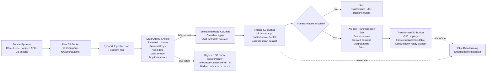
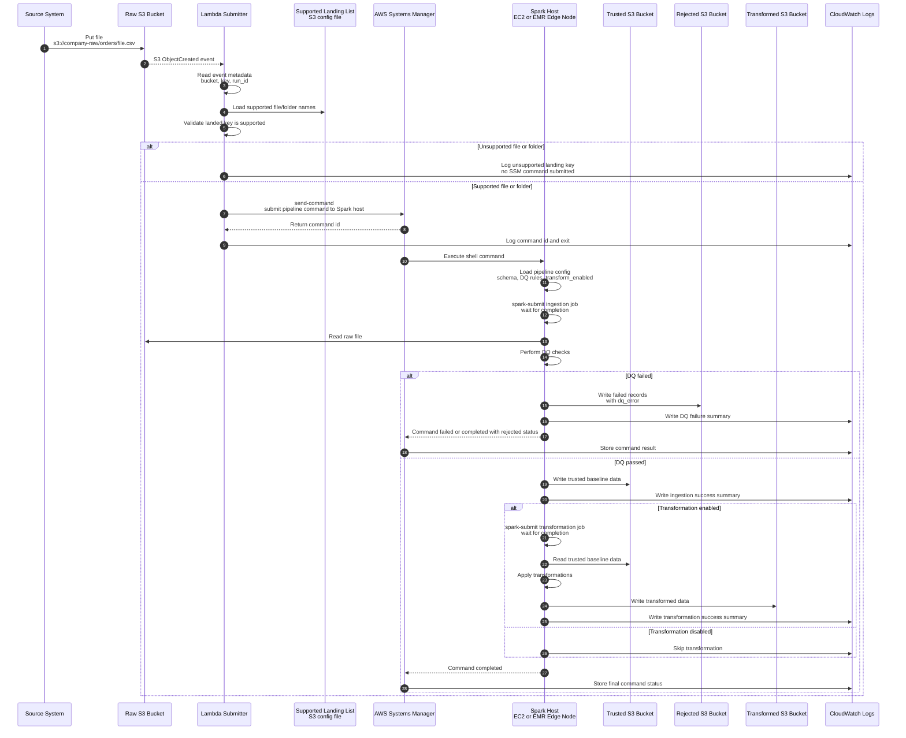

# PySpark Ingestion And Transformation Architecture

This document describes a simple data engineering architecture using PySpark and S3-style data lake buckets.

The goal is to ingest raw files, perform basic data quality checks, save clean baseline data to a trusted bucket, and optionally transform the trusted data into a transformed bucket.

Runnable local implementation:

```text
pipeline_demo/
```

Start with:

```text
pipeline_demo/README.md
```

## 1. Architecture Diagram



## 2. Event-Driven AWS Orchestration Diagram

This diagram shows how the pipeline can run automatically when a file lands in the raw S3 bucket.



## 3. Event-Driven Processing Flow

1. A source system writes a file to the raw S3 bucket.
2. The S3 `ObjectCreated` event triggers a Lambda function.
3. Lambda reads event metadata such as bucket, key, and run id.
4. Lambda reads a supported landing list from a config file in S3. This list contains valid file or folder names that are allowed to land in the raw bucket.
5. Lambda performs only basic validation: is this raw S3 key supported?
6. If the file or folder is unsupported, Lambda logs the unsupported key and stops. It does not submit an SSM command.
7. If the file or folder is supported, Lambda calls AWS Systems Manager Run Command.
8. SSM returns a command id to Lambda.
9. Lambda logs the command id and exits. Lambda does not run Spark, does not run DQ, and does not wait for Spark completion.
10. SSM runs a shell command on a Spark host, such as an EC2 instance or EMR edge node.
11. The shell command loads the pipeline configuration for that source or table.
12. The shell command starts a PySpark ingestion job with `spark-submit` and waits for it to complete.
13. The ingestion job reads the raw S3 file and applies DQ checks.
14. If DQ fails, the job writes rejected records to the rejected bucket and returns a failed or warning status.
15. If DQ succeeds, the job writes standardized baseline data to the trusted bucket.
16. If transformations are enabled in the config, the shell command runs a second `spark-submit` transformation job and waits for it to complete.
17. The transformation job reads from trusted, applies business rules, and writes to transformed.
18. SSM captures the final command status and logs.

Important implementation note: Lambda is only the submitter and basic landing-key validator. It should not run Spark, should not run DQ, and should not wait for the Spark job. The SSM command or shell script on the Spark host is responsible for running `spark-submit`, waiting for completion, and returning the final command status.

## 4. Bucket Roles

| Zone | Example S3 path | Purpose |
|---|---|---|
| Raw | `s3://company-raw/orders/` | Stores files exactly as received from source systems |
| Rejected | `s3://company-rejected/orders/run_id=.../` | Stores records or files that fail DQ checks |
| Trusted | `s3://company-trusted/orders/` | Stores clean, standardized baseline data |
| Transformed | `s3://company-transformed/orders_summary/` | Stores business-transformed data for analytics or downstream use |

The trusted bucket is the baseline bucket. It should contain clean data with standardized columns and data types, but without heavy business-specific transformation.

## 5. Logical Processing Flow

1. Files land in the raw S3 bucket.
2. A PySpark ingestion job reads raw files.
3. The job applies data quality checks.
4. Failed records are written to the rejected bucket with failure reasons.
5. Passed records are standardized and written to the trusted bucket.
6. If transformation is disabled, the pipeline stops after trusted output.
7. If transformation is enabled, PySpark reads trusted data, applies business transformations, and writes to the transformed bucket.
8. Glue Data Catalog tables can be created over trusted and transformed locations.

## 6. Example Data Quality Rules

For a beginner-friendly pipeline, start with simple rules.

Example input columns:

```text
order_id, customer_id, order_date, status, category, amount
```

Basic DQ rules:

| Rule | Example |
|---|---|
| Required columns exist | `order_id`, `customer_id`, `order_date`, `amount` must be present |
| Primary key is not null | `order_id is not null` |
| Customer is not null | `customer_id is not null` |
| Date is valid | `order_date` can be cast to date |
| Amount is valid | `amount >= 0` |
| Duplicate check | No duplicate `order_id` values within the batch |

Records that fail row-level checks should be written to the rejected bucket with a `dq_error` column.

Example rejected record:

```text
order_id,customer_id,order_date,status,category,amount,dq_error
7,C009,not-a-date,COMPLETE,books,19.99,invalid_order_date
8,,2026-01-05,COMPLETE,grocery,12.50,missing_customer_id
```

## 7. Interested Columns For Trusted Zone

The trusted zone should keep only the columns the data platform wants to standardize and support.

Example:

```text
order_id
customer_id
order_date
status
category
amount
ingestion_ts
source_file
run_id
```

Example standardization:

| Column | Trusted type |
|---|---|
| `order_id` | integer |
| `customer_id` | string |
| `order_date` | date |
| `status` | string |
| `category` | string |
| `amount` | double |
| `ingestion_ts` | timestamp |
| `source_file` | string |
| `run_id` | string |

## 8. Optional Transformation

Transformation should run only when enabled in configuration.

Example transformations:

- Filter to completed orders.
- Add `order_year` and `order_month`.
- Create `amount_bucket`.
- Aggregate total amount by category.
- Join with customer or product reference data.

Example transformed output:

```text
category,order_year,order_month,order_count,total_amount,avg_amount
books,2026,1,2,50.50,25.25
electronics,2026,1,2,399.98,199.99
grocery,2026,1,1,42.25,42.25
```

## 9. Configuration-Driven Design

The future pipeline should be driven by configuration instead of hardcoding each source.

Example config shape:

```yaml
pipeline_name: orders_ingestion
source:
  format: csv
  path: s3://company-raw/orders/
  options:
    header: true
    inferSchema: false

target:
  trusted_path: s3://company-trusted/orders/
  rejected_path: s3://company-rejected/orders/
  transformed_path: s3://company-transformed/orders_summary/

schema:
  columns:
    - name: order_id
      type: integer
      required: true
    - name: customer_id
      type: string
      required: true
    - name: order_date
      type: date
      required: true
    - name: status
      type: string
      required: false
    - name: category
      type: string
      required: false
    - name: amount
      type: double
      required: true

dq_rules:
  primary_key: order_id
  non_negative_columns:
    - amount
  duplicate_check: true

trusted:
  interested_columns:
    - order_id
    - customer_id
    - order_date
    - status
    - category
    - amount

transformation:
  enabled: true
  output_mode: overwrite
  partition_by:
    - order_year
  rules:
    - add_date_parts
    - add_amount_bucket
    - aggregate_by_category_month
```

## 10. LocalStack Mapping For Local Practice

In local practice, Docker plus LocalStack acts like a small local AWS account.

Use LocalStack buckets like:

```text
s3://de-lab-raw/orders/
s3://de-lab-rejected/orders/
s3://de-lab-trusted/orders/
s3://de-lab-transformed/orders_summary/
```

The same architecture works locally:

```text
Raw LocalStack S3 -> PySpark DQ -> Trusted LocalStack S3 -> Optional transform -> Transformed LocalStack S3
```

## 11. Review Questions Before Building

Before building the config-driven pipeline, confirm:

1. Should rejected data be stored as full failed records or only error summaries?
2. Should duplicate `order_id` fail the entire batch or only reject duplicate rows?
3. Should trusted output be partitioned by `order_date`, `order_year`, or source system?
4. Should transformation output be one table per source or one table per business use case?
5. Should the pipeline support only CSV first, or CSV, JSON, and Parquet from the beginning?
