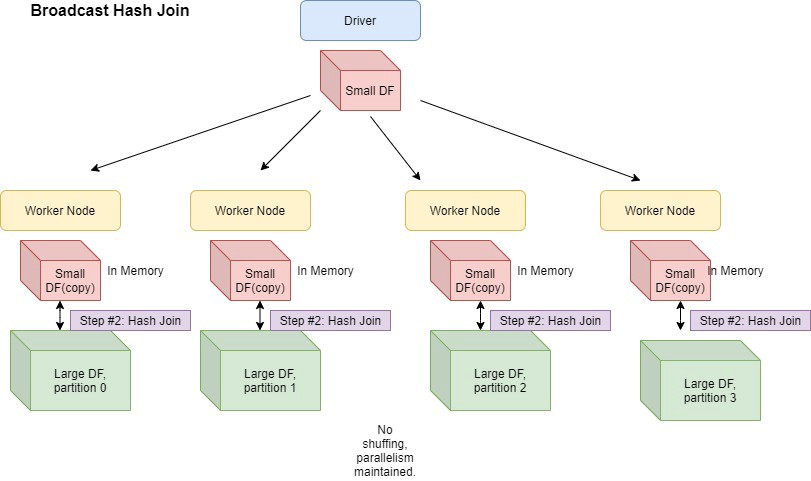
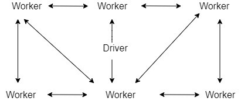
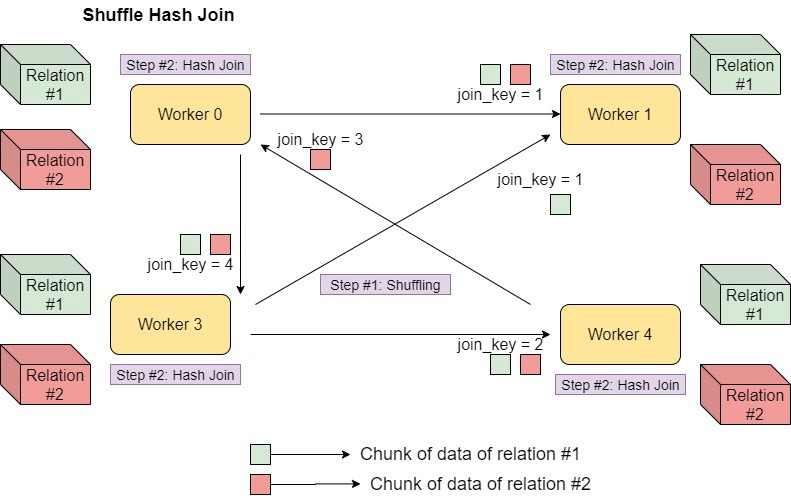
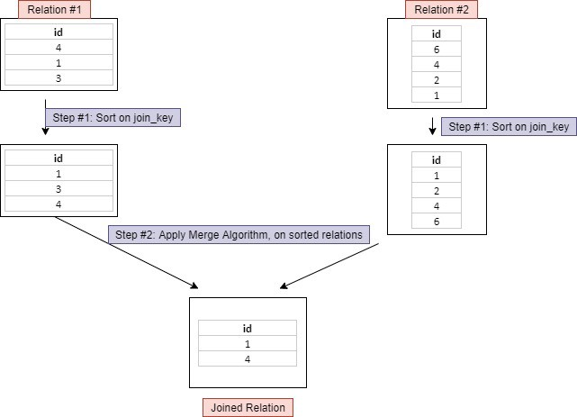
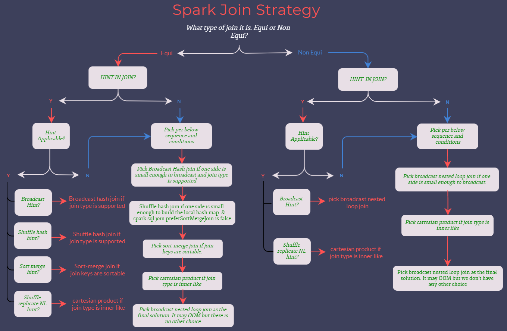

# Spark Join Strategies 

## Broadcast Hash Join

- Here in this case we create a hashmap of the smaller table/relation based on the join key.
- then loop over the larger table/relation map the join key with the hashtable created above and pull out the matching value 

Hash Join is performed by first creating a Hash Table based on join_key of smaller relation and then looping over larger 
relation to match the hashed join_key values. Also, this is only supported for ‘=’ join.

In broadcast hash join, copy of one of the join relations/hashmap are being sent to all the worker nodes and it saves
shuffling cost. This is useful when you are joining a large relation with a smaller one. It is also known as map-side 
join(associating worker nodes with mappers).

Spark deploys this join strategy when the size of one of the **join relations is less than the threshold values(default 10 M).**
The spark property which defines this threshold is spark.sql.autoBroadcastJoinThreshold(configurable).

Broadcast relations are shared among executors using the BitTorrent protocol(read more here). It is a peer 
to peer protocol in which block of files can be shared by peers amongst each other. Hence, they don’t need to 
rely on a single node. This is how peer to peer protocol works:

**Things to Note:**

- The broadcasted relation/hashmap should fit completely into the memory of each executor 
   as well as the driver. The hashmap is created in the Driver, driver will send it to the executors.
- Only supported for ‘=’ join.
- Supported for all join types(inner, left, right) except full outer joins.
- When the broadcast size is small, it is usually faster than other join strategies.
- Copy of relation is broadcasted over the network. Therefore, being a network-intensive operation
  could cause out of memory errors or performance issues when broadcast size is big(for instance,
  when explicitly specified to use broadcast join or change the default threshold).
- You can’t make changes to the broadcasted relation, after broadcast. Even if you do, they won’t be available to 
  the worker nodes(because the copy is already shipped).
- this disables auto broadcast,spark.conf.set("spark.sql.autoBroadcastJoinThreshold", -1),
= When we disable auto broadcast Spark will use standard SortMergeJoin
- When we disable auto broadcast Spark will use standard SortMergeJoin, but it can be forced to use BroadcastHashJoin 
  with broadcast hint, df1.join(broadcast(df2), df1.id==df2.id, "inner").explain()
- [broadcast variables](broadcast-variables.md)  

## Shuffle hash join

Shuffle happens because we have some kind of operation - join, etc.., which involves **joining data across partitions.** 

Shuffle Hash Join - the data is stored in different executors. With Shuffle join rows having the same value of join key are brought
into one executor and merged together here. As the name indicates works by shuffling both datasets - Step #1. So the same keys from 
both sides end up in the same executor. Once the data is shuffled, the smallest of the two will be hashed into buckets, Step #2.
Step #3 - a hash join is performed with the bigger partition within the same task.

Shuffle Hash Join is different from Broadcast Hash Join because the entire dataset is not broadcasted instead both 
datasets are shuffled and then the smallest side data is hashed and bucketed and hash joined with the bigger 
side in all the partitions.

**Things to Note:**
- Only supported for ‘=’ join.
- The join keys don’t need to be sortable
- Supported for all join types except full outer joins.
- It’s an expensive join in a way that involves both shuffling and hashing(Hash Join as explained above). Maintaining a hash table 
  requires memory and computation
  
## Shuffle sort-merge join

Step #1, first step is to sort the table/relation based on join key
Step 2#. Apply merge algorithm on the both the sorted table/dataset

**3 Phases**
- Shuffle Phase: Both large tables will be repartitioned as per the Join keys across the partitions in the cluster.
- Sort Phase: Sort the data within each partition parallelly.
- Merge Phase: Join the sorted and partitioned data. It is merging of the dataset by iterating over the elements
  and joining the rows having the same value for the Join keys.

Shuffle sort-merge, as the name indicates works by shuffling both datasets - Step #1. So the same keys from both sides end up in 
the same partition/executor/worker node. Then perform sort-merge join operation at the partition level in the executor/worker nodes.
Shuffle Hash Join’s performance is the best when the data is distributed evenly with the key you are joining and you 
have an adequate number of keys for parallelism.

# When to use each join
- When the side of the table is relatively small, we choose to **broadcast** it out to avoid shuffle, improve performance. 
  But because the broadcast table is first to collect to the driver segment, and then distributed to each executor redundant, 
  so when the table is relatively large, the use of broadcast progress will be the driver and executor side caused greater pressure.
  When one of the data frames is small and fits in the memory, it will be broadcasted to all the executors, and a Hash Join 
  will be performed.

- shuffle hash join, When the table is relatively large, the use of broadcast may cause driver- and executor-side memory issues. 
  In this case, the Shuffle Hash Join will be used. It is an expensive join as it involves both shuffling and hashing. Also,
  it requires memory and computation for maintaining a hash table. If you want to use the Shuffle Hash Join, spark.sql.join.
  preferSortMergeJoin needs to be set to false, and the cost to build a hash map is less than sorting the data. The Sort-merge
  Join is the default Join and is preferred over Shuffle Hash Join.

- Shuffle sort-merge is used when both the relationships/table are large

# EQUI JOIN :
EQUI JOIN creates a JOIN for equality or matching column(s) values of the relative tables. EQUI JOIN also create JOIN by using JOIN with ON and
then providing the names of the columns with their relative tables to check equality using equal sign (=).
<pre>
Syntax :
SELECT column_list  
FROM table1, table2....
WHERE table1.column_name =
table2.column_name;  
</pre>

#NON EQUI JOIN :
NON EQUI JOIN performs a JOIN using comparison operator other than equal(=) sign like >, <, >=, <= with conditions.
<pre>
Syntax:
SELECT *  
FROM table_name1, table_name2  
WHERE table_name1.column [> |  < |  >= | <= ] table_name2.column;
</pre>

# References
- https://www.linkedin.com/pulse/spark-sql-3-common-joins-explained-ram-ghadiyaram/ 
- **[Spark Join Stratergies](https://towardsdatascience.com/strategies-of-spark-join-c0e7b4572bcf)** 
- [Shuffle/Hash Join](https://www.waitingforcode.com/apache-spark-sql/shuffle-join-spark-sql/read) 
- https://www.hadoopinrealworld.com/how-does-shuffle-hash-join-work-in-spark/
- [Sort Merge join](https://www.waitingforcode.com/apache-spark-sql/sort-merge-join-spark-sql/read)
- [Broadcast join](https://www.waitingforcode.com/apache-spark-sql/broadcast-join-spark-sql/read)
- https://stackoverflow.com/questions/43984068/does-spark-sql-autobroadcastjointhreshold-work-for-joins-using-datasets-join-op
<!-- <a href="https://www.waitingforcode.com/apache-spark-sql/broadcast-join-spark-sql/read" target="_blank" >Broadcast join</a> -->
- https://blog.clairvoyantsoft.com/apache-spark-join-strategies-e4ebc7624b06