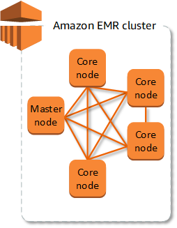
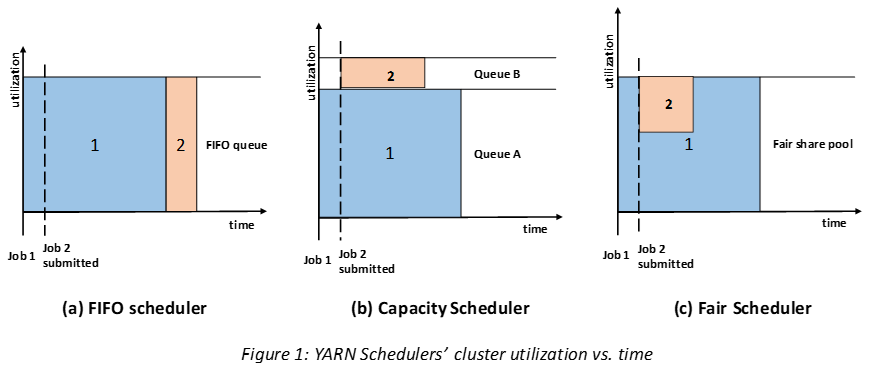

# Tips and Tricks

## What is EMR

The central component of Amazon EMR is the cluster. A cluster is a collection of Amazon Elastic Compute Cloud (Amazon
EC2) instances. Each instance in the cluster is called a node. Each node has a role within the cluster, referred to as
the node type. Amazon EMR also installs different software components on each node type, giving each node a role in a
distributed application like Apache Hadoop.

The node types in Amazon EMR are as follows:
- Master node: The master node manages the cluster and typically runs master components of distributed applications. For
  example, **the master node runs the YARN ResourceManager** service to manage resources for applications. It **also runs the
  HDFS NameNode service**, tracks the status of jobs submitted to the cluster, and monitors the health of the instance
  groups.

  To monitor the progress of a cluster and interact directly with applications, you can connect to the master node over
  SSH as the Hadoop user. For more information, see Connect to the master node using SSH. Connecting to the master node
  allows you to access directories and files, such as Hadoop log files, directly. For more information, see View log
  files. You can also view user interfaces that applications publish as websites running on the master node.

- **Core node:** A node with software components that run tasks and store data in the Hadoop Distributed File System (
  HDFS) on your cluster. Multi-node clusters have at least one core node.Core nodes are managed by the master node. Core
  nodes run the **Data Node daemon to coordinate data storage
  as part of the Hadoop Distributed File System (HD**FS). They also run the Task Tracker daemon and perform other
  parallel computation tasks on data that installed applications require. For example, a **core node runs YARN NodeManager
  daemons, Hadoop MapReduce tasks,and Spark executors.**

  There is only one core instance group or instance fleet per cluster, but there can be multiple nodes running on multiple
  Amazon EC2 instances in the instance group or instance fleet. With instance groups, you can add and remove Amazon EC2
  instances while the cluster is running. You can also set up automatic scaling to add instances based on the value of a
  metric. 

  With instance fleets, you can effectively add and remove instances by modifying the instance fleet's target capacities
  for On-Demand and Spot accordingly.

- **Task node**:  A node with software components that only runs tasks and does not store data in HDFS. Task nodes are
  optional.You can use task nodes to add power to perform parallel computation tasks on data, such as Hadoop MapReduce
  tasks and Spark executors. Task nodes don't run the Data Node daemon, nor do they store data in HDFS. As with core
  nodes, you can add task nodes to a cluster by adding Amazon EC2 instances to an existing uniform instance group or by
  modifying target capacities for a task instance fleet.

  With the uniform instance group configuration, you can have up to a total of 48 task instance groups. The ability to add
  instance groups in this way allows you to mix Amazon EC2 instance types and pricing options, such as On-Demand Instances
  and Spot Instances. This gives you flexibility to respond to workload requirements in a cost-effective way.
  
  With the instance fleet configuration, the ability to mix instance types and purchasing options is built in, so there is
  only one task instance fleet.
  
  _Because Spot Instances are often used to run task nodes, Amazon EMR has default functionality for scheduling YARN jobs
  so that running jobs do not fail when task nodes running on Spot Instances are terminated. **Amazon EMR does this by
  allowing application master processes to run only on core nodes. The application master process controls running jobs
  and needs to stay alive for the life of the job**._
  
  _Amazon EMR release version 5.19.0 and later uses the built-in YARN node labels feature to achieve this. (Earlier
  versions used a code patch). Properties in the yarn-site and capacity-scheduler configuration classifications are
  configured by default so that the YARN capacity-scheduler and fair-scheduler take advantage of node labels. Amazon EMR
  automatically labels core nodes with the CORE label, and sets properties so that **application masters are scheduled only
  on nodes with the CORE label.** Manually modifying related properties in the yarn-site and capacity-scheduler
  configuration classifications, or directly in associated XML files, could break this feature or modify this
  functionality._
  
  Beginning with Amazon EMR 6.x release series, the YARN node labels feature is disabled by default. The application
  master processes can run on both core and task nodes by default. You can enable the YARN node labels feature by
  configuring following properties:
  
  yarn.node-labels.enabled: true
  yarn.node-labels.am.default-node-label-expression: 'CORE'
- **Application Master**: The Application Master is responsible for the execution of a single application. It asks for
  containers from the Resource Scheduler (Resource Manager) and executes specific programs on the obtained containers.
  **Application Master is just a broker that negotiates resources with the Resource Manager** and then after getting some
  container it make sure to launch tasks(which are picked from scheduler queue) on
  containers.
  **Application Master(AM)** is per application, so lets say there are multiple applications running on a YARN cluster, it is possible that there 
  can be  multiple application master on same node. But each of these must belong to different applications and none of them will be aware
  about presence of other.
  [ref](https://stackoverflow.com/questions/63914667/what-is-the-difference-between-driver-and-application-manager-in-spark)  
  ref: https://docs.aws.amazon.com/emr/latest/ManagementGuide/emr-master-core-task-nodes.html



[ref](https://docs.aws.amazon.com/emr/latest/ManagementGuide/emr-overview.html)

- EMR  can run [various jobs](https://docs.aws.amazon.com/emr/latest/ManagementGuide/emr-plan-ha-applications.html) - spark, tensorflow, hadoop, hive etc. In out case we are going to focus on Spark jobs. We
submit spark jobs and we use the yarn scheduler to submit our jobs.

## Yarn Scheduler
Apache YARN (Yet Another Resource Negotiator) is a cluster resource management platform for distributed computing
paradigms which is most often used with Hadoop but it is general enough to be used with other platforms like spark
in our case here.

A scheduler typically handles the resource allocation of the jobs submitted to YARN. In simple words — for example — if
a computer app/service wants to run and needs 1GB of RAM and 2 processors for normal operation — it is the job of YARN
scheduler to allocate resources to this application in accordance to a defined policy.

**There are three types of schedulers available in YARN**: FIFO, Capacity and Fair. FIFO (first in, first out) is the
simplest to understand and does not need any configuration. It runs the applications in submission order by placing them
in a queue. Application submitted first, gets resources first and upon completion, the scheduler serves next application
in the queue. However, _FIFO is not suited for shared clusters as large applications will occupy all resources and queues
will get longer due to lower serving rate._



Above diagram represents the difference among three schedulers. It is now evident that in case of FIFO, a small job blocks
until the large job complete. Capacity scheduler maintains a separate queue for small jobs in order to start them as
soon a request initiates. However, this comes at a cost as we are dividing cluster capacity hence large jobs will take
more time to complete.

**Fair scheduler** does not have any requirement to reserve capacity. It dynamically balances the resources into all
accepted jobs. It can be configured to schedule
with both memory and CPU. When there is a single app running, that app uses the entire cluster. When other apps are
submitted, resources that free up are assigned to the new apps, so that each app eventually on gets roughly the same
amount of resources. This eliminates both drawbacks as seen in FIFO and capacity scheduler i.e. overall effect is
timely completion of small jobs with high cluster utilization. the Fair Scheduler bases scheduling fairness decisions
only on memory.The Fair Scheduler lets all apps run by default,
but it is also possible to limit the number of running apps per user and per queue through the config file. This can
be useful when a user must submit hundreds of apps at once, or in general to improve performance if running too many
apps at once would cause too much intermediate data to be created or too much context-switching. Limiting the apps does
not cause any subsequently submitted apps to fail, only to wait in the scheduler’s queue until some of the user’s
earlier apps finish.

[ref](https://towardsdatascience.com/schedulers-in-yarn-concepts-to-configurations-5dd7ced6c214)
[configuring scheduler](https://medium.com/@sohamghosh/schedulers-in-emr-6445180b44f6)


## Scenarios

1.**Cache/perist dataframe**. df.cache() or df.persist()

- If you are using a dataframe result over and over again, use cache. Let's say for example you create an aggregation
  based on a bucnh of tables or data frames and you use this result over and over again in you next 4 steps. It better
  cache the resultant dataframe instead of calculating it over and over and over again for each of the following 4
  steps.

- Another example, let's say we read a really large dataset with let's say 600gb data. On this dataset we apply about 10
  different transforms, and then perform a count on the resulting dataframe and in the very next step we write this
  computed dataframe to the disk, so here is what is happening
    - 1st step read the 600 GB data into dataframe df
    - 2nd apply transform to this data frame, like adding extra columns
    - 3rd step join this dataframe with another dataframe
    - ..
    - 10th, do some transform to dataframe, **df**
    - 11th, next **apply count on dataframe df**, note this is an action step.
    - 12th, next you write this dataframe to the disk, this is also considered aan actions step
- Note that when we do the write in 12th step, the spark engine has to apply all the transformations from step 1 thru
  step 10 all over again, which is compute expensive, especially for large volume of data
- So between step 10 and 11 we can add step 10.5 wherein we cache the dataframe, df.persist(). So at step 12, the write
  operation uses the cached data to write to disk.

2. Optimize spark submit
- Use fair scheduler for you cluster, this way all the jobs submitted are getting equal resources
- Configure the scheduler at the cluster level, let's say we use the default queue, it is best to limit the maxRunningApps.
  You can update the fair-scheduler.xml under ~~/etc/hadoop/conf~~ /home/hadoop/conf/fair-scheduler.xml.  The fair-scheduler classification cannot be added to
  the Configurations The default queue for fair scheduler- root.hadoop queue
  ``` xml
    <allocations>
      <!-- this allocation is for the default queue -->
      <!-- sets the default running app limit for queues; overridden by maxRunningApps element in each queue.-->
      <queueMaxAppsDefault>25</queueMaxAppsDefault>
      <!-- sets the default AM resource limit for queue; overridden by maxAMShare element in each queue. .5 is the default and -->
      <!--   leave it a default, so commenting it out.-->
      <!--<queueMaxAMShareDefault>0.5</queueMaxAMShareDefault> -->
    </allocations>
   ```  
- And at the job/spark-submit level limit the executor-memory to 32gb(try with 16 or 32), available values 8,16,32,64 gb
  and for num-executors try with 4 or 5 and see how it goes. Num of executors could be upto 20. **Todo** How to use
  executor-cores wrt to num-executors?
- [More of fair scheduler](https://hadoop.apache.org/docs/r2.7.1/hadoop-yarn/hadoop-yarn-site/FairScheduler.html)
- https://amalgjose.com/2015/07/24/configuring-fair-scheduler-in-hadoop-cluster/
- All the above are the yarn scheduler properties.
- [performance][https://towardsdatascience.com/apache-spark-performance-boosting-e072a3ec1179]

3. example:
  <pre>
    val df = spark.read().format("csv").csv("/path/file.csv")
    df = df.filter(....)  // you are over writing the df reference
    // df.cache() // use this if filter and read is to be performed only once.
    val cnt = df.count()  // action - triggers the filter and read operations
    write_to_disk(df)   //  action - triggers the filter and read operations 
  </pre>
 Whenever a "action" (count() and write_to_disk() in this case) is performed it triggers the re-computation of data till the previous DF. 
That is, unless the previous DF is cached. If we have to avoid this reconstruction process everytime and if we start persisting the DF's, 
will we not end up occupying all the memory and spilling some data to disk and slow down the spark application?. _Yes its wasteful and thats 
why its advisable to cache the DF if its used more than once._ That's the reason all DFs are not persisted by default. However, when you 
persist there are multiple options like MEMORY_ONLY, MEMORY_AND_DISK besides others. Check details [here](https://spark.apache.org/docs/latest/rdd-programming-guide.html#rdd-persistence)
ref: https://stackoverflow.com/questions/63086480/are-dataframes-created-every-time-using-dag-when-the-df-is-referenced-multiple.

**Note:** after you use df.cache(), unpersist the cached df as soon as you do not need it.
<pre>
df.unpersist(false) // unpersists the Dataframe without blocking
</pre>

4. Yarn commands
<pre>
yarn application -help
yarn application appId <Applciaiton ID>
yarn application -list -appStates <States>
yarn application -list -appStates RUNNING
yarn application -appTags <Tags>
yarn application -appTypes <Types>
yarn application components <Components Name>
yarn application -decommission < Application Name>
yarn application - instances<Component Instances>
yarn application -list
yarn application -kill <application id>

sudo systemctl stop hadoop-yarn-resourcemanager
sudo systemctl start hadoop-yarn-resourcemanager
</pre>

5. Stop all jobs
for x in $(yarn application -list -appStates RUNNING | awk 'NR > 2 { print $1 }'); do yarn application -kill $x; done


## Good reads
- https://towardsdatascience.com/apache-spark-performance-boosting-e072a3ec1179
- https://luminousmen.com/post/spark-tips-partition-tuning


## Create parquet files without _temporary folder
- using awswrangler, cobvert spark dataframe to pandas and use awswrangler api
```
# update s3 policy file
# "s3:PutObject",
# "s3:ListObjectsV2"
import awswrangler as wr
import pandas as pd

def write_to_s3_parquet(self, data_df, path, max_rows_per_file) -> None:
    pandas_df = data_df.toPandas()
    print(pandas_df)

    wr.s3.to_parquet(
        df=pandasDF,
        path=path,
        dataset=True,
        compression='snappy',
        # partition_cols=['dt'],        
        mode='overwrite_partitions',
        max_rows_by_file=max_rows_per_file)
```
- Tried updating the config, has not worked so far
```
hadoopConf.set('fs.s3.impl', 'org.apache.hadoop.fs.s3a.S3AFileSystem')
hadoopConf.set('fs.s3a.impl', 'org.apache.hadoop.fs.s3a.S3AFileSystem')


#hadoopConf.set('spark.hadoop.fs.s3a.committer.staging.tmp.path', '/tmp/staging')
hadoopConf.set('fs.s3a.committer.staging.tmp.path', 'tmp/staging')
hadoopConf.set('fs.s3a.buffer.dir', 'tmp/staging')

hadoopConf.set("spark.hadoop.fs.s3a.committer.magic.enabled", "true")
hadoopConf.set("fs.s3a.committer.magic.enabled", "true")
#hadoopConf.set("spark.hadoop.fs.s3a.committer.name",  "magic")
# enabling S3Guard
hadoopConf.set("fs.s3a.committer.name",  "magic")
hadoopConf.set("fs.s3a.bucket.landsat-pds.committer.magic.enabled", "true")
hadoopConf.set("fs.s3a.committer.staging.conflict-mode", "replace")
hadoopConf.set("mapreduce.fileoutputcommitter.algorithm.version", "2")
hadoopConf.set("mapreduce.fileoutputcommitter.task.cleanup.enabled",  "false")
hadoopConf.set("mapreduce.outputcommitter.factory.scheme.s3a", "org.apache.hadoop.fs.s3a.commit.staging.S3ACommitterFactory")
```
  - https://hadoop.apache.org/docs/r3.1.1/hadoop-aws/tools/hadoop-aws/committers.html#Switching_to_an_S3A_Committer
  - https://stackoverflow.com/questions/46665299/spark-avoid-creating-temporary-directory-in-s3


## Transformations
- Narrow are select, withcolumn, filter/where clause, count, drop. Thes apply on individual partitions
- Wide are join, groupby, cube, rollup, agg. These are applied on possibly more than one partitions and use key for join
- widening transforamtion marks a stage, there is a stage for each partition and stages run in parallel

## Action
- Actions triggers a job. Action marks a job. Jobs run in sequence
- these are - read, write, collect, take

## When a spark job is submitted to yarn Resource Manager, the RM assigns an Application Master to run the application driver aka the main program of the job you just submitted. The Driver based on number of actions creates jobs - job 1 .. job N.  In each job based on number of widening tranformation creates n+1 stages. So if there are no widening tranformation to be applied to job1 then there will be 0+1=1 stage for job1
